# Independent Product Assessment — User Recommendation Lifecycle

**Audience:** Founder, Product, Business, Design, and Engineering leaders  
**Assessment basis:** Current application code, database migrations, data/configuration files, and automated tests only. Previous audit reports and historical implementation documents were not used as evidence.  
**Plain-English verdict:** FooFoo has a working rules-based recommendation and meal-planning product with immediate dish-level learning. It does **not** yet have a trained long-term machine-learning model.

## 1. One-page executive summary

### The complete product in one visual

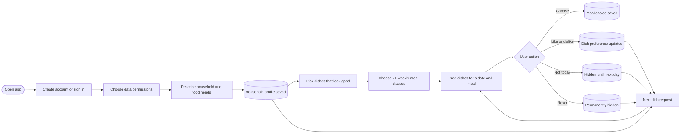

### How the engine works today

The user first creates an account and completes consent plus five onboarding screens. The product remembers the household structure, location, diet, Jain preference, allergies, selected health/lifecycle information, cooking setup, eating-out frequency, cooking goal, and cooking skill.

For each recommendation request, the backend combines that saved household profile with the current meal slot, weekday, live weather when configured, prior feedback, and temporary or permanent exclusions. The engine then:

1. Removes dishes that conflict with diet, Jain rules, declared allergens, weaning safety, fasting mode, or an explicit exclusion.
2. Scores the remaining dishes for regional familiarity, meal-slot fit, season and weather, household/life-stage fit, signature value, meal objective, and cohort/class fit.
3. Adds a small dish-specific boost or penalty learned from likes and dislikes.
4. Adds diversity so the user does not see only one cuisine or meal class.
5. Returns meal classes for weekly planning or ranked dishes for a specific meal.

### What it remembers

| Memory | What is kept | Duration |
|---|---|---|
| Account and consent | Identity and permission choices | Persistent |
| Household profile | Location, diet, allergies, cook skill, and household answers | Persistent |
| Household members | Limited member/life-stage records created during onboarding | Persistent |
| Weekly plan | Selected class for all 21 breakfast/lunch/dinner slots, locks, and selected dishes | Persistent; also cached on the device |
| Recommendation history | Which dish sets were served and when | Persistent |
| Feedback history | Like, dislike, not today, never, and related events | Persistent |
| Dish taste memory | A bounded preference value for each known dish | Persistent |
| Not today | Dish suppression | Temporary, until the next India-day boundary |
| Never | Dish exclusion | Persistent while active |
| Weather | City weather | Cached for up to three hours |
| In-progress onboarding | Answers and current step | Device-local until onboarding finishes |

### How it improves

- A **Like** increases that dish's saved affinity.
- A **Not for me** decreases it.
- **Never** decreases it and removes that dish from future candidate lists.
- **Not today** removes it temporarily.
- More recorded interactions reduce the engine's dependence on broad cold-start cohort assumptions.
- The changed state is read on the **next recommendation request**, so the loop can improve immediately.

This is real personalization, but it is a **bounded rule-based re-ranking loop**. The trained preference model is disabled, has no model artifact, and has zero scoring weight.

### What is still missing

- Anonymous users cannot receive recommendations.
- There is no active trained ML preference model or automated training/deployment loop.
- The weekly **meal-class** plan now aggregates bounded explicit dish affinity into class ranking,
  so repeated likes/dislikes can change both the weekly class choice and dish order within a class.
- Users can edit only diet and allergies after onboarding; there is no complete household/member evolution UI.
- Time itself does not produce learning. A month of no feedback gives essentially the same memory as day one.
- Engine failure has a clear retryable error, but there is no safe cached recommendation set to show offline or during an outage.
- Calibration records Likes only; deselecting a calibration dish does not send a correcting event.
- Clinical condition-specific add-ons are deliberately absent; current add-ons are life-stage/food-role based.

## 2. User lifecycle

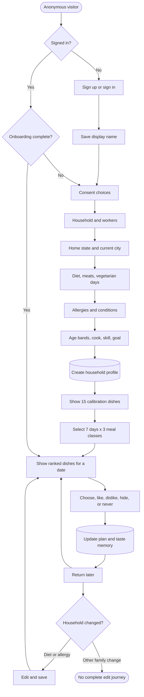

### What happens at each stage

| Stage | What happens to the user |
|---|---|
| Anonymous | The user sees the entry experience but receives no meal recommendations until authenticated. |
| Sign up/sign in | Email/password authentication creates or restores the account. Returning users are routed by onboarding status. |
| Consent | Personalization permission is required. Analytics, push notifications, and data retention are separately selectable. |
| Household creation | Answers are saved incrementally. The final profile is created only when the required name, home state, city, diet, and cooking skill are present. |
| Onboarding | Five screens collect household, location, diet, safety, age/lifecycle, cook, and objective information. Interrupted progress resumes from device storage. |
| Calibration | The user sees five safe dishes per breakfast, lunch, and dinner: three predicted good fits plus two deliberately weaker personal fits. The weaker fits are still diet/allergy eligible. |
| Weekly planning | The engine offers three meal classes for each of 21 weekly slots. The user must choose all 21 before finalizing. |
| Daily recommendation | The user gets up to eight ranked dishes for a meal. If a weekly class was finalized, all shown dishes stay inside that class. |
| Meal selection | A user can choose a dish for a date, lock a meal, open its recipe, or refresh unlocked options. |
| Feedback | Like, Not for me, Not today, and Never are available on daily dish cards. |
| Preference learning | The backend immediately updates dish affinity or exclusion state; the next dish request reads it. |
| Repeat usage | The saved weekly plan, recommendation history, taste state, and exclusions are reused. |
| Family evolution | Only diet and allergies have a reachable edit screen. Full member, location, cooking, and lifestyle evolution is currently not implemented in the UI. |
| Long-term learning | Persistent feedback history exists, but the trained ML model is currently not implemented as an active product capability. |

## 3. Focused flowcharts

### 3.1 First-time user

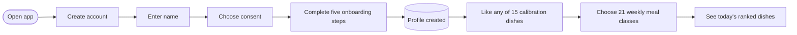

### 3.2 Returning user

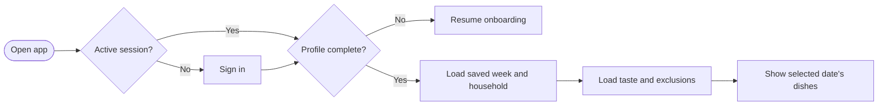

### 3.3 Household update

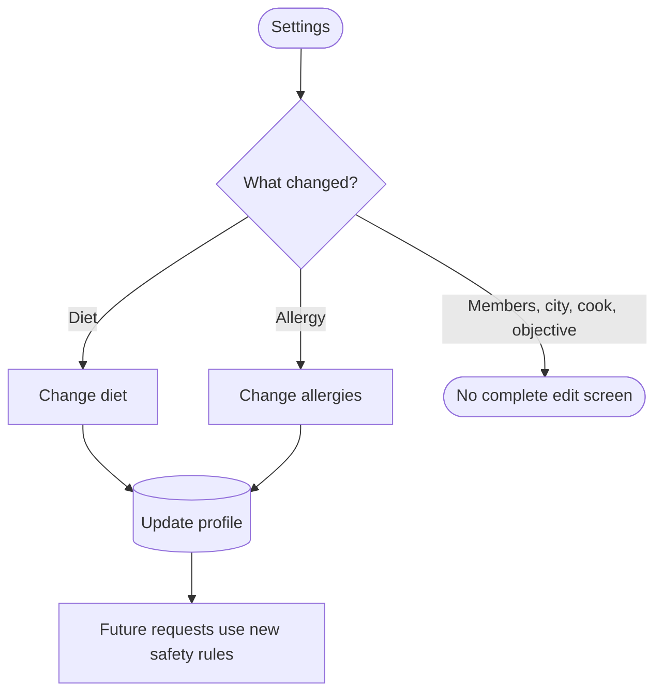

### 3.4 Recommendation generation

```mermaid
flowchart LR
    request([Meal request]) --> readHouse[(Read household)]
    readHouse --> readMemory[(Read feedback and exclusions)]
    readMemory --> context[Add slot, day, and weather]
    context --> derive[Build household taste and life-stage profile]
    derive --> filter[Apply safety and observance filters]
    filter --> score[Score remaining dishes]
    score --> preference[Apply dish affinity adjustment]
    preference --> diversity[Balance relevance and variety]
    diversity --> response[Return ranked dishes]
    response --> history[(Save served recommendation)]
```

### 3.5 Feedback loop

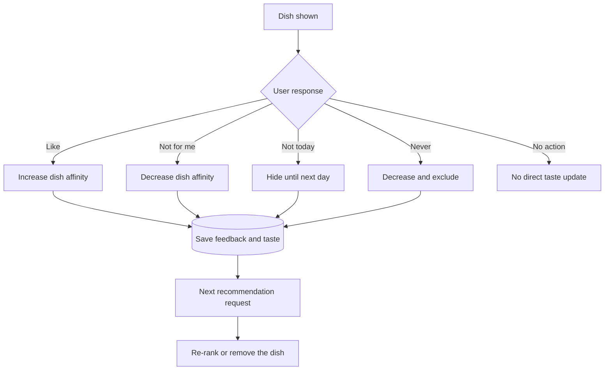

### 3.6 Cold start

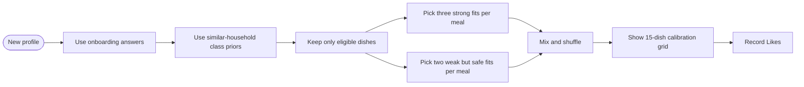

### 3.7 Personalized recommendations

```mermaid
flowchart LR
    base[Eligible scored dishes] --> exclusion{Excluded?}
    exclusion -->|Never or Not today| remove[Remove dish]
    exclusion -->|No| affinity[Read saved dish affinity]
    affinity --> adjust[Add bounded boost or penalty]
    adjust --> rank[Re-rank]
    rank --> class{Weekly class chosen?}
    class -->|Yes| inside[Return only dishes in that class]
    class -->|No| top[Return diverse top dishes]
```

### 3.8 Failure and fallback

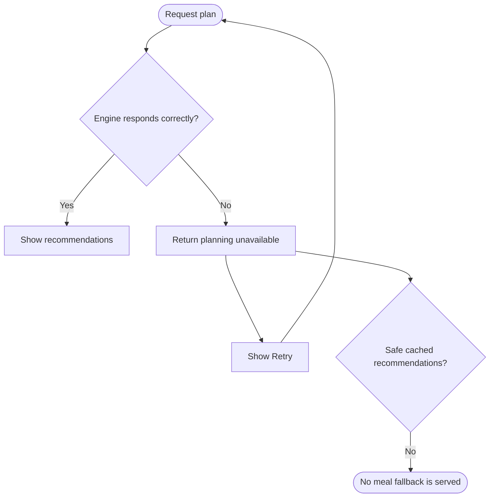

The product intentionally does not invent a generic fallback meal because it may violate household diet or allergy needs. That is safer than showing an unsafe default, but a household-safe cached fallback is currently not implemented.

## 4. Recommendation journey, chronologically

1. **The user opens the app.** The app checks authentication and whether a completed profile exists.
2. **A new user creates an account.** The user supplies a display name and grants personalization consent.
3. **The user describes the household.** Answers are saved after each onboarding step, while a device-local copy supports resume.
4. **The profile becomes active.** Once the five required profile fields are available, the backend creates the household profile and marks onboarding complete.
5. **The user calibrates taste.** The app requests 15 dishes split across breakfast, lunch, and dinner. Likes are saved against this exact recommendation event.
6. **The user builds a weekly plan.** The engine produces meal classes for every weekday and meal slot. The user selects all 21 and finalizes.
7. **The user opens a date.** The app loads the saved class for breakfast, lunch, and dinner. Without a saved class, it asks for general top picks.
8. **The backend composes the recommendation input.** It reads household answers, active members, feedback count, dish affinity, permanent exclusions, temporary suppressions, and city weather when available.
9. **The engine derives a working household profile.** It turns raw answers into region and local blend, household/life-stage posture, spice and texture needs, discovery appetite, diet rules, and cohort/class affinity.
10. **Unsafe or invalid dishes are removed.** Diet, Jain, allergen, weaning, fasting, slot, and explicit exclusions are applied before ranking.
11. **Eligible dishes are scored.** Regional fit, season/weather, age and household fit, signature value, objective, and cohort/class suitability contribute.
12. **Personal preference is applied.** Saved affinity adds a bounded boost or penalty to the dish's rank. Never and Not today remove the dish entirely.
13. **The result is diversified.** General meal lists balance score with variety. A finalized weekly class instead enforces strict class consistency.
14. **The user sees the result.** Dish name, image when available, class/cuisine, recipe path, score explanation, and feedback controls are shown.
15. **The served set is remembered.** The recommendation request and dishes are written to history, allowing feedback to be tied to what was actually shown.
16. **The user acts.** Choosing a date updates the weekly plan. Like, dislike, Not today, and Never update feedback memory.
17. **The next request changes.** New exclusions and dish affinity are loaded immediately. The product does not wait for a nightly training job.

## 5. Recommendation engine internals

```mermaid
flowchart LR
    input[/Household, meal, day, weather, history/] --> derive[Derive household profile]
    derive --> filters[Hard safety and observance filters]
    filters --> catalogue[(Dish catalogue and food ontology)]
    catalogue --> base[Base relevance score]
    base --> goal[Apply cooking objective]
    goal --> cohort[Apply meal-class cohort fit]
    cohort --> taste[Apply saved dish affinity]
    taste --> rank[Rank and diversify]
    rank --> mode{Requested product surface}
    mode -->|Weekly plan| classes[Top three classes per slot]
    mode -->|Daily meal| dishes[Up to eight dishes]
    mode -->|Calibration| grid[Three strong plus two weak fits per meal]
    dishes --> addon[Attempt life-stage add-on]
    addon --> output[Response with explanation]
    classes --> output
    grid --> output
```

### Inputs that actually affect the product

| Input group | Examples |
|---|---|
| Household | Household type, workers, members/life stage |
| Place | Home state, current city |
| Food rules | Diet, meat exclusions, vegetarian days, Jain, allergies |
| Lifestyle | Who cooks, cooking skill, eating out, cooking objective |
| Current context | Meal slot, weekday, weather; fasting/calorie modes exist in the engine but are not exposed as normal controls in the current mobile journey |
| Memory | Interaction count, per-dish affinity, Never list, Not today list, recent served/rejected counts |
| Knowledge | Dish attributes, ingredients/allergens, cuisines and regions, meal classes, class plans, pairing rules, recipes, and image mapping |

### Important limits

- The app's primary planning journey returns **meal classes and individual dishes**, not the separate seven-plate response built by the engine's legacy/general recommendation surface.
- Dish affinity affects daily/class dish ranking. The weekly class generator currently receives the household but not the online dish-affinity state.
- Beginner cooking skill influences the cold-start top-dish surface, but the current mobile cold-start route uses the separate calibration grid.
- Life-stage add-on rules accept both the live stored-role vocabulary (`weaning`, `child`,
  `senior`) and the historical core aliases. Clinical-condition add-ons remain intentionally
  unimplemented pending clinical governance.

## 6. Data journey

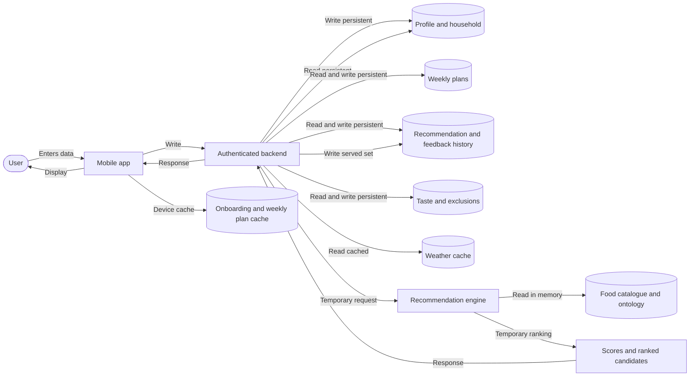

| Information | Read | Write | Cache | Temporary | Persistent |
|---|---:|---:|---:|---:|---:|
| Account/session | Yes | Yes | Device session | No | Yes |
| Onboarding answers | Yes | Yes | Device during onboarding | In-screen answer state | Yes |
| Consent | Yes | Yes | Device until submitted | Yes | Yes |
| Weekly plan | Yes | Yes | Device offline copy | Selection before finalize | Yes |
| Recommendation candidates/scores | No direct DB read | Served result only | No result cache | Yes | History snapshot only |
| Dish catalogue/ontology | Engine reads | Deployment/build process | Loaded in engine memory | Runtime ranking | Source data persists |
| Weather | Yes | Provider/cache writes | Three-hour server cache | Request context | Cache row only |
| Feedback | Yes | Yes | Offline mobile queue on network failure | Queue until delivered | Yes |
| Taste affinity | Yes | Yes | No | Request copy | Yes |
| Not today | Yes | Yes | No | Active until expiry | Record persists with expiry |
| Never | Yes | Yes | No | No | Yes |
| Recommendation history | Yes | Yes | No | No | Yes |

## 7. User memory evolution

**The clock is not the learning mechanism. Feedback and profile changes are.** The following is the best realistic lifecycle, assuming the user keeps interacting.

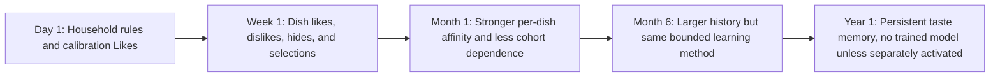

| Time | What can improve | What does not happen automatically |
|---|---|---|
| Day 1 | Safety, regional/life-stage fit, calibration Likes, and first weekly plan | No learned ML model |
| Week 1 | Frequently liked dishes move up; disliked dishes move down; Never/Not today exclusions work | No automatic inference of an unreported family change |
| Month 1 | More interactions reduce broad cold-start cohort influence and expand feedback history | Weekly class choices are still not directly learned from dish affinity |
| Month 6 | Persistent dish memory can be well populated if the user gives feedback | No richer sequence, seasonality, or household-member model emerges solely from time |
| Year 1 | History and bounded affinity remain available | No automatic model training, deployment, or natural preference decay is implemented |

If the user gives **no feedback and changes no profile data**, the product does not materially learn merely because a week, month, or year has passed.

## 8. Recommendation decision tree

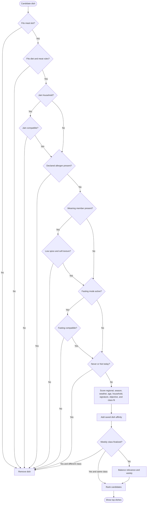

## 9. Current implementation coverage

Legend: **Fully implemented** = reachable end-to-end product path; **Partially implemented** = meaningful capability exists with a clear boundary; **Missing** = no current product path.

| Lifecycle stage | Coverage | Repository evidence | Product meaning |
|---|---|---|---|
| Anonymous recommendations | Missing | `mobile/app/index.tsx:39-42` | No session routes to entry/sign-in, not recommendations. |
| Sign up and sign in | Fully implemented | `mobile/app/(auth)/sign-in.tsx` | Account creation and returning login exist. |
| Consent | Fully implemented | `mobile/app/(onboarding)/consent.tsx`; `step-5.tsx:108-121` | Choices are collected before preferences and persisted after profile creation. |
| Five-step onboarding | Fully implemented | `mobile/app/(onboarding)/step-1.tsx` through `step-5.tsx` | Required household profile can be completed end to end. |
| Onboarding resume | Partially implemented | `mobile/src/onboarding/OnboardingContext.tsx` | Device-local resume exists; there is no cross-device server draft/resume model. |
| Household profile storage | Fully implemented | `supabase/functions/household/handler.ts`; `household/store.ts` | Incremental answers and final profile are stored. |
| Cold-start calibration | Partially implemented | `mobile/app/cold-start.tsx`; `ghar_re_core/calibration.py` | Fifteen safe calibration dishes and Likes work; deselection/negative calibration does not. |
| Weekly class recommendations | Fully implemented for rule-based personalization | `ghar_re_core/meal_planner.py`; `engine.py` | Class planning, anti-repetition, and a bounded mean observed dish-affinity contribution work end to end. |
| Weekly plan persistence | Fully implemented | `mobile/app/(tabs)/weekly-plan.tsx:39-48`; `supabase/functions/plan/state.ts` | Finalized 21-slot plan is stored server-side with device fallback. |
| Daily dish recommendations | Fully implemented for current rule model | `mobile/app/(tabs)/today.tsx`; `engine.py` | Date/slot options, class reconciliation, refresh, explanations, and live-vocabulary life-stage add-ons are reachable. |
| Food safety filters | Fully implemented for modeled allergens/rules | `ghar_re_core/scoring.py:17-155` | Diet, Jain, modeled allergen, weaning, fasting, and exclusion checks are enforced. Cross-contamination cannot be inferred from this catalogue. |
| Live weather context | Partially implemented | `supabase/functions/_shared/services/weather.ts`; `plan/handler.ts:237-245` | Live provider plus cache exists when configured; recommendation still works without it. |
| Feedback capture | Fully implemented | `today.tsx:287-315`; `feedback/events.ts` | Like, dislike, Not today, and Never are recorded. |
| Immediate dish personalization | Fully implemented | `feedback/events.ts:156-215`; `personalization.ts:13-89`; `meal_planner.py:83-102` | The next dish request reads affinity and exclusions. |
| Offline feedback protection | Fully implemented | `mobile/src/api/feedback.ts` | Network failures are queued on device and retried in order. |
| Recommendation history | Fully implemented | `mobile/app/history.tsx`; `plan/handler.ts` history surfaces | Users can view recent served recommendations and details. |
| Profile evolution | Partially implemented | `mobile/app/profile-edit.tsx:37-107` | Diet and allergies can change; other household fields cannot be edited through a complete UI. |
| Family/member evolution | Missing | No reachable member-management screen under `mobile/app` | Add/remove/update family members after onboarding is not implemented. |
| Trained preference model | Missing | `data/source/pref_model.yaml:12-25`; `ghar_re_core/preference.py` | Disabled, no artifact, zero weight. |
| Safe outage/offline meal fallback | Missing | `plan/handler.ts:341-352`; `recommendations/fallback.ts` | A retryable error exists, but no household-safe cached meal set is served. |

## 10. Product gap analysis

### Highest-impact gaps

1. **Complete household evolution journey**  
   The recommendation inputs can represent household members, city, cook, objective, and conditions, but the current Settings UI only edits diet and allergies. Product data will become stale as a family moves, has a child, adds an elder, changes cooks, or changes goals.

2. **No trained long-term model**
   The system stores the data needed for future training, and training code exists, but the live preference term is off. Current learning is dish-specific and bounded; it does not generalize strongly from “likes this dish” to ingredients, cuisines, textures, or patterns beyond the fixed rules.

3. **No safe availability fallback**
   The current failure behavior is honest and safety-conscious, but the user gets no plan during an engine outage. A per-household last-known-safe recommendation cache is not implemented.

4. **Calibration signal is one-sided**
   The grid intentionally includes weak-fit dishes, but the mobile screen sends only Like events. Unliking a previously tapped dish does not reverse it, and ignoring a dish is not treated as a negative signal.

### Other confirmed gaps

- No anonymous “try before signup” recommendation journey.
- No cross-device onboarding draft/resume experience.
- No explicit user controls for fasting mode or calorie target in the main mobile journey, despite engine support.
- No preference decay, season-aware taste history, or time-of-day behavioral learning.
- No clinical-condition-specific add-on logic; this is explicitly held back for clinical review.
- Some onboarding answers are intentionally lossy or collect-only: Jain exclusions and discovery intent do not have full independent destinations; broad age bands become a limited member/lifecycle approximation.
- The “Why this?” UI exposes a technical score and factors, but not a concise product explanation such as “because you prefer quick Maharashtrian dinners and liked Poha.”

## 11. Final one-page visual architecture

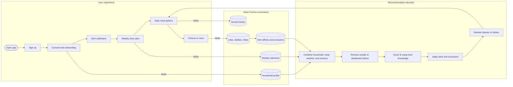

## Evidence and validation note

The main evidence paths were:

- Mobile lifecycle: `mobile/app`, `mobile/src/onboarding`, `mobile/src/api`
- Backend orchestration and persistence: `supabase/functions/household`, `supabase/functions/plan`, `supabase/functions/recommendations`, `supabase/functions/feedback`
- Recommendation logic: `ghar_re_core/derivation.py`, `scoring.py`, `meal_planner.py`, `calibration.py`, `pairing.py`
- Service translation: `ghar_re_service/ghar_re_service/engine.py`
- Storage model: `database/migrations/005`, `006`, `007`, `011`, `038`, `044`, and `053`
- Live preference configuration: `data/source/pref_model.yaml`

Validation run completed against the repository: **196 tests passed, 1 skipped** across the recommendation core and service test suites.
