# FOOFOO

## Final Product Definition, Recommendation Mathematics & Intelligence Bibles

**Document state:** FINAL — replaces the prior document in place

**Date:** 5 August 2026

**Version:** 1.1

**Status:** Canonical product and build specification

**Implementation baseline:** migrations 055–065 and seed 147; reconciled 5 August 2026

**Audience:** Founders, Product, Design, Data Science, Food Science, Engineering, Growth, Operations

**Scope:** India-first, globally extensible AI meal-decision platform

> **Product promise:** Foofoo predicts the complete meal a household will genuinely want and realistically make now—so accurately that the first reaction is, “Yes, that is exactly what I wanted to eat.”

This document is deliberately one integrated build artifact. Part I defines the real consumer product. Part II is the **FooFoo Recommendation Engine Bible**, including the full mathematical spine. Part III is the **Food Intelligence Bible**. Part IV is the **Engineering & Architecture Bible**, including database provenance, APIs, MLOps, and the exact retrieval path used to predict one household meal. It is detailed enough for an AI coding system and human teams to build the intended surface and internal behavior without inventing missing product logic.

**Independence rule.** The active Product, Architecture, Research, Roadmap, Visual, current-status documents, both supplied product briefs, current primary research, and official Indian dietary/household datasets were used. `docs/archive/**`, `database/archive/**`, `docs/governance/**`, and documents whose principal purpose is governance were excluded. The current codebase is evidence—not a design constraint. This specification says what the product should be even when that is more demanding than today’s implementation.

<!-- PAGEBREAK -->

# Document map

| Part | Purpose | Primary reader |
|---|---|---|
| I. Product PRD | Vision, market, users, psychology, journeys, UX, screens, growth, GTM, revenue, metrics | Product, Design, Growth |
| II. Recommendation Engine Bible | Candidate generation, scoring, ranking, cold start, household aggregation, learning, experimentation | Data Science, ML, Product |
| III. Food Intelligence Bible | Meal Genome, ontology, graph, nutrition, regional and temporal intelligence | Food Science, Data, ML |
| IV. Engineering & Architecture Bible | Platform, services, APIs, events, database, provenance, infrastructure, MLOps, security | Engineering, Data Platform, SRE |
| V. Delivery plan | v1→v5 roadmap, acceptance criteria, risks, decision log | Leadership, PMO |

The system is inspired by three patterns, adapted rather than copied:

- **Netflix:** multi-stage candidate generation, contextual ranking, continuous experimentation, and explainable personalization.
- **Amazon:** a retail-grade canonical catalog, strict identifiers, event streams, operational services, and independently scalable domains.
- **Spotify:** taste vectors, a blend of familiar and exploratory items, session context, and a product loop that turns light feedback into durable personalization.

The essential difference is that a meal is not media. Recommendations must satisfy household-wide safety constraints, cooking feasibility, meal composition, regional identity, recent consumption, nutrition, ingredient availability, and the unequal preferences of adults, children, elders, and the primary cook.

<!-- PAGEBREAK -->

# Part I — Comprehensive Product Requirements Document

## 1. Executive summary

Foofoo creates a new consumer utility category: the **meal decision layer**. Delivery platforms answer how to obtain food; recipe platforms answer how to cook a selected dish; trackers describe what was already eaten. Foofoo answers what a household should eat next, then connects that decision to cooking, ordering, and learning.

The beachhead is an urban Indian household where one person carries most of the planning burden. The product opens to a pre-built day and week, not an empty search box. A household can lock a choice, swipe alternatives, mark “not today,” permanently exclude a dish, add a dish to another day, and record whether it was cooked or ordered. Every action becomes evidence; none may override allergies, religious rules, or explicit exclusions.

The launch wedge is convenience and emotional relief, not clinical nutrition. Nutrition supports balance and transparency but Foofoo is not a doctor. The moat comes from four compounding assets: a culturally precise meal ontology, a Meal Genome, household decision history, and a recommendation event corpus with decision traces.

**North-star outcome:** households complete more intended home-meal decisions with less planning effort.

**North-star metric:** Weekly Successful Meal Decisions (WSMD): distinct planned meal slots per household that are accepted or locked and subsequently marked cooked, ordered, or implicitly confirmed without a replacement.

**MVP guardrails:** zero known hard-constraint violations; p95 cached plan load under 1 second on a budget Android device; p95 fresh recommendation under 3 seconds; no child or health-condition claim presented as medical advice; deletion/export paths available; degraded mode returns a previously safe plan.

<!-- PAGEBREAK -->

## 2. Final product decision: predict a meal episode, not a dish

The previous framing—rank dishes inside meal classes—is necessary but insufficient. The final atomic recommendation object is a **Meal Episode**:

`MealEpisode = shared_plate + member_adaptations + cooking_plan + ingredient_plan + occasion_context + predicted_outcome`.

A weekday episode may be `phulka + lauki-chana dal sabzi + curd`, produced in 32 active minutes with two burners and ingredients already typical for the household. A Sunday episode may be `rajma + rice + kachumber`, and a celebratory episode may contain a richer hero, side, and dessert. These are not equivalent “three recipe” recommendations. They occupy different positions in the household’s cadence, effort budget, appetite state, and cultural grammar.

### What the engine must predict

1. **Latent meal intent:** comfort, routine, light, indulgent, quick, leftover-recovery, festive, discovery, or health-supporting.
2. **Plate structure:** staple, main, pulse/protein, vegetable, accompaniment, beverage/dessert only when appropriate.
3. **Household agreement:** whether every applicable member can safely eat it and the likely utility for each member.
4. **Execution probability:** whether the actual cook can and will make it given time, effort, equipment, pantry likelihood, and fatigue.
5. **Outcome:** select, lock, cook/order, finish, repeat, replace, or regret.

The primary rank target is therefore not click-through rate. It is:

`P(the household chooses and completes this meal episode without regretted replacement | household, context, history, exposure)`.

### Product hierarchy

`meal intent → plate grammar → bundle candidates → hard safety → practicality → member utilities → household utility → weekly cadence → slate → explanation → outcome learning`.

This hierarchy prevents restaurant-rich recommendations from dominating ordinary home food. Richness, number of components, novelty, and effort are learned frequencies with explicit cadence constraints. “Everyday” is a first-class food attribute, not the absence of “special.”

<!-- PAGEBREAK -->

## 2.1 Problem definition and jobs to be done

Meal choice is a repeated constrained-optimization problem disguised as a simple question. An Indian household may decide breakfast, lunch, tiffin, snack, and dinner while balancing taste, availability, preparation time, cook skill, freshness, multiple diets, fasting, weather, leftovers, and the memory of recent meals. The decision maker typically optimizes this mentally with incomplete information and absorbs the social cost of a poor choice.

### Functional jobs

1. “Build a realistic plan for my household before I have to think about it.”
2. “Give me alternatives that are meaningfully different but still feasible.”
3. “Remember what everyone cannot, will not, and recently did eat.”
4. “Help me convert a plan into cooking, ingredients, or an order.”
5. “Adapt when today changes without destroying the rest of my week.”

### Emotional jobs

- Reduce decision fatigue, guilt, and the feeling that meal work is invisible.
- Preserve agency: a recommendation is a helpful default, never a command.
- Create confidence that “this works for us,” not merely “this is popular.”
- Share the planning load without forcing every member into another app.

### Social jobs

- Avoid recurring “anything is fine” / post-decision complaint dynamics.
- Include children and elders without giving every preference equal veto power.
- Respect regional identity after migration and mixed-culture households.
- Make the planner feel competent rather than judged.

**Non-goal:** maximizing session time. Foofoo should often succeed in under two minutes.

<!-- PAGEBREAK -->

## 3. Product vision and principles

**Ten-year vision:** a universal food-intelligence layer that can reason from household identity, health constraints, culture, context, inventory, budget, and intent to an actionable meal—then coordinate the surrounding ecosystem.

### Product principles

| Principle | Requirement |
|---|---|
| Decide first | The home screen leads with a recommended plan, not content discovery. |
| Household, not account | The unit of optimization is the eating group; the account is only an access boundary. |
| Safety before relevance | Hard constraints filter candidates before ranking and are rechecked after ranking. |
| Classes before dishes | Plan meal roles and composition before selecting specific dishes. |
| Familiar plus fresh | Use controlled exploration; novelty is a dose, not a goal. |
| Explain the useful why | Show “quick, familiar, good for a rainy weekday,” not opaque scores. |
| Corrections are gifts | “Never,” “not today,” swaps, locks, cooks, and orders are learning signals. |
| Regional identity is layered | Home state, current city, household tradition, season, and exposure are separate signals. |
| Low attention wins | Defaults must be good enough that silence can mean acceptance. |
| Earn expansion | Recipes, groceries, commerce, and clinical partnerships follow trust in the core decision. |

### Product boundaries

Foofoo may recommend and educate; it must not diagnose, prescribe treatment, guarantee health outcomes, infer sensitive health status without consent, or permit a commercial partner to buy rank position disguised as relevance.

<!-- PAGEBREAK -->

## 4. Market research — India

India is structurally attractive because home cooking remains culturally central while urban work patterns increase time poverty. Regional food identities are unusually dense, meal composition commonly spans multiple dishes, vegetarian and religious constraints are prevalent, and low-cost mobile data makes daily utility feasible.

Current public indicators support distribution readiness. TRAI reported more than one billion broadband subscriptions by March 2026; NPCI reported more than 23 billion UPI transactions in May 2026. These are infrastructure signals, not proof of willingness to use or pay for a planner. WHO India notes that urbanization and lifestyle change are shifting dietary patterns while healthy diets still depend on individual need, locally available foods, and dietary customs.

### India segmentation thesis

| Segment | Core tension | Product wedge | Monetization likelihood |
|---|---|---|---|
| Dual-income families | Time + coordination | Ready-made household plan | Medium–high |
| Primary homemakers | Invisible mental load | Relief + variety + recognition | Medium |
| Solo professionals | Delivery default + waste | Quick single-serve plan | Medium |
| Fitness/health-aware adults | Indian relevance gap | Goal-aware planning | High, with safe scope |
| Joint families | Conflicting needs | Base meal + member add-ons | Medium–high |
| Students/shared flats | Budget + beginner skill | Cheap, easy, social plan | Low ARPU, high referrals |
| Migrant households | Identity + local exposure | Home/current-city blend | Medium |

Repository market numbers such as TAM, SAM, and competitor revenue are treated as internal hypotheses because commercial research values can change and may use incompatible definitions. The board-ready sizing model should be bottoms-up: reachable households × activation × retained planning households × paid conversion × ARPU.

Sources: [TRAI dashboard](https://www.trai.gov.in/), [NPCI UPI statistics](https://www.npci.org.in/product/upi/product-statistics), [WHO India healthy diet](https://www.who.int/india/health-topics/healthy-diet).

<!-- PAGEBREAK -->

## 4.1 Research synthesis: how Indian households actually eat

The product must resist three biases in digital food data: recipe websites overrepresent novelty, delivery catalogs overrepresent restaurant food, and engagement feeds overrepresent visually rich dishes. None is a reliable prior for Tuesday dinner at home.

### Evidence translated into product requirements

| Research observation | Product consequence |
|---|---|
| India’s official Time Use Survey measures food/meal preparation inside substantial unpaid domestic work, with women still carrying disproportionate time | Optimize decision and execution burden; planner/cook welfare is part of household utility |
| NINA-DISH found a predominant three-meal pattern, but foods and nutrient contributors varied by region and demographics; rice/roti may appear across meal occasions | Learn household rhythms; never impose Western meal-slot assumptions |
| Indian dietary assessment needs meal-time, food-preparer, recipe, portion, and regional information | Store meal episodes, cook, components, portions, and locale—not only dish IDs |
| Eastern India research documents multi-dish gastronomic sequences and rice-centered combinations | Plate grammar and component ordering are culturally meaningful |
| ICMR-NIN 2024 recommends dietary diversity across food groups | Optimize balance over days/weeks, not by making every plate artificially “perfect” |
| HCES explicitly records meals eaten at home; consumption varies by region and household | Home-meal frequency and spend are segmentation variables, not universal assumptions |

### Research program before broad launch

Foofoo must operate its own longitudinal Indian Home Meal Panel: at least 1,000 consented households across region, household type, income proxy, diet, cook arrangement, and city tier. For 8–12 weeks, collect lightweight photo-assisted meal diaries, planned-versus-actual meals, components, cook effort, pantry availability, leftovers, eating members, and satisfaction. Use trained food annotators; audit inter-rater agreement; publish sampling limitations. Repository seeds bootstrap the product but do not substitute for representative behavioral research.

Primary sources: [India Time Use Survey 2024](https://www.mospi.gov.in/sites/default/files/publication_reports/TUS_Report_2024_28.03.2025F.pdf), [ICMR-NIN Dietary Guidelines 2024](https://nin.res.in/dietaryguidelines/pdfjs/locale/DGI_2024.pdf), [HCES 2023–24 meals-at-home variable](https://microdata.gov.in/NADA/index.php/catalog/237/variable/F2/V54?name=Meals_At_Home), [NINA-DISH study](https://pmc.ncbi.nlm.nih.gov/articles/PMC5652307/), [WFP intra-household consumption research](https://www.wfp.org/publications/wfp-india-who-eats-when-what-and-how-much).

<!-- PAGEBREAK -->

## 5. Market research — global

Globally, Foofoo sits between recipe discovery, grocery planning, calorie tracking, meal kits, food delivery, and general-purpose AI assistants. Every adjacency validates a piece of demand, but none necessarily owns the household decision graph.

### Competitive archetypes

| Archetype | Strength | Structural gap Foofoo targets |
|---|---|---|
| Recipe publishers and creator video | Inspiration and execution | Assume the user has chosen a dish; weak household memory |
| Calorie and diet trackers | Nutrient databases and goal tracking | Retrospective, individual, high-friction logging |
| Meal-planning utilities | Calendars, lists, recipe import | Rules and manual configuration more than adaptive intelligence |
| Meal kits | Closed-loop fulfillment | Limited geography, cost, cuisine, and household flexibility |
| Delivery marketplaces | Supply, logistics, transaction data | Optimize restaurant ordering, not home meal planning |
| Grocery retailers | Basket and purchase knowledge | Ingredient-centric; unclear meal intent and shared preferences |
| General AI assistants | Generative breadth | No durable food master, household safety model, or closed feedback loop |

### Global expansion sequence

1. Validate the household-decision loop in India.
2. Build locale packs that separate universal ontology from cultural policy.
3. Enter diaspora corridors where Indian identity and local ingredient availability intersect.
4. Extend to culturally complex markets with high home-cooking frequency.
5. Offer food-intelligence APIs to retailers, wellness platforms, and appliance ecosystems.

The global opportunity is not “more recipes.” It is decision infrastructure: representing eaters, meals, food, context, and outcomes in one governed learning system.

<!-- PAGEBREAK -->

## 6. Positioning and category design

**Category:** AI meal decision assistant.  
**For:** households and individuals who repeatedly ask what to eat.  
**Foofoo:** builds a practical, personalized meal plan before the decision becomes stressful.  
**Unlike:** delivery, recipe, and tracking apps, Foofoo understands household composition, regional identity, recent meals, constraints, and context.  
**Proof:** a safe plan is ready on open, every correction improves the next one, and the user can trace why an item appeared.

### Messaging ladder

| Layer | Message |
|---|---|
| Functional | “Today’s meals are already planned.” |
| Emotional | “One less thing to carry.” |
| Household | “A plan that works for everyone at home.” |
| Intelligence | “It learns what your family actually eats.” |
| Cultural | “Indian meals, regions, seasons, and realities—not translated Western templates.” |

### Category traps to avoid

- “AI nutritionist” creates medical expectations and regulatory risk.
- “Recipe app” demotes Foofoo to content search.
- “Diet plan” feels restrictive and individual.
- “Food social network” rewards attention rather than completed decisions.
- “Grocery list app” describes an output, not the core value.

The product should be branded around calm competence: warm, grounded, optimistic, and never scolding.

<!-- PAGEBREAK -->

## 7. Persona system — why 25, not 25 separate algorithms

Personas are empathy and testing tools. The engine must not hard-code fixed people. It represents users through composable dimensions: household structure, life stage, diet, health overlays, region, migration, cook skill, time pressure, budget, and novelty tolerance.

### Personas 1–9: core India households

| # | Persona | Situation | Primary need | Failure to avoid |
|---|---|---|---|---|
| 1 | Meera, Pune family planner | MP-origin vegetarian, two children | Weekday relief and variety | Child-hostile spice/complexity |
| 2 | Kavita, Delhi joint family | Children + diabetic elder | Base meal with member add-ons | One “average” meal for all |
| 3 | Asha, Ahmedabad Jain couple | Strict exclusions | Trustworthy Jain safety | Onion/garlic leakage |
| 4 | Nandini, Chennai new mother | Postpartum support network | Gentle, culturally familiar plan | Medical claims |
| 5 | Shreya, Mumbai toddler parent | Unpredictable schedule | Fast fallback and kid format | Rigid weekly plan |
| 6 | Farah, Hyderabad family | Halal, mixed spice tolerance | Safe shared dinner | Treating halal as cuisine |
| 7 | Ritu, Jaipur homemaker | Budget-conscious, confident cook | Seasonal variety | Exotic expensive inputs |
| 8 | Sonali, Kolkata caregiver | Elder with soft-texture needs | Texture-aware add-ons | Conflating preference and safety |
| 9 | Lakshmi, Bengaluru migrant | Tamil identity, local exposure | Home-city blend | Stereotyped regionality |

Each persona must map to test fixtures, not personal labels displayed to users.

<!-- PAGEBREAK -->

## 8. Personas 10–17: individuals and shared households

| # | Persona | Situation | Primary need | Premium trigger |
|---|---|---|---|---|
| 10 | Riya, Bengaluru professional | Lives alone, late work | 20-minute single-serve meals | Automated groceries |
| 11 | Arun, Gurugram runner | Protein goal, Indian food | Macro-aware portions | Goal integrations |
| 12 | Vikram, Pune student | Shared flat, low skill | Cheap group meals | Unlikely; referral engine |
| 13 | Dev, Mumbai beginner | Wants to cook, fears failure | Confidence-ranked recipes | Guided cooking |
| 14 | Isha, Delhi creator | High novelty appetite | Discoverable but practical ideas | Advanced exploration controls |
| 15 | Karan, Hyderabad night-shift | Nonstandard meal timing | Circadian-aware slots | Schedule intelligence |
| 16 | Ananya, Kochi pescatarian | Seafood + freshness sensitivity | Local seasonal choices | Retail integration |
| 17 | Rohit, Indore shared couple | Alternating cooks | Cook-specific feasibility | Household collaboration |

### Design implications

- “Household” may contain one person.
- Serving size, leftover reuse, equipment, and effort must influence feasibility.
- Meal occasions cannot be locked to clock time.
- Beginner users need recipes and substitution support sooner than expert cooks.
- High novelty preference never permits unsafe or implausible exploration.

<!-- PAGEBREAK -->

## 9. Personas 18–25: cultural and edge-case coverage

| # | Persona | Situation | Critical requirement |
|---|---|---|---|
| 18 | Harpreet, Chandigarh family | High-energy breakfast tradition | Meal energy pattern by occasion |
| 19 | Saira, Lucknow fasting member | Periodic fasting in mixed household | Date-bound per-member overlay |
| 20 | Mohan, Patna-to-Mumbai migrant | Cost-sensitive regional comfort | Identity without ingredient impracticality |
| 21 | Teresa, Goa mixed-diet home | Vegetarian and non-veg members | Shared base + optional protein |
| 22 | Padma, Coimbatore elder couple | Low complexity and soft textures | Accessibility + portion realism |
| 23 | Neil, Indian diaspora London | Indian identity, local catalog | Locale availability layer |
| 24 | Sara, Dubai mixed-nationality couple | Cross-cultural compromise | Fairness-aware household blend |
| 25 | “Empty profile” new user | Minimal onboarding data | Safe, popular, diverse cold start |

### Persona acceptance protocol

Every release candidate runs golden journeys for all 25. For each day and meal slot, validation asks: Did the candidate pool survive? Were hard constraints respected? Was the cooking burden realistic? Was repetition controlled? Did the explanation use evidence actually present in the decision trace? Did a household minority become systematically ignored? Could the user recover from a wrong assumption in one action?

<!-- PAGEBREAK -->

## 10. User psychology and behavior design

The product must work with five predictable psychological forces.

1. **Decision fatigue:** reduce choices to one strong default and a small alternative slate.
2. **Status-quo bias:** make the plan editable, but useful without editing.
3. **Ambiguity aversion:** explain feasibility and familiarity; avoid unexplained “AI magic.”
4. **Loss aversion:** “Never” must feel reversible from Settings; accidental rejection cannot silently erase a food forever.
5. **Reactance:** never moralize or lock users into a plan. Language is suggestive: “works well,” not “you must.”

### Household psychology

A planner, eater, shopper, and cook may be different people. Preferences therefore carry roles and confidence. A child’s dislike affects acceptance; a cook’s time constraint affects feasibility; an allergy affects safety; a guest preference affects one context. Treating all signals as identical votes creates bad plans.

### “It read my mind” without manipulation

The desired feeling comes from anticipation and memory, not dark patterns. Foofoo earns it by predicting the latent intent, recalling the household cadence, accounting for the cook’s real burden, and surfacing a complete plate before the user articulates it. The product must never exploit hunger, hide sponsorship, manufacture urgency, or make sensitive inferences visible. Users can inspect and correct the model: familiar/novel balance, effort, regional blend, member scope, and Never list. A correction improves the next decision immediately.

### Healthy engagement

The habit loop is cue → ready plan → small correction → completed meal → quiet learning. Streaks should reward useful outcomes (“four planned dinners completed”) without shaming missed days. Notifications are configurable and capped. Foofoo should celebrate regained time and household alignment, not calories avoided.

<!-- PAGEBREAK -->

## 11. End-to-end lifecycle flow

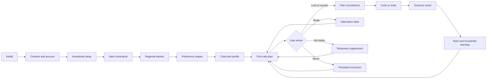

### Lifecycle state model

`anonymous → authenticated → consented → household_incomplete → onboarding_complete → cold_start → learning → mature → dormant → deletion_requested → purged`.

State changes are explicit, versioned, observable, and recoverable. A recommender failure does not move a user backward; it produces a cached or popular-safe fallback. Consent withdrawal disables the affected learning path without breaking essential planning where feasible.

<!-- PAGEBREAK -->

## 12. Journey A — first plan in under five minutes


**Success criteria:** median completion under 4 minutes; 80% reach first plan; no more than one free-text field; users can skip non-safety questions; initial plan contains enough viable alternatives; source of every hard constraint is inspectable.

**Recovery:** interrupted onboarding resumes at the last completed screen. A user can correct a diet or allergen before plan generation. If a safety input changes later, all unlocked future slots are invalidated and regenerated; locked slots display a blocking review if now unsafe.

<!-- PAGEBREAK -->

## 13. Journey B — daily decision and adaptation

The daily surface answers three questions in order: What is planned? Why does it fit? What can I do if it does not?

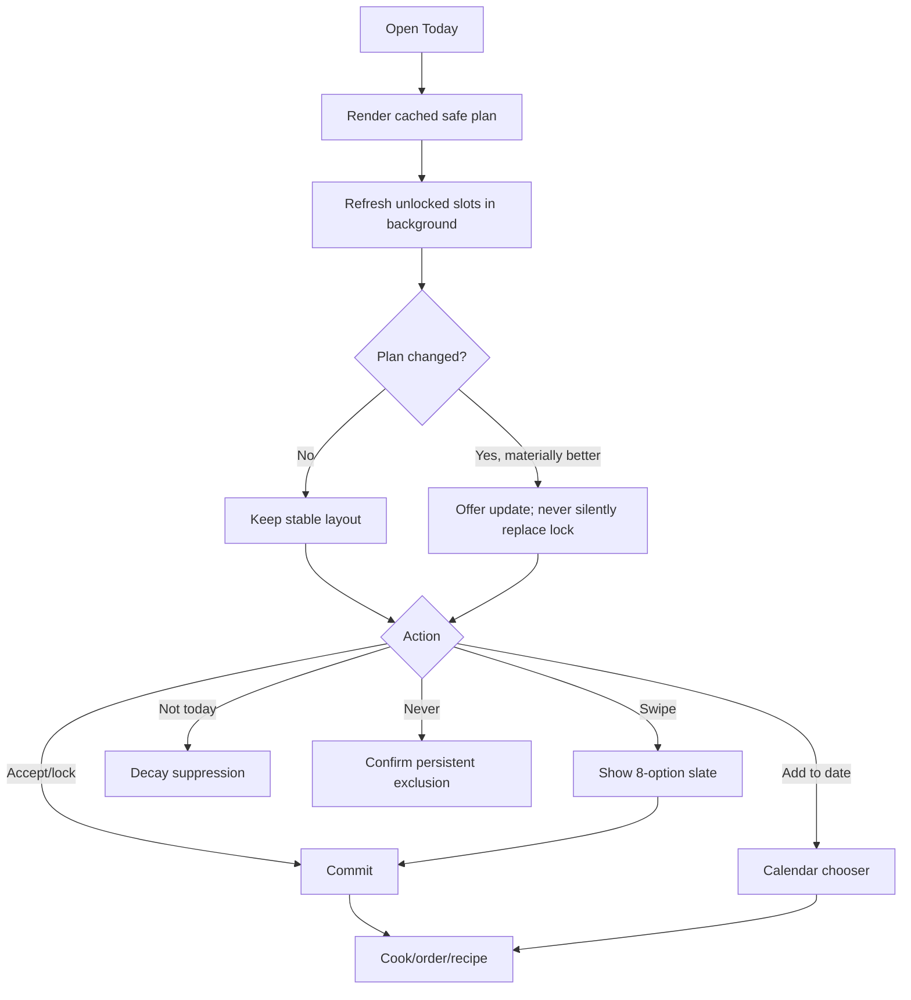

The layout remains stable during background refresh. Locked selections never change without direct user action. If connectivity fails, today’s cached plan and previously loaded recipe remain usable; feedback queues locally with an idempotency key.

<!-- PAGEBREAK -->

## 14. Journey C — household disagreement

Household collaboration is asynchronous and optional. The primary planner can share a lightweight voting link or invite another account. Foofoo aggregates preferences but does not force unanimity.

### Decision policy

- Safety veto: any applicable hard constraint removes the candidate.
- Cook feasibility veto: if the assigned cook cannot execute it in context, it is removed or down-ranked.
- Strong persistent dislike: large negative preference, not necessarily a permanent exclusion unless marked Never.
- Child preference: influences acceptance and optional add-ons; does not override household nutrition or safety.
- Planner preference: gets a fairness floor so the person carrying the task is not always sacrificed.
- Occasion owner: birthday, fasting, or post-workout context may temporarily change weights.


Fairness is measured across weeks, not necessarily every meal. The engine should detect if one member’s utility is persistently below a threshold and schedule compensating choices without violating constraints.

<!-- PAGEBREAK -->

## 15. Information architecture

| Tab | Primary purpose | Key objects |
|---|---|---|
| Today | Decide and act now | Meal cards, locks, alternatives, explanations |
| Week | Review and shape the plan | Seven days, slots, add-ons, refresh |
| Search | Intent-led override | Dish/class search, filters, add-to-date |
| Groceries | Convert plan into inputs | Consolidated ingredients, pantry exclusions |
| Profile | Household truth and control | Members, diet, allergens, region, Never list, privacy |

### Navigation rules

- Today is the default authenticated route.
- Deep links preserve intent: a notification opens the relevant slot; a household invite opens membership review.
- A user can always reach constraints and the Never list within two taps from a recommendation.
- Search is an override path, not the home experience.
- Recipe and dish details are context sheets over the current plan, preserving place on dismissal.

### Object hierarchy

`Household → Week Plan → Day → Meal Slot → Slate → Dish/Combo → Recipe/Order path`.

Each slot has status (`draft`, `recommended`, `locked`, `completed`, `skipped`), one selected item, zero or more alternatives, optional member add-ons, a context snapshot, a model version, and an explanation derived from scored evidence.

<!-- PAGEBREAK -->

## 16. UX design system

The active visual explorer establishes a warm consumer system. The implementation should retain the visual intent while meeting accessibility and performance requirements.

### Visual language

| Token group | Direction |
|---|---|
| Brand | Warm saffron/orange accent used selectively for primary action and appetite cues |
| Surfaces | Cream/off-white base, white elevated cards, restrained borders |
| Type | Friendly geometric sans; clear hierarchy; minimum 16px body on mobile |
| Imagery | Realistic Indian home food, consistent crop, no misleading garnish |
| Motion | Spring-based swipes, immediate haptics, reduced-motion alternative |
| Status | Green for safe/confirmed, amber for attention, red only for destructive/safety states |

### Accessibility

WCAG 2.2 AA contrast; 44×44 minimum targets; screen-reader labels that include dish, slot, status, and action; no color-only meaning; dynamic type to 200%; captions for instructional video; logical focus order; accessible confirmation for Never and deletion.

### Copy principles

Concise, household-aware, and nonjudgmental. “Not right for today?” beats “Reject.” “Because it is quick and your family often likes similar meals” beats “92% match.” Safety explanations name the constraint; personalization explanations never reveal another member’s sensitive health data.

<!-- PAGEBREAK -->

## 16.1 The recommendation surface is the product

The Today screen must not look like a recipe feed. It opens with one **complete recommended meal episode** and at most three reasons. The household can act without opening detail.

### Episode card anatomy

| Layer | Example | Why it exists |
|---|---|---|
| Intent line | “Simple weekday dinner” | Sets the expected richness/effort |
| Complete plate | “Tori chana dal sabzi + phulka + curd” | Prevents ambiguity about the actual meal |
| Practicality | “28 active min · 2 burners · mostly pantry staples” | Predicts execution, not inspiration |
| Household fit | “Mild base; chilli tadka separately” | Shows a real compromise |
| Cadence reason | “Comforting, but lighter than yesterday” | Demonstrates memory |
| Confidence | “Strong fit” or “Safe starting point” | Calibrated, never theatrical |
| Actions | `Make this`, `Show 3 alternatives`, `Not today`, overflow `Never` | Clear intelligence-bearing choices |

“Show alternatives” first asks what is wrong when useful: too much work, not in the mood, missing ingredient, member objection, too similar, or something else. This one-tap reason is more informative than a generic swipe and immediately conditions the replacement slate.

### Interaction contract

Every visible action produces a typed event and an immediate product consequence. “Make this” locks the episode and opens cooking orchestration; “Not today” suppresses the intent/dish with reason-dependent decay; “missing ingredient” updates pantry belief without changing taste; “too much work” updates contextual effort tolerance, not permanent dish preference; “member objection” assigns evidence to the correct member when consent and identity permit.

The product must never force users to train it. Silent acceptance, plan persistence, substitution, abandonment, and the actual meal are learned passively with appropriate uncertainty.

<!-- PAGEBREAK -->

## 17. Screen specification — access and consent

| ID | Screen | Required elements | Primary action | States / acceptance |
|---|---|---|---|---|
| AU-01 | Splash/restore | Logo, local session restore, health probe | Automatic | Cached route <2s; no blocking animation |
| AU-02 | Welcome | Promise, food imagery, sign in/create | Create account | Value understood without carousel |
| AU-03 | Sign up | Email, password, age gate, terms links | Continue | Inline validation; no sensitive food data yet |
| AU-04 | Sign in | Email/password, reset | Sign in | Generic auth errors; rate-limited |
| AU-05 | Reset password | Email and confirmation | Send link | Does not expose account existence |
| CO-01 | Consent | Essential personalization, analytics, notifications, retention controls | Save choices | Granular, versioned, optional items off by default where required |
| CO-02 | Privacy summary | Plain-language purposes, export/delete links | Continue | Accessible before consent |

**Analytics:** `welcome_viewed`, `signup_started`, `signup_completed`, `signin_failed`, `consent_viewed`, `consent_changed` with policy version. Never put email, names, health conditions, or free text in analytics properties.

<!-- PAGEBREAK -->

## 18. Screen specification — onboarding I

| ID | Screen | Inputs | Logic | Completion rule |
|---|---|---|---|---|
| OB-01 | Planner identity | Display name; who usually plans/cooks | Role initialization | Name optional; role required |
| OB-02 | Household type | Solo, couple, family, joint/shared | Determines branch, not persona label | One selection |
| OB-03 | Members | Age band, eating role, optional nickname | Create member rows | At least one eater |
| OB-04 | Regional identity | Home state/culture, current city, time since migration | Blend home and local priors | Home may be skipped; city required for context |
| OB-05 | Diet | Veg, non-veg, egg, vegan, Jain; per-member overrides | Hard constraint intersection | Explicit confirmation |
| OB-06 | Allergens | Standard list + “none known” + uncertainty note | Bitset/relations; safety gate | Must actively choose none or items |

**Critical UX rule:** diet and allergen screens explain household-wide impact. Changing them later triggers future-plan review. No inferred allergy is silently promoted to a hard constraint.

<!-- PAGEBREAK -->

## 19. Screen specification — onboarding II

| ID | Screen | Inputs | Model effect | UX requirement |
|---|---|---|---|---|
| OB-07 | Cook capability | Beginner/intermediate/advanced, equipment, weekday minutes | Feasibility prior | Examples make levels concrete |
| OB-08 | Preference swipes | 8–12 class/dish cards | Initializes class and genome affinities | Yes/no buttons mirror gestures |
| OB-08b | Context preferences | Budget, novelty, health orientation, notification time | Soft weights | Everything skippable except time zone |
| OB-09 | Review | Household facts and safety constraints | Final confirmation | Edit links by section |
| OB-10 | Plan generation | Progress with useful copy | Calls recommendation | Retry and safe fallback |
| OB-11 | First-plan reveal | Today’s plan and three teaching cues | Activation | User can lock or swap immediately |

Onboarding uses progressive disclosure. The engine records source (`explicit_onboarding`) and confidence for every derived attribute. Skipped answers reduce confidence and widen exploration; they never create false precision.

<!-- PAGEBREAK -->

## 20. Screen specification — Today and alternatives

| ID | Screen | Required elements | Actions | Edge states |
|---|---|---|---|---|
| P-01 | Today | Date, meal slots, complete selected episode, member adaptations, effort, explanation | Make this, alternatives, detail, add-to-date | Cached/offline banner; partial slots |
| P-02 | Alternative carousel | 3 visible meaningfully distinct episodes; up to 8 fetched; plate, active time, effort, fit tags | Accept, reasoned reject, not today, never | Exhausted slate → ask intent/constraint |
| P-03 | Meal detail | Complete plate, component recipes, critical-path plan, servings, region, nutrition range, allergens, why | Start cooking, lock, add to date, order | Missing recipe; data-confidence badge |
| P-04 | Explanation sheet | Top positive reasons, trade-off, safety confirmation | Feedback on reason | Never show raw weights or sensitive member condition |
| P-05 | Lock confirmation | Slot and selection | Lock/unlock | Concurrent update handled |
| P-06 | Never confirmation | Dish, consequence, undo route | Confirm Never | Distinguish from Not Today |

The pre-fetched eight-option slate is stable for a decision session, but only one recommendation and three alternatives are initially exposed. Analytics distinguishes fetched, rendered, and actually visible items. Reopening does not reshuffle unless the user explicitly refreshes.

<!-- PAGEBREAK -->

## 21. Screen specification — Week, search, and action

| ID | Screen | Required elements | Actions | Acceptance |
|---|---|---|---|---|
| W-01 | Week plan | 7-day grid/list, slot statuses, locks | Edit slot, refresh unlocked, share | Locked items preserved |
| W-02 | Selective refresh | Scope summary and reason | Refresh | Shows what will/not change |
| W-03 | Add to date | Calendar, slot, replace/add behavior | Confirm | Conflict explicit |
| S-01 | Search | Query, recent intent, filters | Open/add | Results <500ms target |
| S-02 | Filters | Diet-safe fixed, cuisine, time, difficulty, meal role | Apply | Cannot disable hard constraints |
| R-01 | Recipe | Ingredients, steps, servings, substitutions, timers | Start cooking | Offline after first load |
| O-01 | Cook or order | Recipe path, partner deep links, transparent sponsorship | Choose | Commercial content labelled |

Search results use the same hard-constraint service as recommendations. A typed request for an unsafe dish produces a respectful block and safe alternatives, not a silent empty result.

<!-- PAGEBREAK -->

## 22. Screen specification — groceries, household, privacy

| ID | Screen | Required elements | Actions |
|---|---|---|---|
| G-01 | Grocery list | Aggregated quantities, categories, source slots | Check, exclude pantry, share |
| G-02 | Pantry preferences | Staples, avoid auto-add, last reviewed | Update |
| H-01 | Household | Members, roles, invite status | Add/edit/remove |
| H-02 | Member profile | Diet, allergens, preference visibility, temporary context | Save |
| H-03 | Invite | Link/code, permissions, expiry | Send/revoke |
| PR-01 | Profile | Region, cook ability, notification, language | Edit |
| PR-02 | Never list | Excluded dishes/classes, date, source | Restore |
| PR-03 | Data and privacy | Consents, export, delete, retention summary | Request |
| PR-04 | Recommendation controls | Familiarity/novelty, planning effort, explanation detail | Save |

Removing a member starts a review before deleting member-linked preference evidence. Household administrators cannot see another adult’s sensitive condition unless that person chooses to share it; the recommender may use a privacy-preserving “constraint applies” flag.

<!-- PAGEBREAK -->

## 23. Functional requirements

| ID | Requirement | Priority | Acceptance evidence |
|---|---|---|---|
| FR-01 | Generate a 7-day, multi-slot household plan of complete, culturally valid meal episodes | P0 | Contract + golden personas |
| FR-02 | Enforce diet, allergen, religious, occasion, Never constraints twice | P0 | Zero-row safety queries |
| FR-03 | Rank one episode and three distinct visible alternatives; pre-fetch up to eight stable options | P0 | Deterministic exposure/session test |
| FR-04 | Lock selections across refresh | P0 | Concurrency test |
| FR-05 | Process Not Today with time decay and Never persistently | P0 | State transition tests |
| FR-06 | Learn typed taste, intent, effort, pantry, cadence, member, and outcome evidence from every exposure/action | P0 | Raw-event-to-feature trace |
| FR-07 | Generate a shared plate plus safe member adaptations while minimizing extra cooking burden | P0 | Joint-family workload fixtures |
| FR-08 | Search and add a safe dish to a date | P1 | UI/API integration |
| FR-09 | Explain each recommendation from actual contributions | P1 | Trace-to-copy test |
| FR-10 | Build a grocery list from committed plan | P1 | Unit conversion tests |
| FR-11 | Offline-display cached plan and queue feedback | P1 | Airplane-mode journey |
| FR-12 | Export and delete user data | P0 | End-to-end compliance test |
| FR-13 | Support model/config version and experiment assignment | P0 | Decision trace |
| FR-14 | Provide cook/order routes without paid-rank contamination | P2 | Marketplace policy test |

<!-- PAGEBREAK -->

## 24. Non-functional requirements

| Domain | Target |
|---|---|
| Safety | Zero known hard-constraint violations; gate blocks the slate, not just the item |
| Availability | 99.9% monthly for plan read; safe cached fallback during RE outage |
| Latency | cached today p95 <1s; fresh plan p95 <3s; server recommendation p95 <800ms target |
| Scale | horizontal stateless APIs; partition high-volume events; 10× demand headroom before redesign |
| Privacy | data minimization, purpose-bound consent, export/delete, no PII in analytics |
| Security | JWT validation, household ownership checks, RLS, private RE schema, secret rotation |
| Accessibility | WCAG 2.2 AA and screen-reader-complete primary journeys |
| Reliability | idempotent mutations and events; retries bounded; dead-letter visibility |
| Explainability | every result stores candidate set, filters, signal contributions, version, rank |
| Reproducibility | offline replay within numerical tolerance using trace snapshot |
| Cost | model and infra cost per WSMD tracked; LLM never on synchronous ranking hot path |
| Freshness | catalog publishing SLA and feature staleness indicators |

**Current-state note (repository, 5 Aug 2026):** complete-meal episode serving is the mobile default with a compatibility fallback; canonical slates, item propensities, typed outcomes and replay are active. Migrations 060–072 operate the ontology queue, graph, nutrients, research/annotation control plane, safe unknown-dish promotion, complete relationship provenance, consolidated ontology read model, controlled provider evaluation, normalized recommendation lineage and database-enforced AI field policy. Seed 147 populates all 802 production dishes with constraints, regional affinities, nutrition estimates, recipes and published single-primary episodes, plus curated composite episodes. FoodOn enrichment is live. USDA's free demo key is active only for exact-name provisional evidence after a 12-dish evaluation found four exact matches, five wrong-food matches and three no-record results. Migrations 066–069 activate an independent, budgeted Groq backfill for low-risk canonical-dish aliases, taxonomy tags and regional affinity; user-submitted text and every safety-sensitive field remain outside that generative path.

<!-- PAGEBREAK -->

## 25. Success metrics and metric tree

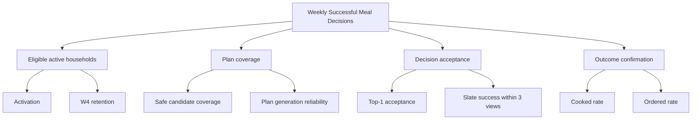

### Metric definitions

| Metric | Definition |
|---|---|
| Activation | Household completes onboarding and accepts/locks ≥2 slots within 24h |
| Top-1 acceptance | Recommended first items accepted ÷ valid first-item exposures |
| Slate success | Sessions with an accepted item within first 3 impressions ÷ slate sessions |
| Plan adherence | Completed intended slots ÷ committed eligible slots |
| Decision time | Active seconds from plan view to commitment, excluding background |
| Variety satisfaction | Accepted slots meeting policy with no repetition complaint event |
| Safety incident rate | Confirmed constraint violations per million slates; target 0 |
| Household fairness | 10th-percentile member utility over rolling 28 days |
| W4 retained household | ≥3 WSMD in week four |
| Recommendation regret | Share of accepted items replaced before the meal window |

Guardrails accompany every growth or ranking experiment: safety, complaint rate, Never rate, latency, cook completion, and 7/28-day retention.

<!-- PAGEBREAK -->

## 26. Experimentation framework

Experiments operate at the household level to prevent cross-member contamination. Assignment is deterministic (`hash(household_id, experiment_id)`) and stored before exposure. Analysis is intention-to-treat; triggered analysis may supplement but never replace it.

### Experiment lifecycle

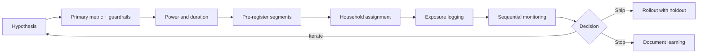

### Required analyses

- Overall and pre-registered segments: cold-start/mature, solo/household, region, diet, cook skill, connectivity tier.
- Novelty effects over at least 14 days; one-day clicks are insufficient.
- Interference review where invited members interact with the same plan.
- CUPED or pre-period covariates for mature households where appropriate.
- False-discovery control for many secondary metrics.
- Long-lived 1–5% global holdout to measure personalization’s cumulative value.

No experiment may weaken a safety filter. Exploration is only within the already-safe pool.

<!-- PAGEBREAK -->

## 27. Growth strategy

Growth begins with product utility, then household network effects, then ecosystem distribution.

### Loops

1. **Relief loop:** strong plan → less decision time → repeat morning open → better evidence → stronger plan.
2. **Household loop:** planner invites eater → more preference evidence → fewer complaints → planner retains → more invitations.
3. **Plan-sharing loop:** share a useful weekly plan → recipient sees concrete value → installs with locale context.
4. **Recipe loop:** accepted decision leads to recipe completion → outcome confidence improves → search acquisition grows.
5. **Partner loop:** grocery/order conversion proves intent → partner improves availability data → plans become more actionable.

### Growth requirements

- Invite without forcing account creation before the recipient understands the purpose.
- Deep links preserve household and plan context with expiry and abuse controls.
- Referral incentives reward activation or WSMD, not raw installs.
- ASO content targets the pain phrase and regional/household use cases.
- Lifecycle messaging pauses when no new value exists; max caps are enforced.
- Win-back shows improved plan quality or a relevant context, not generic urgency.

Growth analytics must separate planners, eaters, and invited non-planners; one household is not counted as multiple independent retained customers.

<!-- PAGEBREAK -->

## 28. Go-to-market strategy

### Phase 1 — Design partners

Recruit 100–300 households across Pune, Bengaluru, Delhi NCR, Mumbai, Hyderabad, Ahmedabad, Chennai, and one Tier-2 cluster. Balance household types and regional origins. Founders observe onboarding and the morning decision weekly. Success is qualitative trust plus 3+ WSMD/week, not downloads.

### Phase 2 — City-cluster launch

Launch through apartment communities, parent groups, workplaces, fitness coaches, and regional food creators. Use invitation cohorts to maintain catalog coverage and support quality. Messaging leads with relief; AI is proof, not headline.

### Phase 3 — Public India launch

Combine ASO, vernacular content, referral incentives, creator demonstrations, and partnerships. Build a wait-free self-serve onboarding only after cold-start coverage is stable.

### Phase 4 — Monetization and partners

Introduce premium household controls, advanced planning, recipes, nutrition views, and integrations. Retail/order partners receive explicit downstream conversion opportunities; no unlabelled paid insertion into organic rank.

### GTM scorecard

CAC per activated household, activation, W1/W4 retention, WSMD, organic share, invite acceptance, support tickets per 100 households, catalog coverage by cohort, and cost per successful decision.

<!-- PAGEBREAK -->

## 29. Monetization

### Recommended ladder

| Tier | Illustrative offering | Pricing test |
|---|---|---|
| Free | Today/week plan, core swipes, basic household, limited history | ₹0 |
| Plus | Advanced household controls, full recipes, grocery automation, unlimited swaps, deeper explanations | ₹99–149/month |
| Family Pro | More members, goal overlays, shared planning, integrations, priority support | ₹199–299/month |
| Partner/API | Food intelligence and qualified intent services | Contracted usage/value |

Pricing values are hypotheses. Test willingness to pay only after habit formation and clear feature value. Use UPI AutoPay and app-store billing as applicable; publish renewal terms plainly.

### Monetization principles

- Core safety is never paywalled.
- Free plans remain genuinely useful.
- Sponsored inventory is labelled and ranked only after safety; users can disable commercial suggestions.
- Health-oriented premium features require evidence and appropriate professional review.
- Subscription cancellation and data deletion are simple.
- Optimize lifetime successful decisions and trust, not short-term conversion.

Potential future revenue includes retailer affiliate fees, order referral, branded but transparent recipe placements, appliance integrations, employee wellness, and B2B recommendation APIs. Each requires a conflict-of-interest review.

<!-- PAGEBREAK -->

## 30. Product roadmap and future vision

| Version | Product promise | Intelligence | Data/Platform |
|---|---|---|---|
| v1 | Safe, practical complete meal episodes | Plate grammars, cohort/class priors, explicit practicality, rule ranker, MMR | Canonical catalog, episode bundles, raw events, complete traces |
| v2 | Learns each household and member | Separate choose/execute/regret models, taste vectors, cadence and fairness state | Near-real-time feature store, calibrated experiments |
| v3 | Understands pantry, leftovers, and similar households | Two-tower retrieval, GBDT/LTR, hierarchical cold start, graph substitution | Food graph projections, workload DAGs, inventory adapters |
| v4 | Anticipates latent intent and whole-week consequences | Sequence intent model, CP-SAT/MIP planning, constrained bandit | Online/offline parity, counterfactual evaluation, shadow models |
| v5 | Household food operating system | Long-horizon multi-objective policy with causal safeguards | Multi-region locale packs, partner platform, privacy-preserving learning where justified |

**Future vision:** Foofoo becomes a private household food memory. It understands what people enjoy, can safely eat, can realistically make, already have, recently consumed, and may need tomorrow. It coordinates cooking, shopping, ordering, appliances, and health services without allowing any partner to own or distort the household’s preferences.

The sequence is intentionally trust-first. A beautiful graph or sophisticated model has no value if the household’s first week contains implausible meals.

<!-- PAGEBREAK -->

# Part II — FooFoo Recommendation Engine Bible

## 31. Recommender objectives and invariants

The recommender maximizes expected household meal utility subject to safety, feasibility, diversity, fairness, and system constraints.

For household `h`, context `c`, meal slot `s`, and candidate `d`:

`maximize E[U(h,d,s,c)] + exploration(d,h) - burden(d,c) - repetition(d,h)`

subject to:

- `Safe(d,h)=1`
- `OccasionFit(d,s)=1`
- `Never(d,h)=0`
- plan composition constraints
- latency and candidate-coverage minimums.

### Non-negotiable invariants

1. Filters precede scoring; safety gates run again after re-ranking.
2. Unknown safety data is not treated as safe for high-risk cases.
3. Every exposure has a stable request, slate, item, rank, model, and experiment identifier.
4. The LLM may enrich or explain offline; it cannot invent a dish into the live safe pool.
5. A locked plan slot is immutable except by the user or an explicit safety invalidation.
6. Personalization confidence controls how much the system departs from cohort priors.
7. No single click permanently rewrites taste; explicit Never is the exception.

<!-- PAGEBREAK -->

## 32. Multi-stage recommendation pipeline


### Stages and budgets

| Stage | Role | Target p95 |
|---|---|---|
| Snapshot | Assemble immutable request context | 80ms |
| Class planning | Choose meal roles before dishes | 60ms |
| Retrieval/filter | 50–500 safe candidates | 180ms |
| Features | Batch online feature read | 100ms |
| Score/aggregate | Score all candidates | 120ms |
| Re-rank/optimize | Diversity + plan constraints | 150ms |
| Gate/explain/persist | Verify and emit | 110ms |

Budgets are targets, not promises. The request degrades through named fallbacks: live personalized → cached features → cohort priors → safe popular plan → last known safe plan.

<!-- PAGEBREAK -->

## 33. Candidate generation

Candidate generation is recall-oriented. Multiple generators produce `(dish_id, generator, retrieval_score)` tuples:

- class-to-dish mappings from the planned meal class;
- regional/home-state affinity;
- current-city exposure;
- household favorites and similar-genome neighbors;
- seasonal/weather-compatible foods;
- underexposed safe catalog for exploration;
- leftovers and ingredient reuse (v3);
- substitution graph paths (v3);
- collaborative cohort neighbors after scale (v3+).

Candidates are unioned, deduplicated by canonical dish ID, and filtered. Generator contribution is logged for later attribution. A minimum coverage policy broadens the class in a controlled hierarchy if fewer than `K_min` candidates survive. It never drops a hard constraint.

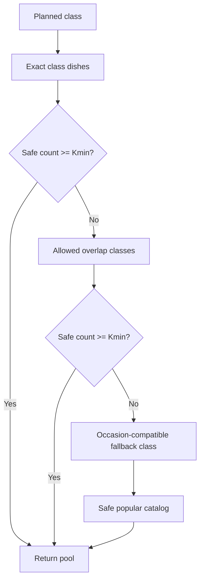

Coverage gaps are operational data with region, class, constraints, and failed counts; they drive content acquisition.

<!-- PAGEBREAK -->

## 34. Hard constraints and safety gates

The candidate set is:

`C_safe = C ∩ C_diet ∩ C_allergen ∩ C_religion ∩ C_occasion ∩ C_never ∩ C_availability`.

Diet and Jain eligibility are derived from ingredient ground truth. Allergen filtering traverses dish ingredients rather than trusting a display-level cached flag. Household constraints are the union of applicable eater constraints for a shared base dish; member add-ons use that member’s constraints plus contamination policy.

### Gate behavior

| Gate | Failure action |
|---|---|
| Diet | Remove candidate; block final slate if leaked |
| Allergen | Remove candidate; raise incident if final leak |
| Religious/Jain | Remove candidate; block slate |
| Meal role/composition | Repair slot or regenerate |
| Never | Remove; explicit restore required |
| Missing provenance | Quarantine content from high-risk surfaces |

Safety regression uses adversarial fixtures: ingredient aliases, compound ingredients, optional garnish, cross-diet variants, missing data, and substitutions. A post-rank gate verifies the exact selected dish version and components, not merely the parent dish.

<!-- PAGEBREAK -->

## 35. Feature model

Features are grouped by source and refresh cadence.

| Family | Examples | Cadence |
|---|---|---|
| Household | composition, diet intersection, cook role | change-driven |
| Taste | class affinity, genome vector, dish history | near-real-time |
| Content | genome tags, ingredients, region, difficulty | publish-time |
| Context | slot, weekday, weather, festival, time budget | request-time/cache |
| Plan | recent classes, ingredients, methods, colors, burden | request-time |
| Popularity | impression-normalized acceptance, cook completion | daily/hourly |
| Quality | catalog confidence, recipe completeness, image quality | publish-time |
| Exploration | impression count, posterior uncertainty | event-driven |

Features have an owner, definition, data type, null policy, valid range, timestamp, source lineage, and offline/online transformation parity test. Null is never casually coerced to zero; it maps to a documented default and missingness indicator where informative.

<!-- PAGEBREAK -->

## 36. Base scoring equation

For candidate `d`:

`z(d)=w_c C(d)+w_g G(d)+w_h H(d)+w_x X(d)+w_q Q(d)+w_e E(d)-P(d)`

`p_accept(d)=σ(z(d))=1/(1+e^{-z(d)})`

where:

- `C`: cohort/class prior;
- `G`: Meal Genome/content match;
- `H`: personal and household history;
- `X`: context fit;
- `Q`: content quality and feasibility;
- `E`: bounded exploration bonus;
- `P`: repetition, burden, temporary suppression, and uncertainty penalties.

Weights interpolate with personalization confidence `ρ∈[0,1]`:

`w_i(ρ)=(1-ρ) w_i,cold + ρ w_i,mature`.

This ensures cold users lean on priors while mature users lean on evidence. Scores are calibrated against acceptance outcomes; rank order alone is insufficient for product decisions such as confidence labels or notification thresholds.

<!-- PAGEBREAK -->

## 37. Personal history and time decay

Event evidence decays so recent behavior matters more without erasing durable taste:

`H_d = Σ_j a(type_j) · exp(-λ Δt_j) · position_debias(j) · context_similarity(j)`.

Illustrative event signs: lock/cooked/rated-positive > accept > detail-view; passive impression is neutral; swipe-past is weak negative; Not Today is strong temporary negative; Never is a hard exclusion. Exact values live in versioned configuration and are learned from outcomes.

### Exposure correction

An unshown dish cannot be considered disliked. Propensity or position correction prevents the first-ranked items from acquiring self-reinforcing popularity simply because they received more exposure. Training data stores the full slate and selection propensity where exploration policy permits.

### Repetition penalties

Penalty components include same dish, parent dish, main ingredient, meal class, cooking method, cuisine, texture, and color family over separate windows. Explicit comfort-food preference and planned leftovers can relax—but not erase—specific penalties.

<!-- PAGEBREAK -->

## 38. Household intelligence mathematics

Let each member `m` have predicted utility `u_m(d)`, role weight `r_m`, and confidence `q_m`. A naive mean can repeatedly ignore a minority. Foofoo uses a blended social-welfare objective:

`U_house(d)=α Σ_m ŵ_m u_m(d) + (1-α) min_m u_m(d) - β Burden(d,cook)`

where `ŵ_m = r_m q_m / Σ r_j q_j`. The minimum-utility term provides a fairness floor. Applicable safety constraints are not utilities; they already removed candidates.

For a shared base plus add-ons:

`U_bundle = U_house(base) + Σ_m U_m(addon_m | base) - γ Complexity(bundle)`.

Complexity penalizes extra burners, distinct ingredient sets, extra active minutes, and coordination. This prevents “personalization” from turning one meal into five separate meals.

### Role examples

The primary cook’s time feasibility receives high weight; an eater’s favorite has preference weight; a temporary guest has contextual weight; a toddler signal is smoothed to avoid a week of only favorite foods. Roles are policy, transparently tested for systematic unfairness.

<!-- PAGEBREAK -->

## 39. Meal Genome similarity

Each dish has sparse categorical tags plus a dense vector. Household taste is an attention-weighted aggregate of accepted dish vectors and explicit class signals.

`sim(d,h)=cos(v_d, v_h)= (v_d·v_h)/(||v_d|| ||v_h||)`.

For mixed feature families:

`G(d,h)=Σ_k η_k sim_k(d,h)`,

where a categorical family can use weighted Jaccard and numeric nutrition/time features use normalized distance.

The vector space must not collapse safety and taste. Diet/allergen/religious data remain constraints. Genome dimensions represent sensory and practical similarity: base ingredient, cooking method, texture, flavor, richness, meal role, cuisine, time, equipment, serving format, temperature, season, accompaniment, familiarity, and nutrient bands.

Embedding models may propose similarities, but curated ontology edges and human review anchor high-impact relations.

<!-- PAGEBREAK -->

## 40. Diversity and MMR ranking

After pointwise scoring, Maximum Marginal Relevance selects a slate:

`MMR(d)=λ Rel(d) - (1-λ) max_{s∈S} Sim(d,s)`.

`S` is the already selected set. Similarity combines genome, main ingredient, meal class, cooking method, and cuisine. The penalty differs by surface: a one-slot carousel needs visually and conceptually distinct choices; a week plan needs balanced continuity and ingredient reuse.

### Diversity policy

- Never sacrifice hard safety.
- Preserve the best high-confidence item at rank 1 unless weekly optimization changes it.
- Cap near-duplicate parent variants in one slate.
- Enforce minimum class/cuisine/method coverage when the safe pool allows.
- Record the relevance loss paid for diversity.
- Measure satisfaction and completion, not only unique tags.

MMR is deterministic for a stored seed and candidate set, supporting replay. Exploration randomization occurs through a logged policy before or within constrained re-ranking.

<!-- PAGEBREAK -->

## 41. Weekly constrained optimization

A weekly plan is not seven independent rankings. Let binary `x_{d,s}` mean dish `d` is selected for slot `s`:

`maximize Σ_{d,s} x_{d,s} Score(d,s) - repetition - burden + reuse + balance`

subject to `Σ_d x_{d,s}=1` for each active slot, hard safety, locks, class composition, cook-time budgets, and policy limits.

### Practical solver strategy

v1 uses greedy slot planning plus MMR and repair. v2 adds beam search over days. v3 may use integer programming for a weekly bundle when inventory, nutrition ranges, and leftovers are sufficiently trustworthy. Locked slots become fixed variables. A selective refresh optimizes only unlocked variables around them.

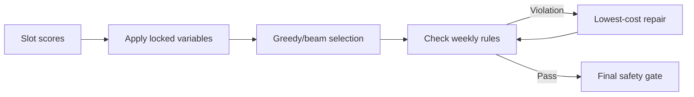

<!-- PAGEBREAK -->

## 42. Cold start algorithms

Cold start has four cases: new household, new member, new dish, and new region.

### New household

1. Apply explicit hard constraints.
2. Build composable cohort priors from household, region, cook skill, and time.
3. Convert 8–12 onboarding swipes into class/genome evidence.
4. Set confidence `ρ` from completeness and signal agreement.
5. Mix popular-safe exploitation with bounded, diverse exploration.

`Score_cold = (1-ρ) Prior_cohort + ρ SwipeTaste + Context + Quality - Penalties`.

### New dish

Use catalog quality, class mapping, genome similarity, regional evidence, and conservative exploration. Never use raw popularity of unexposed content as zero-quality proof.

### New region

Fall back through state → culinary zone → national occasion-compatible priors, while logging a coverage gap.

### Exit

Exit cold start when effective evidence—not raw event count—crosses a configurable threshold and calibration is stable. Ten repeated impressions are not ten independent preference signals.

<!-- PAGEBREAK -->

## 43. Contextual bandits and exploration

After safe candidate generation, a contextual bandit can choose limited exploratory exposure. Thompson Sampling maintains a posterior per dish/class/context; LinUCB or a neural contextual bandit may follow when data supports it.

For Beta-Bernoulli Thompson Sampling:

`θ_d ~ Beta(α_d,β_d)` and select among safe candidates using `θ_d` blended with rank score. Success may be cooked/accepted; failure definitions must account for missing outcome and position.

### Guardrails

- Exploration share capped by confidence and user novelty preference.
- No exploration on safety uncertainty.
- Do not explore high-burden dishes on time-pressured weekdays.
- Household fairness constraints remain active.
- Store propensity for unbiased evaluation.
- Use a stable control policy and off-policy evaluation before rollout.

The bandit is not a substitute for a correct catalog or base ranker. It improves evidence allocation within a safe, high-quality pool.

<!-- PAGEBREAK -->

## 44. Ranking model roadmap v1→v5

| Version | Model | Training data | Promotion gate |
|---|---|---|---|
| v1 | Configured linear score + MMR | Priors, explicit swipes, rules | Safety + golden personas + offline sanity |
| v2 | Calibrated logistic/GBDT ranker | Impressions, accepts, cooks, context | AUC/NDCG plus online WSMD lift |
| v3 | Two-tower retrieval + GBDT/deep ranker | Larger exposure corpus, content embeddings | Retrieval recall + diversity + fairness |
| v4 | Sequence-aware household model | Ordered sessions/weeks | Long-term retention and regret reduction |
| v5 | Constrained policy optimization | Causal/experimental outcomes | Off-policy safety, long-horizon WSMD |

Model sophistication is earned by sample size and operational maturity. Each version retains deterministic rule fallbacks. Champion/challenger runs in shadow first; discrepancies are inspected by cohort and constraint type. Promotion requires calibrated improvements in real outcomes, not only offline ranking metrics.

<!-- PAGEBREAK -->

## 45. Explanations and decision traces

Every recommendation stores:

- request, household snapshot hash, context snapshot;
- planned class and candidate generators;
- candidates before/after each filter with reason codes;
- feature version and values used;
- signal contributions, penalties, point score;
- household aggregation and diversity deltas;
- final rank, safety gate result, model/config/experiment versions;
- response and subsequent events.

User explanation is a faithful compression: select the top 2–3 positive, non-sensitive contributions that pass copy rules. Example: “Quick for a weekday, familiar to your household, and different from yesterday’s main ingredient.”

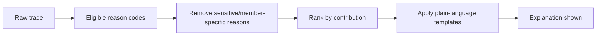

If no defensible reason exists, show a neutral label such as “A safe popular option for this meal,” not fabricated personalization.

<!-- PAGEBREAK -->

## 46. Offline evaluation

### Datasets

- Time-based train/validation/test split.
- Household-level split for generalization checks.
- Cold-start slice, mature slice, sparse regions, strict diets, large households.
- Counterfactual evaluation subset from randomized safe exploration.

### Metrics

Retrieval Recall@K, NDCG@K, MRR, calibration error, coverage, catalog exposure Gini, intra-list diversity, repetition violations, constraint violations, inference latency, and estimated WSMD uplift.

### Replay requirements

Given a trace snapshot, the engine reproduces candidate filters and ranks within a numeric tolerance. Feature leakage tests prevent use of future outcome information. Offline gains must hold across high-risk cohorts. A model that improves average NDCG while degrading Jain or allergen-safe coverage is rejected.

### Human review

Food experts and representative users evaluate paired plans for plausibility, composition, cultural fit, burden, and explanation truthfulness. Human preference is evidence, not an unquestioned label; reviewer agreement is measured.

<!-- PAGEBREAK -->

## 47. Online monitoring and model governance (operational, not policy paperwork)

Operational dashboards show request rate, p50/p95/p99 latency, fallback share, candidate count after each filter, safety gate failures, top-1 acceptance, slate success, WSMD, Never/Not-Today rates, drift, and feature freshness.

### Drift detection

- Population drift in household/context features (PSI/Jensen–Shannon).
- Prediction drift and calibration by cohort.
- Outcome drift by region, season, and meal slot.
- Catalog drift: untagged or low-confidence new content.
- Feedback drift caused by UI or event-contract changes.

Alerts link to traces, model version, deploy, and catalog publish. Rollback changes the active model/config pointer; it does not require a mobile release. A kill switch disables learned ranking and serves safe priors. Safety incidents trigger candidate quarantine and trace preservation.

<!-- PAGEBREAK -->

# 47A. Final mathematical specification — notation and decision object

For household `h`, member set `M_h`, decision time `t`, slot `s`, and context `c_t`, the engine ranks meal episodes `e∈E`. An episode contains components `D_e`, recipe variants `R_e`, member adaptations `A_e`, predicted work plan `W_e`, and pantry requirements `I_e`.

### Core notation

| Symbol | Meaning |
|---|---|
| `x_h,t` | household state known before the decision |
| `z_h,t` | latent appetite/intent state |
| `g_e` | structured episode genome |
| `v_h`, `v_m` | household and member taste vectors |
| `q(e,h,t)` | hard eligibility indicator |
| `p_choose` | probability episode is chosen/locked |
| `p_execute` | probability it is actually cooked or intentionally ordered |
| `p_enjoy,m` | member-level enjoyment probability |
| `p_regret` | probability of replacement, complaint, or strong negative outcome |
| `C_work` | cook workload cost |
| `C_repeat` | temporal repetition/cadence cost |
| `B_balance` | multi-day food-group and variety benefit |
| `π_0`, `π` | logging and candidate policies |

The optimization target is conditional expected successful completion:

`P_success(e)=P(choose e) · P(execute e | choose) · P(no regret | execute)`.

This factorization is product-critical. A rich dish may have high `P(choose)` and low `P(execute)` on a weekday. A practical but disliked plate can have the reverse. Foofoo must rank the joint outcome.

<!-- PAGEBREAK -->

# 47B. Latent appetite and intent inference

Users rarely declare the real momentary intent. “Healthy” may be a long-term goal while tonight’s latent state is tired-and-comfort-seeking. Represent the intent state:

`z_t ∈ {routine, quick, light, comfort, indulgent, discovery, leftover_use, festive, recovery}`.

A Bayesian state model computes:

`P(z_t | x_t, a_<t) ∝ P(x_t | z_t) Σ_z P(z_t | z_{t-1}) P(z_{t-1} | history)`.

Inputs include day/slot, elapsed time since last meal, weekday, recent richness, recent order-out, weather, household schedule, planning lead time, pantry belief, active user, and response patterns in the current session. The prior is household- and region-specific; the posterior updates after each action.

### Intent evidence examples

| Observation | Likely update | What must not happen |
|---|---|---|
| Repeatedly rejects >35-minute plates at 8pm | increase `quick`; lower current effort tolerance | permanently mark those dishes disliked |
| Opens app early Sunday and browses details | increase `discovery` or `indulgent` | apply weekday quick prior |
| Ordered out after accepting a laborious plan | reduce execution probability for similar workload/context | treat order as food dislike |
| Selects khichdi after two rich days | increase `light/recovery` and cadence sensitivity | assume permanent khichdi preference |
| Festival mode confirmed | set `festive`, then apply observance eligibility | infer religious identity from calendar alone |

v1 implements a transparent multinomial model; v3 may use a sequence model. The intent posterior is stored in the decision trace, but user copy remains human: “Looks like a quick, comforting dinner fits tonight.”

<!-- PAGEBREAK -->

# 47C. Event semantics — every action is intelligence, not every action is taste

Each event updates one or more latent dimensions with explicit attribution and uncertainty. Let an event produce evidence vector `δ_j` over `taste`, `intent`, `effort`, `pantry`, `member`, `cadence`, and `quality`.

| Event/action | Primary evidence | Typical strength | Required context |
|---|---|---|---|
| Impression | exposure only | 0 taste | rank, visibility, dwell eligibility |
| Quick swipe past | weak momentary negative | low | position, velocity, alternatives |
| Open detail | curiosity/consideration | low positive | dwell and subsequent action |
| Make this / lock | choice | high positive | full slate and propensity |
| Cook completed | execution truth | very high positive | actual recipe/substitutions/time |
| Ate/enjoyed | outcome utility | highest | member attribution/confidence |
| Not today: mood | intent suppression | strong, short half-life | reason and context |
| Not today: too much work | effort model | strong contextual | available time/cook |
| Missing ingredient | pantry belief | strong, fast-decaying | ingredient and shopping outcome |
| Never | hard household/member exclusion | deterministic until restore | scope and actor |
| Swap component | component/plate preference | medium-high | before/after bundle |
| Ordered another cuisine | intent and preference | contextual positive for actual choice | category/dish if known |
| Plan ignored | ambiguous | low negative execution | app open, notification, meal window |
| Repeat manually | comfort/favorite | high positive | cadence and member set |

Update only if the event was causally possible: an unexposed item gets no negative label. Missing outcomes remain censored, not failures. Offline queues preserve original occurrence order and identifiers.

<!-- PAGEBREAK -->

# 47D. Hierarchical cold-start prior

Each household parameter vector has a hierarchical prior rather than a fixed persona:

`θ_h ~ Normal(μ_h, Σ_h)`

`μ_h = μ_global + u_region + u_household_type + u_diet + u_cook_skill + u_city_tier + u_meal_slot`.

Shrinkage lets sparse segments borrow strength without pretending they are identical. Prior variance reflects evidence quality; a narrow expert prior is permitted only when grounded in representative research. Onboarding observations `y_1…y_n` update the posterior:

`p(θ_h | y) ∝ p(y | θ_h) p(θ_h)`.

For a Beta-Bernoulli class affinity example:

`α_h,k = α_cohort,k + weighted_positive_k`

`β_h,k = β_cohort,k + weighted_negative_k`

`E[p_h,k]=(α_h,k)/(α_h,k+β_h,k)`.

Effective evidence is discounted for correlated actions. Ten rapid swipes in one onboarding batch do not equal ten independent cooked outcomes. Confidence is:

`ρ_h = 1 - exp(-N_eff / τ)`, capped by profile completeness, calibration, and contradiction penalties.

Cold-start exit is per feature family. The engine may be mature on spice and breakfast class, but uncertain on seafood or weekend indulgence.

<!-- PAGEBREAK -->

# 47E. Meal-episode candidate generation

Candidate generation is grammar-constrained bundle construction, not a Cartesian product of dishes.


### Retrieval channels

1. Household repeated episodes and controlled variants.
2. Exact meal-class and regional-grammar catalog.
3. Genome nearest neighbors to prior successes.
4. Component substitution and pairing graph.
5. Similar-household collaborative retrieval after minimum support.
6. Pantry/leftover compatible episodes.
7. Context/season/festival retrieval.
8. High-quality underexposed episodes for safe exploration.

Each channel returns a source score and calibrated reliability. A beam search assembles bundles:

`Beam_{j+1}=Top_B {partial ⊕ component : grammar_valid ∧ constraints_possible}`.

Prune on unsafe ingredients, incompatible plate roles, impossible equipment, excessive work, duplicate functional roles, and implausible regional combinations. Store the generator path for attribution.

<!-- PAGEBREAK -->

# 47F. Practicality intelligence and execution model

Practicality is predicted from the actual cooking episode. Define workload features:

- active preparation minutes, passive minutes, critical-path minutes;
- burner/pressure-cooker/oven occupancy and parallelizability;
- number of vessels and cleanup load;
- distinct ingredients, uncommon ingredients, and prep operations;
- recipe familiarity and cook skill gap;
- pantry probability and shopping detour;
- batchability, leftover value, and reuse of existing prep;
- number and complexity of member adaptations;
- time of request, meal deadline, cook identity, fatigue proxy, and weekday.

Critical-path time is computed on the recipe DAG, not summed naïvely:

`T_critical = max_path Σ operation_duration`, subject to equipment capacity.

Work cost:

`C_work = β1 T_active + β2 T_critical + β3 Vessels + β4 RareIngredients + β5 SkillGap + β6 ShoppingRisk + β7 AdaptationLoad - β8 PrepReuse - β9 LeftoverValue`.

Execution probability:

`p_execute = σ(b0 + b_h + b_slot + γ^T context - C_work + Familiarity + PlanLeadTime)`.

### Cadence tiers

Every episode has a learned/curated tier: `daily_staple`, `regular_rotation`, `weekly_rich`, `occasional`, `festive`. Tier is household-conditional. A paneer gravy may be regular for one family and occasional for another. Weekly rich-episode caps are soft unless the user declares otherwise; a hidden state tracks richness debt and recent cooking load.

This model is a release-gated product component. If `p_execute` is missing or uncalibrated, the engine must remain conservative.

<!-- PAGEBREAK -->

# 47G. Member-level preference and enjoyment models

For member `m`, episode `e`, and context `t`:

`η_m,e,t = b_m + b_e + v_m^T W g_e + f_explicit + f_recency + f_context + f_component + f_social`

`p_enjoy,m(e,t)=σ(η_m,e,t)`.

`v_m` contains separate subspaces for class, main ingredient, texture, spice, flavor, method, regional affinity, serving format, richness, and novelty. Member vectors update only from attributable evidence; household choices with unknown speaker update the shared vector with lower confidence.

### Explicit versus revealed preference

Let `θ_declared` and `θ_behavior` remain separate. Combine them by evidence-dependent reliability:

`θ_effective = (1-ρ_behavior) θ_declared + ρ_behavior θ_behavior`.

Contradiction is retained as a useful feature. A user who declares “healthy” but repeatedly chooses familiar rich food has a goal-behavior gap; the product should serve achievable compromises, not silently discard the goal or shame the behavior.

### Component utility

Episode utility is not the mean of dish utilities:

`u_m(e)=Σ_d a_role(d)u_m(d)+Σ_{d_i,d_j} interaction_m(d_i,d_j)-portion_mismatch-adaptation_cost`.

This captures that dal may be liked with rice but not with a particular roti/sabzi combination, and that an accepted mild base plus optional chilli can outperform a compromised average spice level.

<!-- PAGEBREAK -->

# 47H. Household aggregation and fairness

Safety uses intersection; preference uses fair aggregation. Define normalized member utility `ũ_m∈[ε,1]`. Use an asymmetric Nash social welfare score:

`U_Nash(e)=Σ_m ω_m log(ũ_m(e))`.

The logarithm penalizes very low member utility and avoids the tyranny of the average. Role weights `ω_m` reflect context—not human worth: cook feasibility, eater presence, temporary occasion ownership, and evidence confidence. They sum to one and are audited.

Add a planner/cook welfare term and longitudinal fairness debt:

`U_house(e)=U_Nash(e)+λ_cook u_cook(e)+λ_f Σ_m debt_m · ũ_m(e)-λ_complex C_adapt(e)`.

Fairness debt updates after completed meals:

`debt_m,t+1 = clip(κ debt_m,t + target_share - realized_satisfaction_m,t, 0, d_max)`.

This gives a repeatedly underserved member more influence later without violating safety or making every meal a unanimous vote. For children, preference is smoothed and policy can require exposure to variety; for a planner, burden counts explicitly.

### Decision modes

- **Autopilot:** use fair utility and learned household policy.
- **Vote:** actual votes condition the posterior; unresolved ties use planner-declared rule.
- **Occasion owner:** temporarily increase one member/context weight.
- **Split plate:** shared base plus adaptations when joint utility is poor.
- **No common safe episode:** explain and propose explicitly separate meals.

<!-- PAGEBREAK -->

# 47I. Full pre-rank utility equation

Only episodes with `q(e,h,t)=1` enter scoring. Define standardized features and probabilities:

`R_base = α1 logit(p_choose) + α2 logit(p_execute) + α3 U_house`

`R_quality = α4 CatalogConfidence + α5 RecipeReliability + α6 Availability`

`R_long = α7 BalanceBenefit + α8 LeftoverValue + α9 LearningValue`

`C = α10 WorkCost + α11 RepeatCost + α12 RichnessDebt + α13 PantryRisk + α14 RegretRisk`

`Score_raw(e)=R_base + R_quality + R_long - C`.

The business objective cannot multiply unrelated uncalibrated scores. Probability components are calibrated and transformed to log-odds; bounded policy terms remain separately normalized. Weights are versioned by maturity and learned using multi-task training plus constrained online tuning.

Final probability head:

`p_success = σ(b + w^T φ_e,h,t)`

where labels require choice plus execution and no strong regret within the attribution window. Rank primarily by expected successful decision:

`Value(e)=p_success · V_complete - p_regret · C_regret - p_safety_uncertainty · C_safety`.

`C_safety` is effectively infinite for known violations; uncertain high-risk data is filtered before score.

<!-- PAGEBREAK -->

# 47J. Training objectives

A multi-task model shares representations but predicts distinct outcomes:

- `ŷ_choose`, `ŷ_execute`, `ŷ_enjoy_member`, `ŷ_regret`, `ŷ_time_to_decide`, `ŷ_order_out`.

Total loss:

`L = Σ_k λ_k L_k + λ_rank L_pair/list + λ_cal L_calibration + λ_fair L_fair + λ_reg ||Θ||²`.

Binary heads use weighted log loss with censoring masks. Ranking uses LambdaRank/ListNet or pairwise loss only within truly exposed choice sets. Execution prediction conditions on selection. Member enjoyment uses observed attribution plus weak household labels with smaller weights.

### Positive and negative labels

| Outcome | Label treatment |
|---|---|
| Shown, not inspected | exposure, not negative taste |
| Accepted then cooked | strong success |
| Accepted then replaced | choice positive, execution/regret negative |
| Rejected for missing item | pantry negative, neutral taste |
| Rejected as too rich | current intent/cadence negative |
| Never | hard exclusion plus strong explicit taste signal at specified scope |
| No response | censored unless reliable meal-window evidence exists |

Propensity weighting corrects position/exposure bias:

`L_IPS = Σ_i min(w_max, π_target(a_i|x_i)/π_0(a_i|x_i)) · ℓ_i`.

Doubly robust estimators combine propensity and outcome models to reduce variance.

<!-- PAGEBREAK -->

# 47K. Slate construction, diversity, and calibration

The user sees a small slate of meal episodes, not the top `K` near-duplicates. Greedy selection maximizes:

`J(S)=Σ_{e∈S} Score(e) - λ_sim Σ_{i<j} Sim(e_i,e_j) + λ_cov Coverage(S) - λ_choice ChoiceComplexity(S)`.

Similarity includes plate grammar, main ingredients, method, flavor, richness, work profile, and regional family. The first alternative should answer a plausible objection to the first choice: lighter, quicker, different base, or different cuisine—not cosmetic variation.

Calibrate the slate to household historical distribution without freezing it. If `p_h(k)` is the preferred distribution over attribute family `k` and `q_S(k)` is the slate distribution, calibration cost can use Jensen–Shannon divergence:

`C_cal(S)=JS(p_h || q_S)`.

Blend personal calibration with deliberate exploration and weekly balance. Accuracy-only ranking can crowd out secondary interests; calibrated recommendation research motivates preserving the user’s genuine mix. Reference: [Steck, Calibrated Recommendations](https://doi.org/10.1145/3240323.3240372).

### Slate size

Default is one recommendation plus three meaningfully distinct alternatives. Eight may be pre-fetched for continued browsing, but showing eight at once recreates decision fatigue. Stable item IDs/ranks and selection propensities are logged.

<!-- PAGEBREAK -->

# 47L. Weekly meal-plan optimization

Let `x_e,s∈{0,1}` select episode `e` for slot `s`. Let `y_i,d` indicate ingredient `i` is required on day `d`; `l_k,d` tracks leftovers; locked slots are fixed.

`maximize Σ_s,e x_e,s Value(e,s)`

`+ λ_balance WeeklyFoodGroupCoverage`

`+ λ_reuse IngredientReuse + λ_leftover LeftoverUtility`

`- λ_repeat Repetition - λ_work WorkVariance - λ_rich RichnessViolation - λ_waste WasteRisk`.

Subject to:

- exactly one episode per active slot;
- hard safety and observance;
- plate-grammar validity;
- daily/weekly effort budgets;
- equipment and cook availability;
- max/min cadence by richness, main ingredient, class, technique;
- leftovers consumed only after generated and within safety window;
- nutrition ranges only when data confidence permits;
- locked episode equality constraints.

### Solver evolution

v1 uses greedy placement with repair; v2 uses beam search across days; v3 uses mixed-integer programming or CP-SAT for households opting into pantry/weekly optimization. The solver emits violated soft constraints and trade-off costs for traceability.

<!-- PAGEBREAK -->

# 47M. Cadence and “ordinary food” model

The engine maintains a household meal-rhythm state over rolling windows:

`r_t = {richness, fried_count, outside_food, one_pot_count, dal_count, veg_count, main_ingredient, cuisine, active_minutes, leftovers}`.

An episode receives cadence cost:

`C_cadence(e)=Σ_k λ_k max(0, projected_k(e)-upper_h,k) + μ_k max(0, lower_h,k-projected_k(e))`.

Bounds are learned from the household and softly regularized toward research/region priors. This supports ordinary rotations such as simple sabzi-roti, dal-rice, curd rice, khichdi, idli/chutney, leftovers, or a one-pot meal without treating them as inferior content.

### Richness model

Richness is multidimensional: oil/fat band, dairy/nut gravy, frying, sugar, component count, restaurant association, preparation burden, and household perception. A single “calorie” field is not enough. `richness_household(e)` is learned from explicit comparisons and behavior; the catalog provides a prior.

### Familiarity-novelty budget

`NoveltyBudget_t = base_h + weekend_boost + exploration_preference - recent_novelty - uncertainty_penalty`.

The best default usually contains a familiar anchor and at most one novel dimension. New ingredient + new cuisine + new technique + high effort in one episode is disallowed unless explicitly requested.

<!-- PAGEBREAK -->

# 47N. Online exploration and contextual bandits

Exploration is information acquisition inside the safe, practical pool. For candidate `e`, Thompson Sampling draws:

`θ_e ~ Posterior(reward | context_bucket)`.

Use a constrained score:

`Score_TS(e)=Score_raw(e)+ε_h,t · UncertaintySample(e)`

subject to a minimum predicted-success floor, work budget, fairness floor, and novelty budget. `ε` falls when the household is tired, time-poor, new, or risk-averse and rises in explicit discovery mode.

Reward is not a click:

`r = 0.25 choose + 0.45 execute + 0.30 no_regret + member_satisfaction - burden/regret penalties`.

Exact coefficients are learned/tested and logged by version. Randomized exposure stores the selection propensity. Never and safety rules remain outside the bandit.

Before bandits affect production, evaluate with replay, inverse propensity scoring, self-normalized IPS, and doubly robust estimators. Slate interactions require sequence-aware evaluation; see [McInerney et al., Counterfactual Evaluation of Slate Recommendations](https://arxiv.org/abs/2007.12986) and [Google SlateQ](https://research.google/pubs/slateq-a-tractable-decomposition-for-reinforcement-learning-with-recommendation-sets/).

<!-- PAGEBREAK -->

# 47O. Confidence, calibration, and abstention

Confidence is the probability that displayed fit claims are reliable, not model score magnitude.

`Conf(e)=Calibrated(p_success) · DataCoverage(e) · FeatureFreshness · CohortSupport · (1-ShiftRisk)`.

Evaluate reliability diagrams and Expected Calibration Error:

`ECE=Σ_b |B_b|/n · |accuracy(B_b)-confidence(B_b)|`.

Calibrate by meal slot, cold/mature state, household type, diet, and catalog confidence using isotonic or Platt scaling. A “strong fit” label may appear only when empirical success frequency matches the range.

### Abstention policy

- Missing/uncertain safety truth: exclude candidate.
- Low catalog/recipe confidence: exclude from first rank; allow reviewed discovery only.
- Low personalization confidence: use safe regional/routine priors and say “a safe starting point.”
- No practical common meal: recommend explicit split plan or ask one high-information question.
- Severe distribution shift: serve cached or conservative policy and alert operations.

The engine never fills a slot merely to avoid an empty state.

<!-- PAGEBREAK -->

# 47P. Causal learning and feedback-loop control

The system’s policy determines exposure, so observed behavior is not i.i.d. Popular items get shown and accumulate more positives. Control this by:

1. logging the complete eligible choice set and position;
2. recording logging-policy propensity for randomized choices;
3. maintaining a small safe exploration bucket;
4. training with IPS/doubly robust objectives;
5. reporting outcomes on a persistent randomized holdout;
6. monitoring exposure concentration and catalog starvation;
7. distinguishing content quality from accumulated popularity.

### Causal questions the platform must answer

- Did weather improve the choice, or did the model merely show different dishes?
- Did voting improve completion or only add friction?
- Did a “healthy” explanation change selection without increasing regret?
- Does grocery availability improve execution after controlling for user intent?
- Does novelty cause retention or occur because already-engaged users request it?

No observational dashboard may claim causal lift. Experiments are household-randomized; network spillovers are assessed for shared households. Exposure-bias research shows why the recommender’s own history can narrow diversity without these controls: [Khenissi & Nasraoui](https://arxiv.org/abs/2001.04832), [Google attribute-based propensity](https://research.google/pubs/attribute-based-propensity-for-unbiased-learning-in-recommender-systems-algorithm-and-case-studies/).

<!-- PAGEBREAK -->

# 47Q. End-to-end inference pseudocode

```text
recommend(household_id, slots, now, refresh_scope):
  authorize caller and load immutable household snapshot
  context       = assemble_context(now, location, schedule, pantry_belief)
  latent_intent = infer_intent(snapshot, context, recent_events)
  grammars      = plan_plate_grammars(slots, latent_intent, cadence_state)

  for slot in unlocked(slots):
    partials   = retrieve_shared_bases(grammars[slot], snapshot, context)
    episodes   = beam_complete_plates(partials, food_graph, member_adaptations)
    eligible   = hard_filter(episodes, exact_ingredients, observance, never_list)
    practical  = filter_min_execution_probability(eligible, cook_context)
    features   = hydrate_batch(practical, household, members, context, history)

    for episode in practical:
      episode.member_utilities = predict_member_enjoyment(features)
      episode.household_value  = fair_aggregate(episode.member_utilities)
      episode.p_choose         = choose_model(features)
      episode.p_execute        = execution_model(features)
      episode.p_regret         = regret_model(features)
      episode.score            = full_value_equation(episode, cadence, balance)

    slate = constrained_diversity_rerank(practical)
    safety_gate_exact_versions(slate)
    persist_candidates_features_scores_propensities_and_versions(slate)

  plan = optimize_across_slots_and_locked_week(slates)
  persist_plan_atomically(plan)
  return grounded_explanations(plan)
```

Every named function has input/output schemas, deterministic tests, latency metrics, and a fallback. LLM calls are absent from the ranking hot path.

<!-- PAGEBREAK -->

# 47R. Model promotion criteria

No model ships because an offline aggregate improved. Promotion requires:

| Layer | Required evidence |
|---|---|
| Eligibility | zero known safety violations; catalog uncertainty policy passes |
| Retrieval | Recall@K on completed episodes; coverage by region/diet/slot |
| Rank | NDCG and calibration for choose/execute/regret, all critical slices |
| Practicality | execution calibration; workload error and “too much work” reduction |
| Household | minimum-member utility and fairness-debt behavior |
| Cadence | rich/ordinary frequency, repetition, ingredient/method balance |
| Counterfactual | IPS/DR estimate with adequate effective sample size |
| Shadow | no unexpected score/coverage/latency drift |
| Online | WSMD lift with safety, regret, fairness, latency, and retention guardrails |

The core metric becomes **Household Meal Success Rate**: eligible meal episodes chosen and executed without regretted replacement divided by valid decision opportunities. WSMD is its weekly volume form.

Long-term value is measured over 4–8 weeks: reduced decision time, sustained execution, acceptable variety, and retention. Slate-RL or sequence optimization is deferred until randomized logs, simulator validation, and safe off-policy evaluation exist. Netflix’s published work supports a system of multiple algorithms evaluated with offline evidence and A/B tests rather than one mythical model; Spotify and YouTube describe two-stage retrieval/ranking and behavior-informed taste. Sources: [Netflix recommender system](https://doi.org/10.1145/2843948), [Spotify Home personalization](https://engineering.atspotify.com/2021/11/the-rise-and-lessons-learned-of-ml-models-to-personalize-content-on-home-part-i), [YouTube two-stage recommender](https://research.google/pubs/deep-neural-networks-for-youtube-recommendations/).

<!-- PAGEBREAK -->

# Part III — Food Intelligence Bible

## 48. Food intelligence architecture

Food intelligence separates canonical facts, culturally contingent knowledge, derived signals, and user evidence.

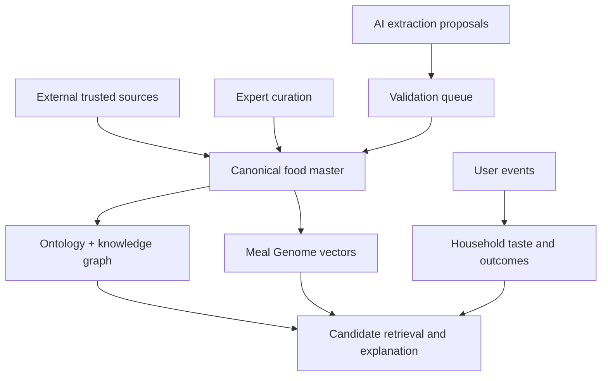

Canonical names and IDs are stable. Regional labels, recipes, nutrients, availability, and substitutions are versioned assertions with provenance and confidence. AI can propose; publishing high-impact facts requires deterministic validation and, for nutrition/safety, trusted source or qualified review.

<!-- PAGEBREAK -->

## 49. Ontology domains

| Domain | Key concepts |
|---|---|
| Dish identity | canonical dish, variant, alias, translation, parent |
| Ingredient | canonical ingredient, form, preparation, category, allergen |
| Meal role | breakfast, lunch, dinner, snack, tiffin, accompaniment, beverage |
| Composition | base, main, side, bread, rice, dal, salad, condiment, dessert |
| Cuisine/region | country, state, culinary region, community, migration affinity |
| Technique | boil, steam, sauté, fry, bake, ferment, pressure cook |
| Sensory | flavor, texture, richness, temperature, spice |
| Practical | time, skill, equipment, cost band, batchability, leftover quality |
| Nutrition | serving, macro/micro ranges, source and confidence |
| Suitability | diet, religious, age/texture, contextual—not diagnostic claims |
| Temporal | season, festival, fasting window, weekday/weekend |
| Relationship | pairs-with, substitutes, variant-of, contains, typical-in |

Ontology terms have canonical codes, display labels, synonyms, locale, hierarchy, definition, source, confidence, effective dates, and status. Labels may change; codes and meaning do not change silently.

<!-- PAGEBREAK -->

## 50. Meal Genome

The Meal Genome is a multi-family representation, not one opaque embedding.

### Proposed dimensions

1. Meal role and component role
2. Primary ingredient and protein family
3. Grain/starch family
4. Cooking method
5. Texture
6. Dominant flavor
7. Spice intensity
8. Richness/oiliness
9. Serving temperature
10. Cook time and active time
11. Skill and equipment
12. Cost band
13. Batchability and leftover stability
14. Regional/cuisine affinity
15. Familiarity/popularity
16. Season/weather affinity
17. Festival/occasion affinity
18. Nutrition bands
19. Kid/elder format suitability with evidence
20. Accompaniment and composition role

Each dimension stores value, confidence, provenance, derivation method, reviewer, and version. A dish vector is rebuilt on publish; user taste vectors are updated from interactions. Safety attributes stay outside the similarity vector so a close match can never override eligibility.

<!-- PAGEBREAK -->

## 50A. Indian plate grammar and meal-episode ontology

A culturally valid meal is a typed composition, not an unordered set. Define a grammar:

`Episode → SharedBase + RequiredComponents + OptionalComponents + MemberAdaptations`.

Examples of grammar families—not universal templates—include:

| Grammar | Typical structure | Practical cadence |
|---|---|---|
| North weekday roti meal | roti + dry/semi-dry sabzi; optional dal/curd/salad | ordinary, low–medium burden |
| North rice-pulse meal | rice + dal/rajma/chole + simple accompaniment | ordinary/comfort; pulse cooking considered |
| South tiffin | idli/dosa/upma/pongal + chutney/sambar as appropriate | breakfast/dinner; batter state matters |
| South rice meal | rice + sambar/rasam/kootu/poriyal/curd in locally plausible subsets | lunch; component count varies by day |
| West one-pot | khichdi/pulao/varan-rice styles + curd/pickle/papad | quick/comfort |
| East rice sequence | rice + vegetable/pulse/fish components in culturally plausible order | lunch/dinner; sequence/context matters |
| Millet/bread regional meal | local millet bread + vegetable/pulse accompaniment | seasonal/region-specific |
| Leftover transformation | prior component → paratha, fried rice, cutlet, wrap, or refreshed plate | waste reduction; safety window required |
| Split-base household | shared staple/veg + optional protein or member side | mixed diet/goal households |

Grammar rules have locale, household support, meal slot, component cardinality, required/optional roles, compatible classes, burden prior, source, confidence, and reviewer. The engine never generalizes one region’s “complete meal” to India.

### Episode Genome

In addition to dish genomes, an episode stores component synergy, number of active preparations, workload DAG, ingredient overlap, color/texture/flavor balance, serving sequence, leftover graph, shared-versus-member coverage, and observed household completion. Episode similarity is distinct from dish similarity.

<!-- PAGEBREAK -->

## 50B. Food-research and catalog program

The recommendation moat requires an evidence pipeline, not a large scraped recipe set.

### Corpus layers

1. **Canonical ingredients and composition:** ICMR-NIN Indian Food Composition Tables and other licensed/trusted sources.
2. **Regional meal diaries:** consented household panel with meal photos, components, portions, time, context, and outcome.
3. **Expert grammar elicitation:** regional home cooks, food historians, dietitians, and culinary researchers; multiple reviewers per region.
4. **Recipe execution studies:** observe active/passive time, equipment contention, substitutions, cleanup, and beginner failure.
5. **Behavioral logs:** actual exposures, plans, swaps, cooks, orders, repeats, member response.
6. **Availability layer:** seasonal/local market and retailer data where licensed.

### Sampling requirements

Stratify by state/culinary region, rural/urban and city tier, income proxy, religion/diet, household size, age composition, migrant status, primary cook arrangement, working schedule, and weekday/weekend/festival. Do not label a food “popular in region” from recipe-page frequency. Report coverage and confidence; preserve within-region heterogeneity.

### Annotation reliability

Each subjective field has a handbook and paired annotation. Use Cohen’s kappa or Krippendorff’s alpha for categorical labels and intraclass correlation for continuous ratings. Low agreement becomes a distribution or disputed assertion, not a forced truth. AI suggestions enter the same review queue and never count as independent evidence.

Reference sources: [ICMR-NIN Indian Food Composition Tables](https://www.nin.res.in/ebooks/IFCT2017_16122024.pdf), [NINA-DISH regional meal assessment](https://pmc.ncbi.nlm.nih.gov/articles/PMC5652307/), [Eastern India food-choice study](https://pmc.ncbi.nlm.nih.gov/articles/PMC7937786/), and [Indian regional food pairing analysis](https://arxiv.org/abs/1505.00890).

<!-- PAGEBREAK -->

## 51. Food knowledge graph

### Node types

`Dish`, `DishVariant`, `Ingredient`, `IngredientForm`, `MealClass`, `MealRole`, `Cuisine`, `Region`, `Technique`, `GenomeTag`, `Nutrient`, `Season`, `Festival`, `Equipment`, `Recipe`, `Source`.

### Edge types

`CONTAINS`, `MAIN_INGREDIENT`, `VARIANT_OF`, `ALIAS_OF`, `BELONGS_TO_CLASS`, `ORIGINATES_IN`, `POPULAR_IN`, `USES_TECHNIQUE`, `HAS_TAG`, `PAIRS_WITH`, `SUBSTITUTES_FOR`, `SUITABLE_IN`, `SEASONAL_IN`, `ASSOCIATED_WITH`, `SUPPORTED_BY_SOURCE`.

Every edge includes direction, scope/locale, confidence, provenance, effective dates, and review state.

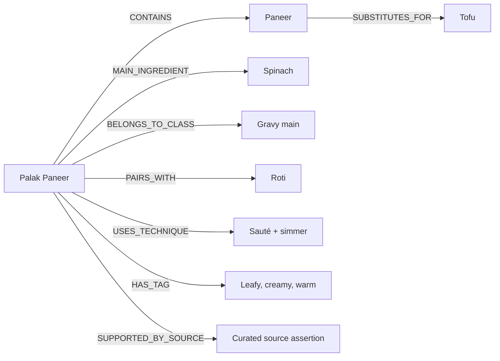

The initial PostgreSQL implementation can store relational edges and materialize bounded adjacency; a dedicated graph database is justified only when traversal workload and operations demonstrate need.

<!-- PAGEBREAK -->

## 52. Nutrition intelligence

Nutrition is represented as ranges per serving with source and uncertainty. Recipe variation makes false precision dangerous.

### Data model

`nutrient_assertion(dish_or_recipe, nutrient_code, min_value, expected_value, max_value, unit, serving_basis, source_id, method, confidence, version)`.

Ingredient-level composition can estimate a recipe; cooking-yield and retention factors adjust values where supported. User-visible values show a range or “estimated” label unless laboratory or trusted packaged-food data supports precision.

### Product use

- v1: broad balance labels and transparent data confidence.
- v2: configurable non-clinical goals such as protein-forward or lighter meals.
- v3: weekly nutrient range optimization with serving awareness.
- clinical conditions: only after qualified evidence review, clear scope, escalation rules, and legal/product approval.

WHO emphasizes diverse diets and notes that individual needs and local customs matter; Foofoo therefore avoids a single universal “health score.” Sources: [WHO healthy diet](https://www.who.int/news-room/fact-sheets/detail/healthy-diet), [WHO India nutrition](https://www.who.int/india/health-topics/nutrition).

<!-- PAGEBREAK -->

## 53. Regional intelligence

Regional preference is a blended, learnable signal:

`RegionAffinity = a·HomeIdentity + b·CurrentLocale + c·HouseholdHistory + d·SeasonalAvailability`, with `a+b+c+d=1`.

Home identity is not current GPS. A Bhopal-origin household in Pune may want MP comfort food, local Maharashtrian options, and global dishes at different rates. The blend begins from onboarding confidence and adapts from evidence.

### Regional data

- canonical regions and culinary zones;
- dish-region affinity with type (`origin`, `popular`, `available`, `festival`);
- language labels and aliases;
- region-specific serving roles and meal composition;
- ingredient availability and substitution;
- season/festival calendars with locale scope;
- confidence and source for every assertion.

Avoid stereotyping: region is a prior, never a restriction unless the user chooses one. Users can increase “food from home” or “local discovery.” Diaspora locale packs overlay ingredient availability without erasing identity.

<!-- PAGEBREAK -->

## 54. Household and life-stage intelligence

Household attributes are conditions and overlays, not fixed persona IDs. Relevant dimensions include age band, texture capability, meal role, cook assignment, schedule, diet, allergy, fasting, and temporary context.

### Base plus add-on pattern

| Household need | Base | Add-on/adaptation |
|---|---|---|
| Toddler | Mild shared khichdi | texture/portion adaptation |
| Diabetic elder | Shared veg main | portion/accompaniment alternative, only evidence-backed |
| Fitness member | Shared dal/veg | additional protein component |
| Fasting member | Normal household base | separate fasting-safe plate |
| Mixed veg/non-veg | Vegetarian shared base | optional meat/egg protein |

The system optimizes additional burden and ingredient overlap. Temporary overlays have effective dates; they expire unless renewed. Sensitive data access is minimized, and explanations reveal only what the viewer is permitted to know.

<!-- PAGEBREAK -->

## 55. Recipe, substitution, and main-ingredient intelligence

A dish is an identity; a recipe is an executable formulation. Multiple recipes may implement one dish with different region, time, equipment, serving, and nutrition.

### Main ingredient heuristic

Flag an ingredient as main when removing it would change the dish’s identity, it dominates recognized name/volume/protein role, or it defines the culinary structure. Multi-main dishes are allowed. Store confidence and evidence; do not force one main ingredient for convenience.

### Substitution edge

`A SUBSTITUTES_FOR B` includes function, recipe context, ratio, preparation adjustment, diet/allergen consequences, flavor/texture delta, locale availability, confidence, and source. A global “paneer ↔ tofu” assertion without context is too coarse.

### Recipe selection

Choose recipe variant after the dish using cook skill, time, equipment, serving count, availability, and locale. Re-run safety on exact ingredients and substitutions. Recipe generation by AI remains draft until ingredient identity, quantities, cooking safety, and constraint checks pass.

<!-- PAGEBREAK -->

## 56. Food data acquisition and AI seeding

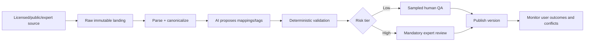

AI may create aliases, draft descriptions, candidate tags, image briefs, and low-risk relationship proposals. Production canonical-dish enrichment uses Groq `openai/gpt-oss-120b`. Candidates at confidence `>=0.65` are retained with provenance; only aliases, allowlisted contextual/taxonomy tags and regional affinities at `>=0.80` may publish automatically. A structured-output contract plus a database field allowlist makes ingredients, allergen status, religious suitability, clinical claims, nutrition, vegetarian status and alcohol claims unpublishable through this path. Deterministic gates reject canonical/component aliases and normalize governed region codes. Atomic UTC-day controls cap the worker at 800 requests and 160,000 tokens; deferred rows resume on the scheduled worker without human intervention. Each AI assertion records model, inputs, timestamp, confidence and validator state. `HF_TOKEN` is retained only as a future fallback; Hugging Face is not an active production provider.

Raw source data remains immutable and license-tagged. Canonicalization is reproducible. Conflicts create a review task rather than silent last-write-wins behavior.

<!-- PAGEBREAK -->

# Part IV — Engineering & Architecture Bible

## 57. Platform architecture

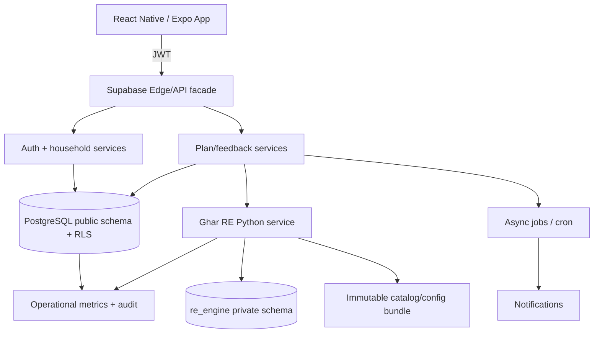

The mobile client is untrusted. It talks through Supabase authentication and narrow Edge Functions. Public user-owned tables use RLS. Private recommendation data is service-role-only. The RE service is stateless per request and loads immutable catalog/config versions at startup; this enables horizontal scale and deterministic traces.

Current repository stack: React Native/Expo, Supabase Auth/Postgres/Edge Functions, Python recommendation service intended for a container platform, OneSignal notifications, and scheduled jobs. The architecture keeps direct table access for simple user-owned reads and uses custom endpoints for cross-domain invariants.

<!-- PAGEBREAK -->

## 58. Service boundaries

| Service/domain | Owns | Does not own |
|---|---|---|
| Identity/Auth | session and auth user | meal preferences |
| Household | profile, members, roles, consent-linked facts | ranking weights |
| Catalog | dishes, ingredients, recipes, ontology publish | user outcomes |
| Planning | week plans, slots, locks, lifecycle | learned model training |
| Recommendation | candidate/scoring/ranking/trace | auth source of truth |
| Feedback | idempotent interaction ingest | synchronous model retrain |
| Context | weather, season, festival snapshot | permanent user taste |
| Notification | eligibility, scheduling, delivery logs | plan generation truth |
| Experiment | assignment and exposure | arbitrary UI analytics |
| Privacy | export/delete workflows | business analytics definitions |

Boundaries are transactional where invariants demand it. A lock and selected-slot update occur atomically. Interaction ingest is append-only and asynchronous feature updates are retryable. The recommendation response is persisted before exposure logging so the exact slate can be reconstructed.

<!-- PAGEBREAK -->

## 59. API surface overview

The deployed v1 API is a Supabase Edge surface. Planning operations intentionally share one
`plan` endpoint and are selected by the request body's `surface` field; the Edge layer then calls
the private, HMAC-authenticated RE routes. The table below records the deployed public contract,
not proposed REST aliases.

| Method | Endpoint | Purpose | Idempotency |
|---|---|---|---|
| POST | `/functions/v1/consent` | Append consent decision | required |
| POST | `/functions/v1/household` | Persist onboarding/household facts | required |
| POST | `/functions/v1/household-access` | List/select membership; invite, role, ownership and leave operations | operation-specific |
| POST | `/functions/v1/recommendations` | Generate and persist a recommendation slate | request ID |
| POST | `/functions/v1/plan` (`surface=saved_week/save_week/lock_slot/add_to_date`) | Read or mutate the persisted plan | mutation-specific |
| POST | `/functions/v1/plan` (`surface=cold_start/calibration/meal_plan/meal_episodes/weekly_plan/class_dishes/recipe/search`) | Invoke a safe planning surface | request ID |
| POST | `/functions/v1/feedback` | Append interaction/outcome | event key required |
| POST | `/functions/v1/user-export` | Request/read export | request ID |
| POST | `/functions/v1/user-delete` | Begin deletion | required |
| GET | RE `/healthz`, `/readyz` | Internal compute liveness/readiness | n/a |

All private endpoints validate JWT, household membership, role permission, JSON schema, size, and rate. Error bodies expose stable codes, correlation ID, retryability, and safe user copy—not stack traces.

<!-- PAGEBREAK -->

## 60. Target recommendation API specification

This is the episode-first target envelope. Deployed v1 keeps `/recommendations` plate-compatible
and exposes canonical complete episodes through `POST /functions/v1/plan` with
`surface=meal_episodes`. That response is schema-validated and includes `grammar_code`,
`grammar_version`, component grammar roles, practicality, intent posterior and transparent v1 rule
predictions. Clients must not fabricate calibrated probabilities when using the compatibility
plate response; unavailable predictions are represented as null/unscored.

### Request

```json
{
  "request_id": "uuid",
  "household_id": "uuid",
  "plan_date": "2026-08-05",
  "meal_slots": ["breakfast", "lunch", "dinner"],
  "refresh_scope": "unlocked_only",
  "client_context": {"timezone": "Asia/Kolkata", "locale": "en-IN"}
}
```

### Response

```json
{
  "request_id": "uuid",
  "plan_id": "uuid",
  "model_version": "re-v2.3.0",
  "catalog_version": "food-2026-08-05.1",
  "slots": [{
    "slot_id": "uuid", "meal_slot": "dinner",
    "selected_episode": {
      "episode_id": "uuid", "intent": "routine",
      "components": [{"dish_id": "uuid", "role": "shared_main"}],
      "member_adaptations": [],
      "practicality": {"active_minutes": 28, "critical_path_minutes": 34, "effort_band": "ordinary"},
      "success_probability": 0.74,
      "confidence_band": "strong_fit"
    },
    "alternatives": [{"episode_id": "uuid", "rank": 1, "reason_tags": ["quicker", "familiar", "lighter_than_yesterday"]}],
    "locked": false
  }],
  "degraded": false,
  "correlation_id": "uuid"
}
```

Responses never expose raw private features or member conditions. The server persists the full candidate/score trace but returns only calibrated consumer fields. `409` signals optimistic-lock conflict; `422` signals no safe coverage with an actionable code; `429` includes retry-after; `503` identifies cached-fallback eligibility.

<!-- PAGEBREAK -->

## 61. Event tracking specification

### Canonical envelope

`event_id`, `idempotency_key`, `event_name`, `occurred_at`, `received_at`, `user_id`, `household_id`, `session_id`, `request_id`, `slate_id`, `item_id`, `rank`, `surface`, `schema_version`, `model_version`, `experiment_assignments`, `properties`, `consent_basis`.

For recommendation intelligence, `item_id` is an `episode_id/episode_hash`; component actions also carry `dish_id`, `recipe_id`, and `component_role`. The immutable exposure record stores `eligible_set_hash`, full ordered slate, logging propensity, visibility duration, intent posterior, context hash, household snapshot hash, catalog/config/feature versions, selected cook, predicted work, and choose/execute/regret probabilities. Outcome events store actual components, substitutions, time, missing ingredients, cook identity, eater set, leftover result, member attribution confidence, and reason taxonomy where supplied.

### Attribution rule

The ingest service never converts raw events directly into a single score. It emits raw facts; versioned feature jobs interpret them. This allows the team to correct semantics later without corrupting history. For example, `dish_ordered` can mean the recommendation succeeded via commerce, the cooking plan failed, or the household chose unrelated food. The payload must preserve which occurred.

### Core event taxonomy

| Domain | Events |
|---|---|
| Lifecycle | `app_opened`, `onboarding_started/completed`, `plan_viewed` |
| Exposure | `slate_exposed`, `dish_impression`, `explanation_viewed` |
| Preference | `dish_accepted`, `dish_swiped_past`, `dish_not_today`, `dish_never`, `never_restored` |
| Planning | `slot_locked/unlocked`, `slot_refreshed`, `dish_added_to_date`, `plan_shared` |
| Outcome | `recipe_started/completed`, `dish_cooked`, `dish_ordered`, `dish_replaced`, `dish_rated` |
| Household | `member_added/updated/removed`, `invite_sent/accepted` |
| Reliability | `fallback_served`, `offline_queue_flushed`, `safety_gate_blocked` |
| Privacy | `consent_changed`, `export_requested/completed`, `deletion_requested/completed` |

Events are append-only. Server timestamps preserve receipt order; device timestamps preserve user order. Duplicate keys return success without double learning.

<!-- PAGEBREAK -->

## 62. Database design principles and provenance classes

Naming uses lowercase `snake_case`; plural table names; UUID primary keys; `*_id` foreign keys; UTC `timestamptz`; ISO/canonical codes; explicit status enums/checks; `created_at`, `updated_at`, optional `deleted_at`; JSONB only for truly variable payloads; normalized master data; append-only facts; RLS on personal tables; private schemas for engine internals.

### Required provenance classes

| Code | Requested category | Definition | Examples |
|---|---|---|---|
| APP | Strictly app-generated | Operational state created by product workflows | plans, slots, locks, consent records |
| EXT | Master strictly from external seeding | Canonical reference imported from licensed/trusted sources | regions, ingredients, nutrient masters |
| AI | AI-created and seeded | Proposed/enriched content with model lineage and review state | draft tags, descriptions, aliases |
| USE | User-usage generated | Behavioral facts emitted through use | impressions, swipes, cooks, taste vectors |
| MIX | App + AI + initial seed | Hybrid entity with seeded base, AI enrichment, app operations, and/or usage updates | dishes, recipes, popularity features |

Every mutable row carries `data_origin`, `source_id`, `source_version`, `confidence`, `review_status`, and `lineage_metadata` where applicable. Column-level provenance below overrides table-level default.

<!-- PAGEBREAK -->

## 63. Expected DB schema — identity, household, consent

| Table `[class]` | Expected columns |
|---|---|
| `public.profiles [APP]` | `id PK/FK auth.users`, `primary_cook_name`, `home_region_id FK`, `current_city_id FK`, `migration_duration_band`, `diet_type_code`, `religious_preference_code`, `cook_capability_code`, `onboarding_completed`, `notification_time`, `locale`, `timezone`, `created_at`, `updated_at`, `deleted_at` |
| `public.households [APP]` | `id PK`, `name`, `household_type_code`, `owner_user_id`, `default_locale`, `timezone`, `status`, timestamps |
| `public.household_members [APP]` | `id PK`, `household_id FK`, `user_id FK nullable`, `display_name`, `age_band_code`, `member_role_code`, `diet_type_code`, `religious_preference_code`, `allergen_mask`, `conditions[]`, `is_active`, `effective_from/to`, timestamps |
| `public.household_invites [APP]` | `id`, `household_id`, `token_hash`, `invited_role`, `expires_at`, `accepted_at`, `revoked_at`, timestamps |
| `public.onboarding_sessions [APP]` | `id`, `profile_id`, `household_id`, `screen_id`, `question_key`, `answer_value jsonb`, `skipped`, `answered_at`, `schema_version` |
| `public.household_answers [APP]` | `id`, `household_id`, `answer_key`, `answer_value`, `source`, `confidence`, `effective_from/to`, timestamps |
| `public.consent_records [APP]` | `id`, `profile_id`, `consent_type`, `granted`, `policy_version`, `ip_hash`, `granted_at` |
| `public.privacy_requests [APP]` | `id`, `profile_id`, `request_type`, `status`, `requested_at`, `completed_at`, `artifact_uri`, `error_code` |

Sensitive columns use restricted access; analytics receives pseudonymous IDs only.

<!-- PAGEBREAK -->

## 64. Expected DB schema — food master and ontology

| Table `[class]` | Expected columns |
|---|---|
| `public.dishes [MIX]` | `id`, `canonical_name`, `parent_dish_id`, `description`, `meal_occasions[]`, `cook_time_minutes`, `active_time_minutes`, `difficulty_code`, `diet_type_code*`, `is_jain*`, `allergen_mask*`, `genome_vector*`, `popularity_score*`, `photo_url`, `data_origin`, `source_id`, `confidence`, `review_status`, timestamps |
| `public.dish_names [MIX]` | `id`, `dish_id`, `locale`, `name`, `name_type`, `is_preferred`, `source_id`, `confidence`, `review_status` |
| `public.ingredients [EXT]` | `id`, `canonical_name`, `ingredient_category_code`, `is_veg`, `is_vegan`, `is_jain_excluded`, `allergen_mask`, `seasonal_peaks[]`, `source_id`, `source_version`, `review_status` |
| `public.ingredient_names [MIX]` | `id`, `ingredient_id`, `locale`, `name`, `name_type`, provenance columns |
| `public.dish_ingredients [MIX]` | `dish_id`, `ingredient_id`, `quantity`, `unit_code`, `preparation`, `is_optional`, `is_main`, `main_confidence`, provenance columns |
| `public.tags [EXT]` | `id`, `tag_code`, `tag_family`, `definition`, `vector_position`, `status`, provenance columns |
| `public.dish_tags [MIX]` | `dish_id`, `tag_id`, `weight`, `confidence`, `derivation_method`, `source_id`, `review_status`, timestamps |
| `public.cuisines [EXT]` | `id`, `cuisine_code`, `name`, `parent_id`, `region_id`, provenance columns |
| `public.regions [EXT]` | `id`, `region_code`, `name`, `region_type`, `parent_id`, `country_code`, provenance columns |
| `public.meal_classes [EXT]` | `id`, `class_code`, `name`, `meal_slots[]`, `planning_role`, `definition`, `status` |

`*` denotes derived-stored: written only by controlled jobs/triggers, never client input.

<!-- PAGEBREAK -->

## 65. Expected DB schema — recipes, nutrition, graph

| Table `[class]` | Expected columns |
|---|---|
| `public.recipes [MIX]` | `id`, `dish_id`, `locale`, `title`, `servings`, `total_time_minutes`, `active_time_minutes`, `difficulty_code`, `equipment_codes[]`, `instructions_status`, provenance/review/version columns |
| `public.recipe_steps [MIX]` | `id`, `recipe_id`, `step_number`, `instruction`, `duration_seconds`, `equipment_code`, `media_url`, provenance columns |
| `public.recipe_ingredients [MIX]` | `recipe_id`, `ingredient_id`, `quantity`, `unit_code`, `preparation`, `is_optional`, `substitution_group_id` |
| `food.nutrients [EXT]` | `id`, `nutrient_code`, `name`, `unit`, `upper_lower_semantics`, source/version |
| `food.nutrient_assertions [MIX]` | `id`, `subject_type`, `subject_id`, `nutrient_id`, `min_value`, `expected_value`, `max_value`, `serving_basis`, `method`, `confidence`, source/review/version |
| `food.ontology_nodes [MIX]` | `id`, `node_type`, `canonical_entity_id`, `label`, `locale`, `status`, provenance |
| `food.ontology_edges [MIX]` | `id`, `subject_node_id`, `predicate_code`, `object_node_id`, `scope_region_id`, `weight`, `confidence`, `effective_from/to`, provenance/review |
| `food.substitutions [MIX]` | `id`, `from_ingredient_id`, `to_ingredient_id`, `function_code`, `recipe_context`, `ratio`, `adjustment_text`, `constraint_delta`, confidence/provenance |
| `food.dish_combos [MIX]` | `id`, `name`, `meal_slot`, `region_id`, `status`, provenance |
| `food.dish_combo_items [MIX]` | `combo_id`, `dish_id`, `component_role`, `is_required`, `sequence`, `portion_ratio` |

The `food` schema is proposed for the richer v3 ontology; the current repository uses `public` plus private RE tables and a bounded relational graph.

<!-- PAGEBREAK -->

## 65A. Expected DB schema — meal episodes, grammar, and practicality

| Table `[class]` | Expected columns |
|---|---|
| `food.plate_grammars [MIX]` | `id`, `grammar_code`, `locale_scope`, `meal_slots[]`, `intent_codes[]`, `required_roles jsonb`, `optional_roles jsonb`, `burden_prior`, `source_id`, `confidence`, `review_status`, version/timestamps |
| `food.grammar_component_rules [MIX]` | `id`, `grammar_id`, `component_role`, `allowed_class_ids[]`, `min_count`, `max_count`, `compatibility_expression`, `sequence`, provenance |
| `food.meal_episodes [MIX]` | `id`, `episode_code`, `grammar_id`, `shared_base_dish_id`, `episode_genome_vector`, `richness_prior`, `effort_prior`, `catalog_status`, provenance/review/version |
| `food.meal_episode_components [MIX]` | `episode_id`, `dish_id`, `recipe_id`, `component_role`, `is_required`, `portion_relation`, `sequence`, `adaptation_scope`, provenance |
| `food.recipe_operations [MIX]` | `id`, `recipe_id`, `operation_code`, `duration_seconds`, `active_seconds`, `equipment_code`, `predecessor_ids[]`, `parallel_group`, `skill_level`, provenance |
| `food.episode_workload_features [MIX]` | `episode_id`, `recipe_variant_hash`, `active_minutes`, `critical_path_minutes`, `vessel_count`, `burner_peak`, `ingredient_count`, `rare_ingredient_count`, `cleanup_score`, `batchability`, `leftover_value`, `feature_version` |
| `food.episode_cadence [MIX]` | `episode_id`, `region_id`, `household_type`, `cadence_tier`, `frequency_prior`, `richness_dimensions jsonb`, `source_id`, `confidence` |
| `public.pantry_beliefs [USE]` | `household_id`, `ingredient_id`, `probability_present`, `quantity_range`, `last_evidence_at`, `evidence_type`, `expires_at`, `feature_version` |
| `public.leftover_lots [APP/USE]` | `id`, `household_id`, `source_plan_slot_id`, `dish_id`, `estimated_servings`, `created_at`, `safe_until`, `status`, `confidence` |
| `re_engine.household_cadence_state [USE]` | `household_id`, rolling-window counts/recencies, `richness_debt`, `effort_debt`, `novelty_budget`, `ordinary_meal_ratio`, `updated_at`, `feature_version` |
| `re_engine.member_fairness_state [USE]` | `household_id`, `member_id`, `satisfaction_debt`, `evidence_count`, `last_served_at`, `updated_at`, `policy_version` |
| `re_engine.intent_state [USE]` | `household_id`, `meal_slot`, `state_probabilities jsonb`, `inference_time`, `context_hash`, `model_version` |

Precomputed episode rows are curated high-quality bundles; the engine may also assemble ephemeral episodes. An ephemeral bundle receives a content-addressed `episode_hash`, exact component versions, and a stored snapshot so events remain replayable after catalog evolution.

<!-- PAGEBREAK -->

## 66. Expected DB schema — plans and interactions

| Table `[class]` | Expected columns |
|---|---|
| `public.week_plans [APP]` | `id`, `household_id`, `week_start_date`, `status`, `generation_request_id`, `model_version`, `catalog_version`, `experiment_snapshot`, timestamps, `version` |
| `public.plan_slots [APP]` | `id`, `week_plan_id`, `plan_date`, `meal_slot_code`, `selected_dish_id`, `selected_combo_id`, `slate_id`, `status`, `is_locked`, `locked_by`, `locked_at`, `context_snapshot_id`, `version`, timestamps |
| `public.addon_slots [APP]` | `id`, `plan_slot_id`, `household_member_id`, `addon_class_id`, `selected_dish_id`, `reason_code`, `status`, timestamps |
| `public.slates [APP]` | `id`, `request_id`, `plan_slot_id`, `surface`, `model_version`, `config_version`, `created_at`, `expires_at` |
| `public.slate_items [APP]` | `slate_id`, `dish_id`, `rank`, `point_score`, `rerank_score`, `generator_codes[]`, `reason_tags[]`, `selection_propensity` |
| `public.interaction_events [USE]` | `id`, `idempotency_key`, `event_name`, `user_id`, `household_id`, `slate_id`, `dish_id`, `rank`, `surface`, `occurred_at`, `received_at`, `schema_version`, `properties`, `consent_basis` |
| `public.outcome_events [USE]` | `id`, `plan_slot_id`, `dish_id`, `outcome_type`, `value`, `occurred_at`, `source`, `confidence` |
| `public.suggestion_logs [USE]` | `id`, `request_id`, `household_id`, `slot`, `candidate_counts`, `selected_ids`, `model/config/catalog versions`, `latency_ms`, `degraded`, `created_at` |
| `public.context_log [APP]` | `id`, `request_id`, `household_id`, `weather_code`, `season_code`, `festival_ids[]`, `day_type`, `time_budget`, `snapshot_hash`, `created_at` |

Events and logs are time-partitioned and append-only, with privacy retention policies.

<!-- PAGEBREAK -->

## 67. Expected DB schema — RE state and configuration

| Table `[class]` | Expected columns |
|---|---|
| `re_engine.re_cohorts [EXT]` | `id`, `cohort_code`, dimension codes, region/city tiers, status, seed version |
| `re_engine.re_personas [EXT]` | `id`, `persona_code`, `name`, `main_cohort_id`, `subcohort_id`, description, seed version |
| `re_engine.re_routing_rules [EXT]` | `id`, `rule_code`, conditions jsonb, target code, priority, effective dates, seed version |
| `re_engine.re_class_dish_options [MIX]` | `meal_class_id`, `dish_id`, `base_weight`, `region_id`, `eligibility_status`, provenance/review |
| `re_engine.re_weekly_class_plans [EXT]` | `id`, `cohort_id`, `day_index`, `meal_slot`, `class_id`, `weight`, seed version |
| `re_engine.re_cohort_class_priors [MIX]` | `cohort_id`, `class_id`, `meal_slot`, `prior_score`, `sample_size`, `calibrated_at`, source |
| `re_engine.user_re_state [USE]` | `household_id`, `confidence`, `interaction_count`, `cold_start_state`, `model_version`, `last_updated_at` |
| `re_engine.user_taste_vectors [USE]` | `household_id`, `vector_type`, `vector real[]`, `evidence_count`, `updated_at`, `feature_version` |
| `re_engine.member_taste_vectors [USE]` | `member_id`, vector/evidence/version columns |
| `re_engine.never_list [USE]` | `household_id`, `member_id nullable`, `entity_type`, `entity_id`, `source_event_id`, `created_at`, `restored_at` |
| `re_engine.not_today_suppression [USE]` | `household_id`, `dish_id`, `penalty`, `starts_at`, `expires_at`, `source_event_id` |
| `re_engine.variety_window_state [USE]` | `household_id`, `dimension_code`, `entity_id`, `last_seen_at`, `count_in_window`, `updated_at` |
| `re_engine.bandit_state [USE]` | `policy_id`, `subject_type/id`, `context_bucket`, posterior parameters, impressions, rewards, updated_at |

Private RE tables are reachable only through service roles and audited interfaces.

<!-- PAGEBREAK -->

## 68. Expected DB schema — config, operations, lineage

| Table `[class]` | Expected columns |
|---|---|
| `re_engine.scoring_config [EXT]` | `config_version`, named parameters, `effective_from`, `status`, checksum |
| `re_engine.weight_ladder_config [EXT]` | `config_version`, `confidence_tier`, signal weights, bounds |
| `re_engine.event_weights [EXT]` | `config_version`, `event_name`, weight, half_life_days, context rules |
| `re_engine.variety_rules [EXT]` | `rule_code`, dimension, window, cap, override conditions, version |
| `re_engine.context_multipliers [EXT]` | context code, genome tag, multiplier, confidence, version |
| `re_engine.engine_versions [APP]` | `version`, artifact_uri`, checksum, status, activated_at`, `rollback_of` |
| `ml.feature_definitions [APP]` | `feature_name`, type, owner, expression/version, null policy, online/offline source, status |
| `ml.feature_values [USE]` | `entity_type/id`, `feature_name`, value, as_of, feature_version |
| `ml.model_registry [APP]` | model/version, training dataset, metrics, artifact/checksum, stage, approver, timestamps |
| `ml.experiment_assignments [APP]` | experiment_id, household_id, variant, assigned_at, assignment_version |
| `ops.safety_gate_log [APP]` | request/slate/dish, gate, code, evidence, model/catalog version, created_at |
| `ops.coverage_gap_log [APP]` | request, region/class/constraints hash, counts, fallback, created_at |
| `ops.etl_job_runs [APP]` | job, run, input/output versions, counts, status, error, timestamps |
| `ops.data_sources [EXT]` | source_id, owner, license, URI, retrieval date, checksum, permitted uses |
| `ops.ai_generation_runs [AI]` | run_id, model, prompt version, input source IDs, parameters, output artifact, validator result, reviewer, timestamps |
| `ops.audit_log [APP]` | actor, action, resource, before/after hash, correlation, occurred_at |

<!-- PAGEBREAK -->

## 69. Column-level provenance rules

Hybrid tables need explicit ownership:

| Field family | Permitted origin | Write authority |
|---|---|---|
| Canonical external identity/name | EXT | ingestion publisher only |
| AI description/alias/tag proposal | AI | generation pipeline into draft |
| Reviewed description/tag | MIX | content publisher after validation |
| `diet_type`, `is_jain`, `allergen_mask` | MIX-derived from EXT/MIX ingredients | trigger/derivation job only |
| `genome_vector` | MIX-derived | versioned feature build only |
| `popularity_score`, acceptance rates | USE-derived | scheduled feature job only |
| Plan/slot/lock status | APP | planning service transaction |
| Swipes/cooks/orders | USE | event ingest append only |
| Taste vectors/bandit posterior | USE-derived | learning workers only |
| Model/config active status | APP | deployment control plane |

Database roles reflect these boundaries: `client_authenticated`, `edge_app`, `catalog_ingest`, `catalog_publisher`, `re_runtime`, `feature_writer`, `privacy_worker`, and `read_analytics`. Supabase platform roles map to these logical authorities through functions and grants. No general application role may manually update derived safety columns.

<!-- PAGEBREAK -->

## 70. Entity relationships

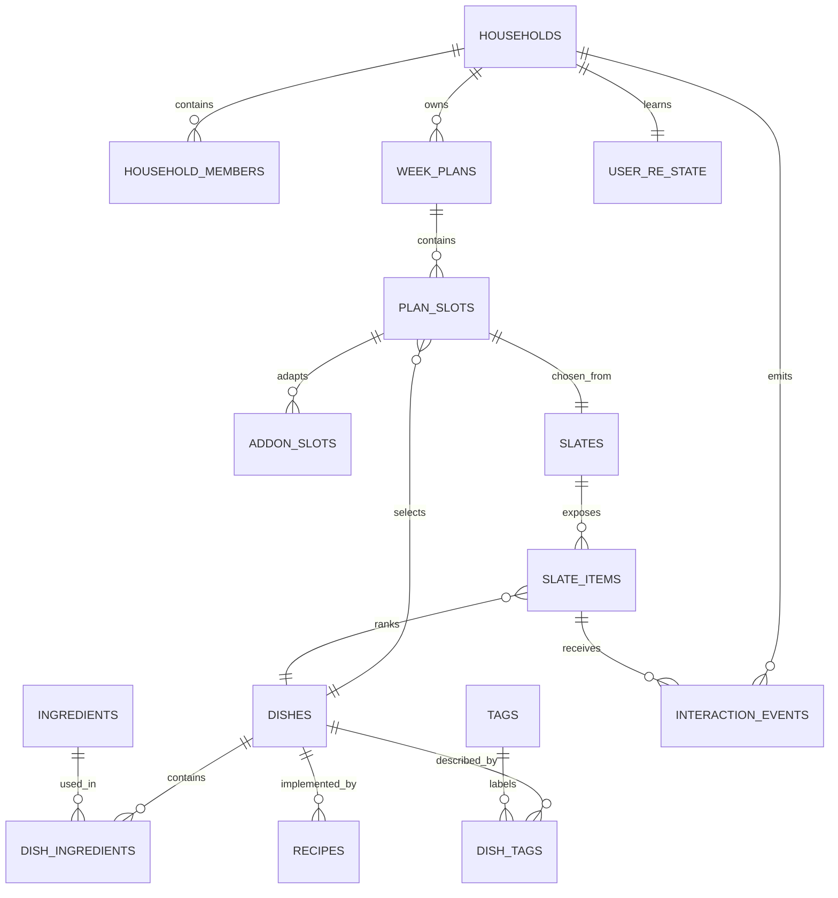

Cardinality and cascade policy: user-owned plans and events delete through the privacy workflow; master dishes never cascade-delete into historical events—instead IDs remain and content is deactivated. Junction rows cascade with their master. Append-only trace tables retain referenced identifiers or immutable snapshots to preserve replay until retention expiry.

<!-- PAGEBREAK -->

## 71. How data is pulled for one recommendation

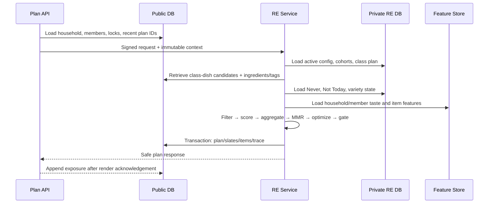

### Query plan

1. Authorize `auth.uid()` against household membership.
2. Read one household snapshot with members and constraints.
3. Read locked slots and recent-window features by indexed household/date keys.
4. Fetch class IDs for requested slots and cohort.
5. Batch fetch class candidates; join canonical dish, ingredient safety, tags, regional affinity.
6. Anti-join Never; apply temporary suppression as a feature/penalty.
7. Batch feature lookup; never issue one query per candidate.
8. Persist decision artifacts atomically, then return.

<!-- PAGEBREAK -->

## 72. Indexing, partitioning, consistency

### Required indexes

- household ownership: `(household_id, user_id)` and active partial indexes;
- plan read: `(household_id, week_start_date)` unique, slots `(week_plan_id, plan_date, meal_slot)`;
- events: `(household_id, occurred_at desc)`, `(slate_id, dish_id)`, unique idempotency key;
- content joins: `(meal_class_id, dish_id)`, `(dish_id, ingredient_id)`, `(dish_id, tag_id)`;
- suppressions: active partial `(household_id, dish_id) where restored_at is null`;
- search: GIN `tsvector` on names/aliases; vector index only after measured need;
- trace: `(request_id)`, `(household_id, created_at desc)`.

Interactions, suggestion logs, traces, and feature history partition monthly by `occurred_at/created_at`. Partition creation is automated and monitored. Personal rows use soft deletion only during the bounded erasure workflow; purge removes partitions’ matching records using controlled jobs.

Optimistic concurrency uses a `version` integer or updated timestamp. Plan locks use row-level transactions. Catalog publishes are immutable snapshots selected by version; an in-flight request never mixes catalog versions.

<!-- PAGEBREAK -->

## 73. Data quality and master-data operations

### Publish gates

| Entity | Minimum gate |
|---|---|
| Dish | canonical name, class, occasion, active recipe or display disclaimer, source |
| Ingredient | canonical identity, diet/allergen/Jain fields, source |
| Dish-ingredient | complete safety-relevant ingredient set |
| Tag | valid vocabulary and vector position |
| Class mapping | safe candidate count by priority cohort |
| Recipe | ordered steps, quantities, servings, exact safety pass |
| Nutrition | source, serving basis, unit, range/confidence |
| Graph edge | valid nodes, predicate schema, provenance, review state |

Quality dashboards show completeness, conflicts, orphan relations, duplicate aliases, unsafe derivation differences, class coverage, region coverage, stale assertions, and AI proposal acceptance rates. The content operations queue is prioritized by real coverage gaps and high-impression uncertainty, not by arbitrary catalog size.

<!-- PAGEBREAK -->

## 74. Security and privacy architecture

Trust boundaries are mobile, public API, private services, databases, external providers, and analytics. Controls include JWT validation, row-level security, least-privilege service roles, schema isolation, encrypted transport/storage, secret management, rate limiting, validation, dependency scanning, and auditable admin actions.

### Threat examples

| Threat | Control |
|---|---|
| Read another household plan | RLS + explicit ownership check |
| Forge feedback for another user | server derives user from JWT; idempotent event validation |
| Prompt injection through AI food content | AI output treated as untrusted data; schema validation and review |
| Infer a member’s health condition | privacy-preserving constraint flags; explanation redaction |
| Leak service key in mobile | service keys only in server secret store; CI scanning |
| Poison ranking via bots | behavioral rate/abuse detection, robust aggregation, quarantine |
| Unsafe catalog edit | restricted publisher role, derivation triggers, safety regression |

Data minimization maps every collected field to a product purpose. Export and deletion span public data, private RE state, events, derived features, notification identity, and cached artifacts.

<!-- PAGEBREAK -->

## 75. Reliability, failure modes, and fallback

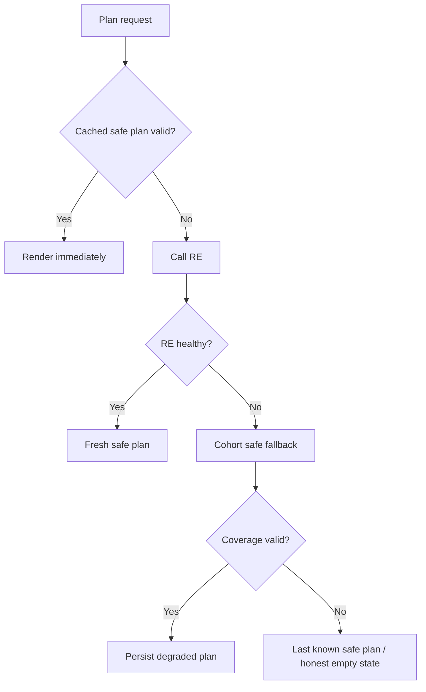

Failure policy prefers a transparent limited experience over a fabricated plan. Timeouts are bounded. Retries use exponential backoff with jitter only for idempotent operations. Circuit breakers stop cascade failure. Dead letters contain identifiers and error codes, not unnecessary PII.

Backups have tested restore procedures and explicit RPO/RTO. Schema migrations are forward-compatible, transactional where possible, and use expand/migrate/contract. The mobile app tolerates at least one prior API version during rollout.

<!-- PAGEBREAK -->

## 76. Observability and SLOs

### Golden signals

- latency by endpoint/stage/model/cohort;
- traffic and active households;
- errors, fallbacks, safety gates, empty candidate pools;
- saturation of DB connections, CPU, memory, queue age;
- product outcomes: WSMD, acceptance, completion;
- data health: feature/catalog freshness and event lag.

### SLO examples

| SLI | Objective |
|---|---|
| Plan-read availability | 99.9% monthly |
| Fresh recommendation success | 99.5% excluding invalid requests |
| Cached plan p95 | <1 second end-to-end |
| Fresh plan p95 | <3 seconds end-to-end |
| Feedback ingest | 99.9% accepted or deduplicated |
| Safety gate false-negative | 0 known |
| Event-to-feature lag | p95 <5 minutes for near-real-time features |

Logs use correlation/request/slate IDs; traces span edge, RE, DB, and external context; metrics avoid high-cardinality raw user IDs. Alerts are actionable and point to runbooks, recent deploys, and rollback controls.

<!-- PAGEBREAK -->

## 77. MLOps lifecycle


Training snapshots are immutable and consent-filtered. Model artifacts include code commit, environment lock, feature definitions, dataset range, metrics by slice, calibration, safety tests, owner, and checksum. Online and offline transformations share code or are parity-tested.

Shadow models receive production feature snapshots without affecting users. Canary ramp follows 1% → 5% → 25% → 50% → 100%, conditioned on SLO and product guardrails. Rollback is a pointer change. A model cannot become champion if its food catalog version is unavailable.

<!-- PAGEBREAK -->

## 78. Infrastructure and deployment

### Environments

Local, test, staging, and production use separate projects/secrets, equivalent schema, and sanitized test data. Production deployment is explicit and auditable. Infrastructure and DB migrations precede compatible service rollout; mobile rollout tolerates lagging clients.

### Runtime scaling

- Edge/API functions scale stateless request validation and orchestration.
- RE containers scale horizontally behind health checks.
- PostgreSQL uses connection pooling, indexed hot paths, read replicas only when measurements justify.
- Immutable catalog/config bundles reduce hot-path joins and support rollback.
- Jobs handle plan pre-generation, notifications, aggregation, retention, and partition care.
- CDN serves optimized food images.

### Cost controls

Track cost per recommendation and WSMD; pre-generate for likely active households; cache context; batch feature reads; keep LLM generation offline; cap abusive refresh; right-size images and logs; archive trace detail per retention policy while retaining aggregate metrics.

<!-- PAGEBREAK -->

## 79. Testing strategy

| Layer | Required tests |
|---|---|
| Catalog | schema, uniqueness, provenance, safety derivation, coverage |
| Algorithm | unit tests for every filter/score/penalty, property-based safety |
| Golden personas | 25 persona journeys across seasons and contexts |
| API | contract, auth, idempotency, errors, version compatibility |
| Database | migrations, constraints, triggers, RLS, query plans, rollback |
| Mobile | component, navigation, accessibility, offline, gesture equivalence |
| Load | cold/warm plans, event bursts, cron overlap, connection saturation |
| Chaos | RE down, context provider down, stale features, partition/job failure |
| ML | leakage, reproducibility, calibration, slice regression, drift |
| Security | abuse, injection, secret scanning, dependency and access tests |

Release certification includes a safety query returning zero violations, first-plan completion on a reference budget Android device, exact trace replay, and physical-device notification validation where notifications ship.

<!-- PAGEBREAK -->

## 80. Delivery plan, ownership, and release gates

### Workstreams

1. Product/UX: flows, screens, content, usability.
2. Food data: catalog, ontology, recipes, regional coverage.
3. RE/ML: ranking, evaluation, traces, experimentation.
4. Platform: APIs, DB, infra, security, observability.
5. Growth/GTM: design partners, referral, lifecycle, pricing.

### Gates

| Gate | Exit condition |
|---|---|
| G0 Foundation | canonical IDs, provenance, event contracts, safety invariants approved |
| G1 Internal alpha | 25 golden personas pass; safe fallback and trace replay work |
| G2 Design partner | activation/WSMD signal; critical UX issues resolved |
| G3 City beta | catalog coverage, latency, support load, W4 retention thresholds met |
| G4 Public launch | physical-device, privacy, reliability, incident, store readiness complete |
| G5 Monetization | demonstrated habit and value; billing/cancel/support ready |

Each gate has one accountable owner per workstream and a signed evidence bundle. Dates follow evidence; release scope may shrink, but safety and traceability do not.

<!-- PAGEBREAK -->

## 81. Risks and mitigations

| Risk | Early indicator | Mitigation |
|---|---|---|
| Bad first-week relevance | high swap/Never, low top-3 success | strengthen class priors and catalog coverage |
| Safety/content error | gate conflicts, complaints | ingredient-ground-truth filters, quarantine, incident path |
| Sparse event data | low exposure/outcome linkage | simplify outcome capture, preserve full slate logs |
| Household minority ignored | fairness-floor decline | role-aware welfare objective and weekly audit |
| Over-complex onboarding | completion drop by screen | progressive disclosure, skip soft questions |
| Notification fatigue | opt-outs, uninstall after push | value eligibility and hard frequency caps |
| AI hallucinated facts | validation conflicts | draft-only AI pipeline with provenance/review |
| Partner pressure distorts rank | organic acceptance declines | separate sponsored surface and policy |
| Infrastructure cost | cost/WSMD rises | caching, batching, offline LLM, pre-generation controls |
| Premature ML | offline lift not reproducible | class-first baseline and promotion gates |
| Regional stereotyping | “not for me” feedback | region as prior; adaptive blend and controls |
| Medical overreach | support/legal incidents | non-clinical scope, evidence tiers, qualified review |

<!-- PAGEBREAK -->

## 82. Open product decisions

1. Is household voting in public v1, or tested as a lightweight link after the planner loop works?
2. Which meal slots launch by city and catalog coverage?
3. Are groceries part of free habit formation or a paid conversion feature?
4. What minimum evidence tier allows condition-aware suitability labels?
5. What threshold and definition constitute “cold-start exit”?
6. Should cook assignment be per household, day, or slot?
7. How much regional exploration can occur by default?
8. What outcome counts as success when the user neither confirms nor replaces a plan?
9. Which partner actions may appear in organic cards, if any?
10. Which locale/language follows Hindi and English?

Decisions must update requirements, event schemas, golden tests, and data definitions together. An unresolved question may use a reversible experiment; it may not create ambiguous safety behavior.

<!-- PAGEBREAK -->

## 82A. Implementation traceability baseline — 5 August 2026

This table distinguishes implemented product infrastructure from remaining external or evidence gates. It overrides earlier current-state language in this document; target requirements remain unchanged.

| PRD capability | Production implementation | State / release meaning |
|---|---|---|
| Household permissions | Migrations 073–074 membership history, exactly-one-owner constraint, hashed invites, atomic owner/role/revoke/leave/accept RPCs, JWT-safe role lookup and membership-aware recommendation/plan/feedback authorization; mobile membership discovery/selection, invite acceptance, owner administration and member leave | Active end to end; owner/planner control plans, cook records execution/pantry evidence, member records attributable feedback, and viewer is read-only |
| Tenant-safe mobile state | Selected household is stored per authenticated user; plan calls and feedback carry it explicitly; feedback queues and persisted plan caches are user-scoped and cleared on sign-out | Active; physical-device reconnect testing remains a launch-readiness gate |
| Complete meal episode | `food.plate_grammars`, recipes, episodes/components, workload/cadence; `/plan` episode surface is mobile-default | Active with dish/class compatibility fallback |
| Ontology graph | Generic typed nodes/edges populated for dishes, aliases, ingredients, classes and catalogue features | Active; human review depth remains ongoing |
| Nutrition assertions | Source-linked `food.nutrient_assertions`; internal estimates cover every dish; USDA demo-key evidence requires exact normalized names | Active/provisional; controlled sample was 4 exact / 5 wrong / 3 absent, so non-exact assertions are rejected |
| Constraints and region | Three constraint assertions per production dish and state/cuisine affinities | Active/provisional; clinical claims remain excluded |
| Dish aliases/ingredients/recipes/classes | Normalized aliases, ingredient links, class mappings and one draft recipe per production dish | Active; AI-draft recipes are not certified recipes |
| Governed ontology read | Authenticated `ontology_record` resolves a canonical ID/name and returns aliases, ingredients, classes, field assertions, constraints, regions, nutrition, recipes, episodes, graph relations and evidence metadata | Active; raw external payloads remain private staging evidence |
| Background enrichment | Durable leased queue, ten-minute worker, daily reconciliation and 90-day refresh | Active; all 802 canonical dishes completed their first external pass with zero failed/pending jobs |
| Unknown-dish mobile intake | Authenticated staging API and mobile form | Active |
| Unknown-dish auto-promotion | Exact external name + entirely known safety ingredients | Active conservative rule; generative AI currently enriches canonical catalogue dishes only, not user text |
| Budgeted AI ontology enrichment | Groq candidates >=0.65; allowlisted low-risk facts publish >=0.80; 800 requests/160k tokens daily | Active scheduled backfill with retries, provenance and deterministic guards; safety fields excluded |
| Slates/propensity/replay/outcomes | Ordered slate/item persistence, exact deterministic propensity, typed outcomes and replay RPC; normalized request/context/feature/run/candidate/stage lineage | Active; 53 historical slates backfilled without inventing unavailable scores |
| ML/control plane | Versioned features, rule-baseline registry, experiments, source/catalog/publish/review tables | Active baseline; no trained production model claimed |
| Research panel | Private studies/participants/diaries plus authenticated enrolled-participant API | Operational infrastructure; recruitment not claimed |
| Annotation system | Versioned batches/items, leased claims, multi-review labels and service-only API | Active infrastructure |
| Legacy contraction | Canonical episode facts dual-written; live snapshot v2 preserves all 1,599 class lookups without runtime mapping CSVs | Class CSV runtime dependency retired in production; event-table contraction still waits for observed parity |

### Decisions required from the Founder

1. Decide whether user-submitted or corrected food text may later be sent to a generative provider or retained for training under explicit consent. Current generative processing is catalogue-name-only and does not train on submissions.
2. Obtain a personal free USDA key only if the demo key's throughput is insufficient for further controlled evaluations; exact-name gating remains mandatory.

<!-- PAGEBREAK -->

## 83. Definition of done

This PRD is implemented when:

- the complete core lifecycle works online and in degraded mode;
- all P0 functional and non-functional requirements have automated evidence;
- all 25 persona fixtures receive culturally plausible, feasible, safe plans;
- every displayed item has a canonical identity, ingredients, class, provenance, and review status;
- every recommendation is replayable from a stored decision trace;
- event exposure and outcome linkage are complete enough for unbiased learning;
- household safety and permissions are enforced at API and database layers;
- accessibility, budget-device performance, export, deletion, and physical notification tests pass;
- operating dashboards and incident/rollback paths exist;
- product, food data, engineering, privacy, and support owners accept their runbooks;
- public claims use validated current sources and do not imply medical authority.

Done means a household can trust Foofoo with tomorrow’s decision, and the team can explain, operate, improve, and—when necessary—reverse every part of that decision.

<!-- PAGEBREAK -->

# Appendix A — Source register

Primary repository inputs (all outside excluded Archive/Governance scope):

- Product: active Product Brief, Market Research, User Personas, GTM, Revenue, Product Bible.
- UX: active PRD, Information Architecture, UX Design System, Visual Design System Explorer.
- Recommendation: canonical planning model/semantics, final RE architecture review, business logic, cold-start design, Ghar RE core spine/derivation/knowledge base, RE visuals.
- Data/API: Conceptual Domain Model, Data Architecture ERD, Migration Strategy, API Contract.
- Engineering: Technical Architecture, Backend Foundation, Service/Edge Function spec, Integration/Infrastructure, Deployment Topology, Extensibility Review.
- Research: active canonicalization, mapping, gap-analysis, discovery, and pipeline packages excluding the governance evaluation package.
- Roadmap/current state: active product roadmap, RE intelligence roadmap draft, current status, open items, and launch blockers.
- User attachments: “Detailed Plan for an AI-Powered Meal Planning App” and “Ghar RE / Foofoo Meal Planning Product Bible.”

External Indian food/household evidence: [India Time Use Survey 2024](https://www.mospi.gov.in/sites/default/files/publication_reports/TUS_Report_2024_28.03.2025F.pdf), [HCES 2023–24](https://microdata.gov.in/NADA/index.php/catalog/237), [ICMR-NIN Dietary Guidelines 2024](https://nin.res.in/dietaryguidelines/pdfjs/locale/DGI_2024.pdf), [Indian Food Composition Tables](https://www.nin.res.in/ebooks/IFCT2017_16122024.pdf), [NINA-DISH](https://pmc.ncbi.nlm.nih.gov/articles/PMC5652307/), [WFP intra-household consumption](https://www.wfp.org/publications/wfp-india-who-eats-when-what-and-how-much), [TRAI](https://www.trai.gov.in/), [NPCI UPI statistics](https://www.npci.org.in/product/upi/product-statistics), and [WHO India healthy diet](https://www.who.int/india/health-topics/healthy-diet).

Recommendation-system research: [Netflix recommender system](https://doi.org/10.1145/2843948), [Netflix foundation model for personalization](https://netflixtechblog.com/foundation-model-for-personalized-recommendation-1a0bd8e02d39), [Spotify two-stage Home personalization](https://engineering.atspotify.com/2021/11/the-rise-and-lessons-learned-of-ml-models-to-personalize-content-on-home-part-i), [Spotify recommendation controls](https://www.spotify.com/uk/safetyandprivacy/understanding-recommendations), [YouTube candidate generation and ranking](https://research.google/pubs/deep-neural-networks-for-youtube-recommendations/), [SlateQ](https://research.google/pubs/slateq-a-tractable-decomposition-for-reinforcement-learning-with-recommendation-sets/), [off-policy slate evaluation](https://proceedings.neurips.cc/paper/2017/hash/5352696a9ca3397beb79f116f3a33991-Abstract.html), [sequential counterfactual slate evaluation](https://arxiv.org/abs/2007.12986), [calibrated recommendations](https://doi.org/10.1145/3240323.3240372), and [fair package recommendation](https://arxiv.org/abs/2105.14423).

<!-- PAGEBREAK -->

# Appendix B — Requirement-to-system traceability

| Product need | UX | Service | Data | Model/evidence |
|---|---|---|---|---|
| Ready plan | Today/Week | Planning + RE | plans, slots, slates | class plan + ranker |
| Safe household meal | Onboarding/Profile | Household + Catalog + RE | members, ingredients, constraints | filters + post-gate |
| Alternatives | Carousel | Recommendation | slate items/events | MMR and exposure policy |
| Temporary rejection | Not Today action | Feedback | suppression | decay penalty |
| Permanent exclusion | Never confirm/list | Feedback/Profile | never list | hard anti-join |
| Member adaptation | Household/add-on card | Planning | add-on slots | bundle optimizer |
| Useful why | Explanation sheet | Trace/Explanation | decision trace | contribution selection |
| Learn outcomes | Cook/order/rating | Event ingest | outcome events/features | decay, rank training |
| Groceries | Grocery tab | Plan-to-basket | recipes/ingredients | consolidation/substitution |
| Privacy control | Privacy screen | Privacy worker | consent/requests/audit | consent-filtered learning |

<!-- PAGEBREAK -->

# Appendix C — Glossary

**Candidate:** eligible item before final rank.  
**Class-first planning:** selecting the kind/role of meal before selecting a dish.  
**Cold start:** insufficient behavioral evidence for a household, member, dish, or region.  
**Decision trace:** immutable evidence of inputs, filters, features, scores, versions, and result.  
**Hard constraint:** rule that removes a candidate and cannot be traded for relevance.  
**Household intelligence:** representation and aggregation of member roles, constraints, and preferences.  
**Meal Genome:** structured, versioned representation of sensory, culinary, practical, cultural, and nutrition properties.  
**MMR:** diversity re-ranking that balances relevance and similarity to already selected items.  
**Not Today:** strong, time-decaying rejection.  
**Never:** explicit persistent exclusion until restored.  
**Slate:** stable ordered alternatives shown for a decision.  
**WSMD:** Weekly Successful Meal Decisions, Foofoo’s north-star outcome.

---

**End of FooFoo Comprehensive PRD and Intelligence Bibles v1.1**
