# Foofoo Database Architecture Review and Target Schema

**Document type:** As-is assessment, target logical model, and migration blueprint
**Audience:** Engineering, data, recommendation/ML, product, privacy, and operations leadership
**Version:** 1.1

**Repository baseline:** migrations 001–072, seed 147, and deployed Edge functions on 5 August 2026

**Status:** Canonical current/target database architecture

**Status vocabulary:** `CURRENT` means evidenced in deployed migrations/runtime code; `PARTIAL` means a usable but insufficient implementation; `PROPOSED` means required by the final product definition but not currently implemented. Section 2A is the authoritative implementation delta when older inventory prose refers to the pre-060 baseline.

## 1. Assumptions and scope

### 1.1 Sources of truth

This review uses the following precedence:

1. `deliverables/FooFoo_Comprehensive_PRD_and_Bibles.md` is the target product, recommendation, food-intelligence, and database specification.
2. `database/migrations/001...072`, seeds `146...147`, current Edge Functions, recommendation-service code, mobile API contracts, and Food Intelligence and Meal Episode Architecture v2.0 define the as-is implementation.
3. `docs/active/CURRENT_STATUS.md`, `OPEN_ITEMS.md`, and `LAUNCH_BLOCKERS.md` distinguish deployed behavior from local release-candidate behavior.
4. `docs/architecture/[ACTIVE]_DOC-P3-04_Data_Architecture_ERD_v1.3.md` supplies historical rationale, but migrations 046–056 supersede important parts. The broad legacy `re_engine` was dropped and a smaller target-aligned `re_engine` was recreated by 055; `ghar_re` remains absent.

No production row counts, runtime consumers, or product behaviors are asserted unless evidenced by those sources. Target-state additions not present today are marked `PROPOSED`.

### 1.2 Product boundary

The final recommendation object is a **meal episode**, not a dish. A meal episode comprises a plate grammar, one or more dish/recipe components, member adaptations, a predicted work plan, pantry requirements, cadence attributes, and outcome probabilities. The database must support the full decision chain:

`household + members + context -> intent -> episode candidates -> safety -> practicality -> member utility -> household utility -> slate -> plan -> exposure -> interaction -> outcome -> learning`.

The database is not expected to run model inference inside PostgreSQL. PostgreSQL owns canonical transactional state, immutable decision evidence, version pointers, and compact online features. Large-scale offline training and analytical transformations should consume CDC/exported facts in a warehouse/object store.

### 1.3 Classification codes

Every target table and important field is assigned one or more source-of-truth classes:

| Code | Required category | Meaning |
|---|---|---|
| `APP` | Strictly app-generated | Created by authenticated product or operational workflows; not seeded or invented by AI |
| `EXT` | External seeded master data | Imported from licensed, authoritative, or explicitly curated external sources |
| `AI` | AI-generated and AI-seeded | Machine-proposed content retained with model/prompt lineage and review status |
| `USE` | User-usage-generated | Raw behavior or state derived exclusively from consented product use |
| `HYB` | Hybrid app + AI + seed | A governed entity combining externally seeded identity, AI enrichment, editorial review, app operations, or usage-derived fields |

`HYB` is the report label for the requested “Hybrid data coming from app + AI + initial seed data” category. A row being hybrid does not permit every column to have every origin; column ownership is explicit in Section 8.

### 1.4 Design decisions

- PostgreSQL remains the transactional system of record.
- `public` holds tenant-scoped product data exposed only through RLS and server APIs.
- `food` holds governed food master data and knowledge assertions.
- `re_engine` holds private online recommendation state and immutable decision evidence.
- `ml` holds feature/model metadata, deployments, datasets, and experiment assignments.
- `ops` holds internal lineage, audit, job, safety, coverage, and dead-letter records.
- `analytics` contains derived views/read models only; raw events remain immutable facts elsewhere.
- `auth.users` remains externally managed by Supabase Auth.
- `household_id`, not `profile_id`, becomes the tenant key.
- User authorization identity and meal participant identity are separate: `household_memberships` grants access; `household_members` represents eaters/cooks.
- Master records are deactivated or superseded, not physically deleted, when referenced by historical decisions.
- Personal-data deletion is an orchestrated hard-delete/anonymization workflow; `deleted_at` is only the bounded workflow marker, not indefinite retention.

## 2. Executive summary

### 2.1 What the database does today

The current system is a production Supabase/PostgreSQL database in an expand-only transition from profile scope to household/episode scope. It stores:

- authenticated profiles, consent, onboarding answers, household-member records, and request context;
- a normalized dish/ingredient/tag/cuisine/class catalogue with ingredient-driven safety derivation;
- weekly class/dish plans, locks, add-ons, and local/server plan persistence;
- recommendation request snapshots, dish/plate JSON payloads, feedback, explicit Never and Not Today state, taste-vector JSON, and bandit parameters;
- append-only interaction/suggestion logs, product events, audit records, weather cache, experiments, notification devices/jobs, and a daily KPI view.
- live household tenants, memberships and invites with backfilled household IDs on major facts;
- live plate-grammar, recipe, meal-episode, pantry, leftover, slate/item and outcome foundations;
- a live provenance-backed Food Ontology staging/assertion/current-value pipeline and class-bound candidate view;
- initial private `re_engine`, `ml`, and `ops` control-plane tables.

Migrations 046–052 deliberately simplified the architecture; migration 055 then reintroduced only the private schemas and entities required by the final product direction, and migration 056 added the Food Ontology ingestion gate. The live recommendation service reads immutable generated ontology/catalogue/config snapshots rather than connecting directly to PostgreSQL. Edge Functions own database access and compose signed requests for that service. The remaining problem is not absence of foundations but incomplete normalization, immutable version closure, runtime adoption and legacy retirement.

### 2.2 What the target database must do

The target database must become a household-scoped decision-memory platform. It must:

- represent multiple authorized users and multiple meal participants in one household;
- store complete, versioned meal episodes and exact recipe/component variants;
- preserve ingredient-level safety and content provenance through every episode;
- capture contextual work, equipment, pantry, leftover, cadence, and member-fit evidence;
- persist ordered slates, item propensities, candidate-stage decisions, model/config/catalog versions, and exact snapshots needed for replay;
- distinguish choice, execution, enjoyment, regret, pantry, effort, intent, and quality signals;
- support member-level preference and longitudinal fairness without leaking sensitive attributes into explanations;
- provide versioned model/config/feature/catalog control planes with shadow, canary, rollback, and backfill lineage;
- isolate tenant data by household membership and isolate private RE/ML/operations data from client roles;
- export consented immutable facts to analytics/training without turning transactional tables into a warehouse.

### 2.3 Highest-priority gaps

| Priority | Gap | Consequence | Required response |
|---|---|---|---|
| P0 | Household foundation exists but legacy profile ownership remains | Cross-path tenancy can drift and shared-household behavior is incomplete | Finish household backfill, constraints, membership history/role semantics, membership-based RLS and legacy-key contraction |
| P0 | Normalized request/run/candidate lineage coexists with five legacy event paths | Duplicate event semantics remain until runtime dual-write and reconciliation finish | Add canonical ingest envelope and bridge/retire legacy facts |
| P0 | Meal-episode/grammar tables exist but served runtime remains dish/class-first | Product cannot yet reproduce or learn from a complete immutable episode | Populate governed recipes/episodes, add exact snapshot closure and move serving contracts after safety parity |
| P0 | Deterministic propensity and eligible-set/candidate stages are live; randomized exposure is absent | Counterfactual evaluation remains limited to deterministic replay | Introduce governed exploration only after volume/safety gates |
| P1 | No explicit execution/regret outcome model data | “Accepted” can be mistaken for “success” | Capture cooked/ordered/replaced/enjoyed/regretted outcomes and censoring windows |
| P1 | Pantry, leftovers and workload foundations exist; equipment/DAG/evidence closure is incomplete | Executability can be inconsistently scored | Normalize equipment and operation edges; add evidence/checkpoints and safe-window policy |
| P1 | Cadence/fairness state exists but member vectors and attributable events are incomplete | Household minorities and planner burden cannot be measured reliably | Add separated declared/behavioral member vectors, presence and member-attributed outcomes |
| P1 | Ontology provenance is strong for dish taxonomy but selective elsewhere | Safety, nutrition, recipes, graph and AI enrichment cannot share one publish contract | Normalize source versions/run inputs; add assertion evidence and immutable catalog manifests |
| P1 | Private schemas are live but initial tables are underspecified | Trust boundaries are clearer but replay and control-plane guarantees remain incomplete | Complete least-privilege roles, runs/traces, deployments, datasets and audit controls |
| P2 | Feature/model registry headers exist; immutable feature history/training snapshots/deployments do not | Learned ranking cannot be reproduced, promoted, or rolled back safely | Complete `ml` history, dataset manifest, deployment and parity contracts |
| P2 | Partition lifecycle is only partially automated | Append-only parents can reject writes when future partitions are absent | Automate partition creation, default quarantine partitions, monitoring, and archival |

### 2A. Reconciled implementation delta — migrations 060–072 and seed 147

The following items moved from absent/scaffolded to deployed after the original review snapshot:

| Earlier gap | Reconciled current implementation | Remaining boundary |
|---|---|---|
| Empty recipe/grammar/episode tables | 802 recipes, recipe steps/known ingredients, three published grammars/rules, 802 single-primary plus curated combo episodes, components, workloads and cadence | Recipes are provisional drafts, not professionally tested |
| No generic graph | `food.ontology_nodes` and `food.ontology_edges`, populated for dishes, aliases, ingredients, meal classes and feature terms | Review/festival depth remains iterative |
| No nutrient assertions | `food.nutrients` and source-linked `nutrient_assertions`; catalogue estimates cover all production dishes; exact-only USDA assertions active | Demo-key sample showed 4/12 exact, 5/12 unsafe mismatches and 3/12 absent; broad provider coverage is unsuitable |
| Empty constraints/regions | Governed constraint and regional-affinity rows populated for every production dish | Health-condition suitability remains out of scope |
| Empty ML/control tables | Active feature definitions, registered rule-baseline model, source registry, catalog version, content review and publish controls | No trained model is represented as production-ready |
| No worker/cron | Leased skip-locked queue, service-only Edge worker, ten-minute execution, daily reconciliation, completed first pass for all 802 canonical dishes and 90-day refresh | USDA controlled evaluation is durable; exact-name gating and free-tier rate limits remain intentional constraints |
| No user-dish mobile flow | Authenticated staging API and mobile submission screen | Generative classification awaits a provider/safety decision |
| Dish-first final object | Meal-episode surface is the client default; canonical slate items resolve catalogue episode IDs | Compatibility fallback remains for rollback |
| No full replay/outcome/propensity path | Ordered slates/items, deterministic propensity, typed outcomes and replay function are active | Counterfactual learning waits for randomized exposure and volume |
| No research/annotation operations | Private studies/participants/diaries, annotation batches/items/labels, participant API and service-only annotation API | Representative-panel recruitment is not claimed |
| Selective relationship provenance and no consolidated ontology read | Migration 065 adds source record/URL, derivation, confidence, model, review and verification fields where the relation is itself an assertion; `get_dish_ontology_record` returns canonical data, recipes, episodes, graph, nutrition and evidence metadata | Pure vocabulary masters still follow their own catalog/version authority; raw provider payloads remain staging-only |

Legacy event contracts remain explicit compatibility bridges because the user required no break to the current recommender. Dish/class lookup is contracted locally: snapshot v2 contains every canonical and legacy-only lookup/membership, and the two mapping CSVs are no longer shipped in the runtime bundle. Event contraction still requires observed dual-write parity, privacy/export coverage and a rollback window; this is a governed release gate, not unfinished schema discovery.

### 2B. Reconciled household-authorization delta — migrations 073–074

Migration 073 is deployed and closes the backend portion of the highest-risk Phase 1 tenancy gap:

- canonical `owner`, `planner`, `cook`, `member`, and `viewer` memberships are enforced through a
  hardened membership helper and role-aware API checks;
- a deferred database constraint guarantees exactly one active owner, while atomic service-only
  RPCs handle owner transfer, role changes, revocation, leave, invite creation and acceptance;
- `household_membership_events` preserves grant/change/revoke/leave/rejoin history even though the
  expand-only compatibility membership table retains its composite key;
- invitations retain only a SHA-256 token hash, and the raw token is returned once at creation;
- membership-aware RLS protects households, memberships, invites and membership events;
- `household-access`, recommendations and plan use explicit membership authorization. Any active
  role may read recommendations/plans; plan mutations currently require owner or planner.

Validation 927, rollback-only transition smoke 928 and authenticated anti-probing validation 929
passed in production, including two owner
transfers and member revocation, and no live household violates the owner invariant. This is an
expand-only implementation: legacy owner projection and profile-as-household compatibility remain
until broader tenant-key contraction evidence exists. Mobile invitation/member-management UX and
the complete cook/member action matrix remain delivery work, so Phase 1 is not yet contracted.

## 3. Current-state database analysis

### 3.1 Current schema topology

The repository schema through deployed migration 059 consists of approximately 57 `public` base tables and 20 private `food`/`re_engine`/`ml`/`ops` base tables, plus rolling partitions and Supabase-managed `auth`. Active status evidence dated 2026-08-05 says migrations 054–059 and ontology seed 146 are live. Migrations 057–059 respectively harden trigger-helper privileges/FK indexes, automate a six-month-ahead horizon for current `interaction_events`/`suggestion_logs`, and enforce non-null household continuity on five major fact/context roots with new-profile provisioning. Validations 911–913 and live advisor/cron/data checks passed: zero audited client trigger grants, missing leading FK indexes, duplicate indexes, missing horizon partitions, tenant orphans, and null scoped household IDs. Migration 058 does not yet implement target-family default quarantine, late-row repair, archival or retention drops; migration 059 does not replace owner duplication, membership history or composite tenant FKs. Historical `re_engine` was dropped by migration 047 and intentionally reintroduced with a smaller target-aligned surface in migration 055; historical `ghar_re` remains dropped. The live recommendation service still reads an immutable generated ontology/catalog bundle rather than connecting directly to PostgreSQL. Counts are derived from surviving migration state and must be confirmed against `pg_catalog` as a release check.

| Current domain | Current tables | State |
|---|---|---|
| Identity and consent | `profiles`, `household_members`, `onboarding_sessions`, `household_answers`, `consent_records` | Present; profile-scoped |
| Household tenancy | `households`, `household_memberships`, `household_invites`; `household_id` added to major facts | Live expand-only foundation; legacy profile ownership remains during transition |
| Context | `household_context`, `context_log`, `weather_cache` | Present; overlapping context representations |
| Food master | `re_states`, `dishes`, `ingredients`, `dish_ingredients`, `tags`, `dish_tags`, `cuisines`, `meal_classes`, `dish_combos`, `dish_combo_items`, `dish_name_synonyms` | Strong dish-level foundation; `re_states` rehomed by migration 046 |
| Plans | `week_plans`, `plan_slots`, `addon_slots` | Present; class/dish atomicity |
| Recommendation facts | `recommendation_events`, `suggestion_logs`, `interaction_events`, `feedback_events`, `product_events` | Present but semantically duplicated |
| Online RE state | `user_re_state`, `user_taste_vectors`, `never_list`, `not_today_suppression`, `re_dish_bandit_state` | Present in `public`, service-role managed |
| Operations | `audit_log`, `derivation_conflicts`, `experiments`, `notification_devices`, `notification_jobs` | Present; several producers/controls incomplete |
| Derived analytics | `recommendation_kpis_daily` view | Present; acceptance-oriented and dish-oriented |
| Episode/food foundation | `food.plate_grammars`, `grammar_component_rules`, `recipes`, `recipe_steps`, `recipe_ingredients`, `meal_episodes`, `meal_episode_components`, `episode_workload_features`, `episode_cadence` | Live schema foundation; data population/runtime use remain partial |
| Canonical exposure/outcome | `slates`, `slate_items`, `outcome_events`, `pantry_beliefs`, `leftover_lots` | Live target precursors; request/run/snapshot grain and full event envelope remain incomplete |
| Private intelligence/control | `re_engine.intent_state`, `household_cadence_state`, `member_fairness_state`; `ml.feature_definitions`, `model_registry`, `experiment_assignments`, `feature_snapshots`; `ops.data_sources`, AI runs/inputs/assertion links, provider evaluations, usage/retry, gap and safety logs | Live foundations; migrations 070–072 normalize provider, AI assertion and recommendation lineage; deployment/dataset breadth remains incomplete |
| Food Ontology enrichment | `meal_class_families`, `taxonomy_terms`, `taxonomy_term_aliases`, `dish_submissions`, `food_source_records`, `dish_enrichment_jobs`, `dish_taxonomy_assertions`, `dish_taxonomy_current`, `dish_meal_class_mappings`, `dish_constraints`, `dish_regional_affinities` | Live for all 802 dishes; external pass complete and independent budgeted Groq low-risk backfill active |

### 3.2 Current table inventory and assessment

| Table | Kind | Current purpose | Assessment |
|---|---|---|---|
| `profiles` | Runtime/identity | One auth user and de facto household root; region, diet, cook skill, aggregate allergens | `PARTIAL`: conflates user, household, planner, and tenant |
| `household_members` | Runtime | Eaters/add-on subjects scoped by `profile_id`; age, segment, conditions, diet, allergens | `PARTIAL`: no user linkage, role history, membership permission, or effective dates |
| `onboarding_sessions` | Event log | Append-like raw screen/question answers; `profile_id` now references `auth.users` so history can precede profile creation | `CURRENT`: useful audit history; lacks session/schema/version/household identity |
| `household_answers` | Runtime state | One wide Q1–Q15-derived row per auth user after migration 043 | `PARTIAL`: stable for v1 contract but wide, vocabulary-bound, not historical, and not deleted by a profile-only cascade |
| `consent_records` | Compliance event | Append-only consent decisions | `CURRENT`: strong base; lacks household/member purposes and revocation metadata |
| `re_states` | Reference vocabulary | State-code/home-state lookup rehomed from `re_engine` to `public` by migration 046 | `CURRENT/PARTIAL`: retain as a geographic-code source or migrate into governed `food.regions`; do not drop before profile FK backfill |
| `ingredients` | Master | Ingredient safety flags and one substitution pointer | `PARTIAL`: no canonical code, category, localized names, source/version/review |
| `dishes` | Hybrid master | Dish identity/display, derived safety, genome vector, popularity | `CURRENT/PARTIAL`: core is strong; recipes, provenance, active time, equipment, review status absent |
| `dish_ingredients` | Master junction | Ingredient membership, optional/main flags | `PARTIAL`: lacks quantity, unit, preparation, recipe scope, source, and validity dates |
| `tags`, `dish_tags` | Master/junction | Genome vocabulary and weighted membership | `CURRENT/PARTIAL`: confidence exists; derivation and provenance are weak |
| `cuisines` | Master | Cuisine vocabulary | `CURRENT`: requires hierarchy, region FK, provenance, and SCD/version control |
| `meal_classes` | Master | Public class mirror with slot arrays | `CURRENT/PARTIAL`: class hierarchy/rules are mostly bundle-side |
| `dish_combos`, `dish_combo_items` | Master | Curated dish grouping and component roles | `PARTIAL`: useful precursor, not an episode/grammar model |
| `dish_name_synonyms` | Hybrid master | Regional/common aliases with source URL and confidence | `CURRENT`: best existing provenance pattern; URL alone is not a source registry |
| `derivation_conflicts` | Operations/audit | Detect safety/genome derivation conflicts | `CURRENT`: important and should remain internal |
| `week_plans` | Transaction | One profile/week, version, lock, draft/finalized status | `CURRENT/PARTIAL`: no household, catalog/config snapshot, revision number, or episode plan |
| `plan_slots` | Transaction | Date/slot class, selected dish, lock, embedded slate arrays/reasons | `PARTIAL`: arrays/JSON duplicate future slate entities and weaken integrity |
| `addon_slots` | Transaction | Member-specific dish add-on | `PARTIAL`: no recipe/component adaptation semantics or status history |
| `household_context` | Runtime/event | Dynamic request context history | `PARTIAL`: overlaps `context_log`; source class allows AI-generated context, which is unsafe for user/context truth |
| `context_log` | Audit event | Slate-linked weather/time/season/festival context | `PARTIAL`: no FK to canonical slate and no immutable snapshot hash |
| `weather_cache` | Cache | City/date weather response | `CURRENT`: cache identity needs provider/version/geocode precision |
| `recommendation_events` | Recommendation event | One request, response outcome, plate JSON, versions, latency, trace JSON | `PARTIAL`: JSON preserves payload but prevents item-level FKs and complete stage analysis |
| `suggestion_logs` | Recommendation event | One suggested dish/rank in a slate | `PARTIAL`: duplicates recommendation plate items; lacks request FK and propensity |
| `interaction_events` | Usage event | Typed dish actions and context | `PARTIAL`: older taxonomy differs from `feedback_events`; client insert path increases contract drift risk |
| `feedback_events` | Usage event | Accept/edit/swap/like/dislike/exposure/suppression/lock actions | `CURRENT/PARTIAL`: idempotency is a composite behavioral key, not client-generated event identity |
| `product_events` | Analytics event | General event name/properties and experiment JSON | `PARTIAL`: another overlapping event stream; no household, session, slate, rank, schema version, or consent basis |
| `user_re_state` | Derived usage state | Cold-start/confidence/interactions/version | `PARTIAL`: profile-scoped and retains obsolete persona-era columns |
| `user_taste_vectors` | Derived usage state | Genome/class/dish affinity | `PARTIAL`: JSON/arrays are unversioned and household/member attribution is absent |
| `never_list` | Derived/explicit state | Permanent profile/dish exclusion until restore | `CURRENT`: must generalize scope to household/member/entity and preserve source event |
| `not_today_suppression` | Derived state | Profile/dish exponential temporary penalty | `CURRENT/PARTIAL`: no reason dimension or intent/ingredient/effort scope |
| `re_dish_bandit_state` | Derived state | Per-profile/dish Beta posterior | `SCAFFOLDED`: state exists; propensity/reward policy evidence is incomplete |
| `experiments` | Configuration | Key, variants, allocation, active flag | `SCAFFOLDED`: no eligibility, assignment unit, persistent assignment, hypothesis, or guardrails |
| `notification_devices` | Runtime | OneSignal device identity and timezone | `CURRENT`: profile-scoped; should reference user and household delivery preference separately |
| `notification_jobs` | Operations | Scheduled push work and retry state | `CURRENT`: needs delivery attempts/receipts and partition/retention policy |
| `audit_log` | Operations | Internal actor/action/resource audit | `CURRENT/PARTIAL`: verify append-only enforcement, correlation, before/after hashes, and retention |
| `recommendation_kpis_daily` | Analytics view | Daily active profiles, dishes shown, positive/Never rates | `PARTIAL`: measures acceptance, not choose-execute-no-regret household success |

Migration 055/056 additions are already live and therefore are not merely target proposals:

| Table group | Current implementation | Required correction or completion |
|---|---|---|
| `households`, `household_memberships`, `household_invites` | Expand-only tenant root, owner user column, composite membership PK | Make membership history rejoin-safe; choose active owner membership as authority; complete non-null tenant backfill and remove legacy profile ownership only after parity |
| `food.plate_grammars`, `food.grammar_component_rules` | Version integer plus arrays/JSON for slots, intents, roles and allowed classes | Preserve as compatibility input; normalize role/class/slot relations and publish exact immutable grammar versions before episode serving |
| `food.recipes`, `recipe_steps`, `recipe_ingredients` | Recipe versions exist; equipment and predecessor relations are arrays; ingredients reference mutable public masters | Add normalized equipment/DAG edges, exact ingredient-assertion versions, publish gates, and copy-on-write release membership |
| `food.meal_episodes`, components, workload, cadence | Episode identity and workload foundation exists | Add immutable served snapshot/version closure, member adaptations, exact recipe/component versions, grammar-slot validity and final safety evidence |
| `public.slates`, `slate_items` | One household/request slate, rank-keyed items, per-item selection propensity and JSON trace | Add request/run grain, per-slot refresh sequence, stable item ID, episode/snapshot XOR, ordered-policy propensity semantics and transactional persistence |
| `public.outcome_events` | Idempotent outcome header with coarse JSON value | Add canonical event envelope, item/rank linkage, normalized eater/substitution/missing-ingredient children, consent basis and partition-ready keys |
| `public.pantry_beliefs`, `leftover_lots` | Basic online state/inventory | Add evidence lineage, quantity domains, episode snapshot source, safe-window policy and idempotent update checkpoints |
| `re_engine`, `ml`, `ops` migration-055 tables | Private schemas and initial state/control records restored | Add feature history/snapshots, request/run/candidate stages, model deployments/datasets, experiment definitions/variants, normalized lineage, catalog releases and auditable activation |
| Ontology staging/assertion tables from 056 | Strong one-way intake, raw source records, append assertions, guarded current pointers and class mappings | Restrict public provisional evidence, normalize data-source registry, add field policy/risk tiers, immutable acceptance decisions and exact release manifests |
| `dish_candidates_by_class` | Runtime class-bound view includes both `enriched` and `review`, excluding only rejected mappings | Primary-eligible runtime view must require accepted safety/class assertions; review rows may appear only in an explicitly degraded, labeled fallback path |

### 3.3 Current relationships

```text
auth.users
  ├── 0..1 public.profiles                       (user and de facto household after completion)
  ├── 0..* onboarding_sessions                   (can precede profile)
  ├── 0..1 household_answers                     (can precede profile)
  └── through profiles
          ├── 0..* household_members
          ├── 0..* consent_records
          ├── 0..* household_context
          ├── 0..* week_plans ── 1..* plan_slots ── 0..* addon_slots
          ├── 0..* recommendation_events ── 0..* feedback_events
          ├── 0..* interaction_events / suggestion_logs / product_events
          └── 0..1 user_re_state / user_taste_vectors
                └── 0..* never_list / not_today_suppression / re_dish_bandit_state

dishes
  ├── *..* ingredients through dish_ingredients
  ├── *..* tags through dish_tags
  ├── *..* dish_combos through dish_combo_items
  ├── 0..* dish_name_synonyms
  └── referenced by plan, recommendation, feedback, and RE-state rows
```

### 3.4 Current modeling weaknesses and risks

1. **Identity conflation.** `profiles.id` is simultaneously auth user, household owner, planner, recommendation subject, and tenant key. Multi-user households cannot be expressed without duplicating or reassigning data.
2. **Event fragmentation.** Similar actions exist in `interaction_events`, `feedback_events`, and `product_events`; exposure exists in both `recommendation_events.plates` and `suggestion_logs`. Event meaning and idempotency differ.
3. **Dish/plate mismatch.** Current planning and feedback FKs point to `dish_id`, while the target outcome is a multi-component episode whose exact recipe variant matters.
4. **Weak temporal semantics.** Current answers, member conditions, diets, and preferences are overwritten rather than effective-dated. Historical replay can accidentally use present-day state.
5. **JSON/array overloading.** `plates`, `decision_trace`, `slate_dish_ids`, `slate_reasons`, `class_affinity`, `dish_affinity`, and experiment assignments carry useful flexibility but insufficient referential integrity and queryable lineage.
6. **Selective provenance.** `dish_name_synonyms` and several new event tables carry source labels; core dishes, ingredients, recipes, tags, cuisines, and mappings do not consistently reference a source/version/reviewer.
7. **Safety truth split.** Ingredient-derived triggers are a strong invariant, but dish bundles and recipe variants have no exact component snapshot or post-rank gate record.
8. **Config location drift.** The final PRD expects versioned private RE config while current runtime reads YAML/JSON bundle files. This is operationally valid, but database and artifact version pointers need one explicit activation authority.
9. **Partition operations risk.** `interaction_events` and `suggestion_logs` depend on monthly child partitions. Initial creation covers three months; the continuing creation job must be evidenced and monitored.
10. **Retention conflict.** Personal event rows use `ON DELETE CASCADE`, which supports erasure but can remove facts needed for aggregate reproducibility. The target must export anonymized aggregates before deletion and retain immutable non-identifying catalog/model snapshots.

## 4. Target-state database architecture

### 4.1 Logical schemas and access boundaries

| Schema | Responsibility | Client access | Primary writers |
|---|---|---|---|
| `auth` | Supabase authentication identity | Platform-managed | Supabase Auth |
| `public` | Household-scoped transactional product state and raw user events | RLS; preferably API/RPC rather than direct table mutation | Edge application, event ingest, privacy worker |
| `food` | Governed food master, recipes, nutrition, graph, grammar, episodes | Read through approved views/services; no client writes | Ingest, AI draft pipeline, human publisher, derivation jobs |
| `re_engine` | Private online recommendation state, configs, slates/runs, candidate traces | None | Recommendation runtime and learning workers |
| `ml` | Feature definitions/history, datasets, models, deployments, experiments | None | Feature/training/control-plane jobs |
| `ops` | Source lineage, publish/job runs, audit, safety, gaps, dead letters | None | Platform and operations services |
| `analytics` | Derived, pseudonymous read models/materialized views | Restricted read-only | Scheduled transforms/warehouse sync |

### 4.2 Tenant and identity model

`households` is the tenant. Access is granted through `household_memberships`; food participation is represented by `household_members`. A household member may be linked to a user profile but does not need an account. Conversely, an authorized planner may temporarily manage a household without being an eater.

Required invariants:

- every tenant aggregate root and every row queried directly under RLS has a non-null `household_id`; deeply owned children may be tenant-scoped transitively only when they use a composite tenant FK (for example `(household_id, plan_slot_id)`) or are never client-queryable;
- every API request derives `profile_id` from JWT and verifies an active membership;
- RLS calls one hardened, `SECURITY DEFINER`, stable helper with the canonical signature `app_private.is_household_member(p_household_id uuid, p_profile_id uuid, p_allowed_roles text[])`, pinned `search_path`, revoked public execute, and indexed active-membership lookup;
- membership rows themselves use non-recursive owner/self policies;
- a user cannot assign their own elevated role; invitations and role changes run through server transactions;
- events store both `actor_profile_id` and affected `member_id` when known;
- household deletion is a privacy workflow, not a direct client cascade;
- master content is never tenant-owned and is never exposed for client mutation.

### 4.3 Transactional consistency boundaries

- **Plan publication:** create plan revision, slots, slate links, and selected episode snapshots in one transaction; use `version integer` optimistic concurrency.
- **Recommendation persistence:** persist run, ordered slate/items, trace header, and safety outcome atomically before returning; append render acknowledgement separately because exposure occurs only when rendered.
- **Interaction ingest:** unique `idempotency_key`, immutable occurrence timestamp, server receipt timestamp, canonical event schema version, authorization and referential validation.
- **Catalog publish:** draft edits remain mutable; published `catalog_version` and content assertions are immutable. Activation is a single pointer change.
- **Model/config activation:** immutable version rows plus one active deployment pointer; rollback never rewrites artifacts.
- **Derived online state:** updates are idempotent by source event and store `last_processed_event_id` or checkpoint to prevent double application.

### 4.4 Temporal history and SCD2

Use SCD2 where later edits must not rewrite the state used by an earlier decision:

- `household_answers` by `(household_id, answer_key)`;
- member diet, allergen, religious/health constraint, cook-role, and availability records;
- region/cuisine/class definitions when meaning changes materially;
- recipe/content assertions and graph edges with `valid_from`, `valid_to`, `is_current`;
- scoring/config rules through immutable version sets and effective windows.

For SCD2 tables, enforce non-overlapping `tstzrange(valid_from, valid_to, '[)')` per natural key using a GiST exclusion constraint. Minor spelling or descriptive changes may create a new localized-name record without versioning the canonical entity. Events and decisions store the applicable snapshot/version, not only a live FK.

A natural code is unique only among current rows when identity and versions share a table: `unique (code) where is_current`. Historical rows use a surrogate `id`, and downstream replay references that exact version ID. For high-reference masters, the preferred physical form is a stable identity table (`region_entities`, `ingredient_entities`, etc.) plus an SCD2 assertion/version table; this prevents FKs from silently following a changed meaning.

### 4.5 Standard columns

Apply by table class:

- Mutable app/master row: `created_at timestamptz`, `updated_at timestamptz`, optional `deleted_at timestamptz`, `version integer not null default 1`.
- Append-only fact: `occurred_at`, `received_at`, `schema_version`, `idempotency_key`; no `updated_at` and no application `UPDATE`/`DELETE` grants.
- Governed content: `data_origin`, `source_id`, `source_version`, `confidence numeric(5,4)`, `review_status`, `lineage_metadata jsonb`, `created_by`, `reviewed_by`, timestamps.
- Derived feature/state: `feature_version`, `as_of`, `evidence_count`, `source_checkpoint`, `updated_at`.
- Model/config/artifact: semantic version, immutable checksum, artifact URI, code commit, status, effective time, approver, rollback link.

Do not copy audit/provenance columns mechanically to pure junctions when provenance is inherited from an immutable parent publish. Where a relationship itself is an assertion—dish ingredient, tag, substitution, graph edge—it needs its own provenance.

## 5. Naming, type, and integrity standards

### 5.1 Naming

- Schemas, tables, columns, indexes, constraints, and codes use lowercase `snake_case`.
- Tables are plural nouns; junction tables combine singular concepts, for example `dish_ingredients`.
- Surrogate keys are UUIDv7/UUID primary keys named `id`; references use `<entity>_id`.
- Canonical machine identifiers use `<entity>_code`; user-facing text is never used as a FK.
- Booleans begin `is_` or `has_`.
- Timestamps describe the event: `created_at`, `updated_at`, `deleted_at`, `occurred_at`, `received_at`, `valid_from`, `valid_to`, `last_seen_at`.
- Avoid generic `type`, `status`, `value`, `data`, or `detail` without a domain qualifier. Use `event_name`, `plan_status`, `feature_value`, or `error_detail`.
- Use controlled lookup codes or documented `CHECK` constraints. PostgreSQL enums are appropriate only for truly stable infrastructure states; evolving product vocabularies belong in versioned code tables/config.
- Store money as `numeric` plus ISO currency code, durations as integer seconds/minutes with the unit in the name, probabilities/confidences as `numeric(7,6)` checked to `[0,1]`, and vectors using `vector(n)` only after a fixed dimension/version exists.
- Arrays/JSON are permitted for immutable replay snapshots or non-relational display metadata. If an element has a master identity, participates in safety/authorization/filtering, or needs independent indexing, model it as a junction table with FKs (equipment, predecessors, allowed classes, present/eater members, festivals, grocery source slots, AI inputs).

### 5.2 Reusable column sets

The catalog below is a compact logical schema. An explicitly shown type wins; otherwise these suffix rules supply the type. This makes the catalog deterministic without repeating `uuid` and `timestamptz` hundreds of times:

| Column pattern | Logical PostgreSQL type |
|---|---|
| `id`, `*_id`, `created_by`, `reviewed_by`, `approved_by`, `resolved_by` | `uuid` |
| `*_ids` | `uuid[]` |
| `*_at`, `valid_from`, `valid_to`, `as_of`, `inference_time` | `timestamptz` |
| `*_date`, `week_start_date`, `plan_date`, `job_date`, `event_month`, `run_month` | `date` |
| `is_*`, `has_*` | `boolean` |
| `*_count`, `*_seconds`, `*_minutes`, `*_days`, `*_number`, `rank`, `sequence`, `attempt_no`, `version` | `integer` unless `smallint` is explicitly shown |
| `probability_*`, `p_*`, `confidence`, `*_confidence`, `*_score`, `*_weight`, `penalty`, `ratio`, `allocation_weight`, `traffic_percentage` | `numeric`, normally `numeric(9,6)` with domain checks |
| `*_vector` | `vector(n)` after dimension freeze; `real[]` during pre-freeze compatibility |
| `*_payload`, `*_snapshot`, `*_parameters`, `*_metrics`, `*_results`, `*_map`, `*_rules`, `*_values`, `*_metadata`, `*_json`, `properties`, `conditions`, `outcome_value` | `jsonb` |
| `*_codes`, `purpose_codes`, `meal_slots`, `intent_codes`, `permitted_uses` | `text[]` |
| `*_uri`, `*_hash`, `*_checksum`, `*_code`, `*_status`, `*_version`, `*_name`, `*_text`, `locale`, `timezone`, `surface`, `owner` | `text` |
| Quantity/value ranges and servings | `numeric(12,4)` unless a unit-specific narrower domain is approved |

Suffixes provide types only, never FK targets. The physical data dictionary and DDL must name every FK explicitly because abbreviations do not pluralize or map safely (`member_id -> public.household_members(id)`, `model_id -> ml.model_registry(id)`, `grammar_id -> food.plate_grammars(id)`, and so on). Provider/device message identifiers are explicitly `text`, not UUIDs. Polymorphic pairs such as `(entity_type_code, entity_id)` cannot have ordinary FKs; allowed types and existence are validated by restricted ingest functions and periodic integrity jobs. No migration may infer an FK from a column name.

The catalog uses these abbreviations to remain readable. They expand to real columns, not implicit metadata:

| Token | Columns |
|---|---|
| `MUT` | `created_at timestamptz not null default now()`, `updated_at timestamptz not null default now()`, `deleted_at timestamptz`, `version integer not null default 1 check (version > 0)` |
| `FACT` | Unpartitioned: `id uuid primary key`; partitioned: `id uuid not null` plus the partition key and `primary key (id, partition_key)`. Both add `idempotency_key text not null`, `occurred_at timestamptz not null`, `received_at timestamptz not null default now()`, `schema_version text not null`; immutable after insert. Global event-ID/idempotency uniqueness is enforced in `event_ingest_keys`, not by an invalid parent-table unique constraint. |
| `PROV` | `data_origin text not null check (data_origin in ('external','ai','app','usage','hybrid'))`, `source_version text`, `confidence numeric(5,4) check (confidence between 0 and 1)`, `review_status text not null`, `lineage_metadata jsonb not null default '{}'`, `created_by uuid`, `reviewed_by uuid`, `created_at`, `updated_at`. Evidence is normalized through `ops.assertion_sources` and `ops.assertion_ai_runs`; no single nullable source column is sufficient for hybrid claims. |
| `SCD2` | `valid_from timestamptz not null`, `valid_to timestamptz`, `is_current boolean not null`; `valid_to is null or valid_to > valid_from`; `is_current = (valid_to is null)`; non-overlapping effective ranges by natural key |
| `DERIVED` | `feature_version text`, `as_of timestamptz`, `evidence_count integer`, `source_checkpoint text`, `updated_at timestamptz` |

### 5.3 Referential and deletion rules

- Tenant children normally reference `households(id) ON DELETE RESTRICT`; the privacy worker deletes in dependency order inside audited jobs. This avoids accidental mass deletion by ordinary application operations.
- Pure ownership children such as invite tokens and draft onboarding steps may cascade when the owning aggregate is deleted.
- Master junctions cascade when a draft master is deleted; published masters are not physically deleted.
- Historical events use stable FKs with `ON DELETE SET NULL` only when the privacy workflow must erase a personal actor. They also retain non-PII immutable item/version hashes for replay.
- `deleted_at` is forbidden on immutable facts. Corrections are new compensating events.
- Every FK used in joins or cascades receives an index on its referencing side unless covered by the leading columns of another index.

## 6. Source-of-truth classification matrix

| Data family | Class | Authoritative writer | AI rule |
|---|---|---|---|
| User profile, household, memberships, invites, plans, locks, consent, privacy requests | `APP` | Auth/household/planning/privacy services | AI must not create or change identity, permission, consent, lock, or deletion state |
| Declared diet, allergens, religion, conditions, member identity | `APP` | User through validated household service | AI must not infer or populate; optional normalization may suggest but user must confirm |
| Raw interactions and outcomes | `USE` | Idempotent event ingest | AI must not synthesize production behavior or labels |
| Taste, intent, pantry, cadence, fairness, popularity, bandit state | `USE` | Versioned learning/feature workers from consented events | May be model-derived, but never seeded as observed behavior; priors remain separate |
| Regions, nutrient vocabularies, canonical ingredient safety assertions | `EXT` | Governed ingest/publisher | AI cannot be canonical authority |
| Dishes, recipes, names, tags, grammars, episodes, substitutions, graph | `HYB` | Content system with per-assertion provenance | AI may propose drafts; safety/high-impact claims require trusted evidence and review |
| AI generation runs and raw proposals | `AI` | Offline generation pipeline | Never eligible until deterministic validation; only the founder-approved low-risk allowlist may publish automatically at the governed threshold |
| Scoring/event/variety/context policy config | `EXT` or `APP` | Reviewed configuration publisher/control plane | AI may analyze offline but cannot activate config |
| Model artifacts/deployments | `APP` built from `USE/HYB` | ML control plane with approver | AI training output cannot self-promote |
| Audit, safety, coverage, job and dead-letter records | `APP` | Platform services | AI may summarize but not rewrite evidence |
| Analytics facts | Derived from `USE/APP/HYB` | Warehouse transforms | Never transactional source of truth |

### 6.1 Column-level ownership rules

| Column family | Class | Required write authority |
|---|---|---|
| `canonical_name`, canonical code, external identity | `EXT` | `catalog_ingest` proposes; `catalog_publisher` publishes |
| AI description, alias, tag, relationship, or recipe proposal | `AI` | `ai_generation_worker` into evidence/draft; aliases and allowlisted non-safety tags/regions may publish only through the guarded RPC at the active policy threshold |
| Reviewed display description/tag/recipe | `HYB` | `catalog_publisher` after validation |
| `ingredients.is_veg`, `is_vegan`, `is_jain_excluded`, allergen relations | `EXT/HYB` validated | Restricted safety publisher; never autonomous AI |
| `dishes.diet_type_code`, `is_jain`, `allergen_mask` | `HYB-derived` | Trigger/derivation job from exact ingredients only |
| Nutrient quantity, serving basis, clinical or religious suitability | `EXT/HYB` validated | Trusted source plus qualified review; never autonomous AI |
| `genome_vector`, workload rollups, popularity/acceptance | `HYB-derived` or `USE-derived` | Versioned feature/derivation jobs only |
| Household/member explicit answers | `APP` | Authorized user via validated service only |
| Impressions, actions, cooks, replacements, member ratings | `USE` | Append-only event ingest only |
| Taste/bandit/intent/pantry/fairness/cadence state | `USE-derived` | Idempotent learning workers only |
| Plan/slot/lock state | `APP` | Planning service transaction only |
| Active model/config/catalog pointer | `APP` | Restricted deployment/publish control plane with audit record |

### 6.2 Datapoints AI must never author as truth

- identity, household membership, role permissions, consent, privacy requests, and user-entered restrictions;
- allergen presence/absence, contamination claims, diet/Jain/religious suitability, health conditions, contraindications, and clinical claims;
- nutrient quantities or serving bases without a trusted cited source;
- real impressions, actions, cooked outcomes, satisfaction, regret, pantry observations, or household-member attribution;
- experiment assignment, selection propensity, model activation, catalog activation, or safety-gate result;
- festival participation or religious identity inferred from geography/calendar;
- a canonical dish/recipe that becomes recommendation-eligible without validation and publish gates.

## 7. Full target table catalog and column-level proposals

The catalog includes tables explicitly required by the final PRD plus narrowly necessary tables where prose requirements have no corresponding entity. It is a logical, migration-planning specification, not executable DDL: tokens expand through Section 5.2, unqualified columns are `NOT NULL` unless marked `NULL`, every `id` is a UUID primary key unless a composite key is stated, and every FK target follows the named entity unless stated otherwise. Physical migrations must spell out every type, nullability rule, FK action, constraint name, and index and pass schema linting before deployment.

Status is deterministic for every row, including rows without a repeated badge: a table in the effective current inventory in Section 3.2 is **CURRENT—ALTER/MIGRATE**; a table not in that inventory is **PROPOSED—CREATE**; a current table absent from this target catalog is **CURRENT—RETIRE/CONSOLIDATE** according to Section 12. `PROPOSED` badges highlight requirements inferred from prose rather than the PRD's explicit entity list; they are not the only absent tables. “Retention” is a recommended default subject to approved policy and consent basis.

The compact rows define the decision-grade logical grain and critical columns. Before implementation, generate a DDL data dictionary with one row per physical column: `schema`, `table`, `column`, PostgreSQL type/domain, nullable/default, PK/FK/check, origin class, authoritative writer, raw/derived flag, AI rule, description, and sensitivity. Section 6.1 is the mandatory ownership policy for that dictionary, especially for every `HYB` assertion.

### 7.1 Identity, household, consent, and capability (`public`)

| Table | Purpose / class | Proposed columns, keys, and constraints | Indexes / cardinality / retention / workload |
|---|---|---|---|
| `profiles` | Auth-linked person profile; `APP` | `id uuid PK/FK auth.users`; `display_name text`; `locale text`; `timezone text`; `notification_time time`; `onboarding_completed_at timestamptz`; `last_active_at`; `MUT`. Do not store household-wide diet/allergens here. | `idx_profiles_active(last_active_at) WHERE deleted_at IS NULL`; 1:1 auth user; account lifetime + privacy workflow; read-heavy |
| `households` | Tenant and planning subject; `APP` | `id uuid PK`; `name text`; `household_type_code text`; `default_locale text`; `timezone text`; `household_status text CHECK(active,paused,deleting,deleted)`; `MUT`. Ownership authority is the active owner membership, not a duplicate profile column. | Status and update-time indexes; one active owner membership per household; lifetime; read-heavy |
| `household_memberships` | Authorization link, separate from eater identity; `APP` `PROPOSED` | `id uuid PK`; `household_id FK`; `profile_id FK`; `membership_role_code text CHECK(owner,admin,planner,viewer)`; `membership_status`; `joined_at`; `left_at NULL`; `MUT`; check terminal rows have `left_at`; exactly one active owner | Unique active membership `(household_id,profile_id) WHERE membership_status='active'`; unique active owner `(household_id) WHERE membership_role_code='owner' AND membership_status='active'`; `(profile_id,membership_status)`; leave/rejoin creates a new row; many-to-many history; lifetime; security hot path |
| `household_members` | Person whose food utility/constraints matter; `APP` | `id uuid PK`; `household_id FK`; `linked_profile_id uuid NULL FK profiles`; `display_name`; `age_band_code`; `birth_year smallint NULL`; `member_role_code`; `is_active`; `MUT`; avoid exact DOB unless justified | `(household_id,is_active)`; unique `(household_id,linked_profile_id)` when linked; 1:N; lifetime; read-heavy |
| `household_invites` | Secure shared-household invitation; `APP` | `id`; `household_id`; `invited_email_hash`; `token_hash UNIQUE`; `invited_role_code`; `expires_at`; `accepted_by_profile_id`; `accepted_at`; `revoked_at`; `created_by_profile_id`; `created_at` | Active token and `(household_id,created_at desc)`; 1:N; purge 90 days after terminal state; write-light |
| `member_dietary_constraints` | Effective-dated diet/religious/condition constraints; `APP` `PROPOSED` | `id`; `household_member_id`; `constraint_type_code`; `constraint_code`; `severity_code`; `source_kind='user_declared'`; `confirmed_by_profile_id`; `SCD2`; `MUT`; unique current natural key | GiST non-overlap by member/type/code; active partial index; 1:N; retain history until erasure; read-heavy safety path |
| `member_allergens` | Explicit member-allergen relation; `APP` `PROPOSED` | `id`; `household_member_id`; `allergen_code`; `severity_code`; `cross_contact_policy_code`; `confirmed_by_profile_id`; `SCD2`; `MUT`; no AI origin | GiST non-overlap; `(household_member_id,allergen_code) WHERE is_current`; 1:N; lifetime; read-heavy safety path |
| `member_cook_profiles` | Cook skill/availability preferences; `APP` `PROPOSED` | `household_member_id PK/FK`; `skill_level_code`; `max_active_minutes_weekday`; `max_active_minutes_weekend`; `cleanup_tolerance_code`; `can_use_pressure_cooker`; `can_use_oven`; `MUT` | PK lookup; 0:1 per member; lifetime; read-heavy practicality path |
| `household_kitchen_equipment` | Available kitchen capacity; `APP` `PROPOSED` | `household_id`; `equipment_code`; `quantity smallint CHECK >0`; `is_available`; `last_confirmed_at`; `MUT`; `PK(household_id,equipment_code)` | Active equipment partial index; 1:N; lifetime; read-heavy practicality path |
| `household_geography_history` | Canonical home/current geography and migration context; `APP` `PROPOSED` | `id`; `household_id`; `geography_role_code CHECK(home_identity,current_residence)`; `region_id`; `city_name`; `city_tier_code`; `country_code char(2)`; `residence_started_on date NULL`; `source_answer_id NULL`; `SCD2`; `MUT` | GiST non-overlap by household/role; current region/city-tier indexes; 1:N history; lifetime; routing/context reads |
| `household_schedule_windows` | Effective cooking/meal availability instead of opaque answer JSON; `APP` `PROPOSED` | `id`; `household_id`; `day_type_code`; `meal_slot_code`; `available_from time NULL`; `meal_deadline time NULL`; `max_active_minutes integer NULL CHECK >=0`; `preferred_cook_member_id NULL`; `source_answer_id NULL`; `SCD2`; `MUT` | Current household/day/slot unique; 1:N; lifetime; practicality-hot reads |
| `onboarding_sessions` | Raw onboarding answer/event trail; `APP` | `id`; `idempotency_key text UNIQUE`; `household_id`; `profile_id`; `session_id uuid`; `screen_id`; `question_key`; `answer_value jsonb`; `is_skipped`; `answered_at`; `received_at`; `schema_version`; `created_at`; immutable; retry returns the prior row | `(household_id,answered_at desc)`, unique `(session_id,screen_id,question_key,idempotency_key)`; 1:N; 24 months or earlier account erasure; append-only |
| `household_answers` | Effective current and historical answers; `APP` | `id`; `household_id`; `answer_key`; `answer_value jsonb`; `answer_schema_version`; `source_session_id`; `confidence`; `SCD2`; `created_at`; unique one current answer/key | GiST non-overlap by household/key; current partial index; 1:N; household lifetime; mixed read/write |
| `consent_records` | Immutable consent decisions; `APP` | `FACT` with required client key or deterministic server-generated `idempotency_key`; `profile_id`; `household_id NULL`; `consent_type_code`; `is_granted`; `policy_version`; `purpose_codes text[]`; `ip_address_hash`; `user_agent_hash`; `revokes_consent_id NULL FK self` | `(profile_id,consent_type_code,occurred_at desc)`; append-only; 7 years after terminal state; write-heavy at changes |
| `privacy_requests` | Export/delete workflow; `APP` | `id`; `profile_id`; `household_id NULL`; `request_type_code`; `request_status`; `requested_at`; `verified_at`; `completed_at`; `artifact_uri`; `artifact_expires_at`; `error_code`; `MUT`; unique one active/type/profile | Partial active index; 1:N; artifact expires in 7 days and minimal request proof retains 7 years; workflow writes |

### 7.2 Food master, recipes, and knowledge (`food`)

| Table | Purpose / class | Proposed columns, keys, and constraints | Indexes / cardinality / retention / workload |
|---|---|---|---|
| `catalog_versions` | Immutable catalog release; `APP` from governed content | `id`; `catalog_version text UNIQUE`; `status CHECK(draft,validated,active,retired)`; `content_checksum`; `published_at`; `published_by`; `rollback_of_id`; `source_snapshot_uri`; `created_at`; activated rows immutable | Unique one active via partial index; permanent; read-heavy pointer |
| `catalog_version_items` | Immutable release manifest to exact content-version rows; `APP/HYB` `PROPOSED` | `catalog_version_id`; `entity_type_code`; `stable_entity_id`; `content_version_id`; `content_checksum`; `publish_status`; PK catalog/entity/stable ID; no updates after activation | Content-version reverse index; very high; permanent; build/read-heavy |
| `meal_class_families` | Current 056 planning-class hierarchy; `EXT/HYB` | `family_code PK`; `display_name`; `parent_family_code NULL FK self`; `is_active`; add `PROV`/version on next publish evolution | Parent/active indexes; low; permanent; read-heavy |
| `taxonomy_terms` | Current 056 governed cross-domain term identity; `HYB` | `id`; `dimension`; `code`; `display_name`; `parent_id NULL`; `external_uri NULL`; `is_active`; add definition, `PROV`, `SCD2`; unique current dimension/code | Dimension/parent/current code; medium; permanent; ontology reads |
| `taxonomy_term_aliases` | Current 056 localized/regional aliases; `HYB` | `term_id`; `alias`; `language`; `region`; `data_source_id`; `source_locator`; `confidence`; `PROV`; SCD2; current uniqueness term/alias/language/region | Normalized alias search and term reverse indexes; M:N; permanent; search-heavy |
| `dish_submissions` | Current 056 user-owned unknown-dish staging; `APP` | `id`; `submitted_by`; `entered_name`; `submitted_metadata`; `canonical_dish_id NULL`; `submission_status`; `idempotency_key`; `consent_basis`; `created_at`; `updated_at`; never recommendation-eligible directly | Owner/status/time and idempotency; delete with account unless separately consented research evidence; workflow writes |
| `ontology_field_policies` | Versioned promotion/risk policy implementing Section 14; `APP/EXT` `CURRENT` | `policy_version`; `field_key`; `risk_tier`; `required_source_types`; `auto_select_threshold NULL`; `human_review_count`; `is_safety_field`; `is_primary_required`; `effective_from`; `approved_by`; `checksum`; PK policy/field | One active policy pointer; permanent; publish-hot reads |
| `dish_taxonomy_assertions` | Current 056 append-only per-field evidence, evolved under `food`; `HYB` | `id`; exactly one `dish_id`/`submission_id`; `field_key`; exactly one typed value/term; `confidence`; `source_type`; normalized evidence relations; model/run link when AI; `review_status`; `created_at`; immutable after insert; supersession by new assertion | Subject/field/confidence and review queue indexes; high; permanent versions; workflow/read-heavy |
| `dish_taxonomy_current` | Current 056 selected assertion pointer; `APP/HYB` | `dish_id`; `field_key`; `assertion_id`; `field_policy_version`; `selected_at`; `selected_by`; `review_decision_id`; PK dish/field; assertion must match subject/field and satisfy policy | Assertion unique and dish/field lookup; 1:1 current pointer; permanent decision history elsewhere; read-heavy |
| `ontology_review_decisions` | Immutable review/adjudication evidence; `APP` `CURRENT` | `id`; `assertion_id`; `risk_tier`; `reviewer_profile_id`; `decision_code`; `reason_code`; `evidence_note`; `occurred_at`; `policy_version`; `supersedes_decision_id NULL`; immutable | Assertion/time and reviewer/time; 1:N; permanent with catalog evidence; append-only |
| `dish_meal_class_mappings` | Current 056 normalized dish/class/slot/role assertion; `HYB` | `dish_id`; `meal_class_id` or stable `class_code`; `slot_code`; `item_role_code`; `confidence`; `classification_method`; normalized provenance/AI run; `review_status`; `valid_from/to`; PK exact version; partial current uniqueness | Class/slot/role/eligibility score and reverse dish indexes; M:N; permanent; candidate-hot |
| `dish_constraints` | Current 056 filterable suitability assertion; `HYB` | `dish_id`; `constraint_term_id`; `suitability_code`; `confidence`; normalized evidence; `review_status`; `SCD2`; safety fields follow no-auto-clear policy | Current constraint/dish and reverse constraint indexes; M:N; permanent; safety-hot |
| `dish_regional_affinities` | Current 056 regional evidence; `HYB` | `dish_id`; `region_id`; `affinity_score`; `confidence`; normalized evidence; `review_status`; `SCD2` | Current region/affinity and dish indexes; M:N; permanent; retrieval reads |
| `regions` | Geographic/cultural hierarchy; `EXT` | `id`; `region_code`; `name`; `region_type_code`; `parent_region_id self FK`; `country_code char(2)`; `PROV`; `SCD2`; never globally unique code plus SCD2 | `(parent_region_id)`, unique `(region_code) WHERE is_current`; low cardinality; permanent; read-heavy |
| `cuisines` | Cuisine hierarchy; `EXT` | `id`; `cuisine_code`; `name`; `parent_cuisine_id`; `primary_region_id`; `PROV`; `SCD2` | Parent/region indexes; unique `(cuisine_code) WHERE is_current`; low cardinality; permanent; read-heavy |
| `dishes` | Canonical dish identity; `HYB` | `id`; `dish_code UNIQUE`; `parent_dish_id`; `canonical_name`; `description`; `meal_occasions text[]`; `total_time_minutes`; `active_time_minutes`; `difficulty_code`; derived `diet_type_code`, `is_jain`, `allergen_mask`; `genome_vector`; `popularity_score`; `photo_url`; `catalog_status`; `catalog_version_id`; `PROV`; `MUT` | Active/occasion/diet/parent indexes; canonical name search; high master; permanent/deactivate; read-heavy |
| `dish_names` | Localized names/aliases; `HYB` | `id`; `dish_id`; `locale`; `name`; `name_type_code`; `region_id NULL`; `is_preferred`; `normalized_name`; `PROV`; unique `(dish_id,locale,name,name_type_code)` | GIN trigram/tsvector on normalized name; 1:N; permanent versions; search-heavy |
| `ingredients` | Canonical ingredient safety truth; `EXT` | `id`; `ingredient_code`; `canonical_name`; `ingredient_category_code`; `is_veg`; `is_vegan`; `is_jain_excluded`; `allergen_mask`; `seasonal_peaks`; `catalog_status`; `PROV`; `SCD2`; safety changes create a new exact version | Unique `(ingredient_code) WHERE is_current`; name/category/allergen indexes; high master; permanent; safety read-heavy |
| `ingredient_names` | Ingredient aliases/forms; `HYB` | `id`; `ingredient_id`; `locale`; `name`; `name_type_code`; `normalized_name`; `PROV`; unique `(ingredient_id,locale,name)` | Search index; 1:N; permanent; read-heavy |
| `dish_ingredients` | Conservative display/retrieval ingredient assertion, not final episode safety authority; `HYB` | `dish_id`; `ingredient_id`; `quantity_min numeric`; `quantity_expected`; `quantity_max`; `unit_code`; `preparation_text`; `is_optional`; `is_main`; `main_confidence`; `PROV`; `SCD2`; composite logical key dish/ingredient/version | `(ingredient_id,dish_id)`, current dish index; M:N; permanent versions; prefilter/display reads |
| `tags` | Governed genome taxonomy; `EXT` | `id`; `tag_code`; `tag_family_code`; `definition`; `vector_position int`; `is_user_facing`; `catalog_status`; `PROV`; `SCD2` | Unique current code and vector position via partial indexes; low/medium; permanent; read-heavy |
| `dish_tags` | Weighted dish-tag assertion; `HYB` | `dish_id`; `tag_id`; `weight numeric`; `confidence`; `derivation_method_code`; `PROV`; `SCD2` | Current `(dish_id,tag_id)` unique; reverse tag index; M:N; permanent; read-heavy |
| `meal_classes` | Planning/class taxonomy; `EXT` | `id`; `class_code`; `name`; `planning_role_code`; `definition`; `parent_class_id`; `catalog_status`; `PROV`; `SCD2`; slot applicability is normalized in `meal_class_slots` | Parent/current code; unique `(class_code) WHERE is_current`; medium; permanent; read-heavy |
| `meal_class_slots` | Class-to-slot applicability; `EXT/HYB` `PROPOSED` | `meal_class_id`; `meal_slot_code`; `PROV`; `SCD2`; current pair unique | Slot/class indexes; M:N; permanent; retrieval-hot |
| `dish_meal_classes` | Dish-to-class mapping and priority; `HYB` `PROPOSED` | `dish_id`; `meal_class_id`; `mapping_weight`; `is_primary`; `eligibility_status`; `PROV`; `SCD2` | Current unique pair; `(meal_class_id,eligibility_status,mapping_weight desc)`; M:N; permanent; hot retrieval |
| `recipes` | Executable recipe variant; `HYB` | `id`; `recipe_code`; `dish_id`; `locale`; `title`; `servings numeric`; `total_time_minutes`; `active_time_minutes`; `difficulty_code`; `instructions_status`; `recipe_version`; `catalog_status`; `PROV`; `SCD2`; equipment is normalized in `recipe_equipment` | `(dish_id,catalog_status)`, unique code/version; 1:N; permanent versions; read-heavy |
| `recipe_equipment` | Required/optional equipment by exact recipe version; `HYB` `PROPOSED` | `recipe_id`; `equipment_code`; `quantity smallint`; `is_required`; `PROV`; unique recipe/equipment | Equipment/recipe indexes; M:N; permanent; practicality-hot |
| `recipe_steps` | Ordered user-facing instructions; `HYB` | `id`; `recipe_id`; `step_number`; `instruction`; `duration_seconds`; `equipment_code`; `media_url`; `PROV`; unique `(recipe_id,step_number)` | Recipe/step; 1:N; permanent versions; read-heavy |
| `recipe_ingredients` | Exact recipe-version ingredient quantities and episode safety authority; `HYB` | `recipe_id`; `ingredient_id` referencing an exact ingredient assertion/version; `quantity_min`; `quantity_expected`; `quantity_max`; `unit_code`; `preparation_text`; `is_optional`; `substitution_group_code`; `PROV`; unique recipe/ingredient/preparation | Reverse ingredient and recipe indexes; M:N; permanent; safety/practicality read-heavy |
| `recipe_operations` | Workload DAG nodes; `HYB` | `id`; `recipe_id`; `operation_code`; `sequence`; `duration_seconds`; `active_seconds`; `equipment_code`; `parallel_group`; `skill_level_code`; `PROV`; DAG validated at publish | `(recipe_id,sequence)`; 1:N; permanent; feature-build reads |
| `recipe_operation_dependencies` | Normalized operation DAG edges; `HYB` `PROPOSED` | `recipe_id`; `operation_id`; `predecessor_operation_id`; `PROV`; PK operation/predecessor; both operations must belong to recipe; no cycles at publish | Predecessor reverse index; M:N; permanent; feature-build reads |
| `allergens` | Safety-critical controlled vocabulary; `EXT` `PROPOSED` | `id`; `allergen_code`; `name`; `regulatory_region_code`; `definition`; `PROV`; `SCD2` | Unique current code/region; permanent; safety-hot |
| `equipment` | Governed kitchen-equipment vocabulary; `EXT` `PROPOSED` | `id`; `equipment_code`; `name`; `equipment_category_code`; `PROV`; `SCD2` | Unique current code; permanent; practicality reads |
| `units` | Measurement vocabulary and dimensions; `EXT` `PROPOSED` | `id`; `unit_code`; `dimension_code`; `symbol`; `to_base_multiplier`; `PROV`; `SCD2`; conversions only within dimension | Unique current code; permanent; recipe/grocery reads |
| `festivals` | Governed festival/occasion identity, never household religious identity; `EXT/HYB` `PROPOSED` | `id`; `festival_code`; `name`; `region_scope_code`; `calendar_system_code`; `PROV`; `SCD2` | Unique current code; region index; permanent; context reads |
| `festival_calendar_occurrences` | Dated regional calendar assertion; `EXT/HYB` `PROPOSED` | `id`; `festival_id`; `region_id`; `starts_at`; `ends_at`; `data_source_id`; `confidence`; `PROV`; unique festival/region/start/source | Region/time range index; permanent versions; context reads |
| `weather_observations` | Provider observation/cache with source time; `EXT` `PROPOSED` | `id`; `provider_code`; `provider_location_id text`; `region_id NULL`; `observed_at`; `received_at`; `expires_at`; `weather_code`; `temp_c`; `humidity_pct`; `provider_payload_version`; `payload_checksum`; unique provider/location/observed | Location/expiry and region/time indexes; purge raw provider payload per license, retain referenced normalized observation under trace policy |
| `ingredient_availability_assertions` | Regional/seasonal market availability prior; `EXT/HYB` `PROPOSED` | `id`; `ingredient_id`; `region_id`; `season_code`; `availability_score`; `price_band_code NULL`; `PROV`; `SCD2` | Current region/season/ingredient; M:N; permanent versions; retrieval reads |
| `nutrients` | Nutrient vocabulary; `EXT` | `id`; `nutrient_code UNIQUE`; `name`; `unit_code`; `upper_lower_semantics`; `source_id`; `source_version`; `created_at` | Code unique; low; permanent; read-heavy |
| `nutrient_assertions` | Ranged nutrient evidence; `HYB` validated | `id`; `subject_type_code`; `subject_id`; `nutrient_id`; `min_value`; `expected_value`; `max_value`; `serving_basis_code`; `method_code`; `confidence`; `PROV`; `SCD2`; check min<=expected<=max | `(subject_type_code,subject_id,nutrient_id,is_current)`; 1:N; permanent; read-heavy |
| `allergen_derivatives` | Hidden derivative/compound safety graph; `EXT/HYB` validated `PROPOSED` | `id`; `ingredient_id`; `derivative_ingredient_id NULL`; `allergen_code`; `relation_code`; `evidence_text`; `PROV`; `SCD2` | Current ingredient/allergen; M:N; permanent; safety-hot |
| `substitutions` | Functional ingredient substitution; `HYB` | `id`; `from_ingredient_id`; `to_ingredient_id`; `function_code`; `recipe_context`; `ratio`; `adjustment_text`; `constraint_delta jsonb`; `PROV`; `SCD2`; no unsafe auto-publish | Current from/context index; M:N; permanent; retrieval-heavy |
| `dish_combos` | Curated named bundles; `HYB` | `id`; `combo_code`; `name`; `meal_slot_code`; `region_id`; `catalog_status`; `PROV`; `SCD2` | Code/slot/region; low/medium; permanent; read-heavy |
| `dish_combo_items` | Combo components; `HYB` | `combo_id`; `dish_id`; `component_role_code`; `is_required`; `sequence`; `portion_ratio`; `PROV`; unique combo/dish/role | Combo order and reverse dish; M:N; permanent; read-heavy |
| `plate_grammars` | Culturally valid episode grammar; `HYB` | `id`; `grammar_code`; `locale_scope`; `meal_slots`; `intent_codes`; `required_roles jsonb`; `optional_roles jsonb`; `burden_prior`; `catalog_status`; `PROV`; `SCD2` | Active slot/intent GIN; medium; permanent; candidate-generation hot |
| `grammar_component_rules` | Normalized grammar role/cardinality rules; `HYB` | `id`; `grammar_id`; `component_role_code`; `min_count`; `max_count`; `compatibility_expression jsonb`; `sequence`; `PROV`; `SCD2`; check 0<=min<=max | `(grammar_id,sequence)`; 1:N; permanent; candidate-generation hot |
| `grammar_rule_meal_classes` | Allowed class set with enforceable RI; `HYB` `PROPOSED` | `grammar_component_rule_id`; `meal_class_id`; `PROV`; `SCD2`; current pair unique | Rule/class and class/rule indexes; M:N; permanent; candidate-generation hot |
| `meal_episodes` | Curated complete recommendation unit; `HYB` | `id`; `episode_code`; `episode_hash`; `grammar_id`; `shared_base_dish_id`; `episode_genome_vector`; `richness_prior`; `effort_prior`; `catalog_status`; `catalog_version_id`; `PROV`; `SCD2`; unique content hash/version | Grammar/slot indirectly, hash unique, active status; high; permanent/deactivate; hot retrieval |
| `meal_episode_components` | Exact components/recipes/adaptation scope; `HYB` | `episode_id`; `dish_id`; `recipe_id`; `component_role_code`; `is_required`; `portion_relation`; `sequence`; `adaptation_scope_code`; `target_member_role_code NULL`; `PROV`; unique episode/sequence | Episode and reverse dish/recipe; 1:N; permanent; safety/practicality hot |
| `meal_episode_snapshots` | Immutable ephemeral/served episode definition; `APP/HYB` `PROPOSED` | `id`; `episode_hash UNIQUE`; `catalog_version_id`; `grammar_version`; `component_snapshot jsonb`; `recipe_version_map jsonb`; `genome_snapshot jsonb`; `created_at`; no update | Hash lookup; many served references; retain with traces under trace policy; append-only |
| `episode_workload_features` | Versioned precomputed work attributes; `HYB-derived` | `episode_id`; `recipe_variant_hash`; `active_minutes`; `critical_path_minutes`; `vessel_count`; `burner_peak`; `ingredient_count`; `rare_ingredient_count`; `cleanup_score`; `batchability`; `leftover_value`; `feature_version`; `computed_at`; PK episode/hash/version | Work-budget indexes as measured; 1:N versions; permanent with catalog; read-heavy |
| `episode_cadence` | Regional/household-type cadence prior; `HYB` | `episode_id`; `region_id`; `household_type_code`; `cadence_tier_code`; `frequency_prior`; `richness_dimensions jsonb`; `PROV`; `SCD2` | Current region/household/tier; M:N; permanent; scoring reads |
| `ontology_nodes` | Typed graph node projection; `HYB` | `id`; `node_type_code`; `canonical_entity_id`; `label`; `locale`; `catalog_status`; `PROV`; `SCD2`; unique node type/entity/version | Type/entity and search indexes; high; permanent; graph read-heavy |
| `ontology_edges` | Typed, scoped graph assertion; `HYB` | `id`; `subject_node_id`; `predicate_code`; `object_node_id`; `scope_region_id`; `weight`; `confidence`; `PROV`; `SCD2`; prohibit self-edge unless predicate allows | Current subject/predicate and object reverse indexes; high; permanent; graph read-heavy |

Safety authority is intentionally one-way. `recipe_ingredients` for the exact recipe version selected in an episode is authoritative at the final gate; ingredient safety assertions and derivative/contamination edges are resolved under one immutable catalog version. Dish-level masks are conservative unions across all active eligible recipe variants and are suitable for prefiltering/display only. Each safety decision records the recipe/component versions, closure version/checksum, catalog version, unknown-data result, and gate code in `ops.safety_gate_log`; disagreement blocks eligibility and creates a coverage/review task.

Catalog activation is copy-on-write. Stable conceptual identities never mutate historical content: publish creates new content/assertion version IDs, and `catalog_version_items` freezes the exact set. Mutable draft rows are never referenced by a served run. A run's `catalog_version_id` therefore resolves every episode, recipe, ingredient safety assertion, grammar, and label to an exact immutable row.

The migration-056 `dish_candidates_by_class` view is transitional. Replace it with two security-invoker views built only from one active catalog manifest: `dish_candidates_primary_eligible` requires accepted class/slot/role mapping, complete reviewed safety closure and normal ontology policy; `dish_candidates_degraded_review` additionally permits qualifying non-safety review assertions but retains the same complete safety closure and emits `is_degraded=true`, reason and confidence. Raw source records, pending submissions, rejected assertions and AI-only safety claims appear in neither view.

### 7.3 Plans, slates, context, events, pantry, and notifications (`public`)

| Table | Purpose / class | Proposed columns, keys, and constraints | Indexes / cardinality / retention / workload |
|---|---|---|---|
| `week_plans` | Household weekly plan revision; `APP` | `id`; `household_id`; `week_start_date`; `revision_number`; `plan_status CHECK(draft,finalized,superseded,cancelled,safety_invalidated)`; `generation_request_id NULL`; `engine_version`; `model_version`; `config_version`; `catalog_version_id`; `experiment_snapshot jsonb`; `is_locked`; `version`; `created_at`; `updated_at`; `supersedes_plan_id NULL FK self`; check superseded rows are not locked | Unique `(household_id,week_start_date,revision_number)`; at most one finalized and at most one draft via separate partial indexes; finalizing atomically supersedes the former finalized row; 1:N household; keep until erasure; mixed |
| `household_snapshots` | Immutable replay input; `APP/USE` `PROPOSED` | `id`; `household_id`; `snapshot_hash UNIQUE`; `household_version`; `member_version_map jsonb`; `constraint_version_map jsonb`; encrypted `snapshot_payload jsonb` or `snapshot_uri`; `created_at`; no update | `(household_id,created_at desc)`; 1:N; trace retention; append-only, restricted read |
| `recommendation_requests` | Idempotent client request/root status; `APP` `CURRENT` | `id`; `request_id uuid UNIQUE`; `household_id`; `actor_profile_id`; `surface_code`; `requested_plan_date`; `requested_slot_codes`; `refresh_scope jsonb`; `request_status`; `household_snapshot_id`; `context_snapshot_id`; `experiment_snapshot jsonb`; `created_at`; `completed_at`; `error_code`; `retry_of_id` | Unique `(household_id,request_id)`; `(household_id,created_at desc)`; 1:N; 24 months; write-once plus terminal status |
| `plan_slots` | One dated meal decision; `APP` | `id`; `household_id`; `week_plan_id`; `plan_date`; `meal_slot_code`; `selected_slate_item_id NULL`; `selected_episode_id NULL`; `selected_episode_snapshot_id NULL`; `selected_dish_id NULL` transitional; `slot_status`; `is_locked`; `locked_by_profile_id`; `locked_at`; `safety_invalidated_at`; `context_snapshot_id`; `version`; timestamps; composite tenant FKs to week plan and selected slate item; exactly one episode/snapshot when selected | Unique `(week_plan_id,plan_date,meal_slot_code)`; `(household_id,plan_date)`; 1:N; plan retention; read-heavy. Slate history is not stored as a cyclic slot FK. |
| `addon_slots` | Member adaptation attached to a plan slot; `APP` | `id`; `household_id`; `plan_slot_id`; `household_member_id`; `episode_component_id NULL`; `selected_dish_id`; `selected_recipe_id`; `reason_code`; `addon_status`; `version`; timestamps; composite tenant FKs; unique member/role per slot | `(household_id,plan_slot_id,household_member_id)`; 0:N; plan retention; read-heavy |
| `context_snapshots` | Immutable assembled recommendation-time context; `HYB` `CURRENT`, replaces duplicated logs | `id`; `household_id`; `request_id`; `meal_slot_code`; `decision_time`; `meal_deadline`; `timezone`; `weather_observation_id NULL`; `season_code`; `time_budget_minutes`; `cook_member_id NULL`; `context_payload jsonb`; `field_provenance jsonb` containing origin, observed/effective time, confidence and version per denormalized field; `snapshot_hash UNIQUE`; `created_at`. Festival and present-member relations are normalized below. | `(household_id,created_at desc)`, request; 1:N; same as traces; append-only/read-heavy |
| `context_snapshot_festivals` | Versioned calendar assertions included in a context; `EXT/HYB` `PROPOSED` | `context_snapshot_id`; `festival_id`; `relevance_code`; `confidence`; `data_source_id`; PK snapshot/festival | Festival reverse index; M:N; parent retention; append-only |
| `context_snapshot_members` | Members believed present/participating; `APP/USE` `PROPOSED` | `context_snapshot_id`; `household_member_id`; `presence_role_code`; `source_event_id NULL`; `confidence`; PK snapshot/member/role | Member reverse index; M:N; parent retention; append-only |
| `slates` | One immutable ordered result for one request attempt, meal slot, and refresh sequence; `APP` | `id`; `household_id`; `recommendation_run_id FK`; `request_id`; `plan_slot_id NULL`; `plan_date`; `meal_slot_code`; `refresh_sequence smallint`; `surface_code`; `eligible_set_hash`; `context_snapshot_id`; `household_snapshot_hash`; `intent_posterior jsonb`; `ordered_slate_propensity NULL`; `created_at`; `expires_at`; `is_degraded`; `degraded_reason_code`; unique `(recommendation_run_id,plan_date,meal_slot_code,refresh_sequence)`. Engine/model/config/catalog/feature/policy versions are inherited immutably from the run. | `(household_id,created_at desc)`, request/run/slot; request 1:N runs, run 1:N slates, slate 1:N items; trace retention; append-only |
| `slate_items` | Ordered exposed recommendation units; `APP` | `slate_id`; `item_id uuid`; `episode_id NULL`; `episode_snapshot_id NULL`; explicit XOR check; `rank smallint CHECK >0`; `point_score`; `rerank_score`; `generator_codes text[]`; `reason_tags text[]`; `conditional_rank_propensity numeric CHECK (0,1]`; `marginal_inclusion_propensity NULL`; `p_choose`; `p_execute`; `p_regret`; `p_success`; `predicted_work jsonb`; `is_safety_passed`; `created_at`; PK `(slate_id,item_id)`, unique `(slate_id,rank)` | Episode/snapshot reverse index; 1:N; trace retention; append-only/read-heavy. The product of sequential conditional rank propensities must match header ordered-slate propensity within tolerance; deterministic policies record 1. |
| `interaction_events` | Canonical raw exposure/action event; `USE` | Partitioned `FACT` with `PK(id,occurred_at)`; `actor_profile_id`; `household_id`; `member_id NULL`; `session_id`; `request_id`; `slate_id`; `item_id`; `episode_id NULL`; `dish_id NULL`; `recipe_id NULL`; `component_role_code NULL`; `rank NULL`; `surface_code`; `event_name`; `visibility_duration_ms`; `reason_code`; `experiment_assignments jsonb`; `properties jsonb`; `consent_basis`; `model_version`; global event/idempotency uniqueness through `event_ingest_keys` | Monthly partition on `occurred_at`; `(household_id,occurred_at desc)`, `(slate_id,item_id)`, BRIN time; high-volume append-only; raw 24 months then purge/anonymize per policy |
| `event_ingest_keys` | Cross-partition event idempotency; `APP` `PROPOSED` | `idempotency_key text PK`; `event_id uuid UNIQUE`; `event_table_code`; `event_month date`; `received_at`; immutable; inserted atomically with event | PK and event ID; 1:1 event; same retention as raw event; append-only |
| `outcome_events` | Execution/enjoyment/regret truth; `USE` | Partitioned `FACT` with `PK(id,occurred_at)`; `actor_profile_id`; `household_id`; `plan_slot_id`; `slate_id NULL`; `item_id NULL`; `episode_id NULL`; `episode_snapshot_id NULL`; `outcome_type_code`; `outcome_value jsonb`; `actual_component_snapshot jsonb`; `actual_duration_minutes`; `cook_member_id NULL`; `member_attribution_confidence`; `leftover_result jsonb`; `reason_code`; `source_code`; `confidence`; `consent_basis`; substitutions, missing ingredients, and eaters are normalized in child fact tables | Monthly partition; household/time, plan slot, episode; append-only; raw 24 months |
| `outcome_event_members` | Eater/cook attribution for an outcome; `USE` `PROPOSED` | `outcome_event_id`; `outcome_occurred_at`; `household_member_id`; `participation_role_code`; `rating_value NULL`; `attribution_confidence`; composite FK to event; PK event/time/member/role | Member/time reverse index; M:N; parent retention; append-only |
| `outcome_event_ingredient_changes` | Actual substitutions and missing ingredients; `USE` `PROPOSED` | `outcome_event_id`; `outcome_occurred_at`; `change_type_code CHECK(substitution,missing,added)`; `from_ingredient_id NULL`; `to_ingredient_id NULL`; `quantity`; `unit_code`; `reason_code`; composite FK to event | Event/type and ingredient reverse indexes; 1:N; parent retention; append-only |
| `pantry_beliefs` | Probabilistic online ingredient availability; `USE-derived` | `household_id`; `ingredient_id`; `probability_present`; `quantity_min`; `quantity_max`; `unit_code`; `last_evidence_at`; `evidence_type_code`; `expires_at`; `DERIVED`; PK household/ingredient/feature version or current table + history | Current `(household_id,expires_at)`; M:N; expire stale rows; update-heavy derived state |
| `leftover_lots` | Available leftover serving inventory; `APP/USE` | `id`; `household_id`; `source_plan_slot_id`; `source_episode_snapshot_id`; `dish_id NULL`; `estimated_servings`; `created_at`; `safe_until`; `leftover_status`; `confidence`; `consumed_by_plan_slot_id NULL`; `discarded_at`; `version`; checks safe_until>created_at and servings>=0 | Active `(household_id,safe_until) WHERE status='available'`; 1:N; purge/anonymize after 90 days unless retained in outcome aggregate; mixed |
| `grocery_lists` | Generated shopping aggregate; `APP` `PROPOSED` | `id`; `household_id`; `week_plan_id`; `list_status`; `catalog_version_id`; `generated_at`; `version`; timestamps | `(household_id,generated_at desc)`; 1:N; plan retention; mixed |
| `grocery_list_items` | Consolidated ingredient requirement and pantry exclusion; `APP/USE` `PROPOSED` | `id`; `household_id`; `grocery_list_id`; `ingredient_id`; `quantity_min`; `quantity_expected`; `quantity_max`; `unit_code`; `pantry_probability_at_generation`; `is_excluded_as_available`; `is_checked`; `checked_by_profile_id`; `checked_at`; composite tenant FK; unique list/ingredient/unit | List/status and ingredient; 1:N; plan retention; mixed |
| `grocery_item_plan_slots` | Ingredient demand lineage to plan slots; `APP` `PROPOSED` | `household_id`; `grocery_list_item_id`; `plan_slot_id`; `quantity_contribution`; `unit_code`; composite tenant FKs; PK item/slot | Plan-slot reverse index; M:N; plan retention; read-heavy |
| `notification_devices` | User push endpoint; `APP` | `id`; `profile_id`; `provider_code`; `device_external_id`; `platform_code`; `timezone`; `is_active`; `last_seen_at`; `MUT`; unique provider/device | Profile active index; 1:N; purge 90 days after inactive/account deletion; write-light |
| `notification_preferences` | Household/user notification policy; `APP` `PROPOSED` | `profile_id`; `household_id`; `notification_type_code`; `is_enabled`; `local_delivery_time`; `quiet_hours`; `consent_record_id`; `MUT`; PK profile/household/type | Due preference index; M:N; lifetime; read-heavy scheduler |
| `notification_jobs` | Scheduled delivery work; `APP` | `id`; `household_id`; `profile_id`; `job_date`; `notification_type_code`; `scheduled_for`; `payload jsonb`; `job_status`; `attempt_count`; `provider_message_id`; `last_error_code`; timestamps; unique household/profile/date/type | Partial due `(scheduled_for) WHERE status IN ('pending','failed')`; monthly partition if large; 180 days; write-heavy queue |
| `notification_deliveries` | Attempt/receipt history; `APP/USE` `PROPOSED` | `id`; `household_id`; `notification_job_id`; `notification_device_id`; `attempt_no`; `provider_message_id text`; `delivery_status`; `attempted_at`; `delivered_at`; `opened_at`; `error_code`; composite tenant FK; immutable | Job/attempt unique, provider message; 1:N; 13 months; append-only |

### 7.4 Recommendation state, configuration, and traces (`re_engine`)

| Table | Purpose / class | Proposed columns, keys, and constraints | Indexes / cardinality / retention / workload |
|---|---|---|---|
| `cohorts` | Hierarchical prior segment definition; `EXT` | `id`; `cohort_code`; `dimension_values jsonb`; `region_id`; `city_tier_code`; `cohort_status`; `seed_version`; `PROV`; `SCD2` | Current code/dimensions; low/medium; permanent; read-heavy |
| `personas` | Named research/test archetype, not ranking identity; `EXT` | `id`; `persona_code`; `name`; `cohort_id`; `description`; `seed_version`; `PROV`; `SCD2`; never store a household persona assignment as identity | Current code; low; permanent; test/research reads |
| `routing_rules` | Versioned onboarding/prior routing; `EXT` | `id`; `rule_code`; `conditions jsonb`; `target_code`; `priority`; `rule_version`; `SCD2`; `PROV` | Active priority; low; permanent; read-heavy |
| `class_dish_options` | Retrieval mapping with region/prior weight; `HYB` | `meal_class_id`; `dish_id`; `region_id NULL`; `base_weight`; `eligibility_status`; `PROV`; `SCD2`; current pair uniqueness | `(meal_class_id,region_id,eligibility_status,base_weight desc)`; high; permanent; hot retrieval |
| `weekly_class_priors` | Cohort/day/slot class prior; `EXT/HYB` | `id`; `cohort_id`; `day_type_code`; `day_index`; `meal_slot_code`; `meal_class_id`; `prior_weight`; `sample_size`; `seed_version`; `PROV`; `SCD2` | Current cohort/slot/day; medium/high; permanent; read-heavy |
| `cohort_class_priors` | Calibrated class prior from research/usage; `HYB` | `cohort_id`; `meal_class_id`; `meal_slot_code`; `prior_score`; `sample_size`; `calibrated_at`; `source_kind`; `feature_version`; unique versioned combination | Cohort/slot score; medium; permanent versions; read-heavy |
| `household_re_state` | Cold-start and confidence state; `USE-derived` | `household_id PK`; `confidence_by_family jsonb`; `effective_evidence_count`; `interaction_count`; `cold_start_state`; `model_version`; `last_processed_event_id`; `DERIVED` | Cold-start partial index; 1:1; household lifetime; update/read-heavy |
| `household_taste_vectors` | Shared declared and behavioral vectors with separated evidence authority; `HYB-derived` | `household_id`; `vector_type_code`; `declared_vector APP-derived`; `behavior_vector USE-derived`; `effective_vector HYB-derived`; `declared_source_snapshot_id`; `behavior_event_watermark`; `confidence`; `DERIVED`; PK household/type/feature version or current unique; workers may not rewrite declared source | Household/type; 1:N; current + history retention; hot read |
| `member_taste_vectors` | Attributable member taste state with separated evidence authority; `HYB-derived` | `member_id`; `vector_type_code`; `declared_vector APP-derived`; `behavior_vector USE-derived`; `effective_vector HYB-derived`; `declared_source_snapshot_id`; `behavior_event_watermark`; `confidence`; `DERIVED`; unique member/type/version | Member/type; 1:N; until member erasure; hot read |
| `never_list` | Explicit hard exclusion; `USE` | `id`; `household_id`; `member_id NULL`; `entity_type_code`; `entity_id`; `source_event_id`; `scope_code`; `created_by_profile_id`; `created_at`; `restored_at`; `restored_by_profile_id`; no automatic expiry | Unique active household/member/entity; active partial index; 1:N; until restore + history/erasure; read-heavy |
| `not_today_suppressions` | Reason-conditioned temporary state; `USE-derived` | `id`; `household_id`; `member_id NULL`; `entity_type_code`; `entity_id`; `reason_code`; `penalty`; `starts_at`; `expires_at`; `half_life_hours`; `source_event_id`; `restored_at`; `feature_version` | Active `(household_id,entity_type,entity_id,expires_at)`; 1:N; purge after expiry+90d; hot read/write |
| `variety_window_state` | Normalized rolling dimension counts; `USE-derived` | `household_id`; `dimension_code`; `entity_id`; `window_code`; `last_seen_at`; `count_in_window`; `feature_version`; `updated_at`; PK household/dimension/entity/window | Household/window; high per household; derived TTL/rebuildable; hot read/write |
| `household_cadence_state` | Meal rhythm, richness/effort/novelty debt; `USE-derived` | `household_id PK`; `rolling_counts jsonb`; `richness_debt`; `effort_debt`; `novelty_budget`; `ordinary_meal_ratio`; `last_processed_event_id`; `DERIVED` | PK; 1:1; current + optional history; hot read/write |
| `member_fairness_state` | Longitudinal member satisfaction debt; `USE-derived` | `household_id`; `member_id`; `satisfaction_debt`; `evidence_count`; `last_served_at`; `policy_version`; `last_processed_event_id`; `updated_at`; PK household/member | Household/debt; 1:N; until member erasure; hot read/write |
| `intent_state` | Slot-specific latent appetite posterior; `USE-derived` | `household_id`; `meal_slot_code`; `state_probabilities jsonb`; `inference_time`; `context_hash`; `model_version`; `feature_version`; PK household/slot/inference_time or current/history split | Current partial/materialized pointer; 1:N history; trace retention; write-heavy |
| `bandit_state` | Online exploration posterior; `USE-derived` | `policy_version`; `household_id`; `subject_type_code`; `subject_id`; `context_bucket`; `posterior_parameters jsonb`; `impression_count`; `reward_sum`; `last_processed_event_id`; `updated_at`; composite PK | Household/policy/context; high; rebuildable but retain checkpoints; hot read/write |
| `scoring_configs` | Immutable score parameter set; `EXT/APP` | `config_version PK`; `parameters jsonb`; `effective_from`; `config_status`; `checksum`; `approved_by`; `created_at`; `rollback_of_version`; schema-validated | Unique one active/effective; permanent; read-heavy |
| `weight_ladder_configs` | Confidence-tier signal weights and bounds; `EXT/APP` | `config_version`; `confidence_tier_code`; `signal_weights jsonb`; `lower_bound`; `upper_bound`; `created_at`; `checksum`; PK version/tier; schema-validated | Version/tier; permanent; read-heavy |
| `event_weight_configs` | Versioned event semantics; `EXT/APP` | `config_version`; `event_name`; `evidence_dimension`; `weight`; `half_life_days`; `context_rules jsonb`; `created_at`; PK version/event/dimension | Version/event; permanent; read-heavy |
| `variety_rule_configs` | Versioned cadence/diversity rules; `EXT/APP` | `config_version`; `rule_code`; `dimension_code`; `window_code`; `cap`; `override_conditions jsonb`; `created_at`; PK version/rule | Version/rule; permanent; read-heavy |
| `context_multiplier_configs` | Versioned context-tag effects; `EXT/APP` | `config_version`; `context_code`; `tag_id`; `multiplier`; `confidence`; `created_at`; PK version/context/tag | Context/version; permanent; read-heavy |
| `engine_versions` | Runtime engine artifact/control pointer; `APP` | `version PK`; `artifact_uri`; `artifact_checksum`; `code_commit`; `compatible_catalog_versions`; `engine_status`; `activated_at`; `approved_by`; `rollback_of_version`; `created_at` | One champion partial unique; permanent; read-heavy |
| `recommendation_runs` | One immutable decision execution attempt; authoritative version envelope inherited by slates; `APP` `CURRENT` | `id`; `request_id uuid FK public.recommendation_requests(request_id)`; `attempt_no smallint`; `household_id`; `context_snapshot_id`; `household_snapshot_hash`; `intent_state_hash`; `engine_version`; `model_version`; `config_version`; `catalog_version_id`; `feature_set_version`; `policy_version`; `randomization_seed`; `run_status`; `candidate_count`; `safe_candidate_count`; `latency_ms`; `fallback_code`; `trace_uri NULL`; `trace_checksum`; `created_at`; unique `(request_id,attempt_no)` | Request and `(household_id,created_at desc)`; 24 months; append-only; slates do not duplicate mutable version authority |
| `recommendation_candidates` | One candidate identity/header per run; `APP` `CURRENT` | `recommendation_run_id`; `run_month date`; `candidate_item_hash`; `episode_id NULL`; `episode_snapshot_id NULL`; `feature_snapshot_id`; `generator_scores jsonb`; `created_at`; XOR episode reference; PK `(recommendation_run_id,candidate_item_hash,run_month)` | Monthly partition by `run_month`; run/candidate; 180 days hot plus non-PII encrypted archive to 24 months; append-only/high volume |
| `recommendation_candidate_stages` | Ordered filter/score/rerank/gate replay evidence; `APP` `CURRENT` | `recommendation_run_id`; `run_month`; `candidate_item_hash`; `stage_sequence smallint`; `stage_code`; `is_eligible`; `reason_codes text[]`; `score_contributions jsonb`; `point_score NULL`; `household_utility NULL`; `rerank_delta NULL`; `rank_after_stage NULL`; `safety_gate_result NULL`; `created_at`; composite FK to candidate; PK `(recommendation_run_id,candidate_item_hash,run_month,stage_sequence)` | Monthly partition; run/stage/rank; 1:N stages per candidate; same retention; append-only/high volume |

### 7.5 Feature store, models, experiments, and analytics metadata (`ml`)

| Table | Purpose / class | Proposed columns, keys, and constraints | Indexes / cardinality / retention / workload |
|---|---|---|---|
| `feature_definitions` | Governed feature contract; `APP` | `id`; `feature_name`; `feature_version`; `entity_type_code`; `data_type_code`; `owner`; `expression_uri`; `null_policy`; `valid_range jsonb`; `online_source`; `offline_source`; `freshness_sla_seconds`; `feature_status`; `checksum`; timestamps; unique name/version | Active name pointer; permanent; read-heavy |
| `feature_values` | Point-in-time online/offline feature evidence; `USE-derived` | `entity_type_code`; `entity_id`; `feature_definition_id`; typed value columns (`numeric_value`, `text_value`, `boolean_value`, `json_value`, `vector_value`) with exactly-one check; `as_of`; `expires_at`; `source_event_watermark`; `created_at`; PK includes entity/feature/as_of | Monthly partition by `as_of`; current lookup `(entity_type,entity_id,feature_definition_id,as_of desc)`; raw feature history 24 months; write-heavy |
| `feature_snapshots` | Immutable set used for one run; `APP/USE-derived` `CURRENT` | `id`; `household_id`; `feature_set_version`; `as_of`; `snapshot_hash UNIQUE`; `snapshot_uri` or compact `values jsonb`; `source_watermarks jsonb`; `created_at` | Hash/household time; trace retention; append-only |
| `training_datasets` | Immutable consent-filtered dataset manifest; `APP` `PROPOSED` | `id`; `dataset_name`; `dataset_version`; `manifest_uri`; `manifest_checksum`; `event_time_start/end`; `catalog_version`; `feature_versions jsonb`; `consent_filter_version`; `row_count`; `label_distribution jsonb`; `slice_summary jsonb`; `created_by`; `created_at`; unique name/version | Permanent metadata; read-heavy |
| `model_registry` | Model artifact and evaluation record; `APP` from training | `id`; `model_name`; `model_version`; `training_dataset_id`; `artifact_uri`; `artifact_checksum`; `code_commit`; `environment_lock_uri`; `feature_set_version`; `compatible_catalog_versions`; `metrics jsonb`; `slice_metrics jsonb`; `calibration_metrics jsonb`; `safety_results jsonb`; `model_stage`; `owner`; `approved_by`; timestamps; unique name/version | Stage/name; permanent; read-heavy |
| `model_deployments` | Shadow/canary/champion activation; `APP` `PROPOSED` | `id`; `model_id`; `environment_code`; `deployment_mode`; `traffic_percentage`; `started_at`; `ended_at`; `deployment_status`; `guardrail_snapshot jsonb`; `approved_by`; `rollback_of_id`; `created_at`; check percentage 0..100 | Active environment/mode partial indexes; permanent; control-plane writes |
| `experiments` | Complete experiment definition; `APP` `PROPOSED` supersedes simple current table | `id`; `experiment_key UNIQUE`; `hypothesis`; `assignment_unit_code`; `eligibility_expression jsonb`; `primary_metric_code`; `guardrail_metric_codes`; `minimum_sample_size`; `planned_duration_days`; `holdout_percentage`; `experiment_status`; `assignment_version`; `start_at`; `end_at`; `owner`; `decision_text`; timestamps | Status/time; permanent; read-heavy |
| `experiment_variants` | Normalized variant configuration; `APP` `PROPOSED` | `id`; `experiment_id`; `variant_code`; `allocation_weight`; `config_overrides jsonb`; `is_control`; unique `(experiment_id,variant_code)` and `(experiment_id,id)`; one control partial unique; allocation weights validated transactionally to total 1 | Experiment; 1:N; permanent |
| `experiment_assignments` | Stable household randomization; `APP` | `experiment_id`; `household_id`; `variant_id`; `assignment_version`; `assigned_at`; `assignment_hash`; `eligibility_snapshot_hash`; composite FK `(experiment_id,variant_id)` to variants; PK experiment/household/version | Household/active experiment; high; experiment + privacy retention; append-only |

`analytics` should initially expose derived materialized views such as `household_meal_success_daily`, `recommendation_funnel_daily`, `regret_daily`, `member_fairness_weekly`, `catalog_coverage_daily`, and `experiment_metric_daily`. These are not transactional sources. At scale, CDC copies pseudonymized facts to a warehouse, and PostgreSQL retains only operationally necessary aggregates.

### 7.6 Lineage, safety, operations, and audit (`ops`)

| Table | Purpose / class | Proposed columns, keys, and constraints | Indexes / cardinality / retention / workload |
|---|---|---|---|
| `data_sources` | Immutable external retrieval/license version; `EXT` | `id`; `source_code`; `source_version`; `owner_name`; `license_code`; `license_uri`; `source_uri`; `retrieved_at`; `content_checksum`; `permitted_uses`; `redistribution_policy`; `expires_at`; `created_at`; unique `(source_code,source_version)` and checksum | Code/version/checksum; permanent; read-heavy |
| `food_source_records` | Current 056 immutable raw provider landing, moved from client-visible `public` to `ops`; `EXT` | `id`; `provider_code`; `provider_record_id text NULL`; exactly one `dish_id`/`submission_id`; `query_text`; `source_url`; encrypted/object-backed `source_payload`; `payload_checksum`; `data_source_id`; `fetched_at`; `license_policy_version`; immutable | Subject/provider/time and checksum; retain by license/purpose, default 24 months; append-only/restricted |
| `dish_enrichment_jobs` | Current 056 retryable ontology workflow, moved to `ops`; `APP` | `id`; exactly one `dish_id`/`submission_id`; `job_status`; normalized missing-field children or codes; `attempt_count`; `next_attempt_at`; `lease_expires_at`; `locked_by`; `last_error_code`; `created_at`; `updated_at`; one active job/subject | Partial due/lease and subject active uniqueness; 180 days after terminal; queue writes |
| `ai_dish_enrichment_state` | Live independent Groq queue per canonical dish; `AI` | `dish_id PK`; `status`; `attempts`; `next_attempt_at`; lease owner/times; `model_name`; completion/error timestamps | Due/status index; one row per dish; retries before untouched backfill; operational state |
| `ai_provider_usage_daily` | Live atomic free-tier guard; `AI/APP` | `provider`; `usage_date`; `requests_used`; `tokens_used`; `tokens_reserved`; timestamps; PK provider/date | One row/provider/UTC day; reserve-before-call and settle-after-call prevent concurrent overspend |
| `ai_generation_runs` | AI lineage root; `AI` | `id`; `model_provider`; `model_name`; `model_version`; `prompt_version`; `parameters jsonb`; `input_checksum`; `output_artifact_uri`; `output_checksum`; `validator_version`; `validator_result jsonb`; `reviewer_profile_id`; `run_status`; timestamps | Model/prompt/status/time; permanent metadata; append/workflow |
| `ai_generation_run_inputs` | Normalized AI input lineage; `AI/EXT` `CURRENT` | `ai_generation_run_id`; `input_sequence`; `data_source_id NULL`; `input_artifact_uri NULL`; `input_checksum`; `purpose_code`; check exactly one source/pointer; PK run/sequence | Source and run indexes; 1:N; permanent metadata; append-only |
| `assertion_sources` | Many-source evidence for governed assertions; `EXT/HYB` `CURRENT` | `assertion_type_code`; `assertion_id`; `data_source_id`; `evidence_role_code`; `source_locator`; `evidence_checksum`; `created_at`; PK assertion/source/role | Source and assertion indexes; M:N; permanent with assertion |
| `assertion_ai_runs` | AI proposal lineage attached to an assertion; `AI/HYB` `CURRENT` | `assertion_type_code`; `assertion_id`; `ai_generation_run_id`; `proposal_role_code`; `created_at`; PK assertion/run/role | Run and assertion indexes; M:N; permanent with assertion |
| `content_review_tasks` | Human validation queue for AI/external assertions; `APP` `PROPOSED` | `id`; `assertion_type_code`; `assertion_id`; `assertion_path`; `proposed_origin`; `risk_tier`; `review_status`; `assigned_reviewer_id`; `decision_code`; `decision_reason`; timestamps; unique active assertion task; evidence joins through normalized lineage tables | Status/risk/assignee; retain permanently with published evidence; workflow writes |
| `catalog_publish_runs` | Immutable release build evidence; `APP` `PROPOSED` | `id`; `catalog_version_id`; `input_change_set_uri`; `validation_report_uri`; `row_counts jsonb`; `safety_results jsonb`; `publish_status`; `started_at`; `completed_at`; `approved_by`; `rollback_of_id`; `error_code` | Catalog/status; permanent; append/workflow |
| `etl_job_runs` | Backfill/ETL execution lineage; `APP` | `id`; `job_name`; `run_id UNIQUE`; `input_versions jsonb`; `output_versions jsonb`; `started_at`; `completed_at`; `row_counts jsonb`; `job_status`; `error_code`; `error_detail_redacted`; `code_commit`; `retry_of_id` | Job/time/status; 2 years or permanent for catalog/model jobs; append-heavy |
| `safety_gate_log` | Exact safety gate evidence; `APP` | `id`; `occurred_at`; `request_id`; `slate_id`; `candidate_item_hash`; `episode_id`; `gate_code`; `gate_result`; `reason_code`; `recipe_version_map jsonb`; `safety_closure_version`; `safety_closure_checksum`; `evidence jsonb`; `catalog_version`; `model_version`; immutable; `PK(id,occurred_at)` | Monthly partition by occurred_at; request/slate/gate and failures partial; 24 months; append-heavy |
| `coverage_gap_log` | Candidate/content coverage failures; `APP` | `id`; `occurred_at`; `request_id`; `household_pseudonym`; `region_id`; `meal_class_id`; `constraints_hash`; `candidate_counts jsonb`; `fallback_code`; `catalog_version`; `PK(id,occurred_at)` | Monthly partition by occurred_at; region/class/time; 24 months then aggregate; append-heavy |
| `audit_log` | Privileged change/control audit; `APP` | `id`; `occurred_at`; `chain_partition_code`; `chain_sequence bigint`; `previous_entry_hash`; `entry_hash`; `signature_key_version`; `entry_signature`; `actor_type_code`; `actor_id`; `action_code`; `resource_type_code`; `resource_id`; `before_hash`; `after_hash`; `correlation_id`; `ip_hash`; immutable via revoke/update trigger and external hash-anchor job; `PK(id,occurred_at)` | Quarterly partition; unique chain partition/sequence; actor/time, resource/time, correlation; 7 years; append-only |
| `dead_letter_events` | Failed event/job quarantine without excess PII; `APP` `PROPOSED` | `id`; `source_queue`; `event_id`; `household_pseudonym`; `error_code`; `payload_pointer`; `payload_checksum`; `first_failed_at`; `last_failed_at`; `attempt_count`; `resolution_status`; `resolved_at`; `resolved_by`; `MUT` | Active failure/queue/time; 180 days after resolution; write-heavy |

### 7.7 Research corpus (`research`, optional private schema)

The Product Bible requires an Indian Home Meal Panel and recipe-execution studies but does not define physical entities. The following are `PROPOSED` and must be isolated from production tenant tables with separate consent and access reviews.

| Table | Purpose / class | Proposed columns / controls | Indexes / cardinality / retention / workload |
|---|---|---|---|
| `research.studies` | Study protocol; `APP/EXT` | `id PK`, `study_code UNIQUE`, `protocol_version`, `purpose_text`, `sampling_frame jsonb`, `consent_policy_version`, `starts_at`, `ends_at`, `owner`, `study_status`, `ethics_review_uri`, `privacy_review_uri` | Status/time; low cardinality; permanent protocol metadata; read-heavy |
| `research.participants` | Pseudonymous household participation; `APP` | `study_id FK`, `participant_id uuid`, `household_token text`, `consent_record_id`, `sampling_dimensions jsonb`, `enrolled_at`, `withdrawn_at`; PK study/participant; no direct analytics identity | Token/study; 1:N; delete/withdraw per study consent; restricted mixed workload |
| `research.meal_diaries` | Planned-versus-actual episode observation; `USE` | `id PK`, `study_id`, `participant_id`, `occurred_at`, `meal_slot_code`, `planned_episode_hash`, `actual_components jsonb`, `portions jsonb`, `cook_effort jsonb`, `pantry_evidence jsonb`, `leftover_result jsonb`, `eater_tokens text[]`, `satisfaction jsonb`, `media_uri`; immutable | Monthly participant/time; 1:N; raw media 90 days, structured consented record per study up to 24 months; append-only |
| `research.annotation_batches` | Annotation protocol/version; `APP` | `id PK`, `corpus_version`, `handbook_version`, `task_type_code`, `sampling_method_code`, `required_reviewers`, `agreement_threshold`, `batch_status`, timestamps | Status/corpus; 1:N study/corpus; permanent metadata; workflow writes |
| `research.annotations` | Individual reviewer assertion; `APP/EXT` | `id PK`, `batch_id`, `item_id`, `annotator_token`, `labels jsonb`, `confidence`, `submitted_at`; immutable; unique batch/item/annotator | Batch/item; M:N; permanent evidence; append-only |
| `research.annotation_adjudications` | Dispute resolution; `APP/EXT` | `id PK`, `batch_id`, `item_id`, `conflicting_annotation_ids`, `adjudicator_token`, `decision jsonb`, `rationale_text`, `resolved_at`; immutable | Batch/item; 0:N; permanent evidence; append-only |
| `research.recipe_execution_observations` | Actual work/equipment/time evidence; `USE` | `id PK`, `study_id`, `participant_id`, `recipe_id`, `recipe_version`, `occurred_at`, `operation_timings jsonb`, `equipment_used text[]`, `parallel_work jsonb`, `substitutions jsonb`, `completion_status`, `cleanup_score`, `observer_confidence`; immutable | Recipe/time and participant/time; 1:N; study retention; append-only |

## 8. ERD and relationship map

### 8.1 Backbone

```text
AUTHORIZATION BACKBONE
auth.users 1---1 profiles
profiles M---N households through household_memberships
households 1---N household_members
household_members 0---1 profiles (optional linked account)

PLANNING AND DECISION BACKBONE
households 1---N week_plans 1---N plan_slots
recommendation_requests 1---N recommendation_runs 1---N slates
plan_slots 0---N slates; plan_slots 0---1 selected_slate_items
slates 1---N slate_items
plan_slots N---1 meal_episodes / meal_episode_snapshots
slate_items N---1 meal_episodes / meal_episode_snapshots
slate_items 1---N interaction_events
plan_slots 1---N outcome_events

FOOD BACKBONE
plate_grammars 1---N grammar_component_rules
plate_grammars 1---N meal_episodes 1---N meal_episode_components
meal_episode_components N---1 dishes
meal_episode_components N---1 recipes
recipes 1---N recipe_steps
recipes M---N ingredients through recipe_ingredients
dishes M---N ingredients through dish_ingredients
dishes M---N tags through dish_tags
dishes M---N meal_classes through dish_meal_classes
ontology_nodes 1---N ontology_edges (as subject and object)

LEARNING BACKBONE
households 1---1 household_re_state / household_cadence_state
households 1---N household_taste_vectors / intent_state / variety_window_state
household_members 1---N member_taste_vectors / member_fairness_state
households 1---N never_list / not_today_suppressions / pantry_beliefs / bandit_state
interaction_events + outcome_events ---> feature_values ---> derived online state

REPRODUCIBILITY BACKBONE
catalog_versions ---> dishes/recipes/episodes/assertions
scoring_configs + engine_versions + model_registry ---> recommendation_runs
recommendation_runs 1---N recommendation_candidates 1---N recommendation_candidate_stages
recommendation_runs 1---N slates
feature_snapshots ---> recommendation_runs
experiments 1---N variants 1---N household assignments
```

### 8.2 Core ERD

```mermaid
erDiagram
  PROFILES ||--o{ HOUSEHOLD_MEMBERSHIPS : receives_access
  HOUSEHOLDS ||--o{ HOUSEHOLD_MEMBERSHIPS : grants_access
  HOUSEHOLDS ||--o{ HOUSEHOLD_MEMBERS : contains
  PROFILES o|--o| HOUSEHOLD_MEMBERS : may_represent
  HOUSEHOLD_MEMBERS ||--o{ MEMBER_ALLERGENS : declares
  HOUSEHOLD_MEMBERS ||--o{ MEMBER_DIETARY_CONSTRAINTS : declares

  HOUSEHOLDS ||--o{ WEEK_PLANS : owns
  WEEK_PLANS ||--o{ PLAN_SLOTS : contains
  PLAN_SLOTS ||--o{ ADDON_SLOTS : adapts
  PLAN_SLOTS o|--o{ SLATES : receives_history
  SLATES ||--o{ SLATE_ITEMS : orders
  SLATE_ITEMS ||--o{ INTERACTION_EVENTS : receives
  PLAN_SLOTS ||--o{ OUTCOME_EVENTS : produces

  PLATE_GRAMMARS ||--o{ MEAL_EPISODES : defines
  MEAL_EPISODES ||--o{ MEAL_EPISODE_COMPONENTS : contains
  DISHES ||--o{ MEAL_EPISODE_COMPONENTS : contributes
  RECIPES ||--o{ MEAL_EPISODE_COMPONENTS : executes
  DISHES ||--o{ RECIPES : has
  RECIPES ||--o{ RECIPE_STEPS : contains
  RECIPES ||--o{ RECIPE_INGREDIENTS : requires
  INGREDIENTS ||--o{ RECIPE_INGREDIENTS : used_by
  DISHES ||--o{ DISH_INGREDIENTS : contains
  INGREDIENTS ||--o{ DISH_INGREDIENTS : used_in
  DISHES ||--o{ DISH_TAGS : described_by
  TAGS ||--o{ DISH_TAGS : labels

  HOUSEHOLDS ||--|| HOUSEHOLD_RE_STATE : learns
  HOUSEHOLDS ||--|| HOUSEHOLD_CADENCE_STATE : tracks
  HOUSEHOLDS ||--o{ PANTRY_BELIEFS : estimates
  HOUSEHOLDS ||--o{ LEFTOVER_LOTS : owns
  HOUSEHOLD_MEMBERS ||--|| MEMBER_FAIRNESS_STATE : accrues

  RECOMMENDATION_RUNS ||--o{ RECOMMENDATION_CANDIDATES : considers
  RECOMMENDATION_CANDIDATES ||--o{ RECOMMENDATION_CANDIDATE_STAGES : traces
  RECOMMENDATION_REQUESTS ||--o{ RECOMMENDATION_RUNS : attempts
  RECOMMENDATION_RUNS ||--o{ SLATES : emits_per_slot
  FEATURE_SNAPSHOTS ||--o{ RECOMMENDATION_RUNS : supplies
  MODEL_REGISTRY ||--o{ MODEL_DEPLOYMENTS : deploys
  EXPERIMENTS ||--o{ EXPERIMENT_VARIANTS : contains
  EXPERIMENT_VARIANTS ||--o{ EXPERIMENT_ASSIGNMENTS : assigns
```



### 8.3 Cardinality and ownership notes

- One profile may belong to multiple households; one household may have multiple authorized profiles.
- One household member belongs to exactly one household and may link to at most one profile. Multiple dependent members can remain accountless.
- A plan has one row per active date/meal slot and may have multiple historical revisions, but only one active draft/finalized plan per household/week.
- A request may cover multiple meal slots; each attempt is one run, and a run emits one immutable slate per requested slot/refresh sequence. A plan slot retains all slate history and points only to the selected slate item. This removes the former nullable slot/slate cycle.
- A slate has one or more ordered items. Enforce `CHECK ((episode_id IS NOT NULL)::int + (episode_snapshot_id IS NOT NULL)::int = 1)`; a selected plan slot applies the same XOR and must reference the selected item with a composite tenant FK.
- A user event may refer to the whole slate, one episode item, or a component dish/recipe. Referential checks depend on `event_name`.
- Food master relations are many-to-many only through explicit assertion tables.
- Online state is derived and rebuildable from raw events plus versioned prior/config inputs; it is not a substitute for raw facts.

## 9. Recommendation data flow

### 9.1 Current flow (“what it is”)

| Step | Current reads | Current writes/cache | Payload/result | Limitation |
|---|---|---|---|---|
| Consent/onboarding | `auth.users`; app form state | `consent_records`, `onboarding_sessions`, `profiles`, `household_answers`, `household_members` | Profile-scoped Q1–Q15 request shape | User and household are the same key; answers split across three stores |
| Request composition | `profiles`, `household_answers`, `household_members`, latest `household_context`; exclusions and taste state | New `household_context`; weather cache in RC | Edge builds signed `ghar-re-v1` request | Member and history semantics are coarse |
| Candidate/scoring | No runtime Postgres reads by Python service | In-process immutable catalogue/config bundle | Classes, dish/plate options, scores and traces | PostgreSQL catalogue and bundle can drift; name-based reconciliation |
| Persist served result | Resolve dish names through `dishes` | `recommendation_events` with `plates jsonb`/`decision_trace`; feedback exposure rows | Response to app includes request ID and dishes | No normalized slate/item/propensity or exact episode identity |
| Plan workflow | `week_plans`, `plan_slots` | save/finalize/lock/add-to-date; schedule `notification_jobs` | Saved class/dish plan | Plan is dish/class based |
| Explicit feedback | Latest `recommendation_events` by request; dish lookup | `feedback_events`; upsert Never/Not Today; update `user_taste_vectors.dish_affinity` | Immediate suppression/affinity | Event taxonomy overlaps legacy facts; request ID is not unique |
| Analytics/learning | Recommendation, feedback, product facts | `recommendation_kpis_daily`; preference training export is offline scaffold | Acceptance/Never metrics | No execution/regret labels, propensity, member fairness, or production model artifact |

There are currently two divergent serving paths. Mobile uses `/plan`, which loads Never/Not Today and name-keyed dish affinity but persists only a coarse request result. The older `/recommendations` path produces richer paired/single plates and a decision trace, but has no live mobile caller and does not consume the same online taste state. Neither path produces the PRD meal-episode/slate contract. Additional current defects to correct independently of the target redesign are:

- recommendation persistence is best-effort, so a successful UI response may have no row for later feedback;
- `recommendation_events.request_id` is indexed but not unique and feedback resolves the newest match;
- “served” currently means returned by the RE, not fetched/rendered/visible on device;
- the `/plan` result shape does not feed the exposure flattener expected by automatic `shown_not_tapped` logic;
- raw feedback insertion and Never/Not Today/taste updates are not atomic or repairable on retry;
- mobile query/plan/feedback caches are not scoped by signed-in user/household and are not all cleared on auth change;
- member allergen request validation still uses the older 7-bit ceiling while the database added fish/mustard bits;
- the current member allergen-union trigger is conservative/monotonic rather than an exact recomputation after member deletion/deactivation.

### 9.2 Recommended ownership of target flow

For v1, preserve the current security advantage that Edge/API services own database credentials and identity. The recommendation container receives no Supabase credential: the API performs batched point-in-time reads, creates immutable household/context/feature snapshots, sends a signed decision payload, and transactionally persists the returned run/slates/items/traces before responding. `re_runtime` means an API-side restricted logical writer used only by that persistence transaction, not a direct database role inside the Python container. Direct RE database access is explicitly deferred and would require a separate architecture decision, latency evidence, credential threat model, and migration plan.

### 9.3 Target end-to-end flow (“what it should be”)

| Stage | Exact reads | Writes | Cache | Sent to RE / returned |
|---|---|---|---|---|
| 1. Authorize | `profiles`, active `household_memberships`, `households` | Optional `profiles.last_active_at` asynchronously | Short-lived authorization result keyed by user/household/membership version | Tenant ID, actor ID, role; never trust client-provided actor identity |
| 2. Build household snapshot | Current `household_answers`, `household_members`, member constraints/allergens/cook profiles, kitchen equipment | Immutable household snapshot hash in `recommendation_runs` or object store | Cache by household + aggregate version; invalidate on member/answer/constraint change | Members present, hard constraints, role/cook context, declared goals, snapshot hash |
| 3. Resolve request context | Plan date/slot, `context_snapshots`, weather provider/cache, festival master, cook/member presence, plan lead time | Insert immutable `context_snapshots` | Weather by geocode/provider/expiry; festival catalog by version | Context values, missingness, source times, context hash |
| 4. Load plans/history | Active `week_plans`/`plan_slots`, recent outcomes, leftover lots | No direct write | Current plan read-through cache; invalidated by plan version | Locks, recent episode/component history, usable leftovers |
| 5. Load RE state | `household_re_state`, household/member vectors, Never, suppressions, variety, cadence, fairness, intent, pantry, bandit state | Optionally append new intent posterior only after inference | Current-state cache keyed by feature/config version | Declared and behavioral state separately, confidence/evidence, expiry |
| 6. Resolve versions/experiments | Active `catalog_versions`, engine/config/model deployments, experiments/assignments | Create stable assignment if absent; audit activation pointers separately | Long-lived immutable bundle cache by checksum | Exact catalog/config/feature/model/policy/experiment versions |
| 7. Candidate generation | Class/grammar priors, `plate_grammars`, grammar rules, episodes/components, dish/class maps, recipes, workload/cadence, graph, region/season | Candidate generator metadata in run trace | Immutable catalog/graph bundle loaded in RE memory | Candidate episodes with generator codes/reliability and exact component versions |
| 8. Hard filter | Member constraints/allergens; exact recipe ingredients; ingredient safety; Never; equipment; availability; grammar validity | Candidate decision records and safety logs | Precomputed safety closure by catalog version; never cache across changed constraints | Eligible set and coded exclusions; unknown high-risk facts exclude |
| 9. Feature hydrate | `feature_values`/snapshot, popularity, vectors, work, pantry, cadence, fairness, context | `feature_snapshots` if not already materialized | Batch current features by household/item/version | Point-in-time values with missingness and feature versions |
| 10. Score/rerank/optimize | In-memory decision snapshot | No DB mutation during math | Request-local only | `p_choose`, `p_execute`, member utility, `p_regret`, score contributions, MMR delta, weekly repair costs |
| 11. Post-rank safety | Exact final episode/component/version closure | `ops.safety_gate_log`; block on any failure | Same immutable safety closure | Only verified items continue |
| 12. Persist decision | Transaction over run/slate/items/plan references; trace detail may be object-backed | `recommendation_runs`, candidate decisions, `slates`, `slate_items`, plan draft/revision | Cache returned safe slate/plan by request/version | App receives one complete episode plus three alternatives, reasons, confidence, work summary, stable IDs |
| 13. Render acknowledgement | Existing slate/item | `interaction_events(event_name='impression')` with visible duration/rank/propensity | Offline queue on device | Exposure becomes causally valid only after render acknowledgement |
| 14. Action feedback | Slate/item/plan and reason taxonomy | Append interaction; transactional Never/Not Today/lock/pantry consequence | Invalidate affected RE-state/plan caches | Immediate replacement or plan consequence; event retains context and attribution |
| 15. Outcome capture | Plan slot, selected episode, meal window | `outcome_events`, leftover lots, pantry evidence | Device offline queue | Actual cooked/ordered/replaced components, time, eater set, enjoyment/regret |
| 16. Learning | Consent-filtered raw events/outcomes, slates/propensity, catalog/feature versions | Feature history and online states; immutable training dataset/model records | Near-real-time current feature cache | Workers update dimensions independently; raw facts never rewritten |

### 9.4 Recommendation request contract

The API-to-RE request should contain no direct PII and should be immutable for the request:

```json
{
  "request_id": "uuid",
  "household_id": "uuid",
  "actor_profile_id": "uuid-or-pseudonym",
  "surface": "today",
  "plan_slot": {"date": "YYYY-MM-DD", "meal_slot": "dinner", "locked_item_ids": []},
  "household_snapshot": {"hash": "sha256", "members": [], "constraints": [], "cook": {}},
  "context_snapshot": {"id": "uuid", "hash": "sha256", "values": {}},
  "online_state": {
    "taste": {}, "suppressions": [], "cadence": {}, "fairness": {},
    "intent": {}, "pantry": {}, "leftovers": [], "confidence": {}
  },
  "versions": {
    "catalog": "...", "engine": "...", "config": "...",
    "feature_set": "...", "model": "...", "logging_policy": "..."
  },
  "experiments": {"experiment_key": "variant_code"}
}
```

### 9.5 Recommendation response contract

The response must carry stable episode/slate identifiers and no untraceable free-floating dish names:

```json
{
  "request_id": "uuid",
  "slate_id": "uuid",
  "plan_slot_id": "uuid-or-null",
  "is_degraded": false,
  "items": [{
    "item_id": "uuid",
    "episode_id": "uuid-or-null",
    "episode_hash": "sha256",
    "rank": 1,
    "components": [{"dish_id": "uuid", "recipe_id": "uuid", "role": "shared_base"}],
    "work": {"active_minutes": 28, "critical_path_minutes": 35, "burner_peak": 2},
    "reasons": ["quick_weekday", "familiar_anchor"],
    "confidence_label": "strong_fit"
  }],
  "versions": {"catalog": "...", "model": "...", "config": "..."}
}
```

Predicted probabilities, raw contributions, sensitive member data, and policy propensity belong in persisted internal records; return them to the client only when explicitly needed. User-facing explanations are a safe compression of the trace.

### 9.6 Learning semantics

- Impression is exposure only, never a negative taste label.
- `make_this`/lock is choice-positive; it does not prove execution.
- Cook/order completion is execution truth.
- Accepted-then-replaced is choice-positive, execution/regret-negative.
- Missing ingredient updates pantry; “too much work” updates contextual effort; neither permanently dislikes the dish.
- Never is a deterministic exclusion at its declared household/member/entity scope.
- No response remains censored unless reliable meal-window evidence exists.
- Every worker records event watermarks and is idempotent. Reprocessing a raw event cannot double-update state.

## 10. Indexing, partitioning, consistency, and retention

### 10.1 Index policy

Create indexes from evidenced access paths and validate with `EXPLAIN (ANALYZE, BUFFERS)` on production-scale fixtures. Baseline indexes:

| Access path | Index |
|---|---|
| Membership authorization | `household_memberships(profile_id, household_id) WHERE status='active'`; unique active owner per household |
| Active members/constraints | `household_members(household_id) WHERE is_active`; current constraint/allergen indexes by member/code |
| Current SCD fact | Partial btree on natural key `WHERE is_current`; GiST exclusion on natural key + effective range |
| Weekly plan | Separate at-most-one draft and at-most-one finalized partial uniques per `(household_id, week_start_date)`; slot unique `(week_plan_id, plan_date, meal_slot_code)` |
| Slates | `slates(household_id,created_at desc)`; unique run/date/slot/refresh sequence; `slate_items(slate_id,rank)` |
| Events | `(household_id,occurred_at desc)`, `(slate_id,item_id)`, `(plan_slot_id,occurred_at)`; BRIN on partition time for scans |
| Never/suppressions | Partial unique active exclusion; `(household_id,entity_type_code,entity_id,expires_at)` |
| Candidate retrieval | `(meal_class_id,region_id,eligibility_status,base_weight desc)`; active episode/grammar/slot indexes |
| Food safety | Reverse ingredient indexes; current ingredient/allergen assertions; exact recipe-ingredient version lookup |
| Search | Generated `tsvector` and GIN/trigram indexes on normalized dish/ingredient names and aliases |
| Trace | Unique request ID; run/stage/item; `(household_id,created_at desc)` |
| Features | `(entity_type_code,entity_id,feature_definition_id,as_of desc)` |
| Jobs | Partial `(scheduled_for) WHERE status IN ('pending','failed')`; active DLQ/status indexes |

Do not create a vector index until vector dimension, distance metric, row volume, recall target, and latency measurements justify it. For the first catalog scale, exact or in-memory bundle search is simpler and more reproducible.

### 10.2 Partitioning

| Table family | Partition key | Strategy | Notes |
|---|---|---|---|
| `interaction_events`, `outcome_events` | `occurred_at` | Monthly range | Create three months ahead; default quarantine partition; event-time late-arrival routing |
| `feature_values` | `as_of` | Monthly range | Detach/archive expired history; keep compact current-value projection separately if needed |
| `recommendation_candidates`, `recommendation_candidate_stages` | `run_month` | Monthly range | High-volume detail; derive from run creation month and include it in every partitioned PK/FK |
| `safety_gate_log`, `coverage_gap_log` | `occurred_at` | Monthly range | Preserve failure partitions for the full 24-month trace period; successful candidate-stage detail may contract after 180 days |
| `notification_jobs/deliveries` | `scheduled_for`/`attempted_at` | Monthly after volume threshold | Avoid partitioning prematurely at low scale |
| `audit_log` | `occurred_at` | Quarterly/yearly | Retention normally longer and lookup volume lower |

PostgreSQL unique constraints on partitioned tables must include the partition key. To provide globally unique idempotency without weakening this rule, add a small unpartitioned `public.event_ingest_keys(idempotency_key text primary key, event_id uuid, event_month date, received_at timestamptz)` written in the same transaction as the partitioned event. It is `APP`, append-only, indexed by event ID, and retained at least as long as the raw event. This `PROPOSED` table prevents retries crossing month boundaries from double-learning.

Partition operations are production functionality:

- a scheduled job creates future partitions and matching local indexes;
- monitoring alerts when fewer than two future monthly partitions exist;
- the default partition quarantines unexpected rows instead of dropping the ingest path;
- a repair job moves late rows into the correct partition;
- detach/archive/drop is audited and checksum-verified;
- migration validation inserts boundary timestamps before release.

### 10.3 Consistency and concurrency

- `week_plans.version` and `plan_slots.version` implement optimistic concurrency; every update uses `WHERE id=? AND version=?` and increments version.
- Finalizing a plan, upserting all slots, linking slates, and scheduling notifications is one transaction. The current multi-step finalization can produce a finalized partial plan and must be corrected before target migration.
- Locking writes the exact selected episode/slate item and lock state atomically.
- Recommendation request creation is idempotent by `(household_id,request_id)`; retries return the prior completed slate or resume a retryable failed run.
- Event insertion and direct product consequence are one transaction or an outbox pattern. Current feedback can insert the raw event, fail a derived-state write, then return early on retry; target workers must be repairable from raw facts.
- JSONB affinity read-modify-write is replaced by event-driven normalized/vector updates with source watermarks.
- Catalog and model activations use advisory locks or a serializable control transaction to enforce one active pointer.
- All timestamps are UTC; household timezone is stored separately for presentation and slot/date interpretation.

### 10.4 Binding baseline retention matrix

These are the architecture defaults resolved in Section 14. Privacy/legal review may shorten them; extension requires a documented lawful basis, policy version and hold/release controls.

| Data | Online retention | Archive/erasure behavior |
|---|---|---|
| Profile/household/plan state | Account/household lifetime | Delete through verified privacy workflow; bounded tombstone only where required |
| Consent/privacy request history | 7 years after terminal state, unless applicable law requires less/more | Immutable minimal proof; remove unnecessary IP/user-agent hashes after 180 days |
| Raw interactions/outcomes | 24 months | Consent-filtered pseudonymous training snapshots may outlive raw rows only under approved basis |
| Recommendation/slate headers | 24 months | Delete personal linkage on erasure; retain non-identifying aggregate metrics |
| Candidate-level trace detail | 180 days hot | Encrypted object archive up to 24 months if needed for replay; shorter for non-selected candidates |
| Feature history | 24 months | Current state deleted with household; training snapshot manifests retain checksums, not raw PII |
| Pantry beliefs | Until expiry + 90 days | Rebuildable; erase with household |
| Leftover lots | Safe window + 90 days | Outcome aggregates may retain pseudonymously |
| Notification jobs/delivery | 180 days | Provider identifiers erased with profile |
| Weather cache | Provider TTL + small operational margin | No personal retention; key by coarse geocode/city |
| Catalog/source/model/config metadata | Permanent/versioned | Deactivate or supersede; never rewrite historical meaning |
| AI run/content review lineage | Permanent for published content | Purge rejected/unpublished raw outputs after 180 days unless an active review/hold applies |
| Research raw media | 90 days | Earlier withdrawal deletion; derived consented annotations follow study policy without direct identity |
| Audit/security records | 7 years | Minimize PII, hash identifiers, legal hold exception |
| Analytics aggregates | Indefinite if irreversibly anonymized | Re-identification tests and minimum cohort thresholds |

## 11. Data governance, provenance, security, and audit

### 11.1 Publish workflow

```text
raw external landing / AI proposal
  -> schema validation
  -> entity resolution and duplicate detection
  -> safety derivation and conflict checks
  -> provenance/license validation
  -> human review by risk tier
  -> catalog completeness and coverage gates
  -> immutable catalog version
  -> signed/checksummed bundle
  -> shadow validation
  -> active pointer
```

Minimum gates:

| Entity | Required publish gate |
|---|---|
| Ingredient | Canonical identity, diet/allergen/Jain truth, cited source, review |
| Dish | Canonical ID/name, class/occasion, complete safety-relevant ingredient set, source/review |
| Recipe | Ordered steps, exact ingredients/quantities, serving basis, equipment, safety derivation |
| Nutrition | Trusted source, unit, serving basis, expected/range, method, confidence |
| Grammar/episode | Valid component roles/cardinality, exact recipes, cultural review, work features, safety pass |
| Substitution | Functional context, ratio/adjustment, constraint delta, evidence/review |
| Graph edge | Valid typed nodes/predicate, scope, provenance, confidence, effective dates |

### 11.2 Database roles

| Logical role | Allowed operations |
|---|---|
| `client_authenticated` | RLS-governed reads and narrowly permitted RPCs; no direct raw-event update/delete |
| `edge_app` | Tenant-authorized transactions, event ingest, plan operations; cannot publish food or activate models |
| `catalog_ingest` | Insert raw/draft content and source lineage; cannot activate/publish |
| `ai_generation_worker` | Insert AI run/proposal records and call the narrow low-risk publish RPC; cannot mutate safety fields, canonical identity, recipes, nutrition or unrestricted publish pointers |
| `catalog_publisher` | Publish reviewed content and catalog versions; restricted safety columns through controlled functions |
| `re_runtime` | Read immutable catalog/config and tenant-scoped snapshot; write runs/slates/traces only |
| `feature_writer` | Read consented facts and write derived feature/RE state; no raw-event mutation |
| `model_control` | Register/deploy approved models; no user-data mutation |
| `privacy_worker` | Export/delete across public, RE, ML, notifications, caches, and object artifacts |
| `read_analytics` | Pseudonymous read-only views/replica/warehouse access |

Map Supabase roles to these logical authorities through functions and separate server credentials where necessary. Pin `search_path` for every `SECURITY DEFINER` function and revoke public execute by default.

### 11.3 RLS template

Every tenant-owned table enables and forces RLS. A representative policy is:

```sql
using (
  app_private.is_household_member(
    household_id,
    (select auth.uid()),
    array['owner','admin','planner','viewer']
  )
)
```

Writes use narrower role arrays and `WITH CHECK`. Raw events should be server-insert-only even when a user can read their own history. Reference tables receive explicit read grants/views; internal schemas receive no client usage grants. Do not rely on the production-only out-of-band auto-RLS overlay for clean rebuild safety.

For a transitively scoped child, either include `household_id` and enforce a composite tenant FK or expose it only through a parent-joining security-barrier view/RPC; never write a policy that trusts an unverified child-supplied tenant ID. Define separate `USING` and `WITH CHECK` policies for read, insert, and update rather than one broad `FOR ALL` policy.

### 11.4 Audit and lineage

- Every privileged mutation emits `ops.audit_log` with actor, correlation ID, resource, and before/after hashes.
- Raw external files land immutably with URI, checksum, source/license, retrieval time, and permitted use.
- Every AI proposal links to generation run, prompt/model, input checksums, validator, reviewer, and final decision.
- Every published assertion is attributable to a source or AI run plus human review when required.
- Every recommendation links to catalog, engine, model, config, feature, logging-policy, and experiment versions.
- Backfills record code commit, source watermark, affected versions, counts, conflicts, and rollback strategy.
- Export/delete inventory is generated from schema metadata tests so new personal tables cannot silently escape privacy workflows.

### 11.5 Raw versus derived

| Raw/immutable | Derived/rebuildable |
|---|---|
| Consent decisions, onboarding actions, interactions, outcomes, published content assertions, catalog/model/config versions | Taste vectors, intent posterior, pantry belief, cadence/fairness/variety state, popularity, acceptance/completion rates, bandit posterior, KPI marts |

Derived data always carries feature/model version, `as_of`, evidence count, and source checkpoint. Raw facts are never updated to match a new interpretation; new event/config versions reinterpret them downstream.

### 11.6 Privacy lifecycle

The privacy inventory must cover all of:

- profiles, memberships, household members, answers, consent, invites, plans, grocery/pantry/leftover state;
- recommendation requests/runs, slates, events, outcomes, traces, feature snapshots;
- RE vectors, suppressions, Never, intent, cadence, fairness, variety, bandit state;
- experiment assignments, feature values, training snapshot eligibility, notification identities/jobs;
- device/offline caches and object-store artifacts.

The current export implementation omits several newer tables, and current hard deletion may leave onboarding/answer data referenced directly to `auth.users`. Treat a generated privacy-coverage test as a release gate.

## 12. Current-to-target mapping

| Current object | Target disposition |
|---|---|
| `profiles` as household | Keep as user profile; create one household and owner membership per existing profile |
| `household_members.profile_id` | Backfill `household_id`; optionally link a member to the owner profile; later remove profile ownership FK |
| Wide `household_answers` | Unpivot into SCD2 answer rows while retaining a compatibility view matching Q1–Q15 during transition |
| `onboarding_sessions` | Add household/session/schema/idempotency fields; preserve as immutable history |
| Profile/member diet/allergen columns | Backfill normalized member constraints/allergens; retain derived summary mask only as display/pre-filter cache |
| `dishes`, ingredients, tags, cuisines, classes | Copy/publish into versioned `food` master with stable IDs and provenance; keep compatibility views |
| `dish_combos` | Retain as curated content; do not confuse with meal episodes |
| Bundle catalogue IDs such as name hashes | Create an ID reconciliation map during catalog publish; APIs switch to UUID/content hash, never name matching |
| `week_plans`, `plan_slots`, `addon_slots` | Add household/version/version-snapshot fields; dual-write; later make episode selection canonical |
| `recommendation_events` | Backfill request/run headers and episode snapshots from JSON where resolvable; mark incomplete trace quality explicitly |
| `suggestion_logs` | Migrate trustworthy rank records into slate items; retire unchanged legacy schema |
| `feedback_events`, useful `interaction_events`, recommendation-related `product_events` | Map into canonical immutable events with legacy source/version; do not invent absent rank/propensity/outcome |
| `household_context`, `context_log` | Merge only fields with reliable request linkage into immutable context snapshots; retain legacy rows until expiry |
| `never_list`, `not_today_suppression` | Re-key by household/entity, link source event where known, preserve original timestamps |
| `user_taste_vectors.dish_affinity jsonb` | Resolve names to stable dish IDs; retain unresolved entries in a reconciliation quarantine, not under null IDs |
| `user_re_state`, `re_dish_bandit_state` | Migrate only if evidence/consumers exist; otherwise initialize target derived state from raw facts/priors |
| PRD `re_engine.re_cohorts`, `re_personas`, `re_routing_rules`, `re_class_dish_options`, `re_weekly_class_plans`, `re_cohort_class_priors` | Implement as target `cohorts`, `personas`, `routing_rules`, `class_dish_options`, `weekly_class_priors`, `cohort_class_priors`; the schema already conveys ownership, so the redundant `re_` prefix is intentionally removed |
| PRD `re_engine.scoring_config`, `weight_ladder_config`, `event_weights`, `variety_rules`, `context_multipliers` | Implement as plural target `scoring_configs`, `weight_ladder_configs`, `event_weight_configs`, `variety_rule_configs`, `context_multiplier_configs`; immutable version sets preserve the PRD semantics |
| `experiments` and assignment JSON | Expand definition; materialize stable household assignments; preserve historical variant snapshot in events |
| `notification_devices/jobs` | Re-key identity correctly, add preferences/delivery attempts, preserve provider IDs through privacy inventory |
| Migration-055 `households`/memberships | Keep and harden; migrate owner authority to active membership, add rejoin history and complete tenant constraints before dropping legacy ownership |
| Migration-055 `food.*` episode/recipe tables | Keep as expand foundation; normalize arrays/relationships, add exact immutable content versions/catalog manifest and enforce publish gates |
| Migration-055 `slates`/`slate_items`/`outcome_events` | Keep as compatibility generation; expand to request→run→per-slot-refresh slate grain, stable item IDs, full event envelope and correct propensity semantics |
| Migration-055 private `re_engine`/`ml`/`ops` tables | Keep namespaces; evolve tables through expand migrations, never destructive in-place reinterpretation |
| Migration-056 ontology staging/assertions/current/mappings | Keep one-way ingestion gate; add field policy/risk tier, normalized source/run lineage, immutable review decisions and split normal/degraded candidate views |
| `dish_candidates_by_class` | Replace as runtime authority with `dish_candidates_primary_eligible`; retain a separate explicit degraded-review view for labeled fallback only |
| Dropped ops scaffolding | Reintroduce only alongside a tested producer, consumer/dashboard, retention rule, and runbook |
| `recommendation_kpis_daily` | Keep as compatibility metric; add choose/execute/no-regret household-success marts |

## 13. Migration gaps and phased implementation plan

All migrations follow expand → dual-write/backfill → validate → read cutover → contract. No phase silently fabricates missing historical values.

### Phase 0 — Stabilize the current database (`IN PROGRESS`; migrations 054–059 live)

1. Preserve live verification evidence for migrations 054–059 and seed 146; validations 911–913, the advisor checks, named cron/run ledger and tenant backfill counts are complete. Make `pg_catalog` drift checks part of every release.
2. Verify explicit RLS/grants for every current and ontology table on a clean rebuild; remove dependence on any production-only overlay.
3. Fix member allergen validation to the current bit range and change allergen union to exact recomputation on insert/update/delete/deactivation while retaining conservative safety during reconciliation.
4. Make weekly plan finalization and all slot writes transactional; validate exactly the allowed seven days × active slots before final status.
5. Add a durable unique request identity and make recommendation persistence required for feedback-bearing surfaces.
6. Repair event ingest so raw event and immediate consequence use a transaction/outbox; retries repair incomplete derived state.
7. Scope and clear mobile caches/feedback queues by auth user and household.
8. Expand export/delete/retention coverage to every current personal table and `auth.users`; add automated coverage tests.
9. Prove automated future partition creation and alerting.
10. Remove the stale `supabase/migrations` path or make one canonical migration mechanism unambiguous.

**Exit gate:** no known privacy omission, cross-account cache exposure, partial finalized plan, expired partition window, or unprotected clean-rebuild table.

### Phase 1 — Establish household tenancy (`ROLE BACKEND LIVE`; UX/cutover/contract pending)

1. Keep the live `households`, memberships, invites and one-owner backfill from migration 055; deploy/verify release-candidate 059 so future profiles provision their compatibility household and the five covered roots become non-null.
2. `LIVE/PARTIAL`: migration 073 adds membership event history, exactly-one-active-owner enforcement, owner-transfer/role/invite/leave RPCs and owner/planner plan authorization. Finish cook/member mutations and mobile collaboration UX.
3. Add normalized constraints/allergens, cook profiles, equipment, geography and schedule history.
4. Complete `household_id` population on every tenant root/child; add composite tenant FKs and membership-based RLS helpers.
5. Update every API/cache/idempotency key to require household context while compatibility endpoints still bridge legacy equality.
6. Make tenant keys non-null, switch uniqueness, prove parity, then contract profile-as-tenant columns and policies.

**Exit gate:** adversarial RLS tests prove no cross-household reads/writes for owner, planner, cook, member, viewer, revoked member and invited non-member; owner transfer and leave/rejoin history pass.

### Phase 2 — Canonical IDs, Food Ontology, catalog versions, and provenance (`ONTOLOGY/POLICY LIVE`; immutable publish completion pending)

1. Retain the live migration-056 intake→source→assertion→current→mapping pipeline and immutable generated ontology snapshot.
2. Retain live AI run inputs, assertion evidence/AI links, immutable review decisions and field policies from migration 072; complete catalog-release manifests.
3. Assign/reconcile stable dish, ingredient, recipe, class, taxonomy-term and episode version IDs across database and bundle.
4. Normalize recipe equipment/operation DAG, nutrient assertions, substitutions, availability, festival and reviewed safety provenance.
5. Split normal primary eligibility from degraded review fallback and enforce the Section 14 promotion/multi-label policy in a publish RPC.
6. Replace remaining mutable-name reconciliation in APIs/events. Runtime legacy class CSV fallback is retired in production by snapshot v2 and bundle `sha256:ffad5c55384244e3`.

**Exit gate:** DB and bundle have identical ID/count/checksum manifests; every eligible item has complete safety ingredients and source/review status.

### Phase 3 — Canonical requests, slates, events, and outcomes (`LINEAGE LIVE`; event contraction pending)

1. Retain live recommendation requests, context/feature snapshots, runs, candidates and stages from migration 071; add per-slot refresh grain and canonical event ingest keys.
2. Dual-write current recommendation/feedback flows and compare counts/IDs.
3. Require render acknowledgement for exposure; distinguish fetched/rendered/visible.
4. Add exact plan-slot-to-slate-item/episode linkage and transactional selection/lock.
5. Backfill only resolvable legacy data with `legacy_schema_version` and quality flags.
6. Retire `feedback_events`, legacy `interaction_events`, `suggestion_logs`, and recommendation-specific product-event duplication after reconciliation.

**Exit gate:** 99.9%+ request→slate→event linkage, zero duplicate idempotency effects, exact replay metadata, and no name-keyed IDs.

### Phase 4 — Meal episodes and practicality v1 (`CONTENT/RUNTIME LIVE`; practicality depth pending)

1. Publish plate grammars and normalized component rules through immutable catalog manifests.
2. Populate curated episodes/components and add immutable served snapshots for ephemeral bundles.
3. Complete kitchen equipment, cook profiles, normalized recipe operations, workload evidence, pantry checkpoints, leftover lineage and cadence priors around the live foundation tables.
4. Switch Today/Week contracts from dish items to episode items while preserving component-level recipe links.
5. Add post-rank exact-version safety gates and live safety/coverage producers.

**Exit gate:** all golden households receive safe, culturally valid, executable complete episodes; every selected episode is versioned and replayable.

### Phase 5 — Household intelligence and feature platform

1. Create feature definitions/snapshots/history and idempotent event-processing checkpoints.
2. Separate declared and behavioral household/member vectors.
3. Add intent, cadence, variety, pantry, fairness, and bandit state with source-event watermarks.
4. Implement event-to-feature lag and drift monitoring.
5. Validate fairness and sensitive-feature redaction.

**Exit gate:** online/offline feature parity passes; rebuild from raw events reproduces state; p95 event-to-feature lag meets target.

### Phase 6 — Governed learned ranking and experimentation

1. Build immutable consent-filtered training dataset manifests.
2. Register calibrated choose/execute/regret models and slice metrics.
3. Run shadow inference, then household-randomized 1%→5%→25%→50%→100% canary stages.
4. Record propensity, guardrails, assignments, promotion decision, and rollback pointer.
5. Add counterfactual IPS/self-normalized IPS/doubly robust evaluation before bandit impact.

**Exit gate:** no model becomes champion without safety, calibration, fairness, replay, latency, real-outcome, and rollback evidence.

### Phase 7 — Advanced intelligence only after evidence

Add two-tower retrieval, broader graph retrieval, pantry/leftover optimization, beam/MIP weekly solving, sequence models, and constrained policy optimization only after sufficient catalog quality, linked outcomes, and experiment evidence. These are not database-foundation prerequisites.

## 14. Resolved architecture decisions and residual delivery risks

The following are binding defaults for schema and service implementation. A future change requires a versioned architecture decision record, migration impact assessment and owner approval; it is not an implementation-time choice.

| Topic | Binding decision | Enforced by / acceptance evidence |
|---|---|---|
| Database ownership | Edge/API owns PostgreSQL credentials, tenant authorization, snapshot construction and the transaction that persists run/slate/trace results. The Python RE receives signed immutable payloads and no database credential. | Separate Edge credential; HMAC payload; deny network/database secret to RE; integration test proving a returned result is not exposed until persistence commits |
| Household roles | Canonical roles are `owner`, `planner`, `cook`, `member`, `viewer`. Owner manages members/roles, consent-scope settings and transfer; planner edits plans/locks; cook records execution and pantry; member records own feedback; viewer is read-only. Exactly one active owner exists. Dependents are `household_members`, never authorization memberships. | Role matrix tests in API and RLS; owner transfer transaction; last owner cannot leave/revoke; leave/rejoin creates membership history |
| Emergency safety edits | Any active adult authorization member may submit a stricter allergy/diet block; only owner or the affected linked user may relax it, after reauthentication and audit. | Server RPC, step-up auth for relaxation, immutable before/after audit, immediate snapshot/cache invalidation |
| Episode delivery | Episode identity, exact components/recipes and immutable served snapshot are v1 requirements. Advanced graph retrieval and learned episode assembly remain later phases. | No production episode response without snapshot hash, exact catalog manifest and safety closure; dish-only path remains a labeled compatibility route until contraction |
| Outcome truth | Missing follow-up is censored, never negative. Choice/lock is immediate; cook/order/replace attribution window is plan-slot time through +36 hours; completion/enjoyment through +48 hours; regret through +72 hours; later explicit events remain facts but are excluded from default model labels unless a versioned label policy includes them. | Versioned label-policy table/config; event-time tests; training datasets report censored counts and label-policy version |
| Safety authority | Exact selected recipe-version ingredients plus versioned ingredient/allergen/derivative assertions are authoritative. Dish masks are conservative prefilters only. Unknown, conflicting, optional-but-possible or unreviewed high-risk safety facts block eligibility. | Catalog manifest, closure checksum, pre/post gate logs, coverage task on block; bundle/DB safety parity test |
| Allergen representation | Normalized allergen relations are canonical. The integer mask remains a generated cache with an explicit vocabulary version and is never directly authored by client/AI. | Trigger/job derivation, parity constraint/test, cache rebuild on vocabulary change |
| Member sensitive data | Store age band and optional birth year, not exact DOB. Conditions are user-declared constraints, encrypted/restricted and excluded from explanations/analytics. No latent clinical or religious identity inference is permitted. | Column-level grants, pseudonymous marts, redaction tests and privacy export/delete coverage |
| Food Ontology promotion | External records and model outputs are evidence only. A canonical dish enters a normal primary pool only when canonical identity and required non-safety fields are selected, at least one slot/class mapping is accepted, and every safety field is deterministically or human verified. `review` rows may be used only in a named degraded fallback when safety is complete; the response must expose the fallback and confidence. | Replace broad candidate view with `primary_eligible` and `degraded_review` views; publish function checks field-policy table and safety completion |
| Ontology confidence | Active Groq policy retains allowlisted non-safety candidates at `>=0.65` and may publish aliases, contextual taxonomy tags and regional affinity at `>=0.80`; lower confidence is discarded. Safety/religious/clinical/nutrient/ingredient facts never auto-clear regardless of confidence. Accepted human/canonical truth is not replaced by AI. Higher-risk future assertion families still require explicit evidence/review policy. | Structured model schema; guarded `record_ai_low_risk_enrichment` RPC; database triggers; provenance and threshold tests |
| Multi-label classes | Per dish and slot: exactly one accepted primary class; at most two accepted secondary primary-pool classes; add-on/combo mappings are unlimited only within their explicit planning role and never enter the primary pool. | Partial unique/indexed publish constraint plus deferred count trigger; add-on role guard; bundle parity test |
| Unknown-dish AI | User-submitted text remains disabled for generative processing. Groq is approved only for canonical catalogue names and may publish the narrow non-safety allowlist through a service-role RPC; it never writes safety truth. Training on submissions remains off unless explicit consent and processor governance are approved later. | No submission input in Groq worker; structured allowlist; service-role facade; prompt/input/output lineage; safety fields absent from RPC |
| Reviewer operations | Safety/high-risk assertions: two-person review with one qualified publisher, 24-hour target and no auto-expiry into eligibility. Other provisional assertions: one reviewer, 3-business-day target. Corrected user submissions may enter training only under explicit research/training consent. | Review task risk tier, assignee/decision history, SLA metrics, consent-filtered dataset build |
| Catalog immutability | Draft content is mutable; published content is copy-on-write. Every active bundle/catalog release has an immutable manifest of exact assertion/recipe/grammar/episode versions and checksums. Runtime never reads raw staging or mutable current pointers without a release manifest. | `catalog_versions` plus manifest, one active pointer, checksum verification and replay test |
| Trace storage | Normalize request/run/slate/item/stage/safety/outcome identity and query-critical values. Store bulky immutable traces in object storage with URI/checksum; never store PII in the trace blob. | Relational FK tests, object checksum verification, trace retention/deletion job |
| Feature storage | PostgreSQL stores current online state, feature definitions and request snapshots. High-volume history and training rows go to consent-filtered object/warehouse datasets; null is distinct from zero. | Online/offline parity tests, watermarks, immutable dataset manifest and feature-definition version |
| Privacy versus replay | On erasure, delete tenant linkage/payload, device tokens, raw/derived personal state and object artifacts. Retain only non-identifying catalog/model/config artifacts and aggregated metrics; personal replay is intentionally unavailable afterward. | Generated privacy inventory, deletion tombstone/audit, artifact purge verification |
| Research corpus | Research data uses a separate restricted schema/project, explicit study consent and purpose, pseudonymous linkage, encrypted media, 90-day raw-media default and withdrawal deletion. It never joins production analytics by direct identity. | Study protocol/privacy review, access audit, retention job and withdrawal test |
| Experimentation | Assignment unit is household. Assignment is persisted and immutable per experiment/version; variant must belong to experiment; one control; allocations total one. Reassignment requires a new assignment version. | Composite FK, allocation validation, assignment hash and experiment audit |
| Clinical scope | Store declared exclusions/needs only. Clinical suitability and therapeutic claims are disabled until a separately approved evidence taxonomy, clinical reviewer role and regulatory policy exist. | No clinical publish vocabulary/route in normal catalog; hard feature flag and content lint |
| Analytics location | CDC/export sends pseudonymous facts to the warehouse/object store. PostgreSQL holds operational marts and online features only. | No training scans on OLTP; workload guardrails and warehouse freshness checks |
| Direct client mutation | Clients cannot directly mutate household permissions, safety constraints, plans, raw events, ontology assertions/current pointers, models or configs. All such writes use validated RPC/API paths; event facts are server-insert-only and immutable. | Revoked table grants, narrow policies, API authorization tests and clean-rebuild RLS validation |
| Retention | Architecture baseline is the Section 10.4 matrix: raw behavior/traces 24 months, detailed candidate stages 180 days plus non-PII archive, notifications/DLQ 180 days, audit 7 years, raw research media 90 days, account/consent per purpose and deletion workflow. Privacy/legal may shorten a class; extension requires recorded lawful basis and policy version. | Partition/drop schedule, legal-policy version, hold mechanism, purge metrics and restore test |
| Festival context | A festival calendar may provide external context only. It never infers a household's religion or observance; participation is user-declared or treated as low-weight regional context. | Versioned festival source, context provenance, explanation/redaction test |
| Graph scope | Only bounded, typed, provenance-backed dish/ingredient/substitution edges may affect retrieval. No graph edge affects safety unless backed by reviewed ingredient safety assertions; unconstrained graph expansion is prohibited. | Edge-type allowlist, depth/degree caps, provenance and safety-gate tests |

Residual delivery risks are operational rather than architectural: production DDL must be deployed expand/migrate/contract; legacy dual-write must reconcile before retirement; ontology review capacity must meet the stated SLA; physical-device offline/push testing, alert destination configuration and production load/soak evidence remain release activities outside the logical schema.

## 15. Acceptance and definition of done

The target database foundation is complete when:

- household membership is the enforced tenant boundary in both API and RLS;
- authorization users and eater/cook members are distinct but linkable;
- every recommendation item is a stable episode ID or immutable episode hash;
- every eligible episode resolves exact recipe/component/ingredient versions and passes pre/post safety gates;
- plans, slates, ranks, propensities, interactions, outcomes, and traces join without mutable names;
- a recommendation can be replayed within numerical tolerance using stored snapshots and versions;
- exposure, choice, execution, enjoyment, and regret are separate immutable facts;
- raw-event replay deterministically rebuilds online preference/cadence/fairness/pantry state;
- all AI-assisted content is draft-by-default and published evidence is attributable;
- normal candidate views contain only policy-compliant accepted class mappings and complete reviewed safety closure; degraded review fallback is separately named and observable;
- unknown-dish AI cannot promote content or receive production input until the Section 14 processor/control gates pass;
- catalog, config, model, feature, experiment, and logging-policy versions are immutable and rollback-capable;
- privacy export/delete tests automatically cover every personal table, derived state, cache, and artifact;
- future partitions, retention, backfills, dead letters, data freshness, and safety/coverage gaps are monitored;
- migration/RLS/trigger/query-plan/rollback tests pass on a clean rebuild and production-scale fixture;
- current legacy event/context tables have an explicit migrated, retained-for-expiry, or dropped disposition—no parallel ambiguous source remains.

## 16. Issue-closure register

| Reviewed issue family | Resolution in this specification |
|---|---|
| Logical versus executable schema | Section 7 is explicitly a deterministic logical catalog; executable DDL requires the defined per-column physical dictionary and may not infer FK targets |
| Current/proposed conflation | Section 3 is rebased through deployed 056; Section 7 defines deterministic `CURRENT—ALTER/MIGRATE`, `PROPOSED—CREATE` and `CURRENT—RETIRE/CONSOLIDATE` status |
| Invalid SCD2 uniqueness | Stable identity/current partial uniqueness and exact version IDs are defined in Section 4.4; published release manifests freeze versions |
| Invalid partitioned PK/uniqueness | `FACT` distinguishes unpartitioned and composite partition keys; global idempotency is owned by `event_ingest_keys` |
| Tenant/RLS drift | Household root, composite tenant FKs, canonical helper signature, role matrix and child-table policy rules are fixed in Sections 4.2, 7.1, 11.3 and 14 |
| Request/run/slate/plan cycles | Request 1:N run 1:N per-slot/refresh slate is fixed; plan slots select slate items and retain slate history without a nullable cycle |
| Owner duplication and membership history | Active owner membership is authoritative; membership has a surrogate history row and leave/rejoin semantics |
| Weak provenance/AI lineage | Normalized data sources, run inputs, assertion sources, AI-run links, review decisions and catalog manifests replace singleton IDs/arrays |
| Missing geography/schedule/context masters | Effective geography/schedule, festival, weather, availability, equipment, allergen and unit tables are included with field provenance |
| Dish/recipe safety ambiguity | Exact recipe-version closure is authoritative; dish masks are derived prefilters; unknown/conflicting high-risk data blocks |
| Referential arrays/JSON | Relationally significant equipment, DAG, grammar classes, outcome members/ingredients and grocery-slot sources are normalized; JSON is snapshot-only |
| Column origin ambiguity | Section 6 defines column-family authority; mixed ontology/vector/context records carry field-level origin and separate declared/behavioral evidence |
| Candidate-stage collision | Candidate header and ordered stage facts are separate with stage sequence in the key |
| Catalog replay failure | Copy-on-write content plus immutable catalog-version manifest and exact version-aware FKs replace live mutable pointers |
| RLS/audit inconsistency | One RLS helper signature, separate `USING`/`WITH CHECK`, revoked direct mutation and tamper-evident audit-chain fields are specified |
| Plan lifecycle ambiguity | Revision number, lifecycle checks, partial active uniqueness and atomic finalize/supersede behavior are defined |
| Context/onboarding/idempotency gaps | Context has per-field provenance and normalized relations; onboarding/event ingest has durable idempotency and receipt time |
| Propensity/experiment ambiguity | Sequential conditional rank propensity, ordered-slate propensity, policy seed/version and enforceable household experiment assignment are defined |
| Episode/reference XOR ambiguity | Slate items and selected plan slots require exactly one published episode or immutable snapshot with composite tenant FKs |
| RE database boundary | V1 is fixed as Edge/API-owned DB access with signed snapshots; direct RE DB access is not an alternative in this architecture |
| Food Ontology policy gaps | Section 14 fixes confidence bands, safety exclusions, multi-label limits, review SLA, AI-off default, release eligibility and degraded fallback behavior |
| Migration 055/056 mismatch | Sections 2, 3, 12 and 13 distinguish live foundations from required hardening/runtime adoption; no live table is mislabeled absent |

## 17. Evidence register

Key repository evidence used for this review:

- Final product object and engine mathematics: `deliverables/FooFoo_Comprehensive_PRD_and_Bibles.md`, Sections 2 and 47A–47R.
- Expected database/provenance/security model: the same document, Sections 62–77.
- Current deployed/local status: `docs/active/CURRENT_STATUS.md`, `OPEN_ITEMS.md`, and `LAUNCH_BLOCKERS.md`.
- Current relational schema: deployed `database/migrations/001_extensions_and_schema_setup.sql` through `056_food_ontology_enrichment.sql`, plus seed `146_seed_food_ontology.sql` and validation `910_food_ontology_enrichment_validation.sql`; local migrations 057–059 and validations 911–913 are release-candidate evidence only.
- Schema retirement and reintroduction: migrations 046, 047, 050, 051, 052, and target-aligned private-schema foundation 055.
- Food intelligence/episode contract and live rollout: `docs/architecture/[ACTIVE]_Food_Intelligence_and_Meal_Episode_Architecture_v2.0.md` and `docs/active/CURRENT_STATUS.md`.
- Current P0 loop: migration 053 plus `supabase/functions/recommendations`, `plan`, and `feedback`.
- Current recommendation service and bundled data boundary: `ghar_re_core` and `ghar_re_service`.
- Current mobile flows: `mobile/app/(onboarding)`, `cold-start.tsx`, `(tabs)/today.tsx`, `(tabs)/weekly-plan.tsx`, and `mobile/src/api`.

This document is a logical target specification and migration blueprint. It is not an executable migration and does not authorize destructive schema changes. Each implementation phase requires reviewed DDL, rollback, data reconciliation, RLS, privacy, performance, and live-deployment evidence.
