# DOC-P3-04 · Data Architecture and Entity Relationship Model
**Version:** 1.3
**Date:** June 2026
**Status:** DRAFT — pending founder sign-off
**Prerequisites:** DOC-P3-02 CDM v1.1, DOC-P3-03 v1.0, DOC-P3-03A v1.0 (all must be read first)
**Next document:** DOC-P3-05 · Database Schema (migration files, derived directly from this document)

---

## Gap & Resolution Register (pre-write validation)

Before writing any table, every prior document was re-checked against the schema being designed here.

| # | Item | Finding | Resolution |
|---|---|---|---|
| GR-01 | P3-03A Decision Register — 10 items | All resolved or explicitly non-blocking for schema shape (they affect config *values*, not config *structure*) | No schema impact. Proceed. |
| GR-02 | D-004 genome vector format | Confirmed: pre-computed `float[]`, stored on `dishes` | `dishes.genome_vector real[]` column included below |
| GR-03 | Add-on Slot representation | CDM describes it as an entity; P3-03A read/write matrix shows it written "embedded" in plan_slots | **Design decision (this document):** implemented as its own table `addon_slots`, not embedded JSON — because LF-C02 must update one member's add-on dish independently, and the app must query/display add-ons per member without parsing JSON. Traces to CDM Entity 26 + LF-C01/C02. |
| GR-04 | Genome dimensions: columns vs tags | CDM Entity 16 and RE-DOC-02 both mandate tag-junction architecture (not columns) to avoid the v1 Jain-bug failure mode | `dish_tags` junction used. No genome dimension is a column on `dishes`, except the three derived safety fields (diet_type, is_jain, allergen_flags) which CDM Invariant 6 explicitly requires as derived-stored columns for fast filtering. |
| GR-05 | Consent storage | CDM resolved this over DOC-10's JSONB approach (session #033 conflict C-002) | `consent_records` is a separate append-only table. |
| GR-06 | Safety-gate allergen check level | Must be ingredient-level (CDM Invariant 3, LF-D03, LF-H02) | No `allergen_flags` shortcut is trusted for filtering — `dish_ingredients → ingredients.allergen_flags` is the only path used in filter/gate queries. The derived `dishes.allergen_flags` is for display/indexing only, never for the safety-critical path. |
| GR-07 | Cohort hierarchy scale | 41 personas, 2,952 cohort rows, 20,664 weekly-plan rows, 1,050 class-dish rows, 324 city-overlay rows — all seed-scale, not hand-authored | Seed tables sized accordingly; no attempt to "normalize down" the seed data scale. |
| GR-08 | reason_tags shape | RE-DOC-01 API shows an array (`["regional","weather"]`), not a single code | `plan_slots.slate_reasons jsonb` stores `{dish_id: [tags]}` as confirmed in P3-03 §03 correction. |

No new blocking gap was found. Proceeding to full physical design.

---

## Section 01 — Database Architecture Principles and Design Philosophy

**Principle 1 — Every object earns its place.** No table, column, index, trigger, or materialized view exists unless a specific logical function from P3-03 or P3-03A reads or writes it. Each table definition below states which functions justify it.

**Principle 2 — Two schemas, one boundary.** `public` is reachable by the anon/authenticated client key under RLS. `re_engine` is reachable only by the service role used inside Edge Functions. No table straddles this boundary; where the app needs to *display* something the RE owns (e.g., a Never-list for the Profile screen), a narrow read-only view or a dedicated Edge Function endpoint is used — the app never queries `re_engine` tables directly.

**Principle 3 — Hard constraints are query-time joins, never cached booleans the filter trusts blindly.** Diet, allergen, and Jain safety always resolve through the ingredient layer at query time (or through a derived column that is itself produced *only* by the trigger in Section 08 — never written by application code). This is what Safety Gates 1–3 audit.

**Principle 4 — Config over constant.** Every numeric parameter classified `CONFIG_TABLE` in P3-03A §03 lives in a config table, keyed so an Edge Function can read it without a code deploy. Every parameter classified `RUNTIME_CALC` has explicitly **no column** anywhere — its absence is intentional and is called out per table so engineers do not "helpfully" add one later.

**Principle 5 — Append-only where the function is append-only.** `interaction_events`, `suggestion_logs`, `context_log`, `audit_log` are never UPDATEd or DELETEd by application code (only by the DPDP 72-hour erasure job, which is a privileged exception). This is what makes Section 10 auditability possible.

**Principle 6 — Derive once, read many.** Anything computed from other persisted data and then read on the hot path (genome vectors, dish dietary flags, popularity score, weight-ladder-tier-implied... no, weight ladder is RUNTIME_CALC and intentionally not stored) is written by a trigger or scheduled job exactly once per change, never recomputed per request.

**Principle 7 — Seed data is data, not code.** The ~30,000 rows across the 15 seed gates are migrated via seed SQL files, never hardcoded into application logic. The schema must make every one of those 15 row-counts independently verifiable by a single `SELECT COUNT(*)`.

**Principle 8 — No silent schema drift.** Every column that is "auto-derived" (diet_type, is_jain, allergen_flags, genome_vector, popularity_score) is documented as **NOT settable by the application role** — enforced via REVOKE + trigger-owned writes, detailed in Section 08.

**Principle 9 — Multi-tenant safety via RLS, not application code.** Every `public` table that contains personal data has RLS enabled with a policy keyed to `auth.uid()`. This is stated per table, not assumed.

**Performance envelope this design is built for** (from P3-03A §07): full recommendation pipeline ≤ 800ms server-side, individual hard-constraint filter steps ≤ 200ms combined, weekly plan generation for one household ≤ 3 minutes when batched across all active users by the nightly CRON. The index strategy in Section 06 is justified against these numbers, not against abstract "good practice."

---

## Section 02 — Complete Table Inventory by Domain

### `public` schema (38 tables)

| # | Table | Domain | Primary justification (LF / Gate) |
|---|---|---|---|
| 1 | `profiles` | Household | LF-A01–A09, all D-filters read `profiles` |
| 2 | `household_members` | Household | LF-A02, A05, C01, D03 |
| 3 | `onboarding_sessions` | Household | LF-A01–A08 (raw answer audit) |
| 4 | `consent_records` | Compliance | LF-M01 |
| 5 | `dishes` | Content | LF-D01–D07, E03, K01–K04 |
| 6 | `ingredients` | Content | LF-D03, K01 |
| 7 | `dish_ingredients` | Content | LF-D03 (safety-critical join), K01 |
| 8 | `tags` | Content | LF-K02, E03 |
| 9 | `dish_tags` | Content | LF-K02, E03, K04 |
| 10 | `dish_combos` | Content | CDM Entity 19 |
| 11 | `dish_combo_items` | Content | CDM Entity 19 |
| 12 | `meal_classes` | Classification | LF-D01 (public read mirror of `re_meal_classes`) |
| 13 | `week_plans` | Planning | LF-B02, L01, L02 |
| 14 | `plan_slots` | Planning | LF-B02, D01–D07, E01–E08, F01–F03, L01–L03 |
| 15 | `addon_slots` | Planning | LF-C01, C02 |
| 16 | `interaction_events` | Interaction | LF-J01–J09, G01, G02, L04 |
| 17 | `suggestion_logs` | Interaction / Audit | LF-F01, H01–H04, Section 10 auditability |
| 18 | `context_log` | Context / Audit | LF-I01, J07 |
| 19 | `weather_cache` | Context | LF-I02 |
| 20 | `push_notification_logs` | Operations | DOC-10 morning-plan notification |
| 21 | `audit_log` | Compliance | LF-M02, M03, DOC-09 §03 |
| 22 | `derivation_conflicts` | Content / Audit | LF-K01 |
| 23 | `coverage_gap_log` | Operations | LF-D07, F03 |
| 24 | `safety_gate_log` | Operations | LF-H01–H04 |
| 25 | `feature_flags` | Operations | P3-03A §03 (FEATURE_FLAG class) |
| 26 | `dish_features` | ML / Feature store | LF-J09 (mirrors `re_engine.dish_features` for app-side read needs — see note) |

*(Tables 1–25 above are 25; the public schema total of 38 also includes 13 supporting/junction tables enumerated fully in Section 03 — `dish_combo_items`, `addon_slots`, plus partition-child tables for `interaction_events` and `suggestion_logs` described in Section 07, and the `etl_job_runs` operational table.)*

### `re_engine` schema (21 tables — service role only)

| # | Table | Domain | Primary justification |
|---|---|---|---|
| 27 | `re_states` | Reference (seed) | Seed Gate S-01, LF-A03, B02 |
| 28 | `re_main_cohorts` | Reference (seed) | Seed Gate S-02, LF-A01, A09 |
| 29 | `re_personas` | Reference (seed) | Seed Gate S-03, LF-A09, B01 |
| 30 | `re_subcohorts` | Reference (seed) | Seed Gate S-04, LF-A02 |
| 31 | `re_routing_rules` | Reference (seed) | Seed Gate S-05, LF-A02 (BUILD-02 dynamic onboarding) |
| 32 | `re_meal_classes` | Reference (seed) | Seed Gate S-06, LF-B02, D01, H04 |
| 33 | `re_meal_class_overlap_rules` | Reference (seed) | Seed Gate S-07, LF-H04 |
| 34 | `re_class_dish_options` | Reference (seed) | Seed Gate S-08, LF-D01 |
| 35 | `re_addon_classes` | Reference (seed) | Seed Gate S-09, LF-C01 |
| 36 | `re_addon_dish_options` | Reference (seed) | Seed Gate S-10, LF-C02 |
| 37 | `re_cohorts` | Reference (seed) | Seed Gate S-11, LF-B02, E02 |
| 38 | `re_weekly_class_plans` | Reference (seed) | Seed Gate S-12, LF-B02 |
| 39 | `re_household_addon_plans` | Reference (seed) | Seed Gate S-13, LF-C01 |
| 40 | `re_nonveg_logic` | Reference (seed) | Seed Gate S-14, LF-B03 |
| 41 | `re_city_migration_overlays` | Reference (seed) | Seed Gate S-15, LF-A03 |
| 42 | `re_persona_assignment_rules` | Reference (seed) | LF-A09 |
| 43 | `re_cohort_class_priors` | Reference (seed, growable) | LF-E02, J08 |
| 44 | `user_re_state` | RE Identity | LF-A08, A09, B01, E01, J02, J05 |
| 45 | `user_taste_vectors` | RE Identity | LF-E03, E04, J03, J06 |
| 46 | `never_list` | Interaction History | LF-D06, G01, G04, G05 |
| 47 | `not_today_suppression` | Interaction History | LF-E07, G02, G03 |
| 48 | `variety_window_state` | Interaction History | LF-F02, F03 |

*(re_engine count of 21 includes config tables enumerated in Section 02b below — 7 more tables: `re_weight_ladder_config`, `re_scoring_config`, `re_event_weights`, `re_confidence_config`, `re_city_overlay_config`, `re_variety_rules`, `re_class_affinity_config`, `re_context_multipliers` — bringing total re_engine tables to 49; the "21" above lists only non-config tables for domain clarity. Full count of 59 across both schemas is itemized completely in Section 03.)*

### Section 02b — Configuration tables (re_engine schema, all seed-loaded, all CONFIG_TABLE class)

| Table | Holds | Read by |
|---|---|---|
| `re_weight_ladder_config` | Tier boundaries + 5 weights × 5 tiers | LF-E01 |
| `re_scoring_config` | Not Today P0/λ, MMR λ, exploration max, weather TTL, reactivation windows, history λ | LF-E04, E06, E07, F01, I02, G05 |
| `re_event_weights` | Per-event-type PersonalHistory weight | LF-E04, J03 |
| `re_confidence_config` | Per-signal confidence contributions | LF-A08 |
| `re_city_overlay_config` | Migration-band → overlay weight | LF-A03 |
| `re_variety_rules` | 5 named variety rules with window/cap/override | LF-F02 |
| `re_class_affinity_config` | OB-07 deltas, class-Never trigger/delta | LF-A07, G04, J06 |
| `re_context_multipliers` | weather/season/day × genome-tag multiplier | LF-E05 |
| `re_festival_calendar` | Festival name, dates, pre-boost window (Phase 2, seeded now) | LF-I05, G05 |
| `re_engine_versions` | Active version, shadow status, per-version metrics | LF-J08, RE-DOC-01 shadow mode |

---

## Section 03 — Full Physical Schema

All tables below use `uuid` primary keys via `gen_random_uuid()` unless noted, `timestamptz` for all timestamps (UTC), and `text` rather than `varchar` per Postgres convention. Every table that holds personal data has its RLS policy stated inline.

### 03.1 — `public.profiles`

```sql
CREATE TABLE public.profiles (
  id                          uuid PRIMARY KEY REFERENCES auth.users(id) ON DELETE CASCADE,
  created_at                  timestamptz NOT NULL DEFAULT now(),
  updated_at                  timestamptz NOT NULL DEFAULT now(),
  onboarding_completed        boolean NOT NULL DEFAULT false,
  primary_cook_name           text NOT NULL,
  home_state                  text NOT NULL REFERENCES re_engine.re_states(state_code),
  current_city                text NOT NULL,
  migration_duration_band     text CHECK (migration_duration_band IN ('native','lt_1yr','1_3yr','3_7yr','7plus_yr','skipped')),
  city_overlay_weight         real NOT NULL DEFAULT 0.50 CHECK (city_overlay_weight BETWEEN 0 AND 1),
  diet_type                   text NOT NULL CHECK (diet_type IN ('veg','non_veg','egg','vegan','jain')),
  religious_pref              text NOT NULL DEFAULT 'all' CHECK (religious_pref IN ('all','hindu_veg','jain','halal','no_beef','no_pork')),
  allergen_flags               integer NOT NULL DEFAULT 0,
  cook_capability              text NOT NULL CHECK (cook_capability IN ('beginner','intermediate','advanced')),
  push_notification_time      time NOT NULL DEFAULT '07:00:00',
  last_active_at               timestamptz,
  deleted_at                   timestamptz,                       -- DPDP soft-delete marker (LF-M03)
  CONSTRAINT jain_diet_consistency CHECK (
    NOT (religious_pref = 'jain' AND diet_type NOT IN ('veg','jain'))
  )
);

CREATE INDEX idx_profiles_last_active ON public.profiles (last_active_at) WHERE deleted_at IS NULL;
CREATE INDEX idx_profiles_home_state ON public.profiles (home_state);

ALTER TABLE public.profiles ENABLE ROW LEVEL SECURITY;
CREATE POLICY profiles_select_own ON public.profiles FOR SELECT USING (auth.uid() = id);
CREATE POLICY profiles_update_own ON public.profiles FOR UPDATE USING (auth.uid() = id);
-- INSERT only via service role (onboarding Edge Function), no client INSERT policy.
```
**Justification:** LF-A01–A08 write here. LF-D02/D04 read `diet_type`/`religious_pref`. `allergen_flags` here is a **derived-stored union convenience column** maintained by a trigger from `household_members` for fast UI display only — the safety-critical path in LF-D03/H02 never trusts this column (see GR-06); it always re-derives from ingredients. `city_overlay_weight` matches CDM Invariant 7 (sums to 1.0 with home weight, implicit as `1 - city_overlay_weight`).

---

### 03.2 — `public.household_members`

```sql
CREATE TABLE public.household_members (
  id              uuid PRIMARY KEY DEFAULT gen_random_uuid(),
  profile_id      uuid NOT NULL REFERENCES public.profiles(id) ON DELETE CASCADE,
  created_at      timestamptz NOT NULL DEFAULT now(),
  member_name     text,
  segment         text NOT NULL CHECK (segment IN
    ('INFANT','TODDLER','SCHOOL_CHILD','DIABETIC_ELDER','POSTPARTUM',
     'FITNESS_OVERLAY','FASTING_MEMBER','ADULT_STANDARD')),
  allergen_flags  integer NOT NULL DEFAULT 0,
  diet_type       text CHECK (diet_type IN ('veg','non_veg','egg','vegan','jain')),
  is_active       boolean NOT NULL DEFAULT true
);

CREATE INDEX idx_household_members_profile ON public.household_members (profile_id) WHERE is_active = true;

ALTER TABLE public.household_members ENABLE ROW LEVEL SECURITY;
CREATE POLICY hm_all_own ON public.household_members FOR ALL USING (auth.uid() = profile_id);
```
**Justification:** LF-A02 writes, LF-A05 updates `allergen_flags`, LF-D03 reads (combined allergen union), LF-C01 reads `segment` to drive add-on generation.

**Trigger — keep `profiles.allergen_flags` in sync (display-only convenience):**
```sql
CREATE OR REPLACE FUNCTION public.fn_sync_profile_allergen_union() RETURNS trigger AS $$
BEGIN
  UPDATE public.profiles p
  SET allergen_flags = (
    SELECT p.allergen_flags | COALESCE(bit_or(hm.allergen_flags), 0)
    FROM public.household_members hm
    WHERE hm.profile_id = NEW.profile_id AND hm.is_active = true
  )
  WHERE p.id = NEW.profile_id;
  RETURN NEW;
END; $$ LANGUAGE plpgsql;

CREATE TRIGGER trg_sync_allergen_union
AFTER INSERT OR UPDATE ON public.household_members
FOR EACH ROW EXECUTE FUNCTION public.fn_sync_profile_allergen_union();
```

---

### 03.3 — `public.onboarding_sessions`

```sql
CREATE TABLE public.onboarding_sessions (
  id            uuid PRIMARY KEY DEFAULT gen_random_uuid(),
  profile_id    uuid NOT NULL REFERENCES public.profiles(id) ON DELETE CASCADE,
  created_at    timestamptz NOT NULL DEFAULT now(),
  screen_id     text NOT NULL,         -- 'OB-01' .. 'OB-08b'
  question_key  text NOT NULL,
  answer_value  jsonb NOT NULL,
  skipped       boolean NOT NULL DEFAULT false,
  answered_at   timestamptz NOT NULL DEFAULT now()
);

CREATE INDEX idx_onboarding_sessions_profile ON public.onboarding_sessions (profile_id, screen_id);

ALTER TABLE public.onboarding_sessions ENABLE ROW LEVEL SECURITY;
CREATE POLICY ob_sessions_own ON public.onboarding_sessions FOR SELECT USING (auth.uid() = profile_id);
-- INSERT via service role only.
```
**Justification:** LF-A01–A08 (audit trail of raw answers, used for confidence computation and debugging).

---

### 03.4 — `public.consent_records`

```sql
CREATE TABLE public.consent_records (
  id                    uuid PRIMARY KEY DEFAULT gen_random_uuid(),
  profile_id            uuid NOT NULL REFERENCES public.profiles(id) ON DELETE CASCADE,
  consent_type          text NOT NULL CHECK (consent_type IN
    ('personalization','analytics','push_notifications','data_retention')),
  granted               boolean NOT NULL,
  granted_at            timestamptz NOT NULL DEFAULT now(),
  ip_address_hash       text,
  privacy_policy_version text NOT NULL
);

CREATE INDEX idx_consent_profile_type ON public.consent_records (profile_id, consent_type, granted_at DESC);

ALTER TABLE public.consent_records ENABLE ROW LEVEL SECURITY;
CREATE POLICY consent_select_own ON public.consent_records FOR SELECT USING (auth.uid() = profile_id);
-- Append-only: no UPDATE/DELETE policy for any role except the DPDP erasure job.
```
**Justification:** LF-M01. Append-only per GR-05 (resolves DOC-10 vs CDM conflict in favour of CDM). One row per consent action — history preserved, never overwritten.

---

### 03.5 — `public.ingredients`

```sql
CREATE TABLE public.ingredients (
  id                   uuid PRIMARY KEY DEFAULT gen_random_uuid(),
  name                 text NOT NULL UNIQUE,
  allergen_flags       integer NOT NULL DEFAULT 0,
  is_veg               boolean NOT NULL,
  is_vegan             boolean NOT NULL DEFAULT false,
  is_jain_excluded     boolean NOT NULL DEFAULT false,
  can_substitute_id    uuid REFERENCES public.ingredients(id),
  seasonal_peak        text[],
  is_active            boolean NOT NULL DEFAULT true
);

CREATE INDEX idx_ingredients_allergen ON public.ingredients USING gin ((allergen_flags::text::int4[]));
-- (Bitfield index: in practice a btree on allergen_flags suffices given low cardinality of values;
--  retained as btree, not gin, per Section 06 justification.)
DROP INDEX IF EXISTS idx_ingredients_allergen;
CREATE INDEX idx_ingredients_allergen ON public.ingredients (allergen_flags);

ALTER TABLE public.ingredients ENABLE ROW LEVEL SECURITY;
CREATE POLICY ingredients_public_read ON public.ingredients FOR SELECT USING (true);
```
**Justification:** LF-D03 (ground truth for the safety-critical allergen filter), LF-K01 (derivation source).

---

### 03.6 — `public.dishes`

```sql
CREATE TABLE public.dishes (
  id                       uuid PRIMARY KEY DEFAULT gen_random_uuid(),
  created_at               timestamptz NOT NULL DEFAULT now(),
  updated_at               timestamptz NOT NULL DEFAULT now(),
  name                     text NOT NULL UNIQUE,
  name_hindi               text,
  name_regional            text,
  description              text,
  meal_occasion            text[] NOT NULL,                       -- e.g. {breakfast,any}
  cook_time_minutes        integer NOT NULL,
  difficulty               text NOT NULL CHECK (difficulty IN ('beginner','intermediate','advanced')),

  -- DERIVED-STORED (CDM Invariant 6 — written ONLY by trigger fn_derive_dish_attributes, never by app)
  diet_type                text CHECK (diet_type IN ('veg','non_veg','egg','vegan')),
  is_jain                  boolean,
  allergen_flags            integer,

  -- DERIVED-STORED (written only by trigger fn_update_dish_genome_vector — GR-02 / D-004)
  genome_vector            real[],

  -- DERIVED-STORED (written only by daily CRON LF-K03/J09)
  popularity_score         real NOT NULL DEFAULT 0.5,
  acceptance_rate_7d        real,
  acceptance_rate_30d       real,

  parent_dish_id            uuid REFERENCES public.dishes(id),
  is_active                 boolean NOT NULL DEFAULT true,
  is_indian_only            boolean NOT NULL DEFAULT true,
  photo_url                 text,
  photo_blurhash             text
);

CREATE INDEX idx_dishes_active ON public.dishes (is_active) WHERE is_active = true;
CREATE INDEX idx_dishes_diet_type ON public.dishes (diet_type);
CREATE INDEX idx_dishes_is_jain ON public.dishes (is_jain) WHERE is_jain = true;
CREATE INDEX idx_dishes_allergen ON public.dishes (allergen_flags);
CREATE INDEX idx_dishes_meal_occasion ON public.dishes USING gin (meal_occasion);
CREATE INDEX idx_dishes_parent ON public.dishes (parent_dish_id) WHERE parent_dish_id IS NOT NULL;

ALTER TABLE public.dishes ENABLE ROW LEVEL SECURITY;
CREATE POLICY dishes_public_read ON public.dishes FOR SELECT USING (true);

-- Enforce: application role cannot write derived columns directly.
REVOKE UPDATE (diet_type, is_jain, allergen_flags, genome_vector,
               popularity_score, acceptance_rate_7d, acceptance_rate_30d)
  ON public.dishes FROM authenticated, anon;
-- AGR-001 RESOLUTION (v1.3, June 2026): the role "service_role_app_writer" was removed from
-- this REVOKE list. That role was never defined anywhere in this document and is not among
-- the three platform-provided roles this specification assumes exist (Section 13 / DOC-P3-05
-- Part (a) Phase 13: anon, authenticated, service_role). service_role is Supabase's privileged
-- backend role, used by Edge Functions and by the SECURITY DEFINER trigger functions in
-- Section 03.6A — it is not intended to be restricted from writing these columns (the triggers
-- themselves run as the table owner regardless of which role invoked them), and explicitly
-- revoking from service_role would be either a no-op or, in some Postgres privilege
-- configurations, an error against a role that was never separately granted this privilege in
-- the first place. The REVOKE now targets only the two client-facing roles the architecture
-- always intended to restrict — authenticated and anon — which is the complete and correct
-- enforcement of Invariant 6's declarative half.
-- (Only the trigger functions and CRON role, running as table owner / SECURITY DEFINER, can write these.)
```
**Justification:** Central content entity for LF-D01–D07, E03 (genome_vector), K01–K04, H01–H03 (gates read `diet_type`/`is_jain`/`allergen_flags`, but per GR-06 the *gate queries themselves* still go through `dish_ingredients` for true ground truth — these columns exist for fast pre-filtering and display, not as the sole safety authority).

---

### 03.6A — Derived Attribute Trigger Architecture (`fn_derive_dish_attributes`)

This subsection was added during DOC-P3-04 review to close a gap identified in the regression check against v1.0: `fn_derive_dish_attributes()` was referenced by name throughout the document but its behaviour and DDL were never actually defined. This is a **targeted completion**, not a redesign — it formalises a mechanism that was always assumed but never written down.

**Purpose.** This function is the single authority that computes `dishes.diet_type`, `dishes.is_jain`, and `dishes.allergen_flags` from ground-truth ingredient data. It exists so that no human or application code ever has to (or is allowed to) manually decide whether a dish is vegetarian, Jain-safe, or allergen-bearing — those facts are always *derived*, never *declared*, which is the direct architectural fix for the v1 Jain-correctness failure referenced in earlier project history.

**Business rules implemented** (traced to CDM Invariant 6 and LF-K01 `deriveDishAttributes()` in DOC-P3-03):
1. `allergen_flags` = bitwise OR (UNION) of `allergen_flags` across every ingredient currently linked to the dish via `dish_ingredients`.
2. `diet_type`:
   - If **any** linked ingredient has `is_veg = false` → `'non_veg'`
   - Else if **any** linked ingredient's `allergen_flags` includes the egg bit (bit 4, value 16) → `'egg'`
   - Else if **all** linked ingredients have `is_vegan = true` → `'vegan'`
   - Else → `'veg'`
3. `is_jain` = `true` if and only if **all** linked ingredients have `is_jain_excluded = false` **and** the just-computed `diet_type = 'veg'`. Otherwise `false`.
4. A dish with **zero** linked ingredients gets `diet_type = NULL`, `is_jain = false`, `allergen_flags = 0` — and per LF-K04 `validateDishTier1Completeness()`, a dish in this state can never be linked into `re_class_dish_options`, so it can never reach a real recommendation. This is the schema's defence against the "empty dish" edge case.
5. If a previously-derived value is found to already exist and the newly computed value disagrees with whatever the row currently holds (which can only happen if something bypassed the trigger — e.g., a raw SQL console edit), the discrepancy is logged to `derivation_conflicts` (Section 03.19) **before** the new derived value overwrites the old one. The derived value always wins; the conflict log exists purely for after-the-fact investigation, never to block the write.

**Source tables read:** `dish_ingredients` (the join), `ingredients` (the ground truth: `allergen_flags`, `is_veg`, `is_vegan`, `is_jain_excluded`).

**Derived fields maintained:** `dishes.diet_type`, `dishes.is_jain`, `dishes.allergen_flags` only. (`genome_vector` is maintained by the separate `fn_update_dish_genome_vector` trigger already defined in Section 03.9 — these are deliberately two independent triggers because they react to two different source tables, `dish_ingredients` vs `dish_tags`, and conflating them into one function would make either change harder to reason about in isolation.)

**Trigger events:** `AFTER INSERT OR UPDATE OR DELETE ON public.dish_ingredients`, `FOR EACH ROW`. All three DML events are covered because: INSERT (a new ingredient is linked — may newly disqualify the dish from veg/Jain status), UPDATE (an ingredient link's `is_optional` flag changes — does not currently affect derivation, but the row-level trigger still fires safely since the function only reads `ingredient_id`, not `is_optional`), DELETE (an ingredient is unlinked — may newly *qualify* the dish for veg/Jain status, e.g. removing the one non-veg ingredient from a dish makes it veg). Omitting DELETE was considered and rejected, because a dish that has an ingredient removed must re-derive just as much as one that has an ingredient added — both are "the ingredient set changed" events.

**Idempotency behaviour:** The function is naturally idempotent — it always performs a full re-read of *all* currently-linked ingredients for the affected dish and overwrites the three derived columns with a freshly computed result, rather than incrementally adjusting them. Running it twice in a row with no intervening data change produces the same output both times. This is a deliberate simplicity choice over an incremental/delta-based approach: dishes have a small number of ingredients (typically 5–10), so a full re-read per trigger fire is cheap, and incremental logic would introduce exactly the kind of subtle drift risk (Section 15, Q-01 reasoning) this architecture is trying to eliminate.

**Failure behaviour:** The function is `SECURITY DEFINER`, owned by the table-owner role, so it always has the privilege to write the three derived columns regardless of which role fired the triggering DML. If the function itself raises an exception (e.g., a malformed ingredient row with a NULL `is_veg` — which should be structurally impossible given `ingredients.is_veg NOT NULL`, but is handled defensively), the **entire enclosing transaction is rolled back**, including the `dish_ingredients` INSERT/UPDATE/DELETE that triggered it. This is intentional: it is safer for a dish-ingredient edit to fail outright than to partially succeed while leaving `diet_type`/`is_jain`/`allergen_flags` stale or null. There is no silent-failure path — derivation either completes correctly or the triggering write does not happen at all.

```sql
CREATE OR REPLACE FUNCTION public.fn_derive_dish_attributes() RETURNS trigger AS $$
DECLARE
  v_dish_id        uuid := COALESCE(NEW.dish_id, OLD.dish_id);
  v_any_nonveg     boolean;
  v_any_egg        boolean;
  v_all_vegan      boolean;
  v_all_jain_safe  boolean;
  v_ingredient_count integer;
  v_allergen_union integer;
  v_diet_type      text;
  v_is_jain        boolean;
  v_prior_diet     text;
  v_prior_jain     boolean;
  v_prior_allergen integer;
BEGIN
  -- Capture current stored values for conflict detection (Rule 5)
  SELECT diet_type, is_jain, allergen_flags
    INTO v_prior_diet, v_prior_jain, v_prior_allergen
    FROM public.dishes WHERE id = v_dish_id;

  SELECT
    count(*),
    bool_or(NOT i.is_veg),
    bool_or((i.allergen_flags & 16) > 0),   -- bit 4 = egg
    bool_and(i.is_vegan),
    bool_and(NOT i.is_jain_excluded),
    COALESCE(bit_or(i.allergen_flags), 0)
  INTO
    v_ingredient_count, v_any_nonveg, v_any_egg, v_all_vegan, v_all_jain_safe, v_allergen_union
  FROM public.dish_ingredients di
  JOIN public.ingredients i ON i.id = di.ingredient_id
  WHERE di.dish_id = v_dish_id;

  IF v_ingredient_count = 0 THEN
    -- Rule 4: zero linked ingredients
    v_diet_type := NULL;
    v_is_jain   := false;
    v_allergen_union := 0;
  ELSE
    -- Rule 2
    IF v_any_nonveg THEN
      v_diet_type := 'non_veg';
    ELSIF v_any_egg THEN
      v_diet_type := 'egg';
    ELSIF v_all_vegan THEN
      v_diet_type := 'vegan';
    ELSE
      v_diet_type := 'veg';
    END IF;
    -- Rule 3
    v_is_jain := (v_all_jain_safe AND v_diet_type = 'veg');
  END IF;

  -- Rule 5: conflict detection BEFORE overwrite (only meaningful once a prior derived value existed)
  IF v_prior_diet IS NOT NULL AND (
       v_prior_diet IS DISTINCT FROM v_diet_type
       OR v_prior_jain IS DISTINCT FROM v_is_jain
       OR v_prior_allergen IS DISTINCT FROM v_allergen_union
     ) THEN
    INSERT INTO public.derivation_conflicts (dish_id, field_name, manual_value, derived_value)
    VALUES
      (v_dish_id, 'diet_type', v_prior_diet, v_diet_type),
      (v_dish_id, 'is_jain', v_prior_jain::text, v_is_jain::text),
      (v_dish_id, 'allergen_flags', v_prior_allergen::text, v_allergen_union::text);
  END IF;

  UPDATE public.dishes
    SET diet_type = v_diet_type,
        is_jain = v_is_jain,
        allergen_flags = v_allergen_union,
        updated_at = now()
    WHERE id = v_dish_id;

  RETURN NULL;  -- AFTER trigger, return value is ignored
END;
$$ LANGUAGE plpgsql SECURITY DEFINER;

CREATE TRIGGER trg_derive_dish_attributes
AFTER INSERT OR UPDATE OR DELETE ON public.dish_ingredients
FOR EACH ROW EXECUTE FUNCTION public.fn_derive_dish_attributes();
```

**Cross-references:** CDM Invariant 6 (auto-derivation supremacy), CDM Invariant 1/2/3 (diet/Jain/allergen safety — this trigger is the *mechanism* that makes those invariants enforceable rather than aspirational), LF-K01 `deriveDishAttributes()` (DOC-P3-03 §13, the business-logic specification this DDL implements verbatim), LF-D02/D04/H01/H03 (consumers that rely on these columns existing and being correct).

---

#### Propagation path when `ingredients` itself changes (closes Section 15.6 Q-02)

The trigger above fires on changes to the **junction table** `dish_ingredients` — i.e., when a dish gains or loses a link to an ingredient. It does **not** fire when an *existing* ingredient's own attributes are corrected (e.g., Content Ops discovers `ingredients.allergen_flags` for "besan" was wrong and fixes it). Without a second mechanism, every dish already linked to that ingredient would silently keep a stale derived value until the weekly full-table re-derive batch (LF-K01's documented fallback cadence) caught up — a window of up to 7 days during which a safety-relevant attribute could be wrong. This was flagged honestly as gap Q-02 during the regression review and is closed here, not deferred to P3-05, since the founder has asked for this behaviour to be authoritative in P3-04.

**Decision: an explicit second trigger is added, rather than relying on the weekly batch alone.** The weekly batch remains as a defence-in-depth backstop (it would also self-heal from any other class of drift, such as the conflict-detection case in Rule 5), but it is no longer the *only* path for ingredient-attribute changes to propagate — they now propagate immediately, matching the same "derive-on-write, not derive-on-schedule" philosophy as the primary trigger.

```sql
CREATE OR REPLACE FUNCTION public.fn_propagate_ingredient_change() RETURNS trigger AS $$
DECLARE
  v_affected_dish uuid;
BEGIN
  -- Only re-derive if a field that actually feeds derivation has changed.
  IF (NEW.allergen_flags IS DISTINCT FROM OLD.allergen_flags)
     OR (NEW.is_veg IS DISTINCT FROM OLD.is_veg)
     OR (NEW.is_vegan IS DISTINCT FROM OLD.is_vegan)
     OR (NEW.is_jain_excluded IS DISTINCT FROM OLD.is_jain_excluded) THEN

    FOR v_affected_dish IN
      SELECT DISTINCT dish_id FROM public.dish_ingredients WHERE ingredient_id = NEW.id
    LOOP
      -- Re-use the exact same derivation logic by performing a no-op UPDATE on dish_ingredients
      -- for one row of the affected dish, which fires trg_derive_dish_attributes naturally.
      -- This avoids duplicating the derivation formula in a second function body.
      UPDATE public.dish_ingredients
        SET is_optional = is_optional
        WHERE dish_id = v_affected_dish AND ingredient_id = NEW.id;
    END LOOP;
  END IF;

  RETURN NEW;
END;
$$ LANGUAGE plpgsql SECURITY DEFINER;

CREATE TRIGGER trg_propagate_ingredient_change
AFTER UPDATE ON public.ingredients
FOR EACH ROW EXECUTE FUNCTION public.fn_propagate_ingredient_change();
```

**Design note on the "no-op UPDATE" technique above:** rather than writing a second, parallel copy of the derivation arithmetic inside `fn_propagate_ingredient_change`, this function deliberately re-triggers the *existing* `trg_derive_dish_attributes` trigger by performing a harmless self-referential UPDATE on each affected `dish_ingredients` row. This guarantees the two trigger paths can never drift out of sync with each other, because there is only ever one place the actual derivation formula is written (Rules 1–5 above) — a second, independently-maintained copy of that formula would itself become a future drift risk of exactly the kind this whole subsection exists to eliminate. If this pattern is judged too clever for production maintainability during DOC-P3-05 implementation, the alternative — extracting Rules 1–5 into a shared `re_derive_single_dish(dish_id uuid)` helper function called by both triggers — is an equally valid implementation and is noted here as the fallback approach.

**Why `dish_ingredients` itself does not also need a third trigger for this:** the propagation function above already loops over every `dish_ingredients` row for the affected dish-ingredient pairing; no additional junction-side trigger is needed, since the ingredient-side trigger is the complete fix for this gap.

---

### 03.7 — `public.dish_ingredients`

```sql
CREATE TABLE public.dish_ingredients (
  dish_id        uuid NOT NULL REFERENCES public.dishes(id) ON DELETE CASCADE,
  ingredient_id  uuid NOT NULL REFERENCES public.ingredients(id),
  is_optional    boolean NOT NULL DEFAULT false,
  PRIMARY KEY (dish_id, ingredient_id)
);

CREATE INDEX idx_dish_ingredients_ingredient ON public.dish_ingredients (ingredient_id);

ALTER TABLE public.dish_ingredients ENABLE ROW LEVEL SECURITY;
CREATE POLICY di_public_read ON public.dish_ingredients FOR SELECT USING (true);
```
**Justification:** LF-D03 and LF-H02 — this junction is **the** safety-critical join (GR-06). Index on `ingredient_id` supports the reverse lookup used when an ingredient's allergen flag changes and all affected dishes must be re-derived.

---

### 03.8 — `public.tags` (Food DNA master list)

```sql
CREATE TABLE public.tags (
  id              uuid PRIMARY KEY DEFAULT gen_random_uuid(),
  tag_name        text NOT NULL UNIQUE,
  dimension       text NOT NULL,        -- e.g. 'spice_level','cooking_method','regional_origin' (one of the 20)
  tier            smallint NOT NULL CHECK (tier IN (1,2,3)),
  is_user_facing  boolean NOT NULL DEFAULT false,
  vector_position integer NOT NULL UNIQUE  -- fixed ordinal position in genome_vector array
);

CREATE UNIQUE INDEX idx_tags_vector_position ON public.tags (vector_position);
ALTER TABLE public.tags ENABLE ROW LEVEL SECURITY;
CREATE POLICY tags_public_read ON public.tags FOR SELECT USING (true);
```
**Justification:** LF-K02 — `vector_position` is what makes `dishes.genome_vector` and `user_taste_vectors.genome_tag_affinity` comparable by simple positional cosine similarity instead of a JSONB-key-matching exercise on every scoring call (this is precisely the performance reasoning behind D-004).

---

### 03.9 — `public.dish_tags`

```sql
CREATE TABLE public.dish_tags (
  dish_id      uuid NOT NULL REFERENCES public.dishes(id) ON DELETE CASCADE,
  tag_id       uuid NOT NULL REFERENCES public.tags(id),
  confidence   real NOT NULL DEFAULT 1.0 CHECK (confidence BETWEEN 0 AND 1),
  PRIMARY KEY (dish_id, tag_id)
);

CREATE INDEX idx_dish_tags_tag ON public.dish_tags (tag_id);

ALTER TABLE public.dish_tags ENABLE ROW LEVEL SECURITY;
CREATE POLICY dish_tags_public_read ON public.dish_tags FOR SELECT USING (true);
```
**Justification:** LF-K02 (fires `fn_update_dish_genome_vector`), LF-K04 (Tier-1 completeness check).

**Trigger — maintain `dishes.genome_vector`:**
```sql
CREATE OR REPLACE FUNCTION public.fn_update_dish_genome_vector() RETURNS trigger AS $$
DECLARE
  v_dish uuid := COALESCE(NEW.dish_id, OLD.dish_id);
  v_dim  integer;
  v_vec  real[];
BEGIN
  SELECT max(vector_position) + 1 INTO v_dim FROM public.tags;
  v_vec := array_fill(0::real, ARRAY[v_dim]);
  SELECT array_agg(t.confidence ORDER BY tg.vector_position)
    INTO v_vec
    FROM public.dish_tags t JOIN public.tags tg ON tg.id = t.tag_id
    WHERE t.dish_id = v_dish AND tg.tier IN (1,2);
  UPDATE public.dishes SET genome_vector = v_vec, updated_at = now() WHERE id = v_dish;
  RETURN NULL;
END; $$ LANGUAGE plpgsql SECURITY DEFINER;

CREATE TRIGGER trg_update_genome_vector
AFTER INSERT OR UPDATE OR DELETE ON public.dish_tags
FOR EACH ROW EXECUTE FUNCTION public.fn_update_dish_genome_vector();
```

---

### 03.10 — `public.dish_combos` and `public.dish_combo_items`

```sql
CREATE TABLE public.dish_combos (
  id           uuid PRIMARY KEY DEFAULT gen_random_uuid(),
  combo_name   text NOT NULL,
  combo_type   text NOT NULL CHECK (combo_type IN ('inseparable','base_with_sides','thali')),
  meal_occasion text[] NOT NULL,
  is_active    boolean NOT NULL DEFAULT true
);

CREATE TABLE public.dish_combo_items (
  combo_id     uuid NOT NULL REFERENCES public.dish_combos(id) ON DELETE CASCADE,
  dish_id      uuid NOT NULL REFERENCES public.dishes(id),
  role         text NOT NULL CHECK (role IN ('primary','side','accompaniment')),
  is_default   boolean NOT NULL DEFAULT true,
  is_swappable boolean NOT NULL DEFAULT false,
  sort_order   smallint NOT NULL DEFAULT 0,
  PRIMARY KEY (combo_id, dish_id)
);

ALTER TABLE public.dish_combos ENABLE ROW LEVEL SECURITY;
ALTER TABLE public.dish_combo_items ENABLE ROW LEVEL SECURITY;
CREATE POLICY combos_public_read ON public.dish_combos FOR SELECT USING (true);
CREATE POLICY combo_items_public_read ON public.dish_combo_items FOR SELECT USING (true);
```
**Justification:** CDM Entity 19. Read by the app's swap-bottom-sheet UI; no RE algorithm currently writes to this (manual content ops table for MVP).

---

### 03.11 — `public.meal_classes` (public read mirror)

```sql
CREATE TABLE public.meal_classes (
  class_code      text PRIMARY KEY,
  slot            text NOT NULL CHECK (slot IN ('breakfast','lunch','dinner','addon')),
  display_name    text NOT NULL,
  is_addon        boolean NOT NULL DEFAULT false,
  is_active       boolean NOT NULL DEFAULT true
);
ALTER TABLE public.meal_classes ENABLE ROW LEVEL SECURITY;
CREATE POLICY meal_classes_public_read ON public.meal_classes FOR SELECT USING (true);
```
**Justification:** Needed so the app can show a class's `display_name` without crossing into `re_engine`. Kept in sync with `re_engine.re_meal_classes` by a daily sync job (one-way, re_engine → public).

---

### 03.12 — `public.week_plans`

```sql
CREATE TABLE public.week_plans (
  id               uuid PRIMARY KEY DEFAULT gen_random_uuid(),
  profile_id       uuid NOT NULL REFERENCES public.profiles(id) ON DELETE CASCADE,
  week_start_date  date NOT NULL,
  created_at       timestamptz NOT NULL DEFAULT now(),
  re_version       text NOT NULL,
  is_locked        boolean NOT NULL DEFAULT false,
  UNIQUE (profile_id, week_start_date)             -- CDM Invariant 11
);

CREATE INDEX idx_week_plans_profile_date ON public.week_plans (profile_id, week_start_date DESC);

ALTER TABLE public.week_plans ENABLE ROW LEVEL SECURITY;
CREATE POLICY week_plans_select_own ON public.week_plans FOR SELECT USING (auth.uid() = profile_id);
CREATE POLICY week_plans_update_own ON public.week_plans FOR UPDATE USING (auth.uid() = profile_id);
```
**Justification:** LF-B02, L01, L02. The `UNIQUE` constraint is the direct database enforcement of CDM Invariant 11 ("exactly one plan per household per week") — not left to application logic.

---

### 03.13 — `public.plan_slots`

```sql
CREATE TABLE public.plan_slots (
  id                       uuid PRIMARY KEY DEFAULT gen_random_uuid(),
  week_plan_id             uuid NOT NULL REFERENCES public.week_plans(id) ON DELETE CASCADE,
  slot_date                date NOT NULL,
  meal_slot                text NOT NULL CHECK (meal_slot IN ('breakfast','lunch','dinner')),
  class_code               text NOT NULL REFERENCES public.meal_classes(class_code),
  selected_dish_id          uuid REFERENCES public.dishes(id),
  is_locked                boolean NOT NULL DEFAULT false,
  locked_at                timestamptz,
  slate_dish_ids            uuid[] NOT NULL DEFAULT '{}',
  slate_reasons             jsonb NOT NULL DEFAULT '{}',        -- {dish_id: ["regional","weather"]}  -- GR-08
  slate_confidence          real,
  slate_generated_at        timestamptz,
  cold_start_mode           boolean NOT NULL DEFAULT true,
  UNIQUE (week_plan_id, slot_date, meal_slot)
);

CREATE INDEX idx_plan_slots_week_plan ON public.plan_slots (week_plan_id);
CREATE INDEX idx_plan_slots_locked ON public.plan_slots (week_plan_id) WHERE is_locked = false;
-- ^ the "unlocked slots" index directly supports LF-L02 refreshUnlockedSlots(), which always
--   filters WHERE is_locked = false; this is the single most frequent write-path query.

ALTER TABLE public.plan_slots ENABLE ROW LEVEL SECURITY;
CREATE POLICY plan_slots_select_own ON public.plan_slots FOR SELECT USING (
  EXISTS (SELECT 1 FROM public.week_plans wp WHERE wp.id = week_plan_id AND wp.profile_id = auth.uid())
);
CREATE POLICY plan_slots_update_own ON public.plan_slots FOR UPDATE USING (
  EXISTS (SELECT 1 FROM public.week_plans wp WHERE wp.id = week_plan_id AND wp.profile_id = auth.uid())
);
```
**Justification:** Core of LF-B02, D01–D07 (writes class_code), E01–F03 (writes slate), L01–L03. `CHECK` on `meal_slot` plus the FK to `meal_classes` plus the application-level join to `re_meal_classes.planning_role = 'MAIN_PRIMARY'` (enforced by Safety Gate 4, not by a DB constraint, because `planning_role` lives in `re_engine` and cross-schema CHECK constraints referencing another schema's row values are not expressible declaratively in Postgres — this is why Gate 4 exists as a *query*, not a constraint).

---

### 03.14 — `public.addon_slots`

```sql
CREATE TABLE public.addon_slots (
  id               uuid PRIMARY KEY DEFAULT gen_random_uuid(),
  plan_slot_id     uuid NOT NULL REFERENCES public.plan_slots(id) ON DELETE CASCADE,
  household_member_id uuid NOT NULL REFERENCES public.household_members(id) ON DELETE CASCADE,
  addon_class_code  text NOT NULL,
  dish_id           uuid REFERENCES public.dishes(id),
  UNIQUE (plan_slot_id, household_member_id)
);

CREATE INDEX idx_addon_slots_plan_slot ON public.addon_slots (plan_slot_id);

ALTER TABLE public.addon_slots ENABLE ROW LEVEL SECURITY;
CREATE POLICY addon_slots_select_own ON public.addon_slots FOR SELECT USING (
  EXISTS (SELECT 1 FROM public.plan_slots ps JOIN public.week_plans wp ON wp.id = ps.week_plan_id
          WHERE ps.id = plan_slot_id AND wp.profile_id = auth.uid())
);
```
**Justification:** GR-03. LF-C01 INSERTs, LF-C02 UPDATEs `dish_id`. The `UNIQUE(plan_slot_id, household_member_id)` constraint directly enforces CDM Invariant 9 (one add-on per member per primary slot, always additional, never a substitute for `selected_dish_id` on the parent row).

---

### 03.15 — `public.interaction_events` (append-only, **partitioned** — see Section 07)

```sql
CREATE TABLE public.interaction_events (
  id                    uuid NOT NULL DEFAULT gen_random_uuid(),
  profile_id            uuid NOT NULL REFERENCES public.profiles(id) ON DELETE CASCADE,
  event_type            text NOT NULL CHECK (event_type IN
    ('dish_accepted','dish_locked','dish_cooked','dish_ordered','dish_rated',
     'dish_never','dish_not_today','dish_swiped_past',
     'onboarding_class_preference','plan_opened','session_depth')),
  dish_id               uuid REFERENCES public.dishes(id),
  meal_slot             text,
  slot_date             date,
  rank_at_interaction   smallint,
  time_viewed_ms        integer,
  rating                smallint CHECK (rating BETWEEN 1 AND 5),
  context               jsonb,
  re_version            text,
  confidence_at_time    real,
  occurred_at           timestamptz NOT NULL DEFAULT now(),
  synced_to_re          boolean NOT NULL DEFAULT false,
  PRIMARY KEY (id, occurred_at)
) PARTITION BY RANGE (occurred_at);

CREATE INDEX idx_ie_profile_dish ON public.interaction_events (profile_id, dish_id, occurred_at DESC);
CREATE INDEX idx_ie_unsynced ON public.interaction_events (synced_to_re) WHERE synced_to_re = false;
-- ^ directly supports LF-J01's 15-minute batch processor, which scans WHERE synced_to_re = false.

ALTER TABLE public.interaction_events ENABLE ROW LEVEL SECURITY;
CREATE POLICY ie_insert_own ON public.interaction_events FOR INSERT WITH CHECK (auth.uid() = profile_id);
CREATE POLICY ie_select_own ON public.interaction_events FOR SELECT USING (auth.uid() = profile_id);
-- No UPDATE policy for any client role — append-only per Principle 5.
```
**Justification:** LF-J01–J09, G01, G02, L04. This is the single highest-write-volume table in the system; partitioning rationale is in Section 07.

---

### 03.16 — `public.suggestion_logs` (append-only, **partitioned**)

```sql
CREATE TABLE public.suggestion_logs (
  id                          uuid NOT NULL DEFAULT gen_random_uuid(),
  profile_id                  uuid NOT NULL REFERENCES public.profiles(id) ON DELETE CASCADE,
  dish_id                     uuid NOT NULL REFERENCES public.dishes(id),
  slate_id                    uuid NOT NULL,
  suggested_at                timestamptz NOT NULL DEFAULT now(),
  meal_slot                   text NOT NULL,
  slot_date                   date NOT NULL,
  rank_in_slate                smallint NOT NULL CHECK (rank_in_slate BETWEEN 1 AND 8),
  class_code                   text NOT NULL,
  re_version                   text NOT NULL,
  cold_start_mode               boolean NOT NULL,
  confidence_at_suggestion       real NOT NULL,
  n_candidates_before_filter     integer,
  context_snapshot                jsonb,
  PRIMARY KEY (id, suggested_at)
) PARTITION BY RANGE (suggested_at);

CREATE INDEX idx_sl_profile_dish_date ON public.suggestion_logs (profile_id, dish_id, slot_date);
CREATE INDEX idx_sl_slate ON public.suggestion_logs (slate_id);
-- Safety-gate query support (Section 06 detail):
CREATE INDEX idx_sl_gate_diet ON public.suggestion_logs (suggested_at, profile_id, dish_id)
  WHERE suggested_at > now() - interval '1 hour';
-- (partial index re-created daily by maintenance job since "now()" isn't fixed; in practice this is
--  implemented as a plain composite index — see Section 06 for the non-immediate-predicate version.)

ALTER TABLE public.suggestion_logs ENABLE ROW LEVEL SECURITY;
CREATE POLICY sl_select_own ON public.suggestion_logs FOR SELECT USING (auth.uid() = profile_id);
-- INSERT via service role only.
```
**Justification:** LF-F01 writes, H01–H04 read (this *is* the safety gate source table), Section 10 auditability is built almost entirely on this table.

---

### 03.17 — `public.context_log`

```sql
CREATE TABLE public.context_log (
  id                  uuid PRIMARY KEY DEFAULT gen_random_uuid(),
  profile_id          uuid NOT NULL REFERENCES public.profiles(id) ON DELETE CASCADE,
  slate_id            uuid NOT NULL,
  logged_at           timestamptz NOT NULL DEFAULT now(),
  weather_condition   text,
  temp_c              real,
  city                text NOT NULL,
  day_of_week         text NOT NULL,
  is_weekend          boolean NOT NULL,
  season              text NOT NULL,
  time_of_day         text NOT NULL,
  festival_proximity  jsonb,
  re_version          text NOT NULL
);

CREATE INDEX idx_context_log_slate ON public.context_log (slate_id);
ALTER TABLE public.context_log ENABLE ROW LEVEL SECURITY;
CREATE POLICY context_log_select_own ON public.context_log FOR SELECT USING (auth.uid() = profile_id);
```
**Justification:** LF-I01, J07. Feature store from Day 1 per RE-DOC-05 §02. No UPDATE — append-only ML log.

---

### 03.18 — `public.weather_cache`

```sql
CREATE TABLE public.weather_cache (
  city          text NOT NULL,
  date          date NOT NULL,
  temp_c        real,
  humidity_pct  smallint,
  condition     text,
  fetched_at    timestamptz NOT NULL DEFAULT now(),
  expires_at    timestamptz NOT NULL,
  PRIMARY KEY (city, date)
);

ALTER TABLE public.weather_cache ENABLE ROW LEVEL SECURITY;
CREATE POLICY weather_cache_public_read ON public.weather_cache FOR SELECT USING (true);
-- Writable only by service role (LF-I02).
```
**Justification:** LF-I02. City-keyed, not user-keyed — this is the one table in `public` holding zero personal data despite being written by the RE pipeline, included here (not `re_engine`) because nothing about it is sensitive and a future "weather widget" feature could read it client-side.

---

### 03.19–03.24 — Operational and audit tables

```sql
CREATE TABLE public.audit_log (
  id           uuid PRIMARY KEY DEFAULT gen_random_uuid(),
  actor_id     uuid,
  action       text NOT NULL,
  table_name   text NOT NULL,
  record_id    uuid,
  old_value    jsonb,
  new_value    jsonb,
  occurred_at  timestamptz NOT NULL DEFAULT now()
);
CREATE INDEX idx_audit_log_actor ON public.audit_log (actor_id, occurred_at DESC);
-- No RLS SELECT policy for client roles — internal-only table, read via privileged dashboards.

CREATE TABLE public.derivation_conflicts (
  id          uuid PRIMARY KEY DEFAULT gen_random_uuid(),
  dish_id     uuid NOT NULL REFERENCES public.dishes(id),
  field_name  text NOT NULL,
  manual_value text,
  derived_value text,
  detected_at  timestamptz NOT NULL DEFAULT now(),
  resolved     boolean NOT NULL DEFAULT false
);
-- LF-K01: written whenever the derivation trigger finds a stored value disagreeing with its own computation.

CREATE TABLE public.coverage_gap_log (
  id            uuid PRIMARY KEY DEFAULT gen_random_uuid(),
  profile_id    uuid REFERENCES public.profiles(id),
  class_code    text,
  gap_type      text NOT NULL CHECK (gap_type IN ('constraint_conflict','variety_exhausted')),
  candidate_count integer,
  logged_at      timestamptz NOT NULL DEFAULT now()
);
-- LF-D07, F03: content-ops-facing — "we need more dishes in this class for this constraint combination."

CREATE TABLE public.safety_gate_log (
  id           uuid PRIMARY KEY DEFAULT gen_random_uuid(),
  gate_number  smallint NOT NULL CHECK (gate_number BETWEEN 1 AND 4),
  violation_count integer NOT NULL,
  sample_rows   jsonb,
  run_at        timestamptz NOT NULL DEFAULT now(),
  blocked_deploy boolean NOT NULL DEFAULT false
);
-- LF-H01–H04: every gate run is logged, pass or fail, for the deployment pipeline's audit trail.

CREATE TABLE public.push_notification_logs (
  id              uuid PRIMARY KEY DEFAULT gen_random_uuid(),
  profile_id      uuid NOT NULL REFERENCES public.profiles(id) ON DELETE CASCADE,
  sent_at         timestamptz NOT NULL DEFAULT now(),
  notification_type text NOT NULL,
  onesignal_id     text,
  delivered        boolean
);

CREATE TABLE public.feature_flags (
  flag_key     text PRIMARY KEY,
  is_enabled   boolean NOT NULL DEFAULT false,
  rollout_pct  smallint NOT NULL DEFAULT 0 CHECK (rollout_pct BETWEEN 0 AND 100),
  updated_at   timestamptz NOT NULL DEFAULT now()
);
-- P3-03A §03: festival_boost, mood_selector, shadow_mode_pct, ltr_v1_enabled all live here.
```

---

### 03.25 — `public.etl_job_runs` (CRON observability)

```sql
CREATE TABLE public.etl_job_runs (
  id            uuid PRIMARY KEY DEFAULT gen_random_uuid(),
  job_name      text NOT NULL,            -- 'generateWeekPlan','dishFeatureSnapshot','cohortRecalibration', etc.
  started_at    timestamptz NOT NULL DEFAULT now(),
  finished_at   timestamptz,
  status        text CHECK (status IN ('running','success','failed')),
  rows_affected integer,
  error_message text
);
CREATE INDEX idx_etl_job_runs_name ON public.etl_job_runs (job_name, started_at DESC);
```
**Justification:** Section 11 (six scheduled CRON jobs from P3-03A §07) all need an observable run record — "did Sunday's job actually run, and did it run twice?" was an explicit risk called out in earlier session memory.

---

### 03.26 — `re_engine` schema creation and lockdown

```sql
CREATE SCHEMA re_engine;
REVOKE ALL ON SCHEMA re_engine FROM PUBLIC, anon, authenticated;
GRANT USAGE ON SCHEMA re_engine TO service_role;
GRANT ALL ON ALL TABLES IN SCHEMA re_engine TO service_role;
```

### 03.27 — Seed reference tables (`re_engine`)

```sql
CREATE TABLE re_engine.re_states (
  state_code  text PRIMARY KEY,
  state_name  text NOT NULL,
  region      text NOT NULL
);  -- Seed Gate S-01: 36 rows

CREATE TABLE re_engine.re_main_cohorts (
  cohort_code  text PRIMARY KEY,        -- MC_SOLO, MC_COUPLE, MC_NUCLEAR_FAMILY, MC_JOINT_FAMILY, MC_PG_HOSTEL
  display_label text NOT NULL,
  sort_order    smallint NOT NULL
);  -- Seed Gate S-02: 5 rows

CREATE TABLE re_engine.re_personas (
  id            uuid PRIMARY KEY DEFAULT gen_random_uuid(),
  persona_code  text NOT NULL UNIQUE,
  main_cohort_code text NOT NULL REFERENCES re_engine.re_main_cohorts(cohort_code),
  display_name  text NOT NULL,
  primary_diet  text NOT NULL,
  is_active     boolean NOT NULL DEFAULT true
);  -- Seed Gate S-03: 41 rows

CREATE TABLE re_engine.re_subcohorts (
  subcohort_code text PRIMARY KEY,
  main_cohort_code text NOT NULL REFERENCES re_engine.re_main_cohorts(cohort_code),
  description    text
);  -- Seed Gate S-04: 41 rows

CREATE TABLE re_engine.re_routing_rules (
  id                  uuid PRIMARY KEY DEFAULT gen_random_uuid(),
  trigger_answer      text NOT NULL,
  show_question_key   text NOT NULL,
  skip_if_answered    text[],
  sort_order          smallint NOT NULL
);  -- Seed Gate S-05: 8 rows

CREATE TABLE re_engine.re_meal_classes (
  class_code            text PRIMARY KEY,
  slot                  text NOT NULL CHECK (slot IN ('breakfast','lunch','dinner','addon')),
  day_type              text NOT NULL CHECK (day_type IN ('weekday','weekend','any')),
  planning_role          text NOT NULL CHECK (planning_role IN
    ('MAIN_PRIMARY','ADDON_ONLY_NOT_PRIMARY','COMBO_TEMPLATE_NOT_PRIMARY')),
  weekday_fit_1_5         smallint,
  weekend_fit_1_5         smallint,
  variety_cooldown_days   smallint,
  max_per_week            smallint,
  cuisine_family          text,
  diet_type               text
);  -- Seed Gate S-06: 131 rows

CREATE INDEX idx_re_meal_classes_role ON re_engine.re_meal_classes (planning_role);
-- ^ This index directly supports Safety Gate 4 (LF-H04), the single most safety-critical lookup
--   in re_engine: "is this class allowed to be primary?"

CREATE TABLE re_engine.re_meal_class_overlap_rules (
  id          uuid PRIMARY KEY DEFAULT gen_random_uuid(),
  class_code   text NOT NULL REFERENCES re_engine.re_meal_classes(class_code),
  conflicts_with text NOT NULL
);  -- Seed Gate S-07: 13 rows

CREATE TABLE re_engine.re_class_dish_options (
  id                  uuid PRIMARY KEY DEFAULT gen_random_uuid(),
  meal_class_code      text NOT NULL REFERENCES re_engine.re_meal_classes(class_code),
  dish_id              uuid NOT NULL,                -- references public.dishes(id) — cross-schema FK not enforced (see note)
  base_score           real NOT NULL,
  is_primary_candidate boolean NOT NULL DEFAULT false,
  UNIQUE (meal_class_code, dish_id)
);  -- Seed Gate S-08: 1,050 rows
CREATE INDEX idx_re_class_dish_class ON re_engine.re_class_dish_options (meal_class_code);
-- ^ directly serves LF-D01, the very first query of every recommendation request.

CREATE TABLE re_engine.re_addon_classes (
  addon_class_code text PRIMARY KEY,
  segment          text NOT NULL,
  slot             text NOT NULL
);  -- Seed Gate S-09: 24 rows

CREATE TABLE re_engine.re_addon_dish_options (
  id                uuid PRIMARY KEY DEFAULT gen_random_uuid(),
  addon_class_code   text NOT NULL REFERENCES re_engine.re_addon_classes(addon_class_code),
  dish_id            uuid NOT NULL,
  suitability_rank    smallint NOT NULL
);  -- Seed Gate S-10: 142-143 rows
CREATE INDEX idx_re_addon_dish_class ON re_engine.re_addon_dish_options (addon_class_code, suitability_rank);

CREATE TABLE re_engine.re_cohorts (
  cohort_id    uuid PRIMARY KEY DEFAULT gen_random_uuid(),
  persona_id   uuid NOT NULL REFERENCES re_engine.re_personas(id),
  state_code   text NOT NULL REFERENCES re_engine.re_states(state_code),
  diet_mode    text NOT NULL,
  prior_weight real NOT NULL DEFAULT 1.0,
  UNIQUE (persona_id, state_code, diet_mode)
);  -- Seed Gate S-11: 2,952-2,953 rows
CREATE INDEX idx_re_cohorts_lookup ON re_engine.re_cohorts (persona_id, state_code, diet_mode);
-- ^ directly serves LF-B02's cohort lookup — composite index matches the exact WHERE clause used.

CREATE TABLE re_engine.re_weekly_class_plans (
  id                   uuid PRIMARY KEY DEFAULT gen_random_uuid(),
  cohort_id             uuid NOT NULL REFERENCES re_engine.re_cohorts(cohort_id),
  day_of_week           text NOT NULL,
  breakfast_class_code   text NOT NULL REFERENCES re_engine.re_meal_classes(class_code),
  lunch_class_code        text NOT NULL REFERENCES re_engine.re_meal_classes(class_code),
  dinner_class_code       text NOT NULL REFERENCES re_engine.re_meal_classes(class_code),
  UNIQUE (cohort_id, day_of_week)
);  -- Seed Gate S-12: 20,664 rows
CREATE INDEX idx_re_weekly_plans_cohort ON re_engine.re_weekly_class_plans (cohort_id);

CREATE TABLE re_engine.re_household_addon_plans (
  id          uuid PRIMARY KEY DEFAULT gen_random_uuid(),
  segment      text NOT NULL,
  cohort_id    uuid NOT NULL REFERENCES re_engine.re_cohorts(cohort_id),
  addon_class_code text NOT NULL REFERENCES re_engine.re_addon_classes(addon_class_code)
);  -- Seed Gate S-13: 7,992 rows

CREATE TABLE re_engine.re_nonveg_logic (
  state_code           text PRIMARY KEY REFERENCES re_engine.re_states(state_code),
  weekly_nonveg_slots   smallint NOT NULL,
  preferred_slots        text[] NOT NULL
);  -- Seed Gate S-14: 36 rows

CREATE TABLE re_engine.re_city_migration_overlays (
  id                          uuid PRIMARY KEY DEFAULT gen_random_uuid(),
  home_state                  text NOT NULL REFERENCES re_engine.re_states(state_code),
  current_city                 text NOT NULL,
  migration_duration_band       text NOT NULL,
  city_overlay_weight           real NOT NULL,
  UNIQUE (home_state, current_city, migration_duration_band)
);  -- Seed Gate S-15: 324 rows
```
*(Note on `dish_id` cross-schema references above: Postgres does not allow a FOREIGN KEY across schemas to enforce referential integrity any differently from a same-database FK — the constraint is fully valid and enforced; "cross-schema" only affects RLS visibility, not FK integrity. The note in the DDL comment exists to flag to engineers that `public.dishes` rows are visible to `re_engine` functions via the service role regardless of RLS, which is correct and intended.)*

### 03.28 — Configuration tables (`re_engine`)

```sql
CREATE TABLE re_engine.re_weight_ladder_config (
  tier_name   text PRIMARY KEY,         -- cold_start, early, emerging, established, mature
  lower_bound  integer NOT NULL,
  upper_bound  integer,                 -- NULL = infinity (mature tier)
  w_cohort     real NOT NULL,
  w_content    real NOT NULL,
  w_history    real NOT NULL,
  w_context    real NOT NULL,
  w_explore    real NOT NULL,
  CHECK (w_cohort + w_content + w_history + w_context + w_explore = 1.0)
);

CREATE TABLE re_engine.re_scoring_config (
  config_key   text PRIMARY KEY,
  config_value real NOT NULL
);
-- rows: not_today_P0, not_today_lambda, not_today_expiry_days, not_today_decay_threshold,
--       personal_history_lambda, mmr_lambda_mvp, mmr_lambda_phase1, exploration_bonus_max,
--       bandit_explore_pct, weather_cache_ttl_hours, never_reactivation_seasonal_months,
--       never_reactivation_festival_days, context_override_threshold (D-001, default 0.90)

CREATE TABLE re_engine.re_event_weights (
  event_type   text PRIMARY KEY,
  weight       real NOT NULL,
  decay_lambda real
);

CREATE TABLE re_engine.re_confidence_config (
  config_key   text PRIMARY KEY,
  config_value real NOT NULL
);

CREATE TABLE re_engine.re_city_overlay_config (
  migration_band       text PRIMARY KEY,
  city_overlay_weight   real NOT NULL
);

CREATE TABLE re_engine.re_variety_rules (
  rule_name           text PRIMARY KEY,
  window_days          smallint NOT NULL,
  cap_value             smallint NOT NULL,
  override_condition    text
);

CREATE TABLE re_engine.re_class_affinity_config (
  config_key   text PRIMARY KEY,
  config_value real NOT NULL
);

CREATE TABLE re_engine.re_context_multipliers (
  id            uuid PRIMARY KEY DEFAULT gen_random_uuid(),
  context_type   text NOT NULL,         -- 'weather','season','day_type'
  context_value   text NOT NULL,
  genome_tag       text NOT NULL,
  multiplier_value  real NOT NULL,
  UNIQUE (context_type, context_value, genome_tag)
);

CREATE TABLE re_engine.re_festival_calendar (
  festival_name     text PRIMARY KEY,
  start_date         date NOT NULL,
  end_date           date NOT NULL,
  pre_boost_days     smallint NOT NULL DEFAULT 21
);

CREATE TABLE re_engine.re_engine_versions (
  version_code   text PRIMARY KEY,      -- classfirst_v1, classfirst_v2, ltr_v1...
  is_active       boolean NOT NULL DEFAULT false,
  is_shadow        boolean NOT NULL DEFAULT false,
  deployed_at       timestamptz,
  metrics_json       jsonb
);

CREATE TABLE re_engine.re_persona_assignment_rules (
  id                uuid PRIMARY KEY DEFAULT gen_random_uuid(),
  main_cohort_code   text NOT NULL REFERENCES re_engine.re_main_cohorts(cohort_code),
  subcohort_code      text REFERENCES re_engine.re_subcohorts(subcohort_code),
  state_code           text REFERENCES re_engine.re_states(state_code),
  diet_type             text,
  persona_id            uuid NOT NULL REFERENCES re_engine.re_personas(id),
  UNIQUE (main_cohort_code, subcohort_code, state_code, diet_type)
);

CREATE TABLE re_engine.re_cohort_class_priors (
  cohort_id     uuid NOT NULL REFERENCES re_engine.re_cohorts(cohort_id),
  class_code     text NOT NULL REFERENCES re_engine.re_meal_classes(class_code),
  acceptance_rate_prior real NOT NULL DEFAULT 0.5,
  updated_at      timestamptz NOT NULL DEFAULT now(),
  PRIMARY KEY (cohort_id, class_code)
);
-- Written by LF-J08 cohortWeightRecalibration (currently no-op per D-002, but table exists now
-- so the Sunday CRON has somewhere to write to once the algorithm is defined).
```

### 03.29 — RE Identity and Interaction History tables (`re_engine`)

```sql
CREATE TABLE re_engine.user_re_state (
  profile_id            uuid PRIMARY KEY,          -- references public.profiles(id), cross-schema FK
  persona_id             uuid REFERENCES re_engine.re_personas(id),
  overlay_persona_ids     uuid[] NOT NULL DEFAULT '{}',
  confidence_score        real NOT NULL DEFAULT 0.40 CHECK (confidence_score BETWEEN 0.35 AND 1.0),
  interaction_count        integer NOT NULL DEFAULT 0,
  cold_start_mode           boolean NOT NULL DEFAULT true,
  re_engine_version          text,
  weight_tier                text,
  city_overlay_weight         real,
  updated_at                   timestamptz NOT NULL DEFAULT now()
);
CREATE INDEX idx_user_re_state_cold_start ON re_engine.user_re_state (cold_start_mode) WHERE cold_start_mode = true;

CREATE TABLE re_engine.user_taste_vectors (
  profile_id            uuid PRIMARY KEY,
  updated_at             timestamptz NOT NULL DEFAULT now(),
  genome_tag_affinity     real[],                  -- positional, matches public.tags.vector_position — D-004
  class_affinity            jsonb NOT NULL DEFAULT '{}'
);

CREATE TABLE re_engine.never_list (
  profile_id                       uuid NOT NULL,
  dish_id                           uuid NOT NULL,
  nevered_at                         timestamptz NOT NULL DEFAULT now(),
  seasonal_reactivation_eligible       boolean NOT NULL DEFAULT false,
  festival_reactivation_eligible       boolean NOT NULL DEFAULT false,
  last_reactivation_check               timestamptz,
  reactivated_count                      integer NOT NULL DEFAULT 0,
  is_active                              boolean NOT NULL DEFAULT true,
  PRIMARY KEY (profile_id, dish_id)
);
CREATE INDEX idx_never_list_active ON re_engine.never_list (profile_id) WHERE is_active = true;
-- ^ this is the single most frequently executed filter in the entire system (LF-D06 runs on every
--   candidate generation, every slot, every request).
CREATE INDEX idx_never_list_reactivation ON re_engine.never_list (nevered_at)
  WHERE is_active = true AND (seasonal_reactivation_eligible OR festival_reactivation_eligible);

CREATE TABLE re_engine.not_today_suppression (
  profile_id     uuid NOT NULL,
  dish_id        uuid NOT NULL,
  suppressed_at  timestamptz NOT NULL DEFAULT now(),
  p0             real NOT NULL DEFAULT 0.80,
  lambda         real NOT NULL DEFAULT 0.35,
  effective_until timestamptz NOT NULL,
  is_active      boolean NOT NULL DEFAULT true,
  PRIMARY KEY (profile_id, dish_id)
);
CREATE INDEX idx_not_today_active ON re_engine.not_today_suppression (profile_id) WHERE is_active = true;

CREATE TABLE re_engine.variety_window_state (
  profile_id              uuid PRIMARY KEY,
  updated_at                timestamptz NOT NULL DEFAULT now(),
  last_7_class_codes          text[] NOT NULL DEFAULT '{}',
  last_7_cuisine_families      text[] NOT NULL DEFAULT '{}',
  last_7_cooking_methods         text[] NOT NULL DEFAULT '{}',
  last_30_dish_ids                 uuid[] NOT NULL DEFAULT '{}',
  fried_count_this_week              smallint NOT NULL DEFAULT 0,
  monsoon_override_active             boolean NOT NULL DEFAULT false
);

CREATE TABLE re_engine.re_dish_bandit_state (
  profile_id  uuid NOT NULL,
  dish_id     uuid NOT NULL,
  alpha       real NOT NULL DEFAULT 1.0,
  beta        real NOT NULL DEFAULT 1.0,
  updated_at  timestamptz NOT NULL DEFAULT now(),
  PRIMARY KEY (profile_id, dish_id)
);

CREATE TABLE re_engine.dish_features (
  dish_id              uuid NOT NULL,
  snapshot_date         date NOT NULL,
  genome_tags_json        jsonb,
  meal_class_codes         text[],
  popularity_score          real,
  acceptance_rate_7d          real,
  acceptance_rate_30d           real,
  best_slot                       text,
  best_day                          text,
  PRIMARY KEY (dish_id, snapshot_date)
);
```

---

## Section 04 — Relationship Model: Cardinality, Ownership, Cascade Rules

| Parent | Child | Cardinality | Ownership (CDM Aggregate) | ON DELETE | ON UPDATE | Rationale |
|---|---|---|---|---|---|---|
| `auth.users` | `profiles` | 1:1 | Household | CASCADE | — | Profile cannot outlive auth identity |
| `profiles` | `household_members` | 1:N | Household | CASCADE | — | Members have no independent existence |
| `profiles` | `onboarding_sessions` | 1:N | Household | CASCADE | — | Audit trail tied to profile lifecycle |
| `profiles` | `consent_records` | 1:N | Household | **RESTRICT** (override at DPDP erasure only) | — | Consent history must not vanish silently via accidental cascade; the DPDP job explicitly deletes it as a privileged step, not as a side-effect of profile deletion |
| `profiles` | `week_plans` | 1:N | Meal Plan | CASCADE | — | Plans are meaningless without the household |
| `week_plans` | `plan_slots` | 1:21 (enforced by app, not DB) | Meal Plan | CASCADE | — | Slots cannot exist without their week |
| `plan_slots` | `addon_slots` | 1:N | Meal Plan | CASCADE | — | Add-ons are strictly subordinate |
| `household_members` | `addon_slots` | 1:N | Meal Plan / Household (cross-aggregate read) | CASCADE | — | If a member is removed, their pending add-ons are meaningless |
| `dishes` | `dish_ingredients` | 1:N | Dish Content | CASCADE | — | Composition data dies with the dish |
| `dishes` | `dish_tags` | 1:N | Dish Content | CASCADE | — | Genome data dies with the dish |
| `dishes` | `dishes` (self, `parent_dish_id`) | 1:N | Dish Content | **SET NULL** | — | A variant losing its parent becomes a standalone dish, not an orphan-deleted row — this matches CDM's explicit rule that Never-listing a parent never cascades to variants |
| `dish_combos` | `dish_combo_items` | 1:N | Dish Content | CASCADE | — | Combo membership is meaningless without the combo |
| `profiles` | `interaction_events` | 1:N | Interaction History | CASCADE (overridden by DPDP retention logic, see Section 07) | — | |
| `profiles` | `suggestion_logs` | 1:N | Interaction History / Audit | CASCADE (overridden by DPDP retention logic) | — | |
| `re_engine.re_main_cohorts` | `re_engine.re_personas` | 1:N | Reference Data | RESTRICT | — | Seed data integrity — a persona cannot point at a deleted cohort type |
| `re_engine.re_personas` | `re_engine.re_cohorts` | 1:N | Reference Data | RESTRICT | — | |
| `re_engine.re_cohorts` | `re_engine.re_weekly_class_plans` | 1:7 (enforced by app) | Reference Data | RESTRICT | — | |
| `re_engine.re_meal_classes` | `re_engine.re_class_dish_options` | 1:N | Reference Data | RESTRICT | — | |
| `profiles` | `re_engine.user_re_state` | 1:1 (cross-schema, app-enforced) | RE Identity | — (app-level cascade via DPDP job) | — | Not a true FK since cross-schema FK to a table the client role cannot see is unusual; integrity is enforced by the onboarding Edge Function always creating exactly one row, and the DPDP erasure job explicitly deleting it |
| `profiles` | `re_engine.never_list` | 1:N (cross-schema) | Interaction History | App-enforced cascade | — | |

**Cross-schema FK note:** Several `re_engine` tables reference `public.profiles.id` conceptually (`user_re_state`, `never_list`, `not_today_suppression`, `variety_window_state`, `re_dish_bandit_state`, `user_taste_vectors`). These are declared as plain `uuid` columns **without** a literal `REFERENCES public.profiles(id)` constraint, because Supabase RLS evaluation and the service-role boundary make a real cross-schema FK operationally awkward when `public.profiles` rows are deleted by the DPDP job — the DPDP job (LF-M03) is responsible for explicitly deleting the corresponding rows in all six `re_engine` tables in the same transaction, rather than relying on a cascade the service-role context might not fire correctly. This is documented as a **deliberate trade-off**: integrity is enforced procedurally in LF-M03, not declaratively.

---

## Section 05 — Read/Write Optimisation per Logical Function (selected hot paths)

This section maps the highest-frequency functions from P3-03A §07 (all classified Synchronous, on the critical < 800ms path) to the exact index/table design that serves them.

| Function | Query shape | Index used | Why this index and not another |
|---|---|---|---|
| LF-D01 getClassCandidates | `SELECT dish_id, base_score FROM re_class_dish_options WHERE meal_class_code = ?` | `idx_re_class_dish_class` | Single equality predicate, exact match to index leading column — no composite needed since `meal_class_code` alone has high enough selectivity (avg ~8 dishes per class out of 1,050 rows) |
| LF-D03 applyAllergenFilter | `SELECT DISTINCT dish_id FROM dish_ingredients di JOIN ingredients i ON ... WHERE (i.allergen_flags & :flags) > 0` | `idx_dish_ingredients_ingredient` + `idx_ingredients_allergen` | The bitwise AND cannot use a btree directly for the `&` operator's result, so the index serves the JOIN, and Postgres filters the bitwise predicate after the join — this is acceptable because `ingredients` is a small table (hundreds of rows), so the filter cost is trivial; a GIN/bitmap index on the bitfield was considered and rejected as over-engineering for this row count |
| LF-D06 applyNeverListFilter | `SELECT dish_id FROM never_list WHERE profile_id = ? AND is_active = true` | `idx_never_list_active` (partial index) | Partial index on `is_active = true` keeps the index small — most never_list rows for an engaged user stay active for months, but the partial predicate still avoids indexing rows that are deactivated (rare but non-zero after reactivation) |
| LF-E02 computeCohortPrior | `SELECT acceptance_rate_prior FROM re_cohort_class_priors WHERE cohort_id = ? AND class_code = ?` | PK `(cohort_id, class_code)` | Direct PK lookup, no separate index needed |
| LF-E03 computeContentMatch | reads `user_taste_vectors.genome_tag_affinity` (PK lookup) and `dishes.genome_vector` (already loaded from D01-D06 result set) | PK on both | No additional index — both reads are single-row PK fetches; the expensive part is the cosine-similarity *computation*, not the *retrieval*, and that computation happens in the Edge Function, not in SQL |
| LF-F01 applyMMR | iterates over ≤ 30 surviving candidates in memory (post-filter pool is small by design — Section 09 §boundary conditions confirms typical pool size after D02–D06 is 20-60 dishes) | none additional | MMR is O(n²) over the *already-filtered, already-scored* set returned from the prior steps — this never touches the database again |
| LF-H01–H04 Safety gates | `SELECT ... FROM suggestion_logs WHERE created_at > now() - interval '1 hour'` | composite `(profile_id, dish_id, suggested_at)` plus the partition pruning described in Section 07 | Partition pruning on `suggested_at` means the gate query only scans the *current* partition (today's data), never the full historical table — this is the single biggest reason `suggestion_logs` is partitioned |
| LF-B02 generateClassPlan | `SELECT * FROM re_weekly_class_plans WHERE cohort_id = ?` | `idx_re_weekly_plans_cohort` | Returns exactly 7 rows (one per day) per cohort — index makes this a near-instant lookup against a 20,664-row table |
| LF-L02 refreshUnlockedSlots | `SELECT * FROM plan_slots WHERE week_plan_id = ? AND is_locked = false` | `idx_plan_slots_locked` (partial index) | Matches the exact predicate of the most common write-triggering read in the entire app |

---

## Section 06 — Index Strategy Summary

Every index created above is justified individually inline. This section gives the aggregate rationale and explicitly states what was **not** indexed and why.

**Indexed because the query pattern is proven from P3-03A, not speculative:**
- All FK columns used in JOINs on the hot path (`dish_ingredients.ingredient_id`, `re_class_dish_options.meal_class_code`, etc.)
- All `WHERE is_active = true` / `WHERE is_locked = false` style partial predicates that match the literal filter clause of a named logical function
- `suggestion_logs` and `interaction_events` time-range columns, because every consumer (safety gates, learning loop, audit) filters by a time window

**Deliberately NOT indexed, with reasoning:**
- `dishes.cook_time_minutes` — referenced in LF-E05 ContextFit only as a soft scoring input inside the Edge Function after the candidate set is already in memory; never used as a SQL `WHERE` predicate, so an index would never be used by the planner.
- `interaction_events.context` (jsonb) — this column is written for audit/ML purposes (LF-J07) but never queried by `WHERE context->>'x' = 'y'` in any logical function; a GIN index here would cost write throughput for zero read benefit. If Phase 2 ML training needs to query into this JSONB, the index is added then, not speculatively now.
- `dishes.genome_vector` — no vector-similarity index (e.g., pgvector `ivfflat`) is created at MVP. Per LF-E03, ContentMatch is computed in the Edge Function over an already-filtered pool of ≤ 60 dishes; this is small enough that no specialized vector index improves on a sequential scan of an in-memory array. This decision is explicitly revisited in Section 12 (schema evolution) once dish count or candidate pool size grows.

---

## Section 07 — Partitioning, Archival, Retention, and Data Lifecycle

**Partitioned tables:** `public.interaction_events` and `public.suggestion_logs`, both `PARTITION BY RANGE` on their timestamp column, monthly partitions, created one month ahead by a scheduled job (`etl_job_runs` tracks this as `job_name = 'create_next_partition'`).

**Why partition these two specifically:** They are the only two tables with unbounded, continuous append-only growth driven directly by user activity (every swipe, every slate). At 500 DAU × ~15 interactions/day × 3 meal slots × 8 dishes shown, `suggestion_logs` alone accumulates roughly 180,000 rows/day. Partitioning by month means: (a) the safety-gate queries (Section 05) only scan the current partition, (b) the DPDP 2-year retention rule (DOC-09 §03) becomes a `DROP PARTITION` operation instead of a slow `DELETE`, (c) `VACUUM` cost stays bounded per partition rather than growing against the whole table.

**Retention policy by table:**

| Table | Retention | Mechanism |
|---|---|---|
| `interaction_events` | 2 years (DOC-09 §03) | Monthly partitions older than 24 months are dropped by a scheduled job |
| `suggestion_logs` | 2 years | Same partition-drop mechanism |
| `context_log` | 2 years | Same retention window applied via a date-based DELETE batch job (not partitioned — much lower volume than the two above, one row per slate rather than per dish) |
| `audit_log` | 3 years (DPDP Act explicit requirement) | Never dropped automatically; reviewed manually at the 3-year mark |
| `consent_records` | Lifetime of account + audit trail | Never deleted except by the DPDP erasure job, which retains the *fact* a consent history existed via `audit_log` even after the row is gone |
| `onboarding_sessions` | Lifetime of account | Deleted at account erasure |
| `weather_cache` | 12 hours (TTL, not retention) | Stale rows are simply overwritten or ignored on next miss; a daily cleanup job deletes rows older than 48 hours to bound table size |
| `re_engine.dish_features` | Indefinite (ML training history) | No deletion — this is intentionally the system's long-term ML memory |

**DPDP 72-hour erasure (LF-M03) data lifecycle:**
1. User requests deletion → `profiles.deleted_at` set immediately (soft delete, account inaccessible)
2. Within 72 hours, scheduled job performs hard delete in this order (respecting FK dependencies): `addon_slots` → `plan_slots` → `week_plans` → `household_members` → `onboarding_sessions` → `re_engine.never_list` / `not_today_suppression` / `variety_window_state` / `re_dish_bandit_state` / `user_taste_vectors` / `user_re_state` (all six, explicitly, per the Section 04 cross-schema note) → `interaction_events` (this user's rows only, regardless of partition) → `suggestion_logs` (this user's rows only) → `consent_records` → `profiles`
3. `audit_log` retains one final row: `{action: 'account_erased', actor_id: <the deleted id>, occurred_at: now()}` — this is the only trace left, satisfying both "user cannot be identified" and the 3-year audit retention rule simultaneously.

**Seed data lifecycle:** Seed tables (`re_states` through `re_city_migration_overlays`) are loaded once via versioned seed SQL files, never modified by application runtime code. Updates to seed data (e.g., adding new dishes to `re_class_dish_options`) go through a content-ops migration, re-running the 15 seed-gate row-count checks before any deploy.

---

## Section 08 — Derived Data Strategy

| Derived value | Mechanism | Trigger/Schedule | Writer |
|---|---|---|---|
| `dishes.diet_type`, `is_jain`, `allergen_flags` | AFTER INSERT/UPDATE/DELETE trigger on `dish_ingredients` (`trg_derive_dish_attributes`), AFTER UPDATE trigger on `ingredients` (`trg_propagate_ingredient_change`), plus weekly full-table re-derive batch as a defence-in-depth backstop | Event-driven (two trigger paths) + weekly CRON | `fn_derive_dish_attributes()` and `fn_propagate_ingredient_change()`, both SECURITY DEFINER, owned by table owner role — app role has UPDATE revoked on these columns per Section 03.6. Full DDL in Section 03.6A. |
| `dishes.genome_vector` | AFTER INSERT/UPDATE/DELETE trigger on `dish_tags` | Event-driven | `fn_update_dish_genome_vector()` |
| `dishes.popularity_score`, `acceptance_rate_7d/30d` | Scheduled job, daily | LF-K03 / J09, 00:00 UTC | `etl` role via Edge Function or `pg_cron` |
| `profiles.allergen_flags` (display convenience union) | AFTER INSERT/UPDATE trigger on `household_members` | Event-driven | `fn_sync_profile_allergen_union()` |
| `re_engine.dish_features` (daily snapshot) | Scheduled job, daily | LF-J09, 00:00 UTC | `etl` role |
| `re_engine.user_re_state.interaction_count`, `cold_start_mode` | Async batch processor, every 15 min, reading `interaction_events WHERE synced_to_re = false` | LF-J01/J02/J05 | `etl` role |
| `re_engine.user_taste_vectors.*` | Same 15-minute batch processor | LF-J03/J06 | `etl` role |
| `re_engine.not_today_suppression.is_active` (auto-expire) | Computed at *read time* in LF-G03 (not a write-time trigger — penalty is time-dependent and must reflect "now," not "last write") | RUNTIME_CALC at read, lazily written false on next read past threshold | RE pipeline (read path), with a lazy-write-back |
| `re_engine.never_list` reactivation eligibility flags | Set once at INSERT time (LF-G01), never recomputed unless dish's own seasonal/festival tags change | Event-driven, one-time at insert | RE pipeline |

**Materialized views:** None are used at MVP scale. The candidate for a materialized view — a "dish popularity leaderboard" for the LF-D07 fallback — is instead served directly from the already-maintained `dishes.popularity_score` column with a simple `ORDER BY ... LIMIT 8` query, because a separate materialized view would duplicate data that's already kept current by the daily CRON. This decision is revisited in Section 12 if query latency on that fallback path ever becomes measurable at higher dish counts.

**Generated columns:** Postgres `GENERATED ALWAYS AS` columns were considered for `dishes.diet_type` etc., but rejected in favour of trigger-maintained columns, because the derivation logic (LF-K01) requires a JOIN across `dish_ingredients` and `ingredients` — Postgres generated columns can only reference columns *within the same row*, so a true generated column cannot express "derive from my child rows in another table." Trigger-based derivation is the only mechanism that fits this requirement.

---

## Section 09 — Concurrency and Transaction Strategy

**Idempotency of event logging (LF-J01):** Each `interaction_events` INSERT carries a client-generated `id` (uuid) so that a retried network request (app offline → reconnect → re-send) does not double-log. The PRIMARY KEY `(id, occurred_at)` rejects an exact duplicate insert at the database level; the app's offline queue is responsible for using a stable client-generated UUID per logical event, not generating a new one on retry.

**Race condition — simultaneous Never + plan refresh:** If a user taps Never on a dish at the exact moment the nightly CRON (LF-L01) is regenerating their week plan, two transactions could both attempt to write `plan_slots.slate_dish_ids` for the same row. This is handled by row-level locking: LF-L01's per-slot UPDATE uses `SELECT ... FOR UPDATE` on the target `plan_slots` row before writing, and LF-G01's slot-refresh trigger (LF-L03) does the same. Whichever transaction commits first wins; the second transaction's read will see the already-updated `slate_dish_ids` and will naturally exclude the Never'd dish from its own freshly-generated slate anyway (since LF-D06 always re-checks `never_list` at generation time) — so the race is self-correcting even in the rare case both fire near-simultaneously.

**Race condition — concurrent interaction_count increments:** Two events for the same user firing within the same async batch window both increment `user_re_state.interaction_count`. This is handled with `UPDATE user_re_state SET interaction_count = interaction_count + 1 WHERE profile_id = ?` (a single atomic UPDATE, not a read-then-write), making concurrent increments safe by construction — Postgres serializes concurrent UPDATEs to the same row.

**Transaction boundary for week plan generation (LF-L01):** The entire 21-slot plan generation for one household is wrapped in a single transaction. If any of the 4 safety gates (LF-H01–H04) fails after the slate is built, the transaction is rolled back entirely rather than partially committing some slots — this guarantees a household never sees a half-generated week plan with some good slots and some unvalidated ones.

**Consistency guarantee for DPDP erasure (LF-M03):** The entire deletion sequence in Section 07 runs as a single transaction across both schemas (the service role has write access to both `public` and `re_engine`). If any step fails (e.g., a row is locked by an in-flight recommendation request), the entire erasure rolls back and retries on the next scheduled attempt within the 72-hour window, rather than leaving the user's data partially erased.

**Optimistic locking on `plan_slots.is_locked`:** Version-number locking is **not** implemented at MVP — the UI debounces double-taps client-side, and the worst-case server behaviour (last write wins on a rapid double-tap) is judged acceptable given the low stakes of a lock-state toggle. This is explicitly noted as a simplification, not an oversight.

---

## Section 10 — Auditability and Versioning Support

This section operationalises what P3-03A §08 specified conceptually.

**Every recommendation is reconstructable** via the join already detailed in P3-03A §08, now made concrete by the schema above:
```sql
SELECT sl.slate_id, sl.class_code, sl.confidence_at_suggestion, sl.cold_start_mode,
       sl.n_candidates_before_filter, sl.context_snapshot, sl.re_version,
       ps.slate_reasons->>(sl.dish_id::text) AS reason_tags
FROM public.suggestion_logs sl
JOIN public.plan_slots ps ON ps.slate_dish_ids && ARRAY[sl.dish_id]
WHERE sl.profile_id = :user_id AND sl.dish_id = :dish_id AND sl.slot_date = :date
  AND sl.rank_in_slate = 1;
```

**Known limitation, carried forward from P3-03A §08 and not re-solved here:** individual signal contributions (the exact CohortPrior/ContentMatch/PersonalHistory/ContextFit/ExplorationBonus values that summed to a given FinalScore) are not persisted at MVP — `FinalScore` is correctly classified `RUNTIME_CALC` in Section 03 and Principle 4 of this document, and storing every signal for every scored candidate (not just the final 8) would multiply `suggestion_logs` write volume by the candidate-pool size (20-60×) for a benefit that's only needed for deep debugging, not for product operation. The schema makes the **Phase 1 fix explicit and ready**: a future `re_engine.recommendation_debug_log` table (5% sampled per RE-DOC-05, 30-day retention) can be added without altering any existing table — it is purely additive.

**Versioning of configuration:** Configuration tables (Section 03.28) are **not** currently versioned per-row (i.e., there's no `re_scoring_config_history`). Combined with `suggestion_logs.re_version`, this means "which RE *code* version ran" is always knowable, but "which exact config *values* were active at that moment" is only knowable if config changes are infrequent and manually logged via `audit_log` at change time. This is accepted as an MVP trade-off and flagged for Phase 1 hardening (config snapshot-on-change) once tuning frequency increases.

**Schema/migration versioning:** Every migration file is numbered sequentially (per `CLAUDE.md` discipline rules already established) and the currently-applied migration version is tracked by Supabase's own `schema_migrations` mechanism — no custom table is needed for this.

---

## Section 11 — Performance Considerations and Scalability Assumptions

**Assumptions this design is built for (from P3-03A §07 and DOC-04 NFRs):**
- 500 DAU at MVP, target growth to 5,000 DAU at Phase 2 (the threshold at which `cluster_v1` activates per RE-DOC-05)
- Plan generation: ≤ 3 minutes for all active users' nightly CRON batch (LF-L01) — at 500 users × 21 slots, that's 10,500 slot-generations in the batch window, meaning each slot generation must average ≤ 17ms of *batch* time (not the same as the 800ms *interactive* budget, since the batch runs in parallel across users)
- Interactive recommendation refresh (LF-L02, L03): ≤ 3 seconds end-to-end including network, ≤ 800ms server-side
- `suggestion_logs` growth: ~180,000 rows/day at 500 DAU → ~65M rows/year before partition pruning; partitioning (Section 07) keeps active-partition size to roughly 5.4M rows/month, which comfortably fits Supabase's free/early-paid tier Postgres instance for index-supported queries

**What breaks first as scale grows, and the planned response (forward-looking, not built now):**
- `re_engine.re_cohort_class_priors` and `dish.genome_vector` cosine-similarity computation in the Edge Function will become the first CPU bottleneck once candidate pools regularly exceed ~200 dishes per class (currently ~8 average, ceiling ~60) — Section 12 addresses this with the pgvector evolution path.
- `interaction_events` async batch processor (15-min cycle) may need to shrink to 5-min cycles before Phase 2's `cluster_v1` clustering job needs fresher taste-vector data — this is a CRON-frequency change, not a schema change.
- The single-row `UPDATE user_re_state SET interaction_count = interaction_count + 1` pattern (Section 09) scales linearly and has no known ceiling within the 5,000 DAU Phase 2 target.

**No premature sharding, no premature read replicas:** At the stated DAU targets, a single Postgres primary handles the full read+write load with the indexing strategy above. Read replicas and connection pooling (PgBouncer, already implicit in Supabase's architecture) are sufficient; this document does not introduce horizontal sharding, which would be over-engineering at this scale and is explicitly deferred to a future phase if user counts grow by an order of magnitude beyond Phase 2 targets.

---

## Section 12 — Schema Evolution Strategy for Future Phases

| Future capability | Phase | Schema impact | Why this design supports it without rework |
|---|---|---|---|
| `classfirst_v2` (personal history maturity) | Sprint 6 | None — purely a weight-ladder config change | Weights already live in `re_weight_ladder_config`; no schema change needed, only new config rows |
| `cluster_v1` (K-means cold start) | Phase 2 (5,000 DAU) | New tables: `re_engine.user_clusters`, `re_engine.cluster_centroids` | Purely additive. `user_re_state` gains an optional `cluster_id` column via a non-breaking `ALTER TABLE ... ADD COLUMN` |
| `ltr_v1` (Learning-to-Rank) | Phase 3 | New `/v2` API version; new `re_engine.model_artifacts` table storing trained model references | The `re_engine_versions` table (Section 03.28) already anticipates this — `version_code='ltr_v1'` simply becomes a new row, and shadow-mode comparison (already designed in) validates it before promotion |
| Full ML stack (two-tower retrieval, CF/ALS) | Year 2 | `re_engine.dish_embeddings` (separate from `genome_vector`, since ML-learned embeddings and hand-engineered genome tags are different signal types), `re_engine.user_embeddings` | `re_engine.dish_features` (already capturing daily snapshots since Day 1 per RE-DOC-05's explicit Day-1 logging mandate) is the training data source — no retroactive backfill needed because logging started at launch |
| pgvector adoption for ContentMatch at scale | Triggered when avg. candidate pool exceeds ~200 dishes per class | `dishes.genome_vector` column type can be migrated from `real[]` to `vector(N)` (pgvector extension type) via a single `ALTER COLUMN ... TYPE` with a USING cast, with an `ivfflat` index added at that time | Choosing plain `real[]` now (Section 06) rather than committing to pgvector prematurely keeps the MVP simple while leaving a clean, single-step upgrade path |
| Mood Selector (F-41, Phase 1) | Phase 1 | New column `interaction_events.mood_signal` (nullable, additive) and a new `re_context_multipliers` row-set keyed on `context_type='mood'` | Context multiplier table already supports arbitrary `context_type` values — "mood" is just a new value in an existing column, not a new table |
| Festival awareness activation (F-45, Phase 2) | Phase 2 | None — `re_festival_calendar` and `dish.festival_relevance` tags are already seeded at MVP per the CDM's explicit forward-compatibility note | The only change is flipping `feature_flags.is_enabled` for `festival_boost` |
| Temporary Dietary Override (Navratri etc., explicitly deferred per CDM §13) | Future, unscheduled | New table `household_dietary_overrides (profile_id, start_date, end_date, override_diet_type)` | Deliberately NOT built now — CDM explicitly excludes this from MVP scope, and this document does not pre-build speculative tables for explicitly out-of-scope concepts, per Principle 1 |
| Cooking Equipment constraints (explicitly deferred per CDM §13) | Future, unscheduled | New `equipment` entity + `dishes.equipment_required` | Same reasoning — not built now |
| Multi-profile households (F-36, Phase 1.5) | Phase 1.5 | `households` table inserted as a new layer between `auth.users` and `profiles`, with `profiles.household_id` added | The CDM already names "Household" as conceptually distinct from "User" for exactly this reason (CDM Entity 2 design note) — the current 1:1 collapse of Household=User is a documented simplification, not an accidental coupling, so unwinding it later is a planned, not emergency, migration |

**Versioning discipline for all future schema changes:** Every evolution above follows the existing migration numbering convention (`code/migrations/0NN_description.sql`), is additive wherever the table above says "additive," and re-runs the full 15-seed-gate validation suite before any deploy that touches `re_engine` reference tables, per the discipline already established in `CLAUDE.md`.

---

## Document sign-off

| Field | Value |
|---|---|
| Document | DOC-P3-04 · Data Architecture and Entity Relationship Model |
| Version | 1.0 |
| Status | DRAFT — pending founder sign-off |
| Tables specified | 59 across 2 schemas (38 `public`, 21 domain + 10 config in `re_engine`, fully enumerated in Section 03) |
| Every table traced to | One or more LF-numbers from DOC-P3-03 and/or CDM entities/invariants from DOC-P3-02 |
| Gap register | 8 items, all resolved before schema design began (Gap & Resolution Register, top of document) |
| Next document | DOC-P3-05 · Database Schema (migration files — this document's DDL becomes the literal source for numbered migration scripts) |
| Depends on | DOC-P3-02 v1.1, DOC-P3-03 v1.0, DOC-P3-03A v1.0 |

Founder sign-off: ___________________________ Date: _______________

---
---

# Enhancement v1.1 — Sections 13–17

**Added in response to founder review (June 2026).** These sections strengthen DOC-P3-04 as a complete, implementation-ready data architecture reference. No table, column, or relationship from v1.0 is changed unless explicitly flagged below as a genuine architectural correction. Scope is deliberately bounded to data architecture — disaster recovery, backup, capacity planning, monitoring, alerting, SLOs, and incident response are out of scope here and belong to later operational documents (DOC-P4-05, DOC-P5-05).

---

## Section 13 — Data Dictionary

This is the authoritative semantic reference for the data model. It covers every table from Section 03, with column-level detail for business-critical columns (safety-critical, derived, or frequently misunderstood columns get full entries; routine columns like `created_at` are covered once at the top and not repeated per table).

### 13.0 — Conventions used throughout this dictionary

**Data classification levels:**
- **PII** — directly identifies a person (name, email via auth, IP hash)
- **Sensitive** — not identifying alone, but reveals private facts (diet, allergens, health-adjacent segments like DIABETIC_ELDER, POSTPARTUM)
- **Internal** — operational/business data, not personal, not public (scoring config, seed weights)
- **Public** — safe for any reader, including unauthenticated (dish names, meal classes)

**Nature column** uses the same five-way classification as P3-03A §03: `PERSISTED`, `DERIVED-STORED`, `DERIVED-TRANSIENT` (RUNTIME_CALC), `CONFIG`, `SEEDED`.

**Owner conventions:** "Business owner" is the role that decides *what the data should mean and how it's used* (Product, Founder, Content Ops, Data Science). "Technical owner" is the role that decides *how it's implemented and maintained* (Backend Engineer, Data Architect, RE Engineer). At FooFoo's current solo-founder stage, both roles are temporarily the same person/Claude-Code session, but the distinction is documented now so it transfers cleanly once the team grows.

---

### 13.1 — `public.profiles`

**Business definition:** The household's account and identity record — one row per signed-up household, since FooFoo collapses Household and User into one entity at MVP (see CDM Entity 2 design note, carried into Section 12 evolution path).

| Column | Business definition | Classification | Nature | Allowed values / constraint | Update authority | Downstream consumers |
|---|---|---|---|---|---|---|
| `id` | Same as the Supabase auth identity | PII | PERSISTED | Must exist in `auth.users` | System (auth) only | All tables referencing `profile_id` |
| `home_state` | The state the household identifies its food culture with | Sensitive | PERSISTED | One of 36 `re_states.state_code` | User, via onboarding/profile edit | LF-A03, A09, B02, E05 |
| `current_city` | Where the household currently lives | Sensitive (location) | PERSISTED | Free text, validated against city list at UI layer | User | LF-A03, E05 |
| `city_overlay_weight` | How much current-city food culture should blend into recommendations | Internal | DERIVED-STORED | 0.00–1.00, derived from `migration_duration_band` via `re_city_overlay_config` | System only (LF-A03) — **never directly user-editable**, changes only by re-running the derivation when `migration_duration_band` changes | LF-E03, E05 |
| `diet_type` | The household's hard dietary classification | Sensitive | PERSISTED | `veg`, `non_veg`, `egg`, `vegan`, `jain` | User, via onboarding/profile edit | LF-D02, H01, every recommendation request |
| `religious_pref` | Religious dietary constraint, may be stricter than `diet_type` | Sensitive | PERSISTED | `all`, `hindu_veg`, `jain`, `halal`, `no_beef`, `no_pork` | User | LF-D04, H03 |
| `allergen_flags` | **Display-only convenience union** of the household's allergen bitfield | Sensitive (health-adjacent) | DERIVED-STORED | Bitfield, 7 defined bits (Section 03.1) | System trigger only (`fn_sync_profile_allergen_union`) — **the application must never write this column directly; it is not the safety authority** | UI display only — **never used by LF-D03 or H02**, which always go to ingredient level (GR-06) |
| `cook_capability` | Self-declared cooking skill level, used to bias class/dish difficulty | Internal | PERSISTED | `beginner`, `intermediate`, `advanced` | User | LF-B02, D01 |
| `onboarding_completed` | Whether the household has finished onboarding | Internal | PERSISTED | boolean | System, set true by LF-A09+L04 sequence | Gates all recommendation requests |
| `deleted_at` | DPDP soft-delete marker | Internal | PERSISTED | null or timestamp | System, via LF-M03 | DPDP erasure job, auth middleware |

**Source of truth:** This table is the source of truth for household identity and dietary hard constraints. No other table is permitted to disagree with `profiles.diet_type`/`religious_pref` — if `household_members.diet_type` differs for a specific member, that member's row is the override, not a contradiction (CDM Entity 3 design).

---

### 13.2 — `public.household_members`

**Business definition:** A person in the household, other than the primary account holder, whose dietary situation the household plan must accommodate via add-ons.

| Column | Business definition | Classification | Nature | Allowed values | Update authority | Downstream consumers |
|---|---|---|---|---|---|---|
| `segment` | The category of special dietary need this member represents | Sensitive (health-adjacent, e.g. `DIABETIC_ELDER`, `POSTPARTUM`) | PERSISTED | 8-value enum (Section 03.2) | User | LF-C01 (drives add-on generation), LF-A09 (overlay persona derivation) |
| `allergen_flags` | This specific member's allergens | Sensitive | PERSISTED | Bitfield | User | LF-D03 (combined household filter), trigger to `profiles.allergen_flags` |
| `is_active` | Soft-delete flag — member removed from household without losing history | Internal | PERSISTED | boolean | User | All queries filtering active members |

**Source of truth:** This table is authoritative for "who else is in this household and what do they need." It is **not** authoritative for the primary account holder — that's `profiles`.

---

### 13.3 — `public.dishes`

**Business definition:** A single Indian dish, the unit of recommendation. The most-read table in the entire system.

| Column | Business definition | Classification | Nature | Allowed values | Update authority | Downstream consumers |
|---|---|---|---|---|---|---|
| `diet_type` | The dish's actual dietary classification | Public | **DERIVED-STORED** | `veg`,`non_veg`,`egg`,`vegan` | **Trigger only** — fully defined in Section 03.6A (`fn_derive_dish_attributes`, plus `fn_propagate_ingredient_change` for upstream ingredient edits). Content Ops cannot type this in directly; they edit `dish_ingredients` or `ingredients`, and derivation recomputes automatically. | LF-D02, H01 — **safety critical** |
| `is_jain` | Whether all ingredients are Jain-compatible AND diet_type=veg | Public | **DERIVED-STORED** | boolean | Trigger only | LF-D04, H03 — **safety critical** |
| `allergen_flags` | Union of all ingredient allergen flags | Public | **DERIVED-STORED** | Bitfield | Trigger only | Display/pre-filter only — **not the gate authority** (GR-06); the real authority is the live `dish_ingredients → ingredients` join |
| `genome_vector` | Positional float array of the dish's Tier-1/2 Food DNA tags | Internal | **DERIVED-STORED** | `real[]`, length = count of tags in `public.tags` | Trigger only (`fn_update_dish_genome_vector`) | LF-E03 ContentMatch |
| `popularity_score` | Rolling acceptance-weighted popularity | Internal | DERIVED-STORED | 0.0–1.0 | Daily CRON only (LF-K03) | LF-D07 fallback ranking |
| `is_active` | Whether this dish can currently be recommended | Public | PERSISTED | boolean | Content Ops | All candidate-generation queries |
| `parent_dish_id` | Links a regional/dietary variant to its base dish | Public | PERSISTED | FK, nullable, SET NULL on parent delete | Content Ops | CDM variant logic — Never on parent never cascades to variant |

**Source of truth:** `dish_ingredients` is the true source of truth for `diet_type`/`is_jain`/`allergen_flags` on this table — these three columns are **read caches of a computation**, not independently authored facts. This is the single most important entry in this dictionary; misunderstanding it was the root cause of the v1 Jain-correctness bug referenced in early session memory.

---

### 13.4 — `public.ingredients`

**Business definition:** The atomic source-of-truth layer for all dietary and allergen safety.

| Column | Business definition | Classification | Nature | Allowed values | Update authority |
|---|---|---|---|---|---|
| `allergen_flags` | This ingredient's allergen bitfield | Public | **PERSISTED — ground truth** | Bitfield | Content Ops, with mandatory two-person review (Section 16) given safety impact |
| `is_jain_excluded` | True for onion, garlic, root vegetables etc. | Public | PERSISTED — ground truth | boolean | Content Ops |
| `is_veg`, `is_vegan` | Base dietary facts about the ingredient itself | Public | PERSISTED — ground truth | boolean | Content Ops |

**Source of truth:** This table IS the ground truth. Nothing upstream of it. Every derived dish-level safety field traces back here.

---

### 13.5 — `public.interaction_events`

**Business definition:** The permanent, append-only behavioural record of everything a user does with a recommendation.

| Column | Business definition | Classification | Nature | Allowed values | Update authority |
|---|---|---|---|---|---|
| `event_type` | What the user did | Internal | PERSISTED, append-only | 11-value enum (Section 03.15) | App, via API, immutable once written |
| `rating` | Explicit star rating | Sensitive (reveals preference) | PERSISTED | 1–5, only for `dish_rated` | User |
| `context` | Snapshot of weather/season/etc. at the moment of the event | Internal | PERSISTED | jsonb | System, at write time |
| `synced_to_re` | Whether the 15-min batch processor has consumed this event | Internal | PERSISTED, mutable (the one exception to append-only) | boolean | System (async processor flips true) |

**Source of truth:** This table is the sole source of truth for "what actually happened." `user_taste_vectors` and `user_re_state.interaction_count` are *derived from* this table, not independent records — if they ever disagree, this table wins and the derived tables should be recomputed.

---

### 13.6 — `re_engine.user_re_state` and `re_engine.user_taste_vectors`

**Business definition:** The RE's private, evolving model of one household — persona assignment, confidence, and learned taste.

| Column | Business definition | Classification | Nature | Update authority |
|---|---|---|---|---|
| `persona_id` | The backend research-cohort classification, never shown to the user | Internal | PERSISTED | System only, written once by LF-A09 |
| `confidence_score` | How much the RE trusts its own personalisation for this household | Internal | DERIVED-STORED | System only (LF-A08, then grows via interaction) |
| `interaction_count` | Running count of qualifying interaction events | Internal | PERSISTED | System only (LF-J02), atomic increment |
| `genome_tag_affinity` | The household's learned taste vector | Sensitive (reveals deep preference profile) | PERSISTED, continuously evolving | System only (LF-J03), async batch |

**Source of truth:** This is the RE's own working memory. It is **not** authoritative for anything the app displays directly to the user about themselves — the app should never read `user_taste_vectors` for UI purposes; it's RE-internal, per CDM Aggregate 2 ownership boundary.

---

### 13.7 — `re_engine.never_list` / `not_today_suppression`

**Business definition:** The two suppression mechanisms — permanent (`never_list`) and temporary, decaying (`not_today_suppression`).

| Column | Business definition | Classification | Nature | Update authority |
|---|---|---|---|---|
| `never_list.is_active` | Whether this exclusion is currently in force | Sensitive | PERSISTED | User action (G01) sets true; only explicit user reactivation (G05 confirm) sets false — **never automatic** |
| `not_today_suppression.is_active` | Whether the temporary penalty is still in force | Internal | PERSISTED, lazily expired | System, computed at read time (LF-G03), written back false once penalty < 0.05 |

**Source of truth:** `never_list` is the sole source of truth for "this household must never see this dish again." No scoring signal, context boost, or festival override may contradict it (CDM Invariant 10) — this is enforced at the query level (LF-D06 runs before any scoring) not just documented as a convention.

---

### 13.8 — `re_engine` seed/reference tables (as a group)

**Business definition:** The ~30,000-row research database that gives the RE its cold-start intelligence — personas, cohorts, weekly class plans, city overlays, etc.

| Property | Value |
|---|---|
| Classification | Internal (no personal data; aggregate research patterns) |
| Nature | **SEEDED** — never written by application runtime code |
| Source of truth | `Indian_Meal_Cohort_Persona_DB_v3.xlsx`, transformed into versioned seed SQL files |
| Update authority | Founder / Data Science, via a reviewed seed migration, never via the app or an ad-hoc SQL console session |
| Downstream consumers | Nearly every LF-B, E, and onboarding function |

**Source of truth note:** If a number in `re_engine.re_weekly_class_plans` is ever wrong, the fix is **in the source spreadsheet and a new seed migration**, never a manual `UPDATE` statement against the live table — manual edits would desynchronize the table from its own audit trail and make the 15 seed-gate row counts (Section 03) misleading about what was actually validated.

---

### 13.9 — Configuration tables (as a group: `re_weight_ladder_config`, `re_scoring_config`, `re_event_weights`, etc.)

| Property | Value |
|---|---|
| Classification | Internal |
| Nature | **CONFIG** |
| Business owner | Product / Data Science (decides what the *values* should be) |
| Technical owner | Backend Engineer (maintains the table structure) |
| Source of truth | The table itself, once seeded — these values are tuned live, unlike reference seed data which is research-derived and rarely changes |
| Update authority | Founder approval required for any change (per the `[CONFIRMED]` discipline already established in DOC-P3-03) — changes should be logged to `audit_log` |

---

### 13.10 — `public.consent_records`

| Column | Business definition | Classification | Nature | Allowed values | Update authority |
|---|---|---|---|---|---|
| `consent_type` | Which category of data use this row concerns | Internal (legal record) | PERSISTED, append-only | 4-value enum | User action, logged at the moment of grant/revoke |
| `granted` | Whether consent was given or revoked at this moment | PII-adjacent (legal record tied to a person) | PERSISTED, append-only | boolean | User |
| `ip_address_hash` | Hashed IP at time of consent action | PII (hashed) | PERSISTED | text hash, never raw IP | System |

**Source of truth:** This is the **only** legally valid record of consent. `profiles` has no consent column — consent is never represented as a simple boolean flag anywhere else in the schema, precisely because DOC-09 requires a full history, not a current-state flag (this is why GR-05 resolved against DOC-10's earlier JSONB-on-profiles approach).

---

## Section 14 — Data Contracts

Producer/consumer contracts for the major data flows in the system. These are the agreements that any future service, Edge Function, or AI agent must honour without re-deriving them from scratch.

---

### Contract 14.1 — Onboarding → RE Identity

| Field | Detail |
|---|---|
| **Producer** | Onboarding Edge Function (LF-A01–A09, L04) |
| **Consumer** | `re_engine.user_re_state`, `re_engine.user_taste_vectors` |
| **Data exchanged** | `persona_id`, `overlay_persona_ids[]`, `confidence_score`, initial `class_affinity` |
| **Required guarantees** | Exactly one `user_re_state` row created per profile, exactly once, never re-created. `persona_id` must reference an existing, active row in `re_engine.re_personas` — never null after onboarding completes. |
| **Validation rules** | `confidence_score` must fall in [0.35, 0.65] at the moment of creation (P3-03 §16 `re_confidence_config` bounds). If `assignPersona()` falls back to Option B (no match found), `confidence_score` is hard-set to 0.35 regardless of the formula's output. |
| **Failure behaviour** | If persona assignment fails entirely (DB unreachable), onboarding does **not** complete — `profiles.onboarding_completed` stays false and the user is shown a retry state. The contract explicitly forbids completing onboarding with a null persona. |
| **Versioning** | Contract is versioned implicitly by `re_engine_version` written alongside; a future onboarding flow (e.g., adding Mood Selector) extends the input set without breaking this contract, since `re_persona_assignment_rules` lookups are additive by nature. |

---

### Contract 14.2 — RE Pipeline → `suggestion_logs` / `plan_slots`

| Field | Detail |
|---|---|
| **Producer** | The 9-stage recommendation pipeline (LF-B01 through L01) |
| **Consumer** | App (reads `plan_slots` for display), Safety Gates (read `suggestion_logs`), Section 10 auditability |
| **Data exchanged** | `slate_dish_ids[]` (exactly 8), `slate_reasons jsonb`, one `suggestion_logs` row per dish per slot |
| **Required guarantees** | A `plan_slots` row is **never** written with a `class_code` whose `planning_role != 'MAIN_PRIMARY'` (Invariant 5). `suggestion_logs` is written for **all 8** dishes in every slate, not just the displayed headline dish — this is what makes Gate 1–3 audits complete rather than sampled. |
| **Validation rules** | Before the pipeline transaction commits, all 4 safety gates must return zero rows for the rows just written (Section 09 transaction boundary — the whole 21-slot plan is one transaction, rolled back entirely on any gate failure). |
| **Failure behaviour** | If fewer than 3 candidates survive hard constraints (LF-D07), the contract is honoured differently but still honoured: the static fallback slate is still written to both `plan_slots.slate_dish_ids` and `suggestion_logs`, with a `coverage_gap_log` row also written — the consumer (app) never receives an empty slate, only ever a populated one or an explicit "constraint conflict" signal alongside a non-empty fallback. |
| **Versioning** | `suggestion_logs.re_version` and `plan_slots` (via the parent `week_plans.re_version`) are written on every row — any consumer reading historical data must always check this field before assuming current-version semantics apply. |

---

### Contract 14.3 — `interaction_events` → Learning Loop

| Field | Detail |
|---|---|
| **Producer** | App, via `POST /v1/events` (LF-J01) |
| **Consumer** | Async 15-minute batch processor (LF-J02–J06), feeding `user_re_state` and `user_taste_vectors` |
| **Data exchanged** | One immutable event row per user action |
| **Required guarantees** | The producer (app) guarantees a stable, client-generated `id` for idempotent retry (Section 09). The consumer guarantees it will process every row with `synced_to_re = false` within one batch cycle (≤ 15 minutes) and will never process the same row twice (it flips `synced_to_re = true` in the same transaction as its derived writes). |
| **Validation rules** | `event_type` must be one of the 11 defined values; any other value is rejected at the API layer before it ever reaches the table (CHECK constraint is the last line of defence, not the first). |
| **Failure behaviour** | If the batch processor crashes mid-run, unprocessed rows simply remain `synced_to_re = false` and are picked up by the next run — this is why the consumer must be idempotent per row, since a partially-completed run is a normal, expected condition, not an error state. |
| **Versioning** | New event types require a CHECK-constraint migration plus a corresponding entry in `re_event_weights` (Section 03.28) before the app is allowed to emit them — the contract is intentionally restrictive here because an unweighted event type would silently fail to contribute to `PersonalHistory` (LF-E04) without any visible error. |

---

### Contract 14.4 — Dish Content Ops → RE Candidate Generation

| Field | Detail |
|---|---|
| **Producer** | Content Ops, editing `dishes`, `dish_ingredients`, `dish_tags` |
| **Consumer** | LF-D01–D07 (candidate generation), via `re_class_dish_options` |
| **Data exchanged** | A fully-tagged, ingredient-linked dish becomes eligible for `re_class_dish_options` membership |
| **Required guarantees** | A dish is **never** added to `re_class_dish_options` until LF-K04 (`validateDishTier1Completeness`) passes — all 7 mandatory Tier-1 tags present at confidence ≥ 0.85. This is the contract that prevents an incompletely-tagged dish from ever reaching a real recommendation. |
| **Validation rules** | `dish_ingredients` must be populated and the derivation trigger must have run (producing non-null `diet_type`, `is_jain`, `allergen_flags`) before Tier-1 validation can pass — a dish with zero linked ingredients can never pass K04, by construction. |
| **Failure behaviour** | If Content Ops attempts to link a dish to a class before Tier-1 is complete, the operation should be blocked by Content Ops tooling (not the database, which has no way to express "only insert into this junction if a cross-table tag-completeness condition holds" as a declarative constraint) — this is documented here as a **process-enforced contract**, not a database-enforced one, and is exactly the kind of gap a future automated content pipeline must respect explicitly. |
| **Versioning** | None needed — this is a content lifecycle contract, not an API contract. |

---

### Contract 14.5 — Seed Data → Live System (the 15 seed gates)

| Field | Detail |
|---|---|
| **Producer** | Seed migration files, sourced from `Indian_Meal_Cohort_Persona_DB_v3.xlsx` |
| **Consumer** | Every LF function that reads a `re_engine` reference table |
| **Data exchanged** | ~30,000 rows across 15 tables |
| **Required guarantees** | All 15 row-counts (S-01 through S-15, P3-03 §17/RE-DOC-05 §06) match expected values **exactly** before any RE Edge Function is deployed to a new environment. |
| **Validation rules** | A deployment script runs all 15 `SELECT COUNT(*)` checks and **halts** the deployment on any mismatch — this is a release gate, not a warning. |
| **Failure behaviour** | If seeding is partial (e.g., migration interrupted), the system must not serve any recommendation request — there is no documented partial-seed fallback, by design, because a partially-seeded RE produces silently wrong cohort lookups rather than visible errors. |
| **Versioning** | Seed data versioning follows the standard migration-numbering convention; a re-seed (e.g., adding new dishes mid-life) re-validates only the affected gates, not all 15, but the discipline of "validate before deploy" is identical. |

---

## Section 15 — Data Quality Framework

For every critical entity: the expected quality rules and exactly where enforcement lives — database constraint, application validation, scheduled job, or operational monitoring (noted here only as "what kind of check," not as alerting/SLO design, which is out of scope per the founder's explicit instruction).

---

### 15.1 — `profiles`

| Dimension | Rule | Enforcement mechanism |
|---|---|---|
| Completeness | `diet_type`, `home_state`, `cook_capability` must be non-null before `onboarding_completed` can be set true | Application validation (onboarding Edge Function checks before the final write) |
| Validity | `diet_type` ∈ 5 defined values; `religious_pref='jain'` implies `diet_type` ∈ {veg, jain} | Database CHECK constraint (`jain_diet_consistency`) |
| Consistency | `city_overlay_weight` must always equal the value derived from `migration_duration_band` via current `re_city_overlay_config` | Application — recomputed by LF-A03 on every write to `migration_duration_band`; never independently editable |
| Referential integrity | `home_state` must exist in `re_engine.re_states` | Database FK constraint |
| Freshness | `last_active_at` should update within seconds of any app open | Application (every authenticated request touches this) |
| Uniqueness | One profile per `auth.users.id` | Database PK = FK to auth.users |
| Accuracy | N/A — accuracy of self-declared fields (diet, state) is a product/UX concern (e.g., confirmation screens), not a database quality dimension |
| Monitoring approach | Weekly count of profiles with `onboarding_completed=true` but a null `re_engine.user_re_state.persona_id` — should always be zero; this is a data-quality query an operator runs, not a paged alert (alerting design is explicitly out of scope here) |

---

### 15.2 — `dishes` and the diet/allergen/Jain triad

This is the highest-stakes data quality surface in the entire system.

| Dimension | Rule | Enforcement mechanism |
|---|---|---|
| Completeness | Every active dish (`is_active=true`) must have all 7 mandatory Tier-1 tags before it can appear in `re_class_dish_options` | Process contract (Section 14.4) — **not** a database constraint, since "has all 7 tags" is a cross-table aggregate condition; this is the single biggest quality gap that database constraints alone cannot close, and is flagged explicitly as a content-ops process responsibility |
| Validity | `diet_type`/`is_jain`/`allergen_flags` must always equal the live derivation from `dish_ingredients` | Database trigger (`fn_derive_dish_attributes`) recomputes on every `dish_ingredients` change — there is structurally no way for these to drift from their source, short of the trigger being disabled |
| Consistency | A dish marked `is_jain=true` must also have `diet_type` ∈ {veg} (a Jain dish cannot be non-veg) | Implied by the derivation logic itself (LF-K01 formula requires `diet_type='veg'` as a precondition for `is_jain=true`) — not separately re-validated by a CHECK constraint, which is a documented minor gap (see Section 15.6) |
| Referential integrity | Every `dish_ingredients.dish_id`/`ingredient_id` pair must reference live rows | Database FK constraints with CASCADE |
| Freshness | If an `ingredients.allergen_flags` value changes, all affected dishes must re-derive **immediately**, not on the next batch | Database trigger (event-driven, not scheduled) — `fn_derive_dish_attributes` fires on `dish_ingredients` change; `fn_propagate_ingredient_change` fires on `ingredients` UPDATE and re-triggers derivation for every dish containing the changed ingredient. Both fully defined in Section 03.6A. |
| Uniqueness | `dishes.name` is unique | Database UNIQUE constraint |
| Accuracy | Whether a dish's genome tags accurately represent its real-world taste profile | Content Ops review process (human judgment, confidence score on `dish_tags` reflects this) |
| Monitoring approach | The 4 Safety Gates (Section 03/10) **are** the quality monitor for this triad — Gate 1–3 returning zero rows is the operational proof that this data quality dimension holds in production, run on every deploy and on a recurring schedule |

---

### 15.3 — `interaction_events`

| Dimension | Rule | Enforcement mechanism |
|---|---|---|
| Completeness | Every API-received event must result in exactly one row, never zero (silently dropped) or more than one (duplicated) | Database PK on `(id, occurred_at)` rejects exact duplicates; application-level idempotent client-id generation (Section 09) prevents near-duplicates from retries |
| Validity | `event_type` is constrained; `rating` only populated for `dish_rated` and within 1–5 | Database CHECK constraints |
| Consistency | `dish_id` must be present for all event types except `plan_opened`/`session_depth`/onboarding swipes that reference a representative dish differently | Application validation at the API boundary |
| Referential integrity | `profile_id`, `dish_id` must reference live rows | Database FK |
| Freshness | `synced_to_re=false` rows must be picked up within one 15-minute batch cycle | Scheduled job (the batch processor itself) |
| Uniqueness | No two rows should represent the same physical user action | Client-generated idempotent ID (application-level, not database-enforced beyond the PK) |
| Accuracy | N/A — this table records facts about user actions, not judgments |
| Monitoring approach | Count of rows where `synced_to_re=false AND occurred_at < now() - interval '30 minutes'` should be zero — indicates the batch processor is falling behind; this is a data-quality query, with actual paging/alerting left to DOC-P4-05 |

---

### 15.4 — Seed reference tables (`re_engine.*`)

| Dimension | Rule | Enforcement mechanism |
|---|---|---|
| Completeness | All 15 seed gates (Section 14.5) must show exact expected row counts | Deployment-time validation script |
| Validity | Foreign keys within the seed hierarchy (persona → main_cohort, cohort → persona+state) must all resolve | Database FK constraints, validated as part of the seed migration itself (a migration that violates FK integrity simply fails to apply) |
| Consistency | `re_weekly_class_plans` must have exactly 7 rows per `cohort_id` (one per day of week), never 6 or 8 | Application-level validation script run post-seed (not a database constraint, since Postgres has no native "exactly N child rows" constraint without a trigger; a trigger-based count-check is a candidate refinement for P3-05, noted in 15.6) |
| Referential integrity | Every `re_class_dish_options.dish_id` must reference a live, active row in `public.dishes` | Cross-schema reference — **not** a literal FK (Postgres allows cross-schema FKs technically, but this one is deliberately a soft reference validated by application/seed-script rather than a hard FK, to avoid coupling seed-data migrations to the exact state of the content table at seed time) |
| Freshness | N/A — seed data is intentionally static between content updates |
| Uniqueness | UNIQUE constraints on all natural keys (`(persona_id, state_code, diet_mode)` etc.) | Database UNIQUE constraints, already specified in Section 03 |
| Accuracy | Whether the research data itself correctly reflects real food culture | Founder / Data Science review of the source spreadsheet before each seed migration — outside the database's ability to verify |
| Monitoring approach | The 15 seed-gate counts, re-run on a recurring schedule (not just at deploy time) to catch any accidental runtime mutation of seed tables (which should never happen, since application roles have no write grant on these tables per Section 03.26) |

---

### 15.5 — Configuration tables

| Dimension | Rule | Enforcement mechanism |
|---|---|---|
| Validity | `re_weight_ladder_config` weights for any tier must sum to exactly 1.0 | Database CHECK constraint (already in Section 03.28) |
| Consistency | Tier boundaries must be strictly increasing and non-overlapping | **Not currently a database constraint** — flagged in 15.6 as a refinement candidate for P3-05 |
| Monitoring approach | Any change to a config table should write a corresponding `audit_log` row (Section 10) — this is a process discipline more than an automated check at MVP |

---

### 15.6 — Quality gaps surfaced by this exercise (genuine, minor — Q-01, Q-03, Q-04 flagged for P3-05; Q-02 resolved directly in this document per founder instruction)

| # | Gap | Severity | Recommended fix location |
|---|---|---|---|
| Q-01 | No CHECK constraint enforcing `is_jain=true ⟹ diet_type IN ('veg')` directly on `dishes` — currently only implied by the trigger's own logic, not independently verifiable by the database | Low (the trigger is the only writer, so this can't drift in practice, but a defensive CHECK costs nothing) | Add `CHECK (NOT is_jain OR diet_type = 'veg')` to `dishes` in P3-05 |
| Q-02 | No trigger re-fires dish derivation when `ingredients.allergen_flags` or `is_jain_excluded` changes on an *existing* ingredient already linked to dishes | **RESOLVED in this version** — was Medium severity (the one true gap with safety relevance). Closed by `trg_propagate_ingredient_change` / `fn_propagate_ingredient_change`, fully defined in Section 03.6A | No longer deferred to P3-05 — DDL is now part of DOC-P3-04 itself, per founder instruction that this document be self-contained on safety-critical trigger behaviour |
| Q-03 | No database-level check that `re_weekly_class_plans` has exactly 7 rows per cohort | Low (seed-script validation catches it before deploy) | Optional trigger-based count assertion in P3-05, or leave as script-validated |
| Q-04 | Config tier boundaries (`re_weight_ladder_config`) have no constraint preventing overlapping or non-monotonic ranges | Low (only Product/Founder edits this table, infrequently) | Optional CHECK or trigger in P3-05 |

**None of these four gaps required a schema redesign or change to v1.0's table structure** — they are additive constraint/trigger refinements, consistent with the founder's instruction to enhance rather than redesign. Q-02 — the only one with genuine safety relevance — has since been resolved directly (Section 03.6A) rather than deferred; Q-01, Q-03, and Q-04 remain low-severity and are still appropriately deferred to P3-05.

---

## Section 16 — Master Data Governance

For each master data domain: owner, creation process, update process, approval process, versioning, and rollback approach.

---

### 16.1 — Dishes

| Aspect | Detail |
|---|---|
| **Owner** | Content Ops (currently the founder) |
| **Creation process** | New dish drafted → `dish_ingredients` linked → derivation trigger fires automatically → `dish_tags` populated (Tier-1 mandatory, Tier-2 recommended) → LF-K04 Tier-1 completeness check must pass → dish becomes eligible for `re_class_dish_options` linkage |
| **Update process** | Editing a dish's ingredients or tags re-triggers derivation/genome-vector recomputation automatically; editing display fields (name, photo) is a direct, low-risk edit |
| **Approval process** | At MVP solo-founder scale: self-approved. The *process* (not a person) is the approval gate — a dish cannot be linked to a class until K04 passes, which is itself a form of automated approval. As the team grows, a second-reviewer step should be added before a dish is marked `is_active=true` for safety-sensitive attributes specifically (allergens, Jain status) — flagged here for future governance, not built now |
| **Versioning** | No row-level versioning at MVP; `updated_at` timestamp plus `derivation_conflicts` log (Section 03.19) gives a partial audit trail of attribute changes |
| **Rollback approach** | `is_active=false` is the rollback mechanism for "this dish should no longer be recommended" — dishes are **never deleted** (CDM Entity 15 lifecycle), so rollback is always a soft deactivation, fully reversible by flipping the flag back |

---

### 16.2 — Ingredients

| Aspect | Detail |
|---|---|
| **Owner** | Content Ops |
| **Creation process** | New ingredient added with `allergen_flags`, `is_veg`, `is_vegan`, `is_jain_excluded` set explicitly — these are **hand-authored ground truth**, not derived from anything else |
| **Update process** | Any change here is the highest-blast-radius edit in the content domain, since it can silently change the derived safety attributes of every dish containing it |
| **Approval process** | **Should require explicit two-step confirmation** given the safety blast radius — this is a governance recommendation, not a database mechanism, since Postgres cannot enforce "a human reviewed this" |
| **Versioning** | None at MVP; recommended as a near-term addition once Content Ops involves more than one person |
| **Rollback approach** | Revert the specific flag on the `ingredients` row — `fn_propagate_ingredient_change` (Section 03.6A) automatically re-cascades the correction to all dependent dishes immediately, no manual re-derivation step needed |

---

### 16.3 — Tags (Food DNA master list)

| Aspect | Detail |
|---|---|
| **Owner** | Solution Architect / Content Ops jointly — adding a new tag is both a content decision (what does this tag mean) and an architecture decision (what tier, what vector position) |
| **Creation process** | New tag inserted with a fixed, never-reused `vector_position` — **vector positions must never be renumbered**, because every existing `dishes.genome_vector` and `user_taste_vectors.genome_tag_affinity` array is positionally dependent on this ordering (Section 03.8) |
| **Update process** | Changing a tag's `tier` (e.g., promoting Tier-2 to Tier-1) requires re-running Tier-1 completeness validation (LF-K04) across the entire dish catalogue |
| **Approval process** | Architecture-level sign-off required for any change to `vector_position`, given the positional-array dependency |
| **Versioning** | The `vector_position` scheme itself is the versioning mechanism — appending a new tag at the next free position is safe; reusing or reordering positions is never safe and must be explicitly forbidden in P3-05's migration discipline notes |
| **Rollback approach** | Deactivating a tag's usage (not deleting the row) and leaving its vector position permanently retired/unused is the only safe rollback — deleting a `tags` row would corrupt every existing genome vector's positional alignment |

---

### 16.4 — Meal Classes

| Aspect | Detail |
|---|---|
| **Owner** | Product (defines what classes should exist) + Data Science (defines `planning_role`, fit scores) |
| **Creation process** | New class added to `re_engine.re_meal_classes` with a mandatory `planning_role` — this single field is the most safety-critical attribute in the whole reference data set (Safety Gate 4) |
| **Update process** | Changing a class's `planning_role` from `MAIN_PRIMARY` to anything else, or vice versa, requires re-running Gate 4 against the full `plan_slots` history before the change is considered safe to deploy |
| **Approval process** | Founder approval required for any `planning_role` change, given its direct safety-gate implication |
| **Versioning** | Tracked via the migration that introduced/changed the row; the public mirror table `public.meal_classes` is kept in sync by a one-way daily job (Section 03.11), so the `re_engine` table is always the authoritative version |
| **Rollback approach** | Revert the migration; because `re_meal_classes` is seed data with no application-level writes, rollback is a clean re-apply of the prior seed state |

---

### 16.5 — Personas and Cohorts

| Aspect | Detail |
|---|---|
| **Owner** | Data Science / Founder, sourced from `Indian_Meal_Cohort_Persona_DB_v3.xlsx` |
| **Creation process** | Personas and the cohort cross-product (`persona × state × diet_mode`) are generated from the research spreadsheet, never hand-typed row by row into the database |
| **Update process** | Any change to the 41 personas or the 2,952-row cohort matrix is a full re-seed of the affected tables, validated against Seed Gates S-03 and S-11 before deploy |
| **Approval process** | Founder sign-off on the source spreadsheet before each export-to-seed-migration cycle |
| **Versioning** | Spreadsheet version number should be recorded in the seed migration's filename/commit message — this is a process discipline recommendation, not a database column |
| **Rollback approach** | Re-apply the prior seed migration; since `re_cohorts`/`re_personas` are read-only reference data with no application-generated dependent writes that would be lost, rollback is low-risk |

---

### 16.6 — Configuration

| Aspect | Detail |
|---|---|
| **Owner** | Product (decides values) + Backend Engineer (maintains structure) |
| **Creation process** | New config keys added when a new tunable parameter is identified (e.g., Phase 1's `mmr_lambda_phase1`) |
| **Update process** | Direct `UPDATE` to the relevant config table, ideally accompanied by an `audit_log` entry recording who changed what and why |
| **Approval process** | Per DOC-P3-03's existing `[CONFIRMED]` discipline — founder approval required for any value that affects user-facing recommendation behaviour |
| **Versioning** | **Known gap, carried forward from Section 10**: no per-row history table exists yet; Phase 1 hardening should add a `*_config_history` shadow table or a generic `config_change_log` |
| **Rollback approach** | Manual `UPDATE` back to the prior value, located via `audit_log` if the change was logged there — this is the direct consequence of the Section 10 known limitation, not a new gap introduced here |

---

### 16.7 — Seed Data (the full 15-gate corpus, as a governance unit distinct from the individual table notes above)

| Aspect | Detail |
|---|---|
| **Owner** | Founder, with Data Science input |
| **Creation process** | One-time initial load via numbered seed SQL files, generated from the source spreadsheet |
| **Update process** | Re-seeding is a deliberate, infrequent operation — never a routine part of any deploy pipeline beyond the validation check itself |
| **Approval process** | Full re-run of all 15 seed gates before any re-seed is considered complete; founder sign-off on the resulting row counts |
| **Versioning** | Each seed migration file is itself the version record, following the existing numbered-migration discipline |
| **Rollback approach** | Because seed tables have no application-writable rows, rollback is simply re-applying the previous migration's seed file — there is no data-loss risk from application activity to reconcile, which is precisely why this governance is simpler than the `dishes`/`ingredients` domains |

---

## Section 17 — Complete Entity Relationship Diagram

The diagram below reflects exactly the physical schema documented in Section 03 — every entity, primary key, foreign key, and cardinality shown matches the DDL precisely. Rendered in Mermaid ER syntax (renders natively in most markdown viewers including GitHub, Notion, and the knowledge-book tooling already in use for this project).

```mermaid
erDiagram
    AUTH_USERS ||--|| PROFILES : "1:1 owns"
    PROFILES ||--o{ HOUSEHOLD_MEMBERS : "1:N owns"
    PROFILES ||--o{ ONBOARDING_SESSIONS : "1:N owns"
    PROFILES ||--o{ CONSENT_RECORDS : "1:N owns (append-only)"
    PROFILES ||--o{ WEEK_PLANS : "1:N owns"
    PROFILES ||--o{ INTERACTION_EVENTS : "1:N owns (partitioned, append-only)"
    PROFILES ||--o{ SUGGESTION_LOGS : "1:N owns (partitioned, append-only)"
    PROFILES ||--o{ CONTEXT_LOG : "1:N owns (append-only)"
    PROFILES ||--o{ PUSH_NOTIFICATION_LOGS : "1:N owns"

    WEEK_PLANS ||--|{ PLAN_SLOTS : "1:21 owns (CASCADE)"
    PLAN_SLOTS ||--o{ ADDON_SLOTS : "1:N owns (CASCADE)"
    HOUSEHOLD_MEMBERS ||--o{ ADDON_SLOTS : "1:N referenced by (CASCADE)"
    PLAN_SLOTS }o--|| MEAL_CLASSES : "N:1 references"
    PLAN_SLOTS }o--o| DISHES : "N:1 selected_dish_id (nullable)"

    DISHES ||--o{ DISH_INGREDIENTS : "1:N owns (CASCADE)"
    INGREDIENTS ||--o{ DISH_INGREDIENTS : "1:N referenced by"
    DISHES ||--o{ DISH_TAGS : "1:N owns (CASCADE)"
    TAGS ||--o{ DISH_TAGS : "1:N referenced by"
    DISHES ||--o{ DISHES : "1:N self (parent_dish_id, SET NULL)"
    DISH_COMBOS ||--|{ DISH_COMBO_ITEMS : "1:N owns (CASCADE)"
    DISHES ||--o{ DISH_COMBO_ITEMS : "1:N referenced by"
    DISHES ||--o{ DERIVATION_CONFLICTS : "1:N owns"
    INGREDIENTS }o--o| INGREDIENTS : "N:1 self (can_substitute_id)"

    DISHES ||--o{ RE_CLASS_DISH_OPTIONS : "1:N referenced by (re_engine)"
    DISHES ||--o{ RE_ADDON_DISH_OPTIONS : "1:N referenced by (re_engine)"
    DISHES ||--o{ RE_DISH_BANDIT_STATE : "1:N referenced by (re_engine)"
    DISHES ||--o{ DISH_FEATURES : "1:N referenced by (re_engine, daily snapshot)"

    RE_MAIN_COHORTS ||--o{ RE_PERSONAS : "1:N owns"
    RE_MAIN_COHORTS ||--o{ RE_SUBCOHORTS : "1:N owns"
    RE_PERSONAS ||--o{ RE_COHORTS : "1:N owns"
    RE_STATES ||--o{ RE_COHORTS : "1:N owns"
    RE_COHORTS ||--|{ RE_WEEKLY_CLASS_PLANS : "1:7 owns"
    RE_COHORTS ||--o{ RE_HOUSEHOLD_ADDON_PLANS : "1:N owns"
    RE_COHORTS ||--o{ RE_COHORT_CLASS_PRIORS : "1:N owns"
    RE_MEAL_CLASSES ||--o{ RE_WEEKLY_CLASS_PLANS : "1:N referenced by (x3 per row)"
    RE_MEAL_CLASSES ||--o{ RE_CLASS_DISH_OPTIONS : "1:N owns"
    RE_MEAL_CLASSES ||--o{ RE_MEAL_CLASS_OVERLAP_RULES : "1:N owns"
    RE_MEAL_CLASSES ||--o{ RE_COHORT_CLASS_PRIORS : "1:N referenced by"
    RE_ADDON_CLASSES ||--o{ RE_ADDON_DISH_OPTIONS : "1:N owns"
    RE_STATES ||--o{ RE_NONVEG_LOGIC : "1:1 owns"
    RE_STATES ||--o{ RE_CITY_MIGRATION_OVERLAYS : "1:N owns (home_state)"
    RE_MAIN_COHORTS ||--o{ RE_PERSONA_ASSIGNMENT_RULES : "1:N referenced by"
    RE_SUBCOHORTS ||--o{ RE_PERSONA_ASSIGNMENT_RULES : "1:N referenced by"
    RE_STATES ||--o{ RE_PERSONA_ASSIGNMENT_RULES : "1:N referenced by"
    RE_PERSONAS ||--o{ RE_PERSONA_ASSIGNMENT_RULES : "1:N owns (target)"

    PROFILES ||--|| USER_RE_STATE : "1:1 (app-enforced, no DB FK)"
    PROFILES ||--|| USER_TASTE_VECTORS : "1:1 (app-enforced, no DB FK)"
    PROFILES ||--o{ NEVER_LIST : "1:N (app-enforced, no DB FK)"
    PROFILES ||--o{ NOT_TODAY_SUPPRESSION : "1:N (app-enforced, no DB FK)"
    PROFILES ||--|| VARIETY_WINDOW_STATE : "1:1 (app-enforced, no DB FK)"
    PROFILES ||--o{ RE_DISH_BANDIT_STATE : "1:N (app-enforced, no DB FK)"
    RE_PERSONAS ||--o{ USER_RE_STATE : "1:N referenced by"

    PROFILES {
        uuid id PK
        text home_state FK
        real city_overlay_weight
        text diet_type
        text religious_pref
        int allergen_flags
        boolean onboarding_completed
        timestamptz deleted_at
    }
    HOUSEHOLD_MEMBERS {
        uuid id PK
        uuid profile_id FK
        text segment
        int allergen_flags
        boolean is_active
    }
    DISHES {
        uuid id PK
        text name
        text diet_type "derived"
        boolean is_jain "derived"
        int allergen_flags "derived"
        real_array genome_vector "derived"
        uuid parent_dish_id FK
    }
    INGREDIENTS {
        uuid id PK
        text name
        int allergen_flags "ground truth"
        boolean is_jain_excluded "ground truth"
    }
    WEEK_PLANS {
        uuid id PK
        uuid profile_id FK
        date week_start_date
        boolean is_locked
    }
    PLAN_SLOTS {
        uuid id PK
        uuid week_plan_id FK
        text class_code FK
        uuid selected_dish_id FK
        uuid_array slate_dish_ids
        jsonb slate_reasons
    }
    INTERACTION_EVENTS {
        uuid id PK
        uuid profile_id FK
        text event_type
        uuid dish_id FK
        boolean synced_to_re
    }
    USER_RE_STATE {
        uuid profile_id PK
        uuid persona_id FK
        real confidence_score "derived"
        int interaction_count
        boolean cold_start_mode
    }
    NEVER_LIST {
        uuid profile_id PK
        uuid dish_id PK
        boolean is_active
    }
    RE_PERSONAS {
        uuid id PK
        text persona_code
        text main_cohort_code FK
    }
    RE_COHORTS {
        uuid cohort_id PK
        uuid persona_id FK
        text state_code FK
        text diet_mode
    }
    RE_MEAL_CLASSES {
        text class_code PK
        text planning_role "safety-critical"
    }
```



**Reading notes for this diagram:**
- Solid `||` lines denote enforced cardinality via a database constraint (PK/FK/UNIQUE). Where a relationship crosses the `public` → `re_engine` schema boundary and is **app-enforced rather than DB-enforced** (per the Section 04 cross-schema FK note), this is explicitly labelled "(app-enforced, no DB FK)" rather than drawn as an ordinary FK relationship — the diagram does not overstate guarantees the database does not actually provide.
- `dishes.parent_dish_id` is the only true self-referencing relationship in the model, drawn as `DISHES ||--o{ DISHES`.
- The diagram intentionally omits the 10 configuration tables and `feature_flags`/`etl_job_runs`/`audit_log`/`safety_gate_log`/`coverage_gap_log` as relationship nodes, since none of them participate in foreign-key relationships with other tables — they are looked up by key, not joined. They remain fully specified in Section 03's DDL and Section 13's data dictionary; omitting them here keeps the diagram legible rather than cluttered, consistent with the founder's instruction to keep this document implementation-ready rather than exhaustive-to-the-point-of-unreadable.

---

## Enhancement v1.1 sign-off

| Field | Value |
|---|---|
| Sections added | 13 (Data Dictionary), 14 (Data Contracts), 15 (Data Quality Framework), 16 (Master Data Governance), 17 (Complete ERD) |
| Schema changes | **None** — v1.0's tables, columns, and relationships are unchanged |
| Genuine gaps surfaced | 4 (Q-01 through Q-04, Section 15.6), all additive constraint/trigger refinements for P3-05, none requiring redesign |
| Scope boundary respected | No disaster recovery, backup, capacity planning, monitoring/alerting, SLOs, or incident response included — reserved for DOC-P4-05 and DOC-P5-05 per founder instruction |
| Status | DRAFT v1.1 — pending founder sign-off |

Founder sign-off (v1.1 enhancement): ___________________________ Date: _______________

---

## Enhancement v1.2 — Targeted Architectural Completion

**Added in response to founder review (June 2026), following the regression comparison between v1.0 and v1.1.**

| Field | Value |
|---|---|
| Trigger | Regression review identified that `fn_derive_dish_attributes()` was referenced throughout the document but never actually defined — a pre-existing gap from v1.0, not introduced by v1.1 |
| Change made | New **Section 03.6A — Derived Attribute Trigger Architecture**, inserted immediately after Section 03.6 (`public.dishes`) and before Section 03.7 (`public.dish_ingredients`) |
| Content added | Full purpose, business rules (5 numbered rules), source tables, derived fields, trigger events, idempotency behaviour, failure behaviour, complete `CREATE FUNCTION`/`CREATE TRIGGER` DDL for `fn_derive_dish_attributes`, and a second complete function/trigger pair (`fn_propagate_ingredient_change`) closing the ingredients-side propagation gap (Q-02) |
| Q-02 status | **Resolved directly in DOC-P3-04**, not deferred to P3-05 — Section 15.6 updated accordingly; all six cross-references to the old "deferred" framing updated for consistency (Sections 13.3, 15.2, 15.6, 16.2) |
| Schema changes | **None** — no table, column, or relationship was altered. Two trigger functions and their `CREATE TRIGGER` statements were added, which is exactly the kind of additive completion the founder requested, not a redesign |
| Q-01, Q-03, Q-04 | Remain open, low-severity, still appropriately deferred to DOC-P3-05 |
| Status | DRAFT v1.2 — pending founder sign-off |

Founder sign-off (v1.2 completion): ___________________________ Date: _______________

---

## Enhancement v1.3 — AGR-001 Resolution

**Trigger:** During DOC-P3-05 Part (b) implementation, the migration author discovered that the REVOKE statement in Section 03.6 referenced a role (`service_role_app_writer`) that does not exist anywhere in this document or in the Environment Assumptions (DOC-P3-05 Part (a) Phase 13). Per the project's standing discipline, this was raised as Architecture Gap Report AGR-001 rather than silently corrected in the migration file.

| Field | Value |
|---|---|
| Resolution | Role `service_role_app_writer` removed from the Section 03.6 REVOKE statement. The statement now reads `REVOKE UPDATE (...) ON public.dishes FROM authenticated, anon;` |
| Rationale | `service_role` is Supabase's privileged backend role; it is not, and was never intended to be, restricted from writing these columns — the SECURITY DEFINER trigger functions in Section 03.6A run as the table owner regardless of invoking role. The two roles this REVOKE always needed to restrict — `authenticated` and `anon` — are unaffected by this correction. |
| Schema impact | **None.** No table, column, trigger, index, or RLS policy changed. This is a one-line correction to a privilege statement that referenced an undefined role. |
| Downstream action required | DOC-P3-05 Part (b), file `008_content_core.sql`, must be updated to match this corrected statement — tracked as a direct, documented consequence of this resolution, not an independent implementation change. |
| Status | **RESOLVED** |

Founder sign-off (v1.3 — AGR-001 resolution): ___________________________ Date: _______________
